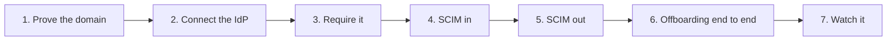
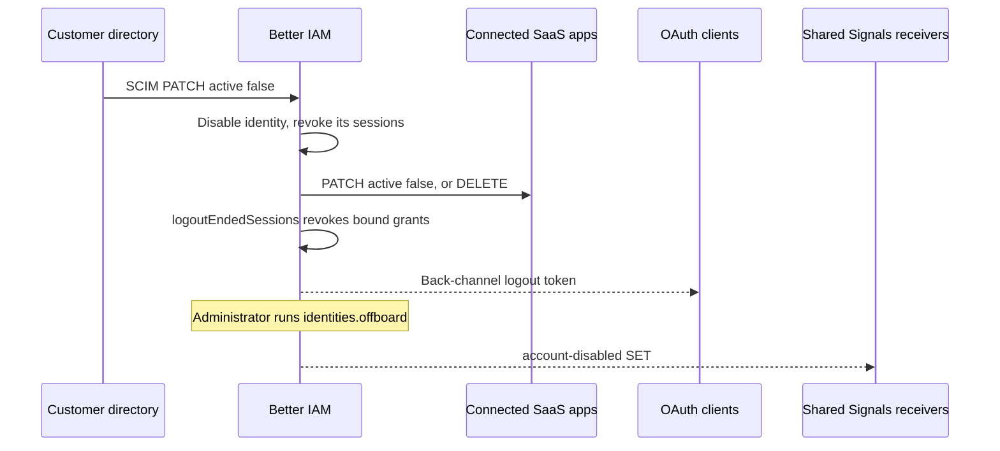

When a company buys your product, its IT team usually asks for the same things: "our people sign in with our
identity provider", "our directory creates and removes their accounts", and "when someone leaves, they lose access
everywhere". Enterprise buyers often treat these as purchase requirements, because manual account management is
slow and leaves former employees with access.

This walkthrough takes one customer organization from "we use Okta or Entra ID" to fully managed access. Its people
sign in with the company's identity provider (IdP), are created and removed by the company's directory, and flow on
to the SaaS applications you connect for them. The same steps work from your own admin UI, the console, or a
script. The [Federation overview](/docs/federation#the-protocols-in-plain-words) explains each protocol in plain
words.

**Who does what.** Your team sets up the protocol services once for your deployment. Each step below is then a
small piece of work done together with the customer's IT administrator: they publish a DNS record, paste values
into their IdP, and hand you metadata or tokens. Each step names who does which part.

The examples assume a server instance `iam`, an organization (a <Term id="tenant">tenant</Term>) `tenantId`, and a
<Term id="credential">credential</Term> `credential` for an administrator of that organization: a cookie session or
an API key with the listed permissions. `saml`, `login`, `scim`, and `provisioner` are the protocol services from
[SAML](/docs/federation/saml), [OAuth and OIDC sign-in](/docs/federation/oauth-sign-in),
[SCIM inbound](/docs/federation/scim), and [SCIM outbound](/docs/federation/scim-outbound), mounted with
`iam.useProtocol`. `issuer` is the [OAuth/OIDC provider](/docs/federation/oauth-provider) and `signals` the
[Shared Signals](/docs/federation/shared-signals) transmitter.



<Steps>
<Step>

### Prove the email domain

**Why:** a verified domain tells Better IAM that everyone with an `@acme.com` address belongs to Acme. That lets
your sign-in page send people to the right organization and identity provider from their email address alone, and
stops another organization from claiming Acme's domain.

**Who:** Acme's administrator claims the domain in your admin UI, and whoever manages Acme's DNS publishes the
record. Your team only builds the screen.

```ts
const claimed = await iam.api.domains.add(credential, { tenantId, domain: 'acme.com' });
// Publish claimed.dnsRecord (a TXT record), then:
await iam.api.domains.verify(credential, { tenantId, domainId: claimed.id });
```

`domains.add` claims the domain and returns a TXT record to publish, named `_better-iam-challenge.acme.com` by
default. `domains.verify` looks the record up in DNS and marks the domain verified. A verified domain belongs to
exactly one organization, and shared mailbox providers such as `gmail.com` cannot be claimed.

Your sign-in page can then route people by email. This lookup is often called **home-realm discovery**.
[`domains.discover`](/docs/reference/api/domains#discover) takes `{ email }` and answers with the organization, its
slug, the sign-in methods it accepts, and whether it requires MFA, so people never have to know a tenant ID or
slug. Pass the email on as a sign-in hint in the next step so people do not type it twice. See the
[`domains` API group](/docs/reference/api/domains).

</Step>
<Step>

### Connect the identity provider

**Why:** single sign-on (SSO) means people use the company account they already have, with the company's own
password rules and MFA, and IT can cut access in one place.

**Who:** for SAML, your team configures the service-provider key pair once, and Acme's IT administrator registers
your app in their IdP and uploads its metadata in your admin UI. For OpenID Connect, Acme's IT administrator
registers your app and sends you its client ID and secret, and your team adds the connection to the deployment
configuration.

<Tabs items={['SAML', 'OpenID Connect']}>
<Tab value="SAML">

For Okta, Entra ID, ADFS, Google Workspace, and other <Term id="saml">SAML</Term> IdPs. With one deployment-wide
service-provider key pair configured (`serviceProvider` in `createSamlService`), organization administrators upload
their IdP's metadata themselves:

```ts
const sso = await saml.createConnection(credential, {
  tenantId,
  id: 'acme-okta',
  name: 'Acme Okta',
  metadataXml,
  trustedEmailDomains: ['acme.com'],
  attributeMapping: { department: 'department', title: 'title' },
});
// Give the IdP administrator: sso.entityId (audience) and sso.acsUrl (assertion consumer service, HTTP-POST).
```

`createConnection` reads the IdP's sign-on URL, entity ID, and signing certificates from the metadata file. It
returns the two values the IdP needs in return: your entity ID (the audience its assertions must name) and your
assertion consumer service (ACS) URL, where the browser posts the IdP's answer. Sign-in starts at `sso.loginUrl`.

Enable `allowIdpInitiated` only if people launch the app from their IdP portal. When the IdP's signing certificate
is about to expire, list the old and new certificates together with `updateConnection` (certificate rollover).
Connection summaries show each certificate's expiry so you can warn before it lapses. Details are in
[Tenant-managed connections](/docs/federation/saml#tenant-managed-connections).

</Tab>
<Tab value="OpenID Connect">

Use `createOAuthLogin` with `kind: 'microsoft'` for Entra ID over <Term id="oidc">OpenID Connect</Term>. Pin
`allowedMicrosoftTenants` to the customer's directory, or set `microsoftTenant` to their tenant ID, so no other
Microsoft directory can sign in to Acme. For any other OIDC provider use `kind: 'oidc'`.

Forward the discovered email as a hint, so the provider's page opens with the right account selected:

```ts
const { url } = await login.begin(connectionId, undefined, {
  loginHint: email,
  domainHint: 'acme.com',
});
```

Details are in [OAuth and OIDC sign-in](/docs/federation/oauth-sign-in#microsoft-entra-id).

</Tab>
</Tabs>

`trustedEmailDomains` (SAML) or a verified-email claim (OIDC) lets the first sign-in create the account. Without
them, people link the provider to an existing account explicitly. Federation never merges accounts on a matching
email alone.

</Step>
<Step>

### Require it

**Why:** as long as people can still sign in with a password, SSO is optional, and someone the company removed from
its IdP could keep using a password they set earlier. Requiring federated sign-in closes that gap.

**Who:** Acme's administrator, in your organization settings screen, once SSO works. Test a federated sign-in
first: after this step, password sign-in is refused for everyone in the organization.

```ts
await iam.api.tenants.setAuthPolicy(credential, {
  tenantId,
  authPolicy: {
    allowedMethods: ['federated'],
    requireMfa: true,
    allowedIpRanges: ['203.0.113.0/24'],
  },
});
```

`tenants.setAuthPolicy` sets the organization's sign-in rules. Password and email-link sign-in are then refused for
the organization before any credential is checked. `requireMfa` adds the product's own second factor on top of the
IdP's. `allowedIpRanges` limits where sessions may be used from, for example the company's office or VPN ranges.
See [Tenant sign-in policy](/docs/guides/authentication/tenant-policy) for every policy field and
[`tenants.setAuthPolicy`](/docs/reference/api/tenants#setauthpolicy) for the signature.

</Step>
<Step>

### Let their directory provision people (SCIM in)

**Why:** SSO alone creates an account only when someone first signs in, and never removes it. With
<Term id="scim">SCIM</Term>, the company's directory creates accounts before day one, updates them when people
change teams, and deactivates them the moment someone leaves, even if they never sign in again.

**Who:** Acme's administrator creates the connection in your admin UI and pastes its URL and token into the
provisioning settings of their IdP. Once the IdP has pushed its groups, they map groups to roles.

```ts
const connection = await scim.createConnection(credential, { tenantId, name: 'Okta provisioning' });
// Give the IdP: the connection base path (connection.path) and connection.token (shown once).
await scim.setRoleMappings(credential, {
  tenantId,
  connectionId: connection.id,
  groupId, // the SCIM group ID, once the IdP has pushed the group
  roleIds: [viewerRoleId],
});
```

`createConnection` issues the bearer token the IdP uses to call your SCIM endpoints. `setRoleMappings` lets an
administrator decide which <Term id="role">roles</Term> a directory <Term id="group">group</Term> grants.

The directory then creates, updates, deactivates, and deletes accounts and groups. Deactivation revokes sessions
immediately. Mapped groups carry their roles, so joining "Engineering" in Okta grants the engineering role here.
`scim.rotateToken` replaces the token without losing provisioned state. See [SCIM inbound](/docs/federation/scim).

</Step>
<Step>

### Provision their applications (SCIM out)

**Why:** customers often want the people you manage to appear in their other SaaS tools, or your platform launches
downstream services per organization. Provisioning them automatically also removes them automatically.

**Who:** Acme's administrator adds each application as a target, with the SCIM token that application's admin
console issued. Your team schedules the syncs once for the whole deployment.

```ts
await provisioner.createTarget(credential, {
  tenantId,
  name: 'Slack',
  baseUrl: 'https://api.slack.com/scim/v2',
  token: slackScimToken,
  groupIds: [engineeringGroupId],
  pushGroups: true,
});
```

`createTarget` registers the application's SCIM URL and the token it issued. `previewTarget` shows what a sync would
change before anything is written. `subscribe(iam.events)` and a periodic `syncAll()` keep the application
current. The console's App provisioning page does all of this without code. See
[SCIM outbound](/docs/federation/scim-outbound).

</Step>
<Step>

### Offboarding end to end

**Why:** this is the payoff of the previous steps. One change in the company's directory ends access in your
product, in the connected applications, and in the systems that trust your tokens.

**Who:** nobody, per leaver. Your team schedules the background jobs once:
`provisioner.syncAll()`, `issuer.logoutEndedSessions()`, and `signals.dispatch()` (see
[Scheduled jobs](/docs/operations/jobs#protocol-jobs)).

When the company removes someone in its directory:

1. SCIM deactivates the identity here, and its sessions and API keys stop working.
2. The provisioner deactivates or deletes the person in every connected application at its next run, which its
   event subscription starts as soon as the audit event is dispatched.
3. OAuth grants bound to the ended sessions are revoked by `logoutEndedSessions()`, and clients registered with a
   `backchannelLogoutUri` receive an OpenID back-channel logout
   ([Back-channel logout](/docs/federation/oauth-provider#back-channel-logout)). Even before
   `logoutEndedSessions()` runs, the grant fails at its next use, because every token use rechecks the session.
4. Receivers registered as Shared Signals streams (the customer's security monitoring system, or applications that
   keep their own sessions) get a signed Security Event Token (SET) as soon as the event is dispatched:
   `session-revoked` when a session is revoked, `account-disabled` when the person is offboarded or reaches their
   scheduled expiry. A SCIM deactivation on its own is recorded as `iam:scim:UpdateUser`, which is not one of the
   [mapped events](/docs/federation/shared-signals#event-mapping). When receivers must hear about a leaver, also
   run the offboarding in the next item.
5. An administrator can also call [`identities.offboard`](/docs/reference/api/identities#offboard) to remove role
   bindings and group memberships and to hand owned resources to a successor in one audited step.



</Step>
<Step>

### Watch it

**Why:** enterprise customers and their auditors will ask who changed what, and you want to notice a broken
integration before a leaver keeps access.

**Who:** your team monitors the integrations across all customers; Acme's administrator can review their own
organization's audit log and connection status.

Every step above is audited: `iam:saml:*Connection`, `iam:scim:*` (inbound users and groups, outbound targets and
syncs), `iam:oauth:*`, `tenant:auth-policy`, and the domain operations. Three tools help you watch them:

- [webhooks](/docs/guides/events/webhooks) route the events to a security monitoring system (SIEM);
- [`audit.verify`](/docs/reference/api/audit#verify) checks that the tamper-evident
  <Term id="audit-chain">audit chain</Term> is intact;
- [`analysis.findings`](/docs/reference/api/analysis#findings) reports risky configuration such as administrators
  without MFA or unused API keys.

SCIM connection summaries (`lastUsedAt`) and provisioning run reports (`lastRun`) show whether each integration is
still running.

</Step>
</Steps>

## Next steps

<Cards>
  <Card title="SAML" href="/docs/federation/saml">
    Every connection option, IdP setup notes, and response validation rules.
  </Card>
  <Card title="SCIM inbound" href="/docs/federation/scim">
    Filters, PATCH, Bulk, manager mapping, and connection administration.
  </Card>
  <Card title="Tenant sign-in policy" href="/docs/guides/authentication/tenant-policy">
    Allowed methods, MFA, IP ranges, and session limits per organization.
  </Card>
  <Card title="Webhooks" href="/docs/guides/events/webhooks">
    Deliver audit events to a SIEM or your own services.
  </Card>
  <Card title="Protocol jobs" href="/docs/operations/jobs#protocol-jobs">
    The background work that makes offboarding reach every connected system.
  </Card>
</Cards>
