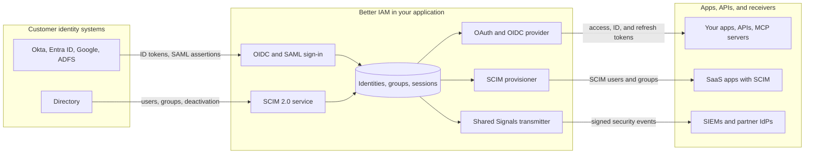

import { ArrowDownToLine, ArrowUpFromLine, Bot, Building, KeyRound, LogIn, RadioTower, Server, ShieldCheck } from 'lucide-react';

Federation means trusting another system to tell you who someone is, or telling another system yourself. It is
how Better IAM fits into the identity systems around it.

Your customers already have identity systems. A company that uses Okta or Microsoft Entra ID wants its people to
sign in with those accounts, wants its directory to create and remove accounts in your product, and wants former
employees to lose access everywhere the day they leave. Your own applications and APIs, in turn, want to rely on
Better IAM for sign-in instead of handling passwords themselves. Standard protocols make each of these connections
work without custom integration code on either side.

## The protocols in plain words

An **identity provider (IdP)** is the system that knows who a person is and signs them in: Okta, Microsoft Entra
ID, Google Workspace, ADFS, or Better IAM itself. The application that trusts the IdP's answer is called the
**service provider** in SAML and the **relying party** in OpenID Connect.

- **OAuth 2.0** lets one application get a limited, revocable token for an account at another service, without
  ever seeing that account's password. <Term id="oidc">OpenID Connect (OIDC)</Term> is a layer on top of OAuth that
  adds a signed **ID token** saying who signed in. Together they are the modern standard for "sign in with another
  account" and for API tokens. Google, GitHub, Microsoft, and every enterprise IdP speak them.
- <Term id="saml">SAML 2.0</Term> (Security Assertion Markup Language) is the older, XML-based single sign-on (SSO)
  standard. Many enterprise IdPs and IT teams still prefer it.
- <Term id="scim">SCIM 2.0</Term> (System for Cross-domain Identity Management) is a REST API for creating,
  updating, and removing user accounts and groups in another system. It automates the "joiner, mover, leaver"
  lifecycle.
- The <Term id="shared-signals">Shared Signals Framework (SSF)</Term> lets one system push security events to others
  as they happen. It has two event profiles: **CAEP** (Continuous Access Evaluation Profile) for session events such
  as "this session was revoked", and **RISC** (Risk Incident Sharing and Coordination) for account events such as
  "this account was disabled".

The OAuth pages also use a few extensions. Each one is a published internet standard, identified by its RFC
(Request for Comments) number:

| Term | What it does |
| --- | --- |
| PAR: pushed authorization requests (RFC 9126) | The app sends its sign-in request to the server directly first, so the request's details never travel through the browser's address bar. |
| <Term id="dpop">DPoP</Term>: demonstrating proof of possession (RFC 9449) | Binds an access token to a private key the app holds, so a stolen token is useless on its own. |
| Token exchange (RFC 8693) | Lets one API trade a user's token for a new, narrower token to call another API on the same user's behalf. |
| Dynamic client registration (RFC 7591) | Lets an app register itself with the authorization server over HTTP, instead of an administrator registering it by hand. |
| Protected resource metadata (RFC 9728) | Lets an API publish which authorization server issues its tokens, so a client can find it without configuration. |

## Who configures what

Your team chooses which protocols to enable and mounts each one once, in code. After that, most connections are
created at runtime, per organization, by that organization's administrator (usually the customer's IT team)
through your admin UI, the console, or a script. No deployment is needed when a new customer connects.

| Protocol | Your team, once per deployment | The organization's administrator, per customer |
| --- | --- | --- |
| OIDC and OAuth sign-in | Mounts `createOAuthLogin` and adds each connection (client ID and secret) to the deployment configuration. | For enterprise SSO, registers your app in their IdP (for example an Entra ID app registration) and sends you the client ID, the secret, and their directory ID. |
| SAML | Creates the service-provider key pair, mounts `createSamlService`, and builds an SSO settings screen. | Registers your app in their IdP and uploads the IdP's metadata file in your admin UI. |
| SCIM inbound | Mounts `createScimService` and builds a provisioning screen. | Creates a connection, pastes its URL and token into the IdP, and maps directory groups to roles. |
| SCIM outbound | Mounts `createScimProvisioner` and schedules its syncs. | Adds a target for each SaaS app, with the provisioning token that app issued. |
| OAuth/OIDC provider | Runs `createOAuthProvider`, builds the sign-in and consent pages, and declares your APIs. | Registers the client applications that may use it. |
| Shared Signals | Runs `createSharedSignalsTransmitter` and schedules its delivery job. | Adds a stream for each receiver (their security monitoring system or an app), with the endpoint and token the receiver provides. |

## Which protocol for which job

Start from the job you need done. Each row names the protocol, the factory function that creates its service, and
the page that covers it.

| You want to | Protocol | Factory | Page |
| --- | --- | --- | --- |
| Let an organization sign in with its IdP (Okta, Entra ID, Google Workspace, ADFS) | OpenID Connect or SAML 2.0 | `createOAuthLogin`, `createSamlService` | [OAuth and OIDC sign-in](/docs/federation/oauth-sign-in), [SAML](/docs/federation/saml) |
| Offer "Sign in with Google", GitHub, or Microsoft | OAuth 2.0 / OIDC | `createOAuthLogin` | [OAuth and OIDC sign-in](/docs/federation/oauth-sign-in) |
| Be the identity provider for your own apps, CLIs, devices, and service accounts | OAuth 2.0 / OIDC authorization server | `createOAuthProvider` | [OAuth/OIDC provider](/docs/federation/oauth-provider) |
| Protect your APIs with tokens meant only for them | Resource indicators, JSON Web Token (JWT) access tokens, DPoP, token exchange | `createAccessTokenVerifier` | [Resource servers and tokens](/docs/federation/oauth-resource-servers) |
| Let AI assistants that speak the Model Context Protocol (MCP hosts) and other clients register themselves and call your APIs | Dynamic client registration, protected resource metadata | `registration`, `createResourceGuard` | [Dynamic registration and MCP](/docs/federation/mcp-authorization) |
| Let a customer's directory push users and groups to you | SCIM 2.0 (inbound) | `createScimService` | [SCIM inbound](/docs/federation/scim) |
| Push your members to SaaS apps such as Slack or GitHub | SCIM 2.0 (outbound) | `createScimProvisioner` | [SCIM outbound](/docs/federation/scim-outbound) |
| Tell security monitoring systems (SIEMs) and apps about revoked sessions and disabled accounts | Shared Signals (CAEP, RISC) | `createSharedSignalsTransmitter` | [Shared Signals](/docs/federation/shared-signals) |

## How the data flows

Better IAM sits between your customers' identity systems and the applications that rely on you. Information comes
in on the left and goes out on the right:



Inbound protocols (OIDC and SAML sign-in, SCIM in) change <Term id="identity">identities</Term>,
<Term id="group">groups</Term>, and <Term id="session">sessions</Term>. Outbound protocols
(the OAuth provider, SCIM out, Shared Signals) read that state and keep the systems downstream of you consistent
with it. An offboarding in the customer's directory therefore reaches every connected application: see
[Offboarding end to end](/docs/federation/enterprise-onboarding#offboarding-end-to-end).

## Mount a protocol

Each protocol is a separate package that uses the same store, verified credential resolution, and authorization
as the rest of Better IAM. Importing the umbrella's main entrypoint does not activate any of them: you configure
and mount each protocol you need, so nothing is exposed that you did not ask for.

```ts title="iam.ts"
import { createScimService } from 'better-iam/scim';

// Every factory takes the host callbacks plus its own options (see each protocol's page).
const scim = createScimService({ ...iam.protocolHost });
iam.useProtocol(scim);
```

- `iam.protocolHost` is the bundle of trusted callbacks a protocol needs from your instance: the store,
  <Term id="credential">credential</Term> authentication, authorization checks, session validation,
  identity-attribute validation, and two callbacks that write to the directory. `completeAuthentication` turns a
  verified external identity into a session, and `syncRoleMappings` turns a directory group into role bindings.
  Spread it into every factory.
- `iam.useProtocol(service)` mounts a protocol service under its base path, so the IAM handlers route its
  requests to it.
- `iam.handler(request)` is the Fetch-compatible handler (for Next.js, Hono, SvelteKit, and similar). It dispatches
  every mounted protocol.
- `iam.nodeHandler(req, res)` is the Node `http` handler. It does the same, and it can also serve protocols that
  need Node's own request and response objects. The OAuth authorization server is one of them, so it needs a Node
  HTTP server rather than a Fetch-only runtime.

When a protocol is mounted through IAM, a successful federated sign-in sets the standard IAM session cookie, so the
rest of your application sees an ordinary signed-in user.

<Callout type="warn" title="Standalone use">
  You can also use the protocol packages without the IAM handler. Then you apply the returned session to your
  application's response yourself, and you must implement every host callback as a trusted server function.
  Never expose those callbacks as HTTP endpoints.
</Callout>

For mount paths behind frameworks and proxies, see [Protocol mounts](/docs/operations/deployment/protocol-mounts).

## Shared guarantees

Federation accepts input from systems you do not control, so every protocol package follows the same safety rules:

- **Explicit linking.** External identities are keyed by <Term id="tenant">tenant</Term>, provider, issuer, and
  subject. Federation never merges accounts because an email address matches, because whoever controls an email
  setting at another provider would otherwise control the account.
- **HTTPS everywhere.** Configured endpoints, callbacks, receivers, and downstream services must use HTTPS.
  `allowInsecureLocalhost: true` permits plain HTTP to loopback addresses for local development only.
- **Secrets at rest.** Client secrets, protocol artifacts, receiver headers, and downstream tokens are encrypted.
  Tokens Better IAM issues are stored as hashes and shown once.
- **Audited.** Connection changes, provisioning, consents, token exchanges, and syncs append events to the
  tamper-evident [audit chain](/docs/guides/events/audit-chain).

## Packages

<PackageTable filter={['@better-iam/oauth', '@better-iam/saml', '@better-iam/scim']} />

Install them individually, or use the `better-iam/oauth`, `better-iam/saml`, and `better-iam/scim` subpaths of the
umbrella package. All factories are server-only.

## Pages in this section

<Cards>
  <Card icon={<Building />} title="Enterprise onboarding" href="/docs/federation/enterprise-onboarding">
    Take one customer from "we use Okta" to fully managed access, step by step.
  </Card>
  <Card icon={<LogIn />} title="OAuth and OIDC sign-in" href="/docs/federation/oauth-sign-in">
    Google, GitHub, Microsoft Entra ID, any OIDC provider, and plain OAuth2.
  </Card>
  <Card icon={<ShieldCheck />} title="SAML" href="/docs/federation/saml">
    Tenant-managed SAML connections with metadata import and IdP-initiated sign-in.
  </Card>
  <Card icon={<KeyRound />} title="OAuth/OIDC provider" href="/docs/federation/oauth-provider">
    An authorization server for your own apps: clients, consent, grants, and logout.
  </Card>
  <Card icon={<Server />} title="Resource servers and tokens" href="/docs/federation/oauth-resource-servers">
    JWT access tokens for your APIs, offline verification, DPoP, and token exchange.
  </Card>
  <Card icon={<Bot />} title="Dynamic registration and MCP" href="/docs/federation/mcp-authorization">
    Self-registering clients and protected resource metadata for MCP servers and hosts.
  </Card>
  <Card icon={<RadioTower />} title="Shared Signals" href="/docs/federation/shared-signals">
    Signed CAEP and RISC events pushed to SIEMs and applications.
  </Card>
  <Card icon={<ArrowDownToLine />} title="SCIM inbound" href="/docs/federation/scim">
    Connection-scoped SCIM 2.0 Users, Groups, filters, PATCH, and Bulk.
  </Card>
  <Card icon={<ArrowUpFromLine />} title="SCIM outbound" href="/docs/federation/scim-outbound">
    Keep downstream SaaS directories in step with your members.
  </Card>
</Cards>

## Protocol references

The protocol engines Better IAM builds on, and the SCIM specification, for when you need the underlying details:

- [oidc-provider documentation](https://github.com/panva/node-oidc-provider/blob/main/docs/README.md), which
  powers the authorization server
- [oauth4webapi](https://github.com/panva/oauth4webapi), which powers OAuth and OIDC sign-in
- [Node-SAML](https://github.com/node-saml/node-saml), which powers SAML validation
- [SCIM protocol, RFC 7644](https://www.rfc-editor.org/rfc/rfc7644.html)
