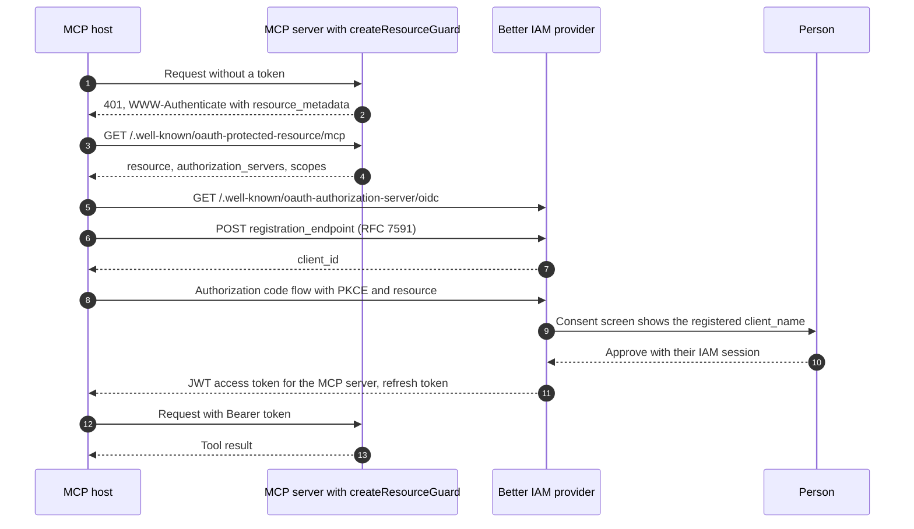

The **Model Context Protocol (MCP)** lets AI assistants and IDEs (the **MCP host**) call tools that your product
exposes through an **MCP server**. When that server holds customer data, the assistant has to act as a particular
person, with that person's permission, just like any other app. MCP uses OAuth for this.

**The problem it solves.** Normally an administrator registers every OAuth client by hand and copies its client ID
into the app. That cannot work for MCP: thousands of people run their own copy of a desktop assistant, and each copy
connects to servers it has never seen. Two standards let such a client configure itself:

- **Protected resource metadata** (RFC 9728): the MCP server publishes a small JSON document that says which
  authorization server issues its tokens. A client that gets a 401 reads it and knows where to go.
- **Dynamic client registration** (RFC 7591): the client registers itself with the authorization server over HTTP
  and receives a client ID, within limits you set.

After that the client runs the normal authorization code flow, the person signs in to Better IAM and approves the
assistant, and the assistant calls the MCP server with a token meant only for it. Better IAM supplies both halves:

- On the [OAuth/OIDC provider](/docs/federation/oauth-provider), `registration` turns on dynamic registration,
  limited to one <Term id="tenant">tenant</Term> and to the scopes and APIs you allow.
- In front of the MCP server (your API), `createResourceGuard` serves the protected resource metadata, verifies
  access tokens, and answers failures with the challenge MCP hosts expect.

The same pieces work for any self-configuring OAuth client, not only MCP.

**Who configures it.** Your team decides the registration policy in code and puts the guard in front of the MCP
server. Tenant administrators can hand out registration tokens when they want tighter control than open
registration, and they manage the registered clients like any other. The people using an assistant only sign in
and approve it.

## How an MCP host connects

The host starts with nothing but the MCP server's URL. Each step below discovers the next piece, so no one has to
configure the host by hand:



The consent screen shows the registered `client_name`. Consenting binds the client to the person's IAM
<Term id="session">session</Term>, so signing out or deactivation revokes it like any other consent.

## Turn on dynamic registration

Declare the MCP server as a [resource server](/docs/federation/oauth-resource-servers) and configure
`registration`:

```ts title="oauth.ts"
const issuer = createOAuthProvider({
  ...options,
  resourceServers: { 'https://mcp.example.com/mcp': { scopes: ['mcp:tools'] } },
  registration: {
    // Optional: accept registrations without a token (what most MCP hosts do), for the tenant the host serves.
    anonymous: ({ headers }) =>
      tenantForHost(headers.host)
        ? {
            tenantId: tenantForHost(headers.host)!,
            scopes: ['openid', 'offline_access', 'mcp:tools'],
            resources: ['https://mcp.example.com/mcp'],
            maxClients: 500,
          }
        : undefined,
  },
});
```

The discovered `registration_endpoint` (`{issuer}/reg`) accepts registrations in two ways. Choose by how much you
trust the clients:

<Tabs items={['Anonymous', 'Registration token']}>
<Tab value="Anonymous">

**Open registration, for public MCP servers.** Most MCP hosts register without any token. The `anonymous` hook
decides what such a request gets: it receives the request's `headers` and `ip` and returns the policy (above: the
tenant that owns the host name the request came to), or `undefined` to decline. Anonymous registrations are capped
per tenant by `maxClients` (default 100), so an open endpoint cannot be used to create unlimited clients.

</Tab>
<Tab value="Registration token">

**Invited registration, for controlled rollouts.** A tenant administrator creates an initial access token (RFC 7591
section 3) and gives it to one partner, one team, or one installation. Only requests carrying it can register:

```ts
const { token } = await issuer.createRegistrationToken(credential, {
  tenantId,
  name: 'Claude Desktop',
  scopes: ['openid', 'offline_access', 'mcp:tools'],
  resources: ['https://mcp.example.com/mcp'],
  maxClients: 1,
  expiresIn: 86400,
});
```

The client sends it as `Authorization: Bearer <registration token>`. Each registration uses one of the token's
`maxClients`.

</Tab>
</Tabs>

A registration request looks like this:

```http
POST /oidc/reg
Content-Type: application/json

{
  "client_name": "Acme Assistant",
  "redirect_uris": ["http://127.0.0.1:33418/callback"],
  "grant_types": ["authorization_code", "refresh_token"],
  "token_endpoint_auth_method": "none",
  "scope": "openid offline_access mcp:tools"
}
```

A missing, invalid, expired, or used-up registration token, a declined anonymous request, or a suspended tenant
answers `401` with `error: invalid_token`.

### Registration policy

The anonymous hook returns, and a registration token stores, the same limits:

<TypeTable
  type={{
    tenantId: { type: 'string', description: 'The tenant the new client belongs to, and so whose people can use it. From the hook only; registration tokens carry their own.', required: true },
    scopes: { type: 'string[]', description: 'The most the client may ask for. A registration requesting more fails; one requesting nothing gets all of these.', default: 'openid profile email offline_access' },
    resources: { type: 'string[]', description: 'The APIs (resource indicators) the client may get tokens for, such as your MCP server.', default: '[]' },
    allowConfidential: { type: 'boolean', description: 'Also permit clients that receive a client secret. Leave off for desktop and CLI hosts, which cannot keep one.', default: 'false' },
    maxClients: { type: 'number', description: 'Anonymous: how many anonymously registered clients the tenant may have. Token: how many registrations the token allows.', default: '100 (anonymous), 1 (token)' },
  }}
/>

`createRegistrationToken` also takes `name` (required, to recognize the token later) and `expiresIn` in seconds
(default 7 days, between one minute and one year). It requires `iam:oauth:clients:create`, returns the token once,
and stores only its hash.

### What a registration may contain

These limits keep a self-registered client from being more powerful than a hand-registered one:

- The tenant comes from the token or the hook. A `tenant_id` in the request is ignored.
- Only the `authorization_code` and `refresh_token` grants are allowed, always with PKCE. A self-registered client
  always acts for a person who consented.
- Clients are public (`token_endpoint_auth_method: "none"`) unless the token or policy sets `allowConfidential`,
  which permits a client secret (`client_secret_basic` or `client_secret_post`).
- Redirect URIs must use HTTPS, loopback HTTP on any port (how desktop apps receive the code, per the native-apps
  standard RFC 8252), or a reverse-domain custom scheme for native apps (`com.example.app:/callback`).
- Nothing the provider would have to fetch can be registered: `jwks_uri`, `sector_identifier_uri`,
  `backchannel_logout_uri`, `initiate_login_uri`, request URIs, or custom lifetimes. Inline `jwks` is refused too.
  A stranger cannot make your server call URLs of their choosing.
- A client that omits `scope` gets the allowance. One that asks for more is refused. It may request tokens only for
  the allowance's `resources`.

### Manage registered clients and tokens

New clients are audited as `iam:oauth:RegisterClient`, appear in `listClients` with `registeredVia` (the token ID
or `anonymous`), and are managed like any other client.

| Method | Permission | What it does |
| --- | --- | --- |
| `listRegistrationTokens(credential, { tenantId })` | `iam:oauth:clients:read` | Lists a tenant's tokens (name, limits, `used`, expiry, `revoked`) so administrators see what is outstanding. Never returns the token itself. |
| `revokeRegistrationToken(credential, { tenantId, tokenId })` | `iam:oauth:clients:delete` | Stops a token from registering more clients, for example when a rollout ends. Clients it already registered stay. |
| `updateClient`, `revokeClient` | `iam:oauth:clients:update`, `iam:oauth:clients:delete` | Change or remove a registered client, like any other. |

Registration management (`registration_client_uri`, which would let a client edit itself) is not offered, so
administrators change and revoke registered clients through `updateClient` and `revokeClient`.

## Protect the MCP server

`createResourceGuard` is everything the MCP server needs in front of its routes: it serves the protected resource
metadata document, verifies access tokens, and answers failures in the form MCP hosts understand.

```ts title="mcp/server.ts"
import { createResourceGuard } from 'better-iam/oauth';

const guard = createResourceGuard({
  resource: 'https://mcp.example.com/mcp',
  authorizationServers: ['https://id.example.com/oidc'],
  scopes: ['mcp:tools'],
  requiredScopes: ['mcp:tools'],
  resourceName: 'Acme MCP',
});

async function handle(request: Request): Promise<Response> {
  const { response, token } = await guard.check(request); // also serves /.well-known/oauth-protected-resource/mcp
  if (response) return response;
  return runMcp(request, token); // token.subject, token.tenantId, token.clientId, token.scopes
}
```

`guard.check(request, { scopes })` returns either `{ response }`, which you send back as is, or `{ token }` for an
authorized request. Pass `scopes` for routes that need more than `requiredScopes`.

| Request | Answer |
| --- | --- |
| `GET` the metadata URL | The metadata document, readable from any origin, cached for an hour. |
| No `Authorization` header | `401` with `WWW-Authenticate: Bearer resource_metadata="…", scope="…"` and no error code, as the bearer-token standard (RFC 6750) requires. This is what starts discovery in the host. |
| Invalid, expired, or wrong-audience token | `401 invalid_token`. |
| Missing scopes | `403 insufficient_scope`, naming the scopes needed. |
| Valid token | `{ token }` with the [verified token fields](/docs/federation/oauth-resource-servers#verify-tokens-in-your-api). |

Bearer and DPoP-bound tokens are both accepted.

<TypeTable
  type={{
    resource: { type: 'string', description: "The MCP server's resource identifier: the same resource indicator you declared at the provider.", required: true },
    authorizationServers: { type: 'string[]', description: 'Issuer URLs of the authorization servers that issue its tokens. Clients go here to sign in.', required: true },
    scopes: { type: 'string[]', description: 'Scopes advertised as scopes_supported, so clients know what to ask for.' },
    requiredScopes: { type: 'string[]', description: 'Scopes every request needs.' },
    resourceName: { type: 'string', description: 'A human-readable name hosts may show.' },
    documentation: { type: 'string', description: 'A URL describing the API for developers.' },
    requireDpop: { type: 'boolean', description: 'Advertise that only DPoP-bound tokens are accepted.' },
    issuer: { type: 'string', description: 'The token issuer to trust.', default: 'the first authorization server' },
    audience: { type: 'string | string[]', description: 'Accepted aud values.', default: 'the resource' },
    'jwks, jwksUri, clockTolerance': { type: 'verifier options', description: 'Passed to createAccessTokenVerifier, for pinned keys or clock tolerance.' },
    realm: { type: 'string', description: 'A realm name added to the WWW-Authenticate challenge.' },
  }}
/>

The guard also exposes `metadataUrl` and its `verifier`.

### Lower-level pieces

If your framework already has its own auth middleware, use the parts:

- `protectedResourceMetadata(options)` returns the RFC 9728 document as an object.
- `protectedResourceMetadataUrl(resource)` returns where it lives: `/.well-known/oauth-protected-resource`
  inserted before the resource's path, for example `https://mcp.example.com/.well-known/oauth-protected-resource/mcp`.
- `createProtectedResourceHandler(options)` serves the document (`GET`, `HEAD`, and CORS preflight) and returns
  `undefined` for every other request, so it can sit in front of your routing.
- The verifier's `challenge(error, realm, { resourceMetadata, scopes })` builds a `WWW-Authenticate` value that
  points clients at the metadata.

## Refresh tokens for MCP clients

Refresh tokens follow OAuth 2.1 (the consolidated revision of OAuth 2.0 that MCP builds on) for these requests, so
an assistant stays connected without asking again every 15 minutes. An authorization code without the `openid` scope yields a refresh token whenever the client is
registered for the `refresh_token` grant, with no `offline_access` or `prompt=consent` needed. OpenID requests keep
the OIDC rule: they need `offline_access`. Refresh tokens rotate on every use and end with the consenting session.

## Next steps

<Cards>
  <Card title="Resource servers and tokens" href="/docs/federation/oauth-resource-servers">
    Resource server options, the verifier, DPoP, and token exchange.
  </Card>
  <Card title="OAuth/OIDC provider" href="/docs/federation/oauth-provider">
    Interaction pages, consent, and grant revocation.
  </Card>
</Cards>
