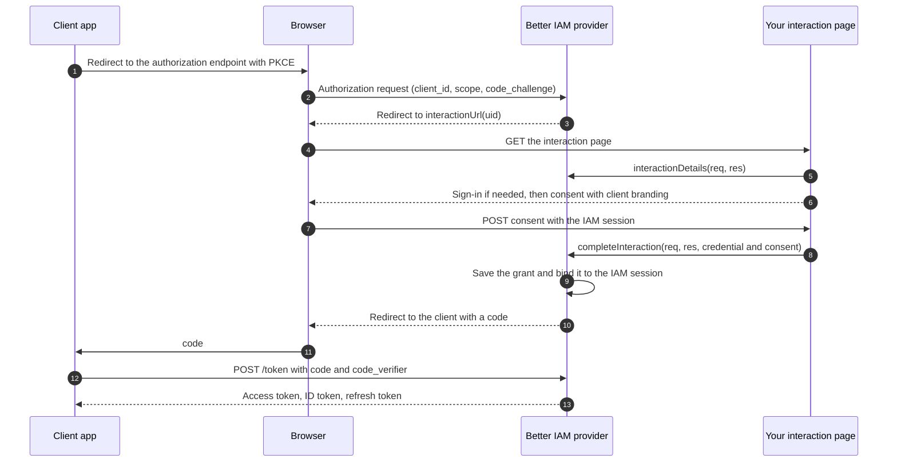

import { Bot, Server } from '@/lib/icons';

An **authorization server** is the service other applications send people to when they need them to sign in, and
that hands those applications tokens afterwards. When you enable it, Better IAM becomes an identity provider like
Google or Okta, but for your own product: "Sign in with Acme".

**The problem it solves.** As a product grows, more software needs your users' identity: a second web app, a
mobile app, a CLI, a partner integration, a TV app, a background job. Letting each of them collect passwords is
insecure, and building a custom token scheme for each is slow. OAuth 2.0 and <Term id="oidc">OpenID Connect</Term>
are the standards all of these clients already speak. The person signs in once with Better IAM, approves the app (consent), and the app
receives:

- an **ID token** that says who signed in (OpenID Connect),
- a short-lived **access token** to call your APIs,
- and optionally a **refresh token** to get new access tokens without asking again.

`createOAuthProvider` builds this server. Every client belongs to one <Term id="tenant">tenant</Term>, every consent
is bound to the IAM <Term id="session">session</Term> that gave it, and ending that session ends the tokens. The protocol engine is
[oidc-provider](https://github.com/panva/node-oidc-provider); Better IAM supplies the storage (encrypted,
tenant-bound records in your database), the accounts, the consent rules, and client administration.

**Who configures it.** Your team sets up the provider, declares your APIs, and builds its sign-in and consent pages
once. Tenant administrators then register the applications (clients) that may use it, through an admin screen you
build on the client methods below or a script, and people manage the apps they connected from a "Connected apps"
page.

## What it supports

Each row is a standard OAuth or OpenID Connect feature. You do not have to use all of them: most products start
with the authorization code flow and refresh tokens, and add the others when a client needs them.

| Capability | What it is for |
| --- | --- |
| Discovery and JWKS | Clients read the server's endpoints and its JSON Web Key Set (JWKS, the public signing keys) from standard URLs, including `/.well-known/oauth-authorization-server{issuer path}`, instead of being configured by hand. |
| Authorization code with PKCE | The standard browser sign-in flow. It is the only enabled response type, and PKCE (a per-request secret that makes a stolen code useless) is required for every client. |
| Refresh tokens | Let an app stay signed in without asking again. They rotate on every use, and reusing an old one revokes the whole chain. |
| Client credentials | Machine-to-machine access for a backend job, tied to an active <Term id="service-account">service account</Term>. No person is involved. |
| Device authorization | Sign-in for devices without a browser or keyboard (TVs, CLIs): the device shows a code, the person approves it on their phone or laptop. |
| UserInfo | Returns the signed-in person's claims to a client holding an access token. |
| Introspection and revocation | Let a client check whether a token is still valid, or cancel it. A client may only do this for its own tokens. |
| RP-initiated logout | Lets an app (the relying party, RP) send the person to Better IAM to sign out, with your own logout page. |
| Back-channel logout | Tells apps server-to-server that a person's session ended. See [Back-channel logout](#back-channel-logout). |
| Pushed authorization requests (PAR, RFC 9126) | The client sends its sign-in request to the server first, so its parameters stay out of the browser URL. See [Pushed authorization requests](#pushed-authorization-requests). |
| Resource indicators (RFC 8707) and JWT access tokens (RFC 9068) | Tokens meant for one API only, which that API verifies offline with the public keys. See [Resource servers and tokens](/docs/federation/oauth-resource-servers). |
| <Term id="dpop">DPoP</Term> (RFC 9449) | Binds a token to a key the client holds, so a stolen token is useless on its own. See [DPoP](/docs/federation/oauth-resource-servers#dpop). |
| Token exchange (RFC 8693) | Lets one of your APIs call another for the same user with a new, narrower token. See [Token exchange](/docs/federation/oauth-resource-servers#token-exchange). |
| Dynamic client registration (RFC 7591) | Lets clients such as MCP hosts register themselves over HTTP. Off unless `registration` is configured. See [Dynamic registration and MCP](/docs/federation/mcp-authorization). |

The development interaction UI is disabled: login and consent pages belong to your application.

## Set up the provider

Create the provider with the host callbacks, persistent keys, and the URLs of your own sign-in pages, then mount
it:

```ts title="oauth.ts"
import { createOAuthProvider } from 'better-iam/oauth';

export const issuer = createOAuthProvider({
  ...iam.protocolHost,
  issuer: 'https://identity.example/oidc',
  jwks: secrets.privateSigningJwks,
  cookieKeys: secrets.cookieSigningKeys,
  encryptionKey: secrets.base64Encoded32ByteEncryptionKey,
  trustedOrigins: ['https://identity.example'],
  scopes: ['documents:read'],
  interactionUrl: (uid) => `https://identity.example/interactions/${uid}`,
  renderDevicePage: ({ kind, form }) => renderDeviceScreen(kind, form),
  renderLogoutPage: ({ form }) => renderLogoutScreen(form),
});
iam.useProtocol(issuer);
```

<TypeTable
  type={{
    issuer: { type: 'string', description: 'The public URL that identifies this server in every token. HTTPS, without query or fragment. It never changes after launch, and endpoint URLs keep its path.', required: true },
    jwks: { type: 'JWKS', description: 'Private keys that sign ID tokens and JWT access tokens. During rollover: the active private key plus still-valid verification keys.', required: true },
    cookieKeys: { type: 'string[]', description: "Keys that sign the provider's own cookies (interaction and session). At least 32 characters each.", required: true },
    encryptionKey: { type: 'string', description: 'Base64-encoded 32-byte key, separate from the signing keys. Encrypts client secrets and protocol records at rest.', required: true },
    trustedOrigins: { type: 'string[]', description: 'Origins allowed to submit the consent form (completeInteraction), as a CSRF defense.', required: true },
    interactionUrl: { type: '(uid: string) => string', description: 'The URL of your login and consent page for a pending sign-in. The provider redirects the browser there.', required: true },
    renderDevicePage: { type: '({ kind, form, userCode?, clientName? }) => string', description: 'Wraps the provider-generated device-code form in your page. kind is input (enter the code), confirm (approve this device), or success.', required: true },
    renderLogoutPage: { type: '({ form }) => string', description: 'Wraps the provider-generated "sign out?" form in your page for RP-initiated logout.', required: true },
    scopes: { type: 'string[]', description: 'Your own OAuth scopes (for example documents:read), in addition to openid, email, profile, offline_access, and iam.' },
    resourceServers: { type: 'Record<string, OAuthResourceServer>', description: 'Your APIs, by resource indicator, so clients can get tokens restricted to one of them. See Resource servers and tokens.' },
    requirePushedAuthorizationRequests: { type: 'boolean', description: 'Require every client to push its authorization parameters first (PAR).', default: 'false' },
    dpopNonceSecret: { type: 'string', description: 'Base64-encoded 32-byte secret that turns on server-provided DPoP nonces: fresh values each key-bound request must include, so pre-generated proofs expire quickly. Identical on every instance.' },
    authorizeTokenExchange: { type: '(request) => boolean | Promise<boolean>', description: 'Your extra rule deciding which APIs may act for users through token exchange (RFC 8693). Return false to refuse.' },
    registration: { type: '{ anonymous?(request) }', description: 'Turns on dynamic client registration (RFC 7591), where clients such as MCP hosts register themselves. anonymous decides what a registration without a token gets.' },
    trustProxy: { type: 'boolean', description: 'Trust X-Forwarded-* headers. Turn on when a reverse proxy terminates TLS in front of the server.', default: 'false' },
    allowInsecureLocalhost: { type: 'boolean', description: 'Allow http:// on loopback addresses and let outbound requests reach loopback targets. Local development only.', default: 'false' },
    'store, authenticate, authorize, validateSession': { type: 'host callbacks', description: 'Database access, credential and permission checks, and the product session policy. Supplied by iam.protocolHost.', required: true },
  }}
/>

A **scope** is a named piece of access a client asks for, such as `email` or `documents:read`. Scope names are 1 to
128 letters, digits, and `: _ . -`. The provider always supports `openid`, `email`, `profile`, `offline_access`
(ask for a refresh token), and `iam`, plus your `scopes` and every resource server's scopes.

### Keys

Supply persistent signing keys, cookie-signing keys, and a separate 32-byte encryption key. Keep the same keys
across replicas and process restarts, and load them from your [secret store](/docs/operations/deployment/secrets).

<Callout type="warn" title="Never regenerate keys at startup">
  Replacing the signing keys breaks verification of every JWT and ID token already issued, replacing the cookie
  keys ends pending interactions and provider sessions, and a new encryption key makes every stored protocol
  artifact unreadable. Signing-key rollover uses a JWKS containing the active private key and the still-valid
  verification keys. Changing the encryption key requires re-encrypting stored protocol artifacts; automatic key
  migration is not provided.
</Callout>

### Mount it

`iam.useProtocol(issuer)` registers the provider. `iam.nodeHandler(req, res)` then serves the complete
authorization server: it passes every request under the issuer's path, and the metadata path
`/.well-known/oauth-authorization-server{issuer path}`, to the provider on Node's request and response objects.
You can also call `issuer.nodeHandler(req, res)` yourself. See
[Protocol mounts](/docs/operations/deployment/protocol-mounts).

The configured issuer stays fixed: metadata and generated endpoint URLs retain its mount path, so an issuer of
`https://identity.example/oidc` serves its token endpoint at `https://identity.example/oidc/token` and its public
keys at `https://identity.example/oidc/jwks`.

## Authorization code flow

This is what happens when a person clicks "Sign in with Acme" in one of your client apps:



## Build the interaction pages

An **interaction** is the part of the flow where a person has to do something: sign in, or approve a client. The
provider hands it to your application, because the look of your sign-in and consent screens, and which sign-in
methods they offer, are product decisions.

- `issuer.interactionDetails(req, res)` tells your page what is being asked: which client, which tenant, which
  scopes. Call it on `GET` and render the screen.
- `issuer.completeInteraction(req, res, { credential, consent })` records the person's answer and sends the browser
  back to the client. Call it on `POST`.

```ts title="interactions.ts"
import type { IncomingMessage, ServerResponse } from 'node:http';

export async function interaction(req: IncomingMessage, res: ServerResponse) {
  const credential = { headers: toHeaders(req.headers) }; // the person's IAM session cookie
  if (req.method === 'GET') {
    const details = await issuer.interactionDetails(req, res);
    // details.client: name, logoUri, clientUri, policyUri, tosUri, firstParty
    // details.scopes and details.resources: what the client asks for
    res.setHeader('content-type', 'text/html; charset=utf-8');
    res.end(renderConsentPage(details));
    return;
  }
  const form = await readForm(req);
  await issuer.completeInteraction(req, res, {
    credential,
    consent: form.get('consent') === 'yes',
  });
}
```

If the person is not signed in yet, show your normal Better IAM sign-in (password, passkey, SSO, MFA) on the same
page first; the consent step then uses the session it creates.

`completeInteraction` enforces these rules:

- The request is a `POST` whose `Origin` is in `trustedOrigins` (`CSRF` otherwise).
- The credential must resolve to a user session in the client's tenant (`TENANT_MISMATCH` otherwise). Sign the
  person in to that tenant first.
- Consent cannot be granted while an administrator [impersonates](/docs/guides/authentication/impersonation) the
  member (`IMPERSONATION_RESTRICTED`).
- `consent: false` finishes the interaction with `access_denied`, which tells the client the person declined.

<Callout type="error" title="Never trust identity from the form">
  Pass the person's actual IAM <Term id="credential">credential</Term> (their session cookie or bearer token).
  Never pass account IDs or tenant IDs from a form as verified identity.
</Callout>

`interactionDetails` returns:

<TypeTable
  type={{
    uid: { type: 'string', description: 'The interaction ID from the URL.' },
    prompt: { type: 'string', description: 'What the provider needs from the person: login or consent.' },
    tenantId: { type: 'string', description: "The client's tenant. The person must sign in to this tenant." },
    clientId: { type: 'string', description: 'The requesting client.' },
    clientName: { type: 'string', description: 'The registered client name, for the consent text.' },
    client: { type: '{ name, logoUri?, clientUri?, policyUri?, tosUri?, firstParty }', description: "Branding for the consent screen, and whether it is one of the deployment's own apps." },
    scopes: { type: 'string[]', description: 'The scopes the client asks for. Describe them on the consent screen.' },
    resources: { type: 'string[]', description: 'The APIs (resource indicators) the client wants tokens for.' },
    details: { type: 'object', description: 'Raw provider prompt details, such as which scopes and claims are not yet approved.' },
  }}
/>

The forms passed to `renderDevicePage` and `renderLogoutPage` carry the provider's CSRF fields. Embed them in your
page unchanged. The runnable example in `examples/shared` demonstrates the full browser flow.

### Branding and first-party apps

Consent screens get the client's branding from `interactionDetails(...).client`: `name`, and the HTTPS `logoUri`,
`clientUri`, `policyUri`, and `tosUri` set at registration. They also get `firstParty`, which marks the
deployment's own applications. Asking people to "allow" your own mobile app to access their account is confusing,
so your host may approve consent for first-party apps without asking by calling `completeInteraction` with
`consent: true` once the person is signed in. The provider never skips the interaction by itself.

## Register clients

A **client** is an application allowed to use the provider. There are two kinds:

- **Confidential clients** run on a server and can keep a secret: web apps with a backend, services.
- **Public clients** run where a secret would leak: single-page apps, mobile and desktop apps, CLIs. They rely on
  PKCE instead of a secret.

Clients are created with `issuer.registerClient(credential, input)`, which requires `iam:oauth:clients:create` on
the `oauth-client` resource. A client's tenant and ID are immutable.

<Tabs items={['Web app', 'Browser or native app', 'Service', 'Device']}>
<Tab value="Web app">

```ts
const { clientSecret } = await issuer.registerClient(credential, {
  tenantId,
  clientId: 'reports-web',
  name: 'Reports',
  redirectUris: ['https://reports.example/callback'],
  postLogoutRedirectUris: ['https://reports.example/'],
  scopes: ['openid', 'email', 'profile', 'offline_access', 'documents:read'],
  logoUri: 'https://reports.example/logo.png',
  policyUri: 'https://reports.example/privacy',
  firstParty: true,
});
// A confidential client receives its random secret once. Store it now.
```

</Tab>
<Tab value="Browser or native app">

```ts
await issuer.registerClient(credential, {
  tenantId,
  clientId: 'reports-spa',
  name: 'Reports',
  public: true,
  redirectUris: ['https://reports.example/callback'],
});
```

Public clients use PKCE without a secret. They cannot use `client_credentials` or token exchange. Browser CORS
access is limited to the origins of registered redirect URIs.

</Tab>
<Tab value="Service">

```ts
const { clientSecret } = await issuer.registerClient(credential, {
  tenantId,
  clientId: 'billing-sync',
  name: 'Billing sync',
  redirectUris: [],
  grantTypes: ['client_credentials'],
  serviceAccountId,
  scopes: ['documents:read'],
});
```

The client credentials grant is for software acting as itself, such as a nightly sync. The client must name an
active service account in the same tenant, and its tokens carry that service account as `identity_id`, so your
APIs know which non-human identity is calling. Deactivating the service account makes the client and its tokens
unavailable. See [service accounts](/docs/reference/api/service-accounts).

</Tab>
<Tab value="Device">

```ts
await issuer.registerClient(credential, {
  tenantId,
  clientId: 'reports-tv',
  name: 'Reports for TV',
  public: true,
  redirectUris: [],
  grantTypes: ['urn:ietf:params:oauth:grant-type:device_code', 'refresh_token'],
});
```

The device authorization grant is for devices where typing a password is impractical. The device asks the
discovered device authorization endpoint for a code and shows it. The person opens the verification page on
another device, where you render the provider's form with `renderDevicePage` (`kind: 'input'`, then `confirm` with
the `userCode` and `clientName`, then `success`), and signs in and consents through your interaction page. Device
codes expire after 10 minutes.

</Tab>
</Tabs>

<TypeTable
  type={{
    tenantId: { type: 'string', description: 'The tenant whose people may use the client. Immutable.', required: true },
    clientId: { type: 'string', description: 'The ID the app sends in every request. Up to 128 characters, unique across tenants, immutable.', required: true },
    name: { type: 'string', description: 'Up to 200 characters. Shown on the consent screen and in connected-apps lists.', required: true },
    redirectUris: { type: 'string[]', description: 'Up to 20 exact HTTPS URLs the provider may send codes to. Required for authorization code clients; empty for services and devices.', required: true },
    public: { type: 'boolean', description: 'A public client without a secret, for browser, mobile, desktop, and CLI apps.', default: 'false' },
    tokenEndpointAuthMethod: { type: "'client_secret_basic' | 'client_secret_post' | 'private_key_jwt'", description: 'How a confidential client proves itself: the secret in the Authorization header, the secret in the form body, or a signed assertion.', default: "'client_secret_basic'" },
    grantTypes: { type: 'OAuthGrantType[]', description: 'Flows the client may use: authorization_code, refresh_token, client_credentials, urn:ietf:params:oauth:grant-type:device_code, urn:ietf:params:oauth:grant-type:token-exchange.', default: 'authorization_code, refresh_token' },
    scopes: { type: 'string[]', description: 'The scopes the client may request. Keep it to what the app needs.', default: 'openid email profile offline_access' },
    postLogoutRedirectUris: { type: 'string[]', description: 'Up to 20 HTTPS URLs the provider may return to after RP-initiated logout.' },
    resources: { type: 'string[]', description: 'The APIs (resource indicators) the client may request tokens for.' },
    requireDpop: { type: 'boolean', description: 'Issue only DPoP-bound access tokens, which are useless without the client key.', default: 'false' },
    requirePushedAuthorization: { type: 'boolean', description: 'Require this client to push authorization parameters first (PAR).', default: 'false' },
    serviceAccountId: { type: 'string', description: 'The active same-tenant service account that client_credentials tokens act as. Required for that grant. Immutable.' },
    backchannelLogoutUri: { type: 'string', description: "HTTPS endpoint of the client that receives logout tokens when a person's session ends." },
    jwks: { type: 'JWKS', description: 'private_key_jwt only: one to ten public keys the client signs its assertions with.' },
    jwksUri: { type: 'string', description: 'private_key_jwt only: the HTTPS URL the provider fetches those public keys from.' },
    accessTokenTtl: { type: 'number', description: 'Access token lifetime in seconds, 60 to 86,400. Can only shorten the default or the API lifetime.' },
    refreshTokenTtl: { type: 'number', description: 'Refresh token lifetime in seconds, 300 to 30 days. Shorter values force people to sign in again sooner.', default: '30 days' },
    'logoUri, clientUri, policyUri, tosUri': { type: 'string', description: "HTTPS branding for the consent screen: logo, home page, privacy policy, terms of service." },
    firstParty: { type: 'boolean', description: "Marks one of the deployment's own apps so your consent page may approve it without asking.", default: 'false' },
  }}
/>

`registerClient` returns `{ clientId, clientSecret, tenantId }`; `clientSecret` is only present for secret-based
confidential clients. Registered redirect URIs are exact. Client secrets and protocol payloads are encrypted at
rest, and token identifiers are hashed for storage.

### Manage clients

After registration, these methods back an "Applications" page in your admin UI. Each checks the listed permission
on the client:

| Method | Permission | What it does and when to use it |
| --- | --- | --- |
| `listClients(credential, { tenantId, includeRevoked? })` | `iam:oauth:clients:read` per client | Lists the clients the caller may read, for an admin "Applications" page. Never returns a secret. |
| `getClient(credential, { tenantId, clientId })` | `iam:oauth:clients:read` | Reads one client's settings. |
| `updateClient(credential, { tenantId, clientId, ...settings })` | `iam:oauth:clients:update` | Changes settings, such as a new redirect URI, with the same validation as registration. |
| `rotateClientSecret(credential, { tenantId, clientId, revokeTokens? })` | `iam:oauth:clients:update` | Issues a new secret once and disables the previous one immediately. Use it on a schedule, or at once when a secret leaked. |
| `revokeClient(credential, { tenantId, clientId })` | `iam:oauth:clients:delete` | Retires an app: revokes the client and deletes every token, code, and grant issued to it. |

`updateClient` changes the name, redirect URIs, grant types, scopes, resources, `requireDpop`,
`requirePushedAuthorization`, lifetimes, branding, back-channel logout URI, and keys. Tenant, ID, client type, and
service account stay immutable. Pass `null` to remove a branding URL or the back-channel logout URI, or to restore
a default lifetime.

<Callout type="info" title="Narrowing a client revokes its tokens">
  Removing a grant type, scope, or resource, or turning on `requireDpop`, revokes every token, code, and consent
  issued to the client (the result says `tokensRevoked: true`), so no credential keeps authority the client no
  longer has.
</Callout>

Pass `revokeTokens: true` to `rotateClientSecret` when the old secret leaked, so tokens obtained with it stop
working too. Client summaries include `tokenEndpointAuthMethod`, `keyIds`, `jwksUri`, `registeredVia`,
`secretRotatedAt`, and `firstParty`. Updates and rotations are audited as `iam:oauth:UpdateClient` and
`iam:oauth:RotateClientSecret`.

### Key-based client authentication

A shared secret has to be stored by both sides and can leak. With `private_key_jwt`, the client keeps a private key
and proves itself by signing a short message instead, so the provider only ever holds its public key.

Confidential clients default to `client_secret_basic`. Register with `tokenEndpointAuthMethod:
'client_secret_post'` to send the secret in the form body, or `'private_key_jwt'` with public keys in `jwks` or an
HTTPS `jwksUri`:

```ts
await issuer.registerClient(credential, {
  tenantId,
  clientId: 'ledger-api',
  name: 'Ledger',
  redirectUris: [],
  grantTypes: ['client_credentials'],
  serviceAccountId,
  tokenEndpointAuthMethod: 'private_key_jwt',
  jwks: { keys: [ledgerPublicJwk] },
});
```

- A `private_key_jwt` client receives no secret. It gives either `jwks` (at most ten keys; private key members
  are refused) or `jwksUri`, not both.
- It signs a short-lived assertion (`iss` and `sub` = client ID, `aud` = issuer, unique `jti`) for each token,
  introspection, or revocation request, and each assertion works once.
- Rotate keys with `updateClient({ jwks })` or a new `jwksUri` without revoking tokens.

## Consent and connected apps

Each consent is a **grant**: the record that a person allowed a client certain scopes. Repeating consent in the
same provider session extends the existing grant, so an account has one grant per client instead of a new one per
sign-in. Grants expire 30 days after the last consent.

Grants are what a "Connected apps" settings page shows, where people see which apps can access their account and
disconnect the ones they no longer use:

| Method | What it does |
| --- | --- |
| `listGrants(credential, { tenantId, identityId?, clientId? })` | Lists live grants: client name, OIDC scopes and claims, resource scopes, creation, expiry. Revoked, expired, and session-orphaned grants are left out. |
| `revokeGrant(credential, { tenantId, grantId })` | Disconnects one app, by the grant's opaque `id`. |
| `revokeGrants(credential, { tenantId, identityId?, clientId? })` | Disconnects all of an account's apps, or one client's. Returns `{ revoked }`. |

Revocation invalidates the grant's refresh tokens, access tokens, and codes at once and is audited as
`iam:oauth:RevokeGrant`. People manage their own grants without extra permissions. Reading or revoking another
account's grants, for example by support staff, requires `iam:oauth:grants:read` or `iam:oauth:grants:revoke` on
`iam/{identityId}` in that account's tenant.

### Session binding

Every user grant is bound to the IAM session used to approve it. On every later token use the provider rechecks
session expiry, logout, account deactivation, tenant suspension, the current MFA policy, and configured idle
limits. This is why signing out of Better IAM, or being deactivated, also cuts off every app the person connected.
`iam.protocolHost.validateSession` supplies the exact product policy; standalone integrations without that
callback use a one-day idle maximum.

Refresh-token reuse permanently revokes the grant family, including tokens issued by a racing request: a reused
refresh token means someone copied it. Database transactions protect individual artifact operations and do not
hold a writer lock while waiting for request bodies.

## Tokens and claims

A **claim** is one fact inside a token, such as the account's email. Tokens carry `tenant_id`; client-credentials
tokens also carry `identity_id`, the service account.

| Scope | Claims |
| --- | --- |
| `openid` | `sub` (the account ID), `tenant_id` |
| `email` | `email`, `email_verified` |
| `profile` | `name` |
| `iam` | `roles`, `groups`, `attributes` |

The built-in `iam` scope adds `roles` and `groups` (the account's live <Term id="role">role</Term> and
<Term id="group">group</Term> IDs when the claims are
read, expired bindings excluded) and `attributes` (declared identity attributes) to the userinfo response. Per the
standard rule, ID tokens issued alongside an access token carry only `openid` claims, so relying parties read
these from userinfo. They can render navigation or map roles without a callback. The values are snapshots, and
enforcement stays with Better IAM.

<Callout type="warn" title="Scopes are not permissions">
  OAuth scopes are client-facing claims, not IAM permission grants. Resource servers should introspect or verify
  tokens, check their tenant and scope, and apply their product's authorization
  <Term id="policy">policy</Term>. OAuth tokens are not
  accepted as IAM administrative session credentials by default.
</Callout>

### Token lifetimes

| Artifact | Lifetime |
| --- | --- |
| Access token | 15 minutes, or the target resource server's `accessTokenTtl`. A client's `accessTokenTtl` (60 to 86,400 seconds) can only shorten it. |
| Refresh token | The client's `refreshTokenTtl` (5 minutes to 30 days, default 30 days). Restarts on every rotation, but never outlives the consent. |
| Consent (grant) | 30 days from the last consent. |
| Authorization code | 60 seconds. |
| Pushed authorization request | 60 seconds. |
| Device code, interaction | 10 minutes. |
| ID token | 15 minutes. |

Short access tokens limit the damage of a leaked token; refresh tokens keep the experience smooth. Pass `null` to
`updateClient` to restore a default lifetime.

## Pushed authorization requests

Normally a client puts its whole authorization request (client ID, scopes, redirect URI) in the browser URL, where
it can be read or tampered with and can grow too long. With **pushed authorization requests** (PAR, RFC 9126), the
client first posts those parameters directly to the server at the discovered
`pushed_authorization_request_endpoint`, gets back a short-lived `request_uri`, and sends only that through the
browser.

Require PAR for every client with `requirePushedAuthorizationRequests: true`, or per client with
`requirePushedAuthorization`, for example for high-value integrations. Pushed requests expire after 60 seconds and
cannot use unregistered redirect URIs.

## Back-channel logout

When a person signs out of Better IAM, apps that created their own sessions from its tokens still consider them
signed in. **Back-channel logout** (an OpenID standard) fixes that: the provider calls each app's server directly
with a signed logout token, and the app ends its own session.

Register an HTTPS `backchannelLogoutUri` on a client to receive them. `logoutEndedSessions({ identityId? })` does
the work:

- It finds consents whose IAM session expired, was revoked, or belongs to an account or tenant that is no longer
  active.
- It posts a logout token signed with the provider keys (`sub` = account, `aud` = client, back-channel logout
  event) to each client once per account.
- It revokes the grants and their tokens, and audits `iam:oauth:SessionLogout`.
- It returns `{ sessions, grants, notified, failures }`.

Deliveries time out after 2.5 seconds and are not retried. Sessions expire without an event, so call
`logoutEndedSessions()` on an interval as well as after sign-out and deactivation events:

```ts title="jobs.ts"
iam.events.subscribe(['auth:session:*', 'identity:*', 'tenant:*'], () =>
  issuer.logoutEndedSessions(),
);
setInterval(() => void issuer.logoutEndedSessions(), 60_000).unref();
```

<Callout type="warn" title="Outbound requests">
  Outbound requests (client JWKS URIs and logout deliveries) refuse private and special-use addresses, so a client
  cannot point the provider at your internal network. `allowInsecureLocalhost` exempts loopback targets for local
  development only.
</Callout>

See [Protocol jobs](/docs/operations/jobs#protocol-jobs) for running this job in production alongside the other
scheduled work.

## Audit events

Every administrative change and every consent is recorded in the tenant's [audit chain](/docs/guides/events/audit-chain),
so you can answer "who connected this app" or "who rotated this secret":

| Action | When |
| --- | --- |
| `iam:oauth:RegisterClient` | A client was registered by an administrator or through dynamic registration. |
| `iam:oauth:UpdateClient`, `iam:oauth:RotateClientSecret`, `iam:oauth:RevokeClient` | Client administration. |
| `iam:oauth:Consent` | A person approved a client. |
| `iam:oauth:RevokeGrant` | A grant was revoked. |
| `iam:oauth:SessionLogout` | `logoutEndedSessions` ended a client's grants for an account. |
| `iam:oauth:TokenExchange` | A token was exchanged (RFC 8693). |
| `iam:oauth:CreateRegistrationToken`, `iam:oauth:RevokeRegistrationToken` | Registration token administration. |

## Next steps

<Cards>
  <Card icon={<Server />} title="Resource servers and tokens" href="/docs/federation/oauth-resource-servers">
    Audience-restricted JWT access tokens, offline verification, DPoP, and token exchange.
  </Card>
  <Card icon={<Bot />} title="Dynamic registration and MCP" href="/docs/federation/mcp-authorization">
    Let MCP hosts discover the server, register, and call your APIs.
  </Card>
</Cards>
