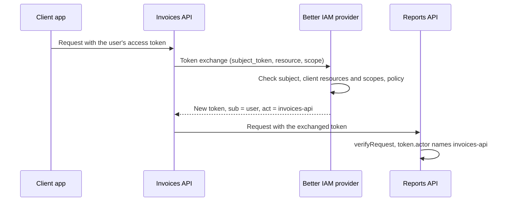

In OAuth, a **resource server** is simply an API that accepts access tokens: your invoices API, your reports API,
your MCP server. The [OAuth/OIDC provider](/docs/federation/oauth-provider) issues the tokens; the resource server
checks them on every request.

**The problem it solves.** A plain access token is valid wherever it is presented. If one API receives a token and
that API is compromised or buggy, it could replay the token against every other API. And an API that has to ask the
authorization server about every token adds a network call to every request. This page covers the four standards
that fix those problems, in plain terms:

- **Resource indicators** (RFC 8707): the client says which API it wants a token for, and gets a token that only
  that API accepts.
- **JWT access tokens** (RFC 9068): the token is a JSON Web Token (JWT), a signed JSON document the API verifies
  locally with the provider's public key. No network call per request.
- **DPoP** (RFC 9449, "Demonstrating Proof of Possession"): the token is bound to a key the client holds, so a
  stolen token is useless without that key.
- **Token exchange** (RFC 8693): one API calls another on the user's behalf with a new, narrower token that records
  both who the user is and which API is acting.

**Who configures it.** Your team declares the APIs in the provider configuration and adds token verification to
each API. Tenant administrators decide which client applications may call which API when they register clients.

## Declare resource servers

Tell the provider which APIs exist, so it can issue tokens restricted to one of them. Add a `resourceServers` entry
per API:

```ts title="oauth.ts"
const issuer = createOAuthProvider({
  ...options,
  resourceServers: {
    'https://api.example': { scopes: ['invoices:read', 'invoices:write'], accessTokenTtl: 600 },
    'https://reports.example': { scopes: ['reports:read'] },
  },
});
```

Each key is a **resource indicator**: an absolute URI, without a query or fragment, that names the API. It usually
is the API's base URL.

<TypeTable
  type={{
    scopes: { type: 'string[]', description: "The scopes this API understands, such as invoices:read. Requested scopes outside this set are dropped from its tokens, so a token never carries another API's permissions.", required: true },
    audience: { type: 'string', description: 'The aud value written into its tokens, which the API checks. Set it when your API already expects a specific audience.', default: 'the resource indicator' },
    accessTokenTtl: { type: 'number', description: 'Access token lifetime in seconds for this API. Shorter for sensitive APIs. A client can only shorten it further.', default: '900' },
    accessTokenFormat: { type: "'jwt' | 'opaque'", description: 'jwt lets the API verify tokens offline. opaque tokens are random strings that only the provider can look up.', default: "'jwt'" },
  }}
/>

## Register clients for a resource

Being declared is not enough: a client may only get tokens for the resources it was registered with. Anything else
fails with `invalid_target`. This is how you decide, per application, which APIs it may call.

```ts
await issuer.registerClient(credential, {
  tenantId,
  clientId: 'billing-sync',
  name: 'Billing sync',
  redirectUris: [],
  grantTypes: ['client_credentials'],
  serviceAccountId,
  scopes: ['invoices:read'],
  resources: ['https://api.example'],
  requireDpop: true,
});
```

## Request a resource token

A client asks for an API's token by adding the `resource` parameter. It then gets an access token restricted to
that audience, carrying only that API's scopes, in JWT format unless the server says `accessTokenFormat: 'opaque'`.
Without `resource`, OpenID requests keep receiving UserInfo access tokens, which are only good for the provider's
userinfo endpoint.

<Tabs items={['Service', 'Browser app']}>
<Tab value="Service">

```http
POST /oidc/token
Authorization: Basic <client credentials>
Content-Type: application/x-www-form-urlencoded

grant_type=client_credentials&resource=https://api.example&scope=invoices:read
```

</Tab>
<Tab value="Browser app">

Browser clients add `resource` to the authorization request and to the code exchange:

```http
GET /oidc/auth?client_id=reports-spa&response_type=code&scope=openid%20reports:read
  &resource=https://reports.example&code_challenge=...&code_challenge_method=S256
  &redirect_uri=https://reports.example/callback&state=...
```

Consent grants each requested resource the requested scopes its resource server defines, and
[`listGrants`](/docs/federation/oauth-provider#consent-and-connected-apps) shows them per resource.

</Tab>
</Tabs>

## Verify tokens in your API

Every request to your API must prove it carries a valid token for this API with the right scopes.
`createAccessTokenVerifier` checks JWT access tokens inside your API, without calling the provider. For
client-credentials tokens it also reports the <Term id="service-account">service account</Term> the client acts
as:

```ts title="api/auth.ts"
import { createAccessTokenVerifier } from 'better-iam/oauth';

const verifier = createAccessTokenVerifier({
  issuer: 'https://identity.example/oidc',
  audience: 'https://api.example',
});

const token = await verifier.verifyRequest(
  {
    authorization: req.headers.authorization,
    dpop: req.headers.dpop,
    method: req.method,
    url: fullUrl,
  },
  { scopes: ['invoices:read'] },
);
// token.tenantId, token.clientId, token.identityId (service account), token.subject, token.scopes
```

By default the verifier fetches and caches `{issuer}/jwks`, refreshing it on an unknown `kid` (key ID), so signing
key rollover needs no change in the API; pass `jwks` for pinned keys. It checks the signature, `typ: at+jwt`,
issuer, audience, expiry, and scopes. A missing scope fails with `INSUFFICIENT_SCOPE` (403); everything else fails
with `INVALID_TOKEN` (401).

The verifier has three functions:

- `verifyRequest(request, { scopes })` checks the `Authorization` header of a request, including the DPoP proof
  when the token is key-bound. Use it for every API request.
- `verify(token, { scopes })` checks a bare token string. It refuses DPoP-bound tokens, because it has no proof to
  check, so use it only where tokens arrive outside HTTP headers.
- `challenge(error, realm?, { resourceMetadata?, scopes? })` builds the `WWW-Authenticate` response header, which
  tells the client why it was refused. The optional arguments add a realm name, the
  [protected resource metadata](/docs/federation/mcp-authorization#protect-the-mcp-server) URL, and the scopes a
  `403` needs.

A complete route handler:

```ts title="app/api/invoices/route.ts"
import { IamError } from 'better-iam';

export async function GET(request: Request) {
  try {
    const token = await verifier.verifyRequest(
      {
        authorization: request.headers.get('authorization'),
        dpop: request.headers.get('dpop'),
        method: request.method,
        url: request.url,
      },
      { scopes: ['invoices:read'] },
    );
    return Response.json(await listInvoices(token.tenantId!, token.subject));
  } catch (error) {
    if (!(error instanceof IamError)) throw error;
    return new Response(null, {
      status: error.status,
      headers: { 'www-authenticate': verifier.challenge(error) },
    });
  }
}
```

`createAccessTokenVerifier` takes these options:

<TypeTable
  type={{
    issuer: { type: 'string', description: 'The authorization server issuer, exactly as in its discovery document. Tokens from any other issuer are refused.', required: true },
    audience: { type: 'string | string[]', description: "The aud values this API accepts: its resource indicator, or the resource server's configured audience.", required: true },
    jwks: { type: 'JSONWebKeySet', description: 'Pinned public keys instead of fetching them. Use it when the API cannot reach the provider.' },
    jwksUri: { type: 'string', description: 'Where to fetch the public keys from.', default: '{issuer}/jwks' },
    clockTolerance: { type: 'number', description: 'Seconds of clock difference tolerated for exp, nbf, and the DPoP iat.', default: '30' },
    dpopMaxAge: { type: 'number', description: 'Maximum age of a DPoP proof in seconds. Lower it when several API replicas share traffic.', default: '300' },
    algorithms: { type: 'string[]', description: 'Accepted signature algorithms. Symmetric algorithms are never accepted by default.', default: 'RS, PS, ES families and EdDSA' },
  }}
/>

A verified token has these fields:

<TypeTable
  type={{
    subject: { type: 'string', description: 'Who the token is for: the account, or the client for client-credentials tokens.' },
    clientId: { type: 'string', description: 'The application the token was issued to.' },
    tenantId: { type: 'string', description: 'The tenant of the client and account. Scope your data access to it.' },
    identityId: { type: 'string', description: 'The service account behind a client-credentials client.' },
    scopes: { type: 'string[]', description: 'The scopes granted for this API.' },
    audience: { type: 'string[]', description: 'The token audience.' },
    expiresAt: { type: 'number', description: 'When the token expires (exp, in seconds).' },
    'issuedAt, tokenId': { type: 'number, string', description: 'iat and jti, when present. jti is useful in logs.' },
    boundKey: { type: 'string', description: 'For a DPoP-bound token, the SHA-256 thumbprint of the client key it is bound to.' },
    actor: { type: '{ sub, act? }', description: 'For an exchanged token, the chain of clients acting for the subject.' },
    claims: { type: 'JWTPayload', description: 'Every claim, for anything else you need.' },
  }}
/>

Opaque tokens (`accessTokenFormat: 'opaque'`) cannot be verified offline and need the provider's introspection
endpoint, which answers only for tokens issued to the calling client. Keep the default JWT format for APIs that
other clients call. Either way, the token only says who is calling and with which scopes: check the
<Term id="tenant">tenant</Term> and apply your product's authorization <Term id="policy">policy</Term>.

## DPoP

An ordinary ("bearer") token works for whoever holds it, like cash. **DPoP** makes it work only together with a
private key the client generated and never shares. The client signs a small proof for every request (method, URL,
time, and a hash of the token), and the API checks the proof against the key the token is bound to. Use it for
clients whose tokens could leak through logs, proxies, or compromised devices.

DPoP is on at the provider: a client that sends a `DPoP` proof receives a key-bound token (`token_type: DPoP`), and
a client registered with `requireDpop` cannot get anything else.

In the API, `verifyRequest` requires the `DPoP` authorization scheme and a proof for bound tokens. It checks the
key thumbprint, method, URL (ignoring query and fragment), access-token hash, and age, and rejects replayed proofs.
A plain bearer token sent with the `DPoP` scheme is refused too.

<Callout type="warn" title="Replay detection is per instance">
  The verifier keeps replay state in memory per instance. A deployment with several API replicas should also
  enforce short proof lifetimes with `dpopMaxAge`.
</Callout>

At the authorization server, `dpopNonceSecret` (32 bytes, base64, identical on every instance) enables
server-provided nonces: the server hands out a fresh value that the next proof must include, which limits how long
a pre-generated proof stays usable.

## Token exchange

Sometimes an API needs to call another API for the same user. The invoices API, handling Ada's request, needs
Ada's reports. Forwarding Ada's token does not work, because it is meant only for the invoices API. Using the
invoices API's own service identity would lose track of who the request is for. **Token exchange** gives the
invoices API a new token for the reports API that still names Ada as the subject and names the invoices API as the
actor.

Register the calling API as a confidential client with the `urn:ietf:params:oauth:grant-type:token-exchange` grant
type, the downstream `resources`, and the `scopes` it may use there:

```ts
await issuer.registerClient(credential, {
  tenantId,
  clientId: 'invoices-api',
  name: 'Invoices API',
  redirectUris: [],
  grantTypes: ['urn:ietf:params:oauth:grant-type:token-exchange'],
  scopes: ['reports:read'],
  resources: ['https://reports.example'],
});
```

Then exchange the caller's token:

```http
POST /oidc/token
Authorization: Basic <client credentials>
Content-Type: application/x-www-form-urlencoded

grant_type=urn:ietf:params:oauth:grant-type:token-exchange
&subject_token=<the caller's access token>
&subject_token_type=urn:ietf:params:oauth:token-type:access_token
&resource=https://reports.example
&scope=reports:read
```



The rules:

- The subject token can be a JWT access token from this issuer or an opaque one it stores. It must belong to an
  active account in the exchanging client's tenant and must not be DPoP-bound.
- Name the target with `resource` (or `audience`). It must be one of the client's registered resources.
- The issued token keeps the account as `sub`, and names the exchanging client as `client_id` and as the actor in
  `act` (nested for chains).
- It carries only the requested scopes allowed by both the client and the target resource server (all of them when
  `scope` is omitted), and expires no later than the subject token.
- `actor_token` is refused, because the authenticated client is always the actor. Only access tokens can be
  requested.

`authorizeTokenExchange(request)` adds your product policy after the built-in checks, for example which subject
clients or scopes an API may delegate. Returning `false` answers `access_denied`. Without it, any client registered
for the grant may exchange for its own resources and scopes.

```ts
const issuer = createOAuthProvider({
  ...options,
  authorizeTokenExchange: ({ clientId, subjectClientId, scopes }) =>
    clientId === 'invoices-api' && subjectClientId === 'reports-web' && !scopes.includes('reports:admin'),
});
```

The request carries `tenantId`, `clientId` (the exchanging API), `identityId` (the user), `subjectClientId` (the app
the user's token was issued to), `subjectScopes`, `resource`, and `scopes`. Each exchange is audited as
`iam:oauth:TokenExchange`. `createAccessTokenVerifier` reports the chain as `actor`.

## Next steps

<Cards>
  <Card title="Dynamic registration and MCP" href="/docs/federation/mcp-authorization">
    Serve protected resource metadata in front of your API with createResourceGuard.
  </Card>
  <Card title="OAuth/OIDC provider" href="/docs/federation/oauth-provider">
    Clients, consent, grants, and token lifetimes.
  </Card>
</Cards>
