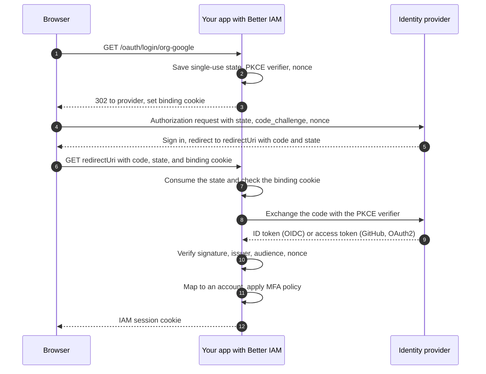

OAuth 2.0 is the web standard for letting one application act with an account at another service, without ever
seeing that account's password. <Term id="oidc">OpenID Connect</Term> (OIDC) builds on it to answer "who is this
person?": the provider
returns a signed **ID token** that names the account. Together they power every "Sign in with Google" button and
most enterprise single sign-on.

**The problem it solves.** People do not want yet another password, and companies want their employees to sign in
with the company account, under the company's password and MFA rules, so IT can remove access in one place.
Federated sign-in gives both: the person proves who they are to Google, GitHub, Microsoft, or their company's
identity provider (IdP), and your application trusts that answer.

`createOAuthLogin` makes your application the **relying party** (the side that trusts the provider). You configure
**connections**: one per provider and <Term id="tenant">tenant</Term>, each with the client ID and secret you
registered at that provider. Because every connection belongs to one tenant, each organization can have its own
provider, client registration, and callback URL.

**Who configures it.** Your team, in the deployment configuration: connections are fixed in code, not created at
runtime. For a consumer button (Google, GitHub) you register one OAuth app at the provider yourself. For an
enterprise customer, their IT administrator usually registers your app in their IdP (for example an Entra ID app
registration) and gives you the client ID and secret, which you add as a connection. When customers should manage
their own SSO without a deployment, use [tenant-managed SAML connections](/docs/federation/saml#tenant-managed-connections).

The package handles the protocol and its security details. Better IAM decides who the person is: it maps the
external identity to an account (an <Term id="identity">identity</Term>), enforces the tenant's MFA requirements,
and issues the <Term id="session">session</Term>.

## Set up a connection

Create the login service with the host callbacks from `iam.protocolHost` and one connection per provider and
tenant, then mount it so the IAM handler serves its routes:

```ts title="iam.ts"
import { createOAuthLogin } from 'better-iam/oauth';

const login = createOAuthLogin({
  ...iam.protocolHost,
  trustedOrigins: ['https://product.example'],
  connections: [
    {
      id: 'org-google',
      tenantId: organization.id,
      kind: 'google',
      clientId: secrets.googleId,
      clientSecret: secrets.googleSecret,
      redirectUri: 'https://product.example/oauth/google/callback',
    },
  ],
});
iam.useProtocol(login);
```

Register `redirectUri` as the callback URL at the provider: it is where the provider sends the browser back after
sign-in. Then link to `/oauth/login/org-google` from your sign-in page.

| Route | What it does |
| --- | --- |
| `GET /oauth/login/{connectionId}` | Starts sign-in: redirects (302) to the provider. Accepts `login_hint`, `domain_hint`, and `prompt` query parameters. |
| `POST /oauth/login/{connectionId}` | Starts [linking](#link-an-existing-account) the provider to the signed-in account and answers `{ url }`. |
| `GET` on the connection's `redirectUri` | The callback: finishes sign-in, clears the binding cookie, and (mounted through IAM) sets the session cookie. |

`/oauth/login` is the default `basePath`. The callback path is whatever you registered as `redirectUri`, and each
connection needs its own.

## How sign-in works

Sign-in uses the OAuth **authorization code flow**: the browser visits the provider, comes back with a short-lived
code, and your server exchanges that code for tokens directly with the provider, so no token passes through the
browser.



Each protection in this flow stops a specific attack:

- **State** is a random value that must come back unchanged. It is stored in the database, bound to the tenant and
  connection, expires after 10 minutes, and is deleted when the callback consumes it, so a callback cannot be
  forged or replayed (`OAUTH_STATE` otherwise).
- **The binding cookie** ties the flow to the browser that started it. It is HTTP-only, `SameSite=Lax`,
  `__Host-` prefixed on HTTPS, and lives 10 minutes. An attacker cannot make your browser finish their sign-in.
- **PKCE** (Proof Key for Code Exchange) sends a hash of a secret with the request and the secret itself with the
  code exchange, using `S256`, so an intercepted authorization code is useless on its own.
- **Nonce** binds the ID token to this request. OIDC kinds (`oidc`, `google`, `microsoft`) send and check it and
  require an ID token, whose signature, issuer, and audience are validated too.
- The callback URL must match the registered `redirectUri` exactly (origin and path).

When the login service is mounted through IAM, a successful callback sets the standard IAM session cookie. Without
the IAM handler, call the two steps yourself: `login.begin(connectionId)` returns the provider `url` and a
`binding` value to keep in an HTTP-only cookie, and `login.callback(connectionId, callbackUrl, binding)` verifies
the response and returns the session, which you apply to your response.

## Providers

Pick a preset with `kind`. Presets know the provider's endpoints and how it reports a verified email.

<Tabs items={['Google', 'GitHub', 'Microsoft', 'Any OIDC', 'OAuth2']}>
<Tab value="Google">

```ts
{ id: 'org-google', tenantId, kind: 'google', clientId, clientSecret, redirectUri }
```

Google uses its fixed OIDC issuer, `https://accounts.google.com`, with discovery. Default scopes are `openid email
profile`. The email counts as verified when the ID token says `email_verified: true`. A `domainHint` becomes
Google's `hd` parameter, which limits the account picker to one Google Workspace domain.

</Tab>
<Tab value="GitHub">

```ts
{ id: 'github', tenantId, kind: 'github', clientId, clientSecret, redirectUri }
```

GitHub is plain OAuth 2.0 without ID tokens, so Better IAM calls GitHub's authenticated profile API and uses the
stable numeric account ID as the subject (issuer `https://github.com`), never the username, which people can
change. The email is the account's primary, verified address from the emails API. Default scopes are
`read:user user:email`, and a client secret is required. `loginHint` becomes GitHub's `login` parameter.

</Tab>
<Tab value="Microsoft">

```ts
{
  id: 'acme-entra',
  tenantId,
  kind: 'microsoft',
  clientId,
  clientSecret,
  redirectUri,
  microsoftTenant: 'organizations',
  allowedMicrosoftTenants: ['c5a7f7e2-1b4d-4c55-9a53-2f0f5d2b8e11'], // Acme's Entra tenant ID
}
```

Signs in with Microsoft Entra ID (formerly Azure AD). See [Microsoft Entra ID](#microsoft-entra-id) for directory
selection, the tenant allowlist, and email verification.

</Tab>
<Tab value="Any OIDC">

```ts
{
  id: 'acme-okta',
  tenantId,
  kind: 'oidc',
  issuer: 'https://acme.okta.com',
  clientId,
  clientSecret,
  redirectUri,
}
```

`kind: 'oidc'` works with any OpenID Connect provider: Okta, Auth0, Keycloak, Ping, and others. Give its `issuer`
and Better IAM reads the rest from the provider's discovery document. Every discovered endpoint must use HTTPS.
The email counts as verified when the ID token says `email_verified: true`.

</Tab>
<Tab value="OAuth2">

```ts
{
  id: 'legacy-sso',
  tenantId,
  kind: 'oauth2',
  issuer: 'https://sso.legacy.example',
  authorizationEndpoint: 'https://sso.legacy.example/oauth/authorize',
  tokenEndpoint: 'https://sso.legacy.example/oauth/token',
  userInfoEndpoint: 'https://sso.legacy.example/api/me',
  clientId,
  clientSecret,
  redirectUri,
  scopes: ['profile'],
  mapProfile: (profile) => ({
    subject: String(profile.id),
    email: typeof profile.email === 'string' ? profile.email : undefined,
    emailVerified: profile.email_verified === true,
    name: typeof profile.name === 'string' ? profile.name : undefined,
  }),
}
```

Use `kind: 'oauth2'` for a provider that speaks OAuth 2.0 but not OIDC, so there is no standard ID token. Give
`issuer`, `authorizationEndpoint`, `tokenEndpoint`, `userInfoEndpoint`, and `mapProfile(profile)`. The mapper runs
only on a successful, authenticated profile response and must return a stable `subject`; it can also supply
`email`, `emailVerified`, and `name`. These are server configuration fields, never request parameters.

</Tab>
</Tabs>

<Callout type="warn" title="Choose a stable subject">
  Never use an email address or a mutable username as the `subject` of an OAuth2 mapping. The subject is the key
  that ties the external account to the local one; if it can change hands, so can the account.
</Callout>

## Microsoft Entra ID

`kind: 'microsoft'` signs in with Microsoft Entra ID. Entra has one sign-in endpoint for many directories (one per
customer company), so the connection has to say which directories it accepts.

- `microsoftTenant` selects the directory: `organizations` (the default, any work or school tenant), `common`
  (work, school, and personal accounts), `consumers` (personal accounts only), or one tenant ID or domain.
- `issuer` may point at a sovereign-cloud authority instead of `https://login.microsoftonline.com`. Every
  discovered endpoint must live on that authority.
- Multi-tenant settings (`organizations`, `common`, `consumers`) require `allowedMicrosoftTenants`: the Entra
  tenant IDs (`tid`) that may sign in. A directory you have not approved cannot create or reach accounts in this
  tenant; it fails with `OAUTH_TENANT`.
- The ID token must come from the concrete issuer of its own `tid`, and the external identity is keyed by that
  issuer.
- `domainHint` becomes Microsoft's `domain_hint`, which sends people straight to their company's sign-in page.

<Callout type="info" title="Email verification in Entra ID">
  Entra lets directory administrators set any email address, so the `email` claim counts as verified only when the
  token carries `xms_edov: true` (the email's domain is verified in that directory). Enable that optional claim in
  the app registration if first sign-in should enroll accounts by email.
</Callout>

For a single customer, either pin `allowedMicrosoftTenants` to their directory or set `microsoftTenant` to their
tenant ID.

## Options

A connection tells Better IAM which provider to use, which tenant its sign-ins belong to, and which client
registration to present. Each connection takes:

<TypeTable
  type={{
    id: { type: 'string', description: 'Unique connection ID. It appears in the start URL, so keep it URL-friendly, such as acme-entra.', required: true },
    tenantId: { type: 'string', description: 'The tenant whose accounts this connection signs in to. Sign-ins through it can never reach another tenant.', required: true },
    kind: { type: "'google' | 'github' | 'microsoft' | 'oidc' | 'oauth2'", description: 'A provider preset, or oidc and oauth2 for any other provider.', required: true },
    clientId: { type: 'string', description: 'The client ID you received when you registered the app at the provider.', required: true },
    clientSecret: { type: 'string', description: 'The matching secret, sent in the token request body (client_secret_post). Required for GitHub.' },
    redirectUri: { type: 'string', description: 'The fixed HTTPS callback URL registered at the provider. Unique per connection and never taken from the browser.', required: true },
    issuer: { type: 'string', description: "The provider's issuer URL. Required for oidc and oauth2. For microsoft, an optional sovereign-cloud authority." },
    scopes: { type: 'string[]', description: 'What to ask the provider for. Add scopes only when mapAttributes needs more claims.', default: 'openid email profile (GitHub: read:user user:email, OAuth2: none)' },
    microsoftTenant: { type: 'string', description: 'Which Entra directory to sign in against: organizations, common, consumers, or one tenant ID or domain.', default: "'organizations'" },
    allowedMicrosoftTenants: { type: 'string[]', description: 'Entra tenant IDs (tid) allowed to sign in. Required for multi-tenant directories so only approved companies get in.' },
    authorizationEndpoint: { type: 'string', description: "OAuth2 only: the provider's HTTPS URL where the browser signs in and approves access." },
    tokenEndpoint: { type: 'string', description: "OAuth2 only: the provider's HTTPS URL where the server exchanges the code for an access token." },
    userInfoEndpoint: { type: 'string', description: 'OAuth2 only: the HTTPS profile API called with the access token to learn who signed in.' },
    mapProfile: { type: '(profile) => { subject, email?, emailVerified?, name? }', description: 'OAuth2 only: trusted server code that picks a stable subject (and optional email and name) out of the profile.' },
    mapAttributes: { type: '(claims) => Record<string, unknown> | undefined', description: 'Copies directory data (department, cost center) from verified claims or the profile into declared identity attributes on every sign-in.' },
  }}
/>

The service itself (`createOAuthLogin`) takes the connections plus a few shared settings:

<TypeTable
  type={{
    connections: { type: 'OAuthLoginConnection[]', description: 'The connections above. Connection IDs and callback URLs must be unique.', required: true },
    trustedOrigins: { type: 'string[]', description: 'Origins allowed to start account linking with POST, as a CSRF defense. Usually your app origin.', default: 'the origin of each redirectUri' },
    basePath: { type: 'string', description: 'Where the start routes are served.', default: "'/oauth/login'" },
    allowInsecureLocalhost: { type: 'boolean', description: 'Allow http:// endpoints and callbacks on localhost, 127.0.0.1, and [::1], for local development against a test provider.', default: 'false' },
    'store, authenticate, completeAuthentication': { type: 'host callbacks', description: 'The database, credential checks for linking, and the trusted callback that turns a verified identity into a session. Supplied by iam.protocolHost.', required: true },
  }}
/>

Configured endpoints and registered callback URLs must use HTTPS. `allowInsecureLocalhost: true` enables HTTP only
for loopback addresses.

## Sign-in hints

Sign-in hints skip steps on the provider's page. Use them after
[home-realm discovery](/docs/reference/api/domains#discover) has matched an email to a connection, so the person
does not type their email twice or pick an account from a list:

```ts
const { url } = await login.begin(connectionId, undefined, {
  loginHint: 'ada@acme.com',
  domainHint: 'acme.com',
  prompt: 'select_account',
});
```

Or on the `GET` start route: `/oauth/login/acme-entra?login_hint=ada%40acme.com&domain_hint=acme.com`.

| Hint | Effect |
| --- | --- |
| `loginHint` | Pre-fills the account, usually an email address. GitHub receives it as `login`. |
| `domainHint` | Becomes Microsoft's `domain_hint` or Google's `hd`, skipping the account picker for that organization. |
| `prompt` | `login` forces re-authentication, `select_account` shows the account picker, `consent` asks for consent again, and `none` fails instead of showing any page. Not sent to GitHub. |

Hints are validated and forwarded only. They never influence which identity the callback accepts.

## First sign-in and account linking

External identities are keyed by tenant, provider, issuer, and subject. What happens at the callback:

| Situation | Result |
| --- | --- |
| The external identity is already linked | The linked account signs in. |
| Not linked, verified email, no account with that email in the tenant | A new account is enrolled with a verified email and linked. |
| Not linked, email unverified or missing | Refused with `VERIFIED_EMAIL_REQUIRED`. |
| Not linked, an account with that email already exists | Refused with `ACCOUNT_LINK_REQUIRED` (409): the person must link explicitly. |

Same-email identities never merge automatically: otherwise anyone who could set that email address at some
provider could take over the account. Federation invokes the tenant's local MFA requirements before it issues a
session, so a tenant that requires MFA still asks for the product's second factor. See
[error codes](/docs/reference/errors) for every code above.

### Link an existing account

Linking connects a provider to an account that already exists, for example when someone who signed up with a
password wants to use Google from now on. The person signs in first, reauthenticates, and then `POST`s to the same
start URL:

```ts title="Browser"
const response = await fetch('/oauth/login/org-google', {
  method: 'POST',
  credentials: 'include',
  headers: { 'content-type': 'application/json', 'x-better-iam': '1' },
  body: '{}',
});
const { url } = await response.json();
location.assign(url);
```

The browser supplies `Origin`. Linking requires:

- an `Origin` in `trustedOrigins`, the `X-Better-IAM: 1` header, and a JSON content type, so other sites cannot
  start it;
- a current user session authenticated within the last five minutes (`RECENT_AUTH_REQUIRED` otherwise, see
  <Term id="step-up">step-up authentication</Term>), so a borrowed, unlocked laptop is not enough;
- the same target tenant as the connection;
- an account that is not a root administrator. Root administrators cannot use the ordinary linking flow.

Only session and identity IDs are saved with the browser-bound ceremony; raw IAM credentials are never stored. At
the callback the host rechecks the original session and identity and rejects competing mappings: an external
identity already linked to another account fails with `ACCOUNT_LINK_CONFLICT`. A new link is audited as
`identity:link-provider`.

The direct equivalent is `login.begin(connectionId, credential)` followed by
`login.callback(connectionId, callbackUrl, binding)`. Protect the returned `binding` like the HTTP-only cookie the
built-in handler uses.

## Map directory attributes

Your policies can use facts about people, such as their department. When the company's IdP already knows them,
`mapAttributes(claims)` copies them in at every sign-in. OIDC, Google, and Microsoft pass the verified ID token
claims; GitHub and OAuth2 pass the authenticated profile.

```ts
{
  id: 'acme-okta',
  tenantId,
  kind: 'oidc',
  issuer: 'https://acme.okta.com',
  clientId,
  clientSecret,
  redirectUri,
  mapAttributes: (claims) => ({
    department: typeof claims.department === 'string' ? claims.department : undefined,
  }),
}
```

The mapped values are validated against `permissions.identityAttributes` inside the sign-in transaction and
replace the identity's stored attributes on every sign-in, so directory data such as a department drives
`principal.department` <Term id="condition">conditions</Term> in your
[policies](/docs/guides/authorization/conditions). Return `undefined` to leave the
stored attributes untouched. An invalid mapping fails the sign-in closed.

## Next steps

<Cards>
  <Card title="SAML" href="/docs/federation/saml">
    For identity providers that speak SAML 2.0, with tenant-managed connections.
  </Card>
  <Card title="Tenant sign-in policy" href="/docs/guides/authentication/tenant-policy">
    Require federated sign-in and MFA for an organization.
  </Card>
  <Card title="Enterprise onboarding" href="/docs/federation/enterprise-onboarding">
    Domains, SSO, SCIM, and offboarding for one customer, end to end.
  </Card>
</Cards>
