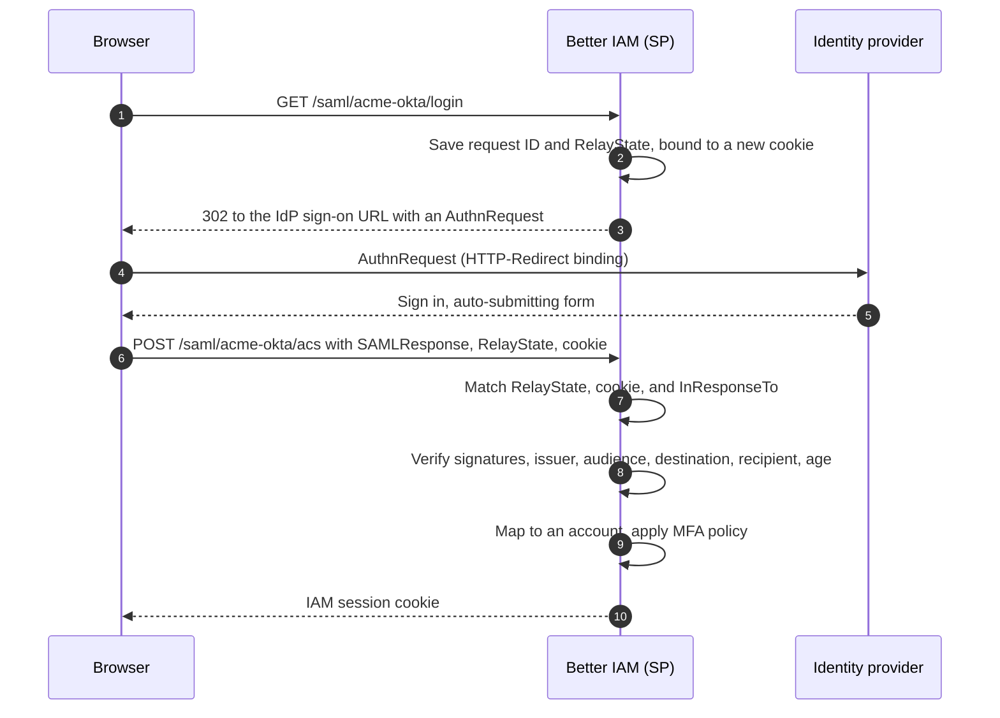

<Term id="saml">SAML 2.0</Term> (Security Assertion Markup Language) is the long-established standard for
enterprise single sign-on (SSO): one company account that opens every work application. The company's **identity
provider** (IdP: Okta, Microsoft Entra ID, ADFS, Google Workspace) signs an XML document, the **assertion**, that
says who the person is. The browser carries it to your application, the **service provider** (SP), which checks the
signature and signs the person in.

**The problem it solves.** Many enterprise customers require SSO before they buy, and their IT teams often prefer
SAML because every IdP supports it and their existing apps use it. With SSO, people use their company account
under the company's password and MFA rules, and IT removes access in one place. (If the customer's IdP supports
<Term id="oidc">OpenID Connect</Term>, [OAuth and OIDC sign-in](/docs/federation/oauth-sign-in) works too.)

`createSamlService` makes Better IAM a SAML service provider. Each connection has a fixed
<Term id="tenant">tenant</Term>, IdP issuer, SP audience, and callback URL. Connections come from two places, and both work side by side:

- **Tenant-managed connections** live in the database. An organization's administrator creates one at runtime by
  uploading their IdP's metadata file, with no deployment change. This is what most products want.
- **Configured connections** are fixed in your deployment configuration.

**Who configures it.** Your team sets up the service-provider key pair once and builds an SSO settings screen that
calls the connection methods below. The customer's IT administrator then does the rest: they register your app in
their IdP and upload the IdP's metadata file on that screen. No deployment is needed per customer.

A few SAML terms you will meet on this page:

| Term | Meaning |
| --- | --- |
| Entity ID | A unique name for each side. Your SP entity ID is also the **audience** the assertion must be addressed to. |
| ACS URL | The assertion consumer service: the URL on your side where the browser posts the IdP's response. |
| Metadata | An XML file describing one side: its entity ID, URLs, and signing certificates. Exchanging metadata sets up the trust. |
| `NameID` | The IdP's identifier for the person inside the assertion. |
| `RelayState`, `InResponseTo` | Values that tie a response to the sign-in request your side started. |

Validation is built on [Node-SAML](https://github.com/node-saml/node-saml).

## SP-initiated sign-in

"SP-initiated" means the person starts at your application, which sends them to the IdP and waits for the answer:



The request ID and `RelayState` are single use and expire after 10 minutes. When the service is mounted through
IAM, a successful sign-in sets the standard IAM <Term id="session">session</Term> cookie.

## Tenant-managed connections

Tenant-managed connections let each organization connect its own IdP at runtime, which is how a multi-tenant
product offers SSO to many customers. Give the service one service-provider identity (a key pair and certificate)
shared by every managed connection, plus the host's authorization checks:

```ts title="iam.ts"
import { createSamlService } from 'better-iam/saml';

export const saml = createSamlService({
  ...iam.protocolHost,
  serviceProvider: {
    baseUrl: 'https://identity.example',
    privateKey: secrets.samlSpKey,
    publicCertificate: secrets.samlSpCertificate,
  },
});
iam.useProtocol(saml);
```

Then an organization administrator connects their IdP:

```ts
const connection = await saml.createConnection(credential, {
  tenantId: organization.id,
  id: 'acme-okta',
  name: 'Acme Okta',
  metadataXml: uploadedIdpMetadata,
  trustedEmailDomains: ['acme.com'],
  attributeMapping: { department: 'department' },
});
// connection.entityId, connection.acsUrl → register them at the IdP
```

`createConnection` reads the IdP's sign-on URL, entity ID, and signing certificates from the metadata, stores the
connection, and returns the values the IdP needs in return. Each managed connection gets fixed URLs under the base
URL:

| URL | Use |
| --- | --- |
| `{baseUrl}/saml/{id}/metadata` | Signed SP metadata, which some IdPs can import directly. Also the SP entity ID (the audience): `connection.entityId`. |
| `{baseUrl}/saml/{id}/acs` | The HTTP-POST assertion consumer service: `connection.acsUrl`. |
| `{baseUrl}/saml/{id}/login` | Where sign-in starts: `connection.loginUrl`. Link to it from your sign-in page. |

`/saml` is the default `basePath`. Connection IDs are 2 to 63 lowercase letters, digits, and hyphens, because they
appear in these URLs; without `id`, one like `saml-3f9a1c0b2d4e` is generated.

<TypeTable
  type={{
    tenantId: { type: 'string', description: 'The organization whose people sign in through this connection.', required: true },
    name: { type: 'string', description: 'A label for administrators, up to 200 characters.', required: true },
    id: { type: 'string', description: 'The ID used in the connection URLs: 2 to 63 lowercase letters, digits, and hyphens.', default: 'generated' },
    metadataXml: { type: 'string', description: "The IdP's metadata file. Fills in entryPoint, idpIssuer, and idpCertificates, so the administrator only uploads one file." },
    entryPoint: { type: 'string', description: "The IdP's HTTPS sign-on URL, where the browser is sent. Overrides the imported value." },
    idpIssuer: { type: 'string', description: "The IdP's entity ID. Assertions from any other issuer are refused. Overrides the imported value." },
    idpCertificates: { type: 'string[]', description: "One to five IdP signing certificates, PEM or base64, used to check the IdP's signatures. Overrides the imported ones." },
    trustedEmailDomains: { type: 'string[]', description: 'Up to 20 exact domains whose email addresses this IdP is trusted to vouch for, so first sign-in can create accounts.', default: '[]' },
    attributeMapping: { type: 'Record<string, string>', description: 'Copies SAML attributes into identity attributes on every sign-in: identity attribute name to SAML attribute name, up to 32 entries.', default: '{}' },
    requireEncryptedAssertions: { type: 'boolean', description: 'Reject assertions that are not encrypted. Needs the SP decryption key.', default: 'false' },
    allowIdpInitiated: { type: 'boolean', description: 'Also accept sign-ins started from the IdP portal (app tiles).', default: 'false' },
    enabled: { type: 'boolean', description: 'false stops new sign-ins through this connection immediately.', default: 'true' },
  }}
/>

IdP details come from `metadataXml` or from explicit `entryPoint`, `idpIssuer`, and `idpCertificates`. Explicit
values override imported ones.

### Manage connections

These methods back an SSO settings screen. Each one checks the caller's permission on the connection in its
tenant, so only administrators who hold the `iam:saml:connections:*` permissions there can change it:

| Method | Permission | What it does |
| --- | --- | --- |
| `createConnection(credential, input)` | `iam:saml:connections:create` on `saml/{id}` | Adds an IdP. Audited as `iam:saml:CreateConnection`. |
| `listConnections(credential, { tenantId })` | `iam:saml:connections:read` on `saml/*` | Lists the tenant's connections, for an SSO settings page. |
| `getConnection(credential, { tenantId, connectionId })` | `iam:saml:connections:read` | Reads one connection. |
| `updateConnection(credential, { tenantId, connectionId, ...changes })` | `iam:saml:connections:update` | Changes settings, uploads refreshed metadata, or rolls certificates. Audited as `iam:saml:UpdateConnection`. |
| `deleteConnection(credential, { tenantId, connectionId })` | `iam:saml:connections:delete` | Removes the connection and its pending sign-ins. Audited as `iam:saml:DeleteConnection`. |

Permissions apply in the connection's tenant. Connection summaries include the values to enter at the IdP
(`entityId`, `acsUrl`, `metadataUrl`, `loginUrl`) and, for each certificate, its SHA-256 fingerprint, subject,
validity, and `expired`, so certificate rollover can be monitored.

External identities linked through a deleted connection stay with their accounts. Configured `connections` keep
working alongside managed ones, and their IDs are reserved. To offer the signed SP metadata XML as a download in
your admin UI, call `getMetadata(id)`, which covers both kinds of connection; the synchronous `metadata(id)` covers
configured ones only.

### Register the app at the IdP

The IdP administrator needs two values from the connection: the entity ID (audience) and the ACS URL. Better IAM
requires both the SAML response and the assertion to be signed, and reads the email address from an attribute
named `email` or `mail` (or the `urn:oid:0.9.2342.19200300.100.1.3` OID).

<Tabs items={['Okta', 'Entra ID', 'Google Workspace']}>
<Tab value="Okta">

1. Create a SAML 2.0 app integration.
2. Set **Single sign-on URL** to `connection.acsUrl` and **Audience URI (SP Entity ID)** to `connection.entityId`.
3. Keep both the response and the assertion signed.
4. Add attribute statements, for example `email` from `user.email` and `department` from `user.department`.
5. Download the IdP metadata from the app's **Sign On** tab and pass it as `metadataXml`.

</Tab>
<Tab value="Entra ID">

1. In **Enterprise applications**, create your own (non-gallery) application and choose SAML single sign-on.
2. Set **Identifier (Entity ID)** to `connection.entityId` and **Reply URL (Assertion Consumer Service URL)** to
   `connection.acsUrl`.
3. Under the SAML signing certificate, set the signing option to **Sign SAML response and assertion**.
4. In **Attributes & Claims**, add a claim named `email` (for example from `user.mail`) and any attributes you map.
5. Download the **Federation Metadata XML** and pass it as `metadataXml`.

</Tab>
<Tab value="Google Workspace">

1. In the Admin console, add a custom SAML app under **Web and mobile apps**.
2. Download the IdP metadata and pass it as `metadataXml`.
3. Set **ACS URL** to `connection.acsUrl` and **Entity ID** to `connection.entityId`, and check **Signed
   response** so the whole response is signed.
4. Map **Primary email** to an attribute named `email`, plus any directory attributes you map.

</Tab>
</Tabs>

Then share `connection.loginUrl`, or route people to it from home-realm discovery (see
[Enterprise onboarding](/docs/federation/enterprise-onboarding)).

### Import IdP metadata

`createConnection` and `updateConnection` parse `metadataXml` with `parseIdpMetadata`, which is also exported, for
example to preview an upload before saving it:

```ts
import { parseIdpMetadata } from 'better-iam/saml';

const idp = parseIdpMetadata(xml);
// idp.entityId, idp.entryPoint (HTTP-Redirect sign-on URL), idp.certificates (PEM), idp.singleLogoutUrl?
```

It reads the entity ID, the HTTP-Redirect sign-on URL, and every signing certificate. It refuses DTDs, entities,
documents over 512 KiB, and documents that do not describe exactly one IdP.

<Callout type="warn" title="Metadata signatures are not checked">
  Import metadata only from administrators or from the IdP's own HTTPS URL. Whoever controls the metadata controls
  which certificates Better IAM trusts for the connection.
</Callout>

### Certificate rollover

IdP signing certificates expire, typically every one to three years, and the IdP then switches to a new one. If
Better IAM does not know the new certificate yet, sign-in breaks. To avoid that, list the old and new certificates
together through `updateConnection` until the IdP switches, then remove the old one:

```ts
await saml.updateConnection(credential, {
  tenantId,
  connectionId: 'acme-okta',
  idpCertificates: [currentCertificate, nextCertificate],
});
```

Refreshed metadata that already lists both certificates works the same way. Watch `certificates[].notAfter` and
`expired` in connection summaries to warn administrators before a certificate lapses.

## Configured connections

For connections fixed in your deployment, for example a single-tenant installation, pass `connections`:

```ts
const saml = createSamlService({
  ...iam.protocolHost,
  connections: [
    {
      id: 'acme',
      tenantId: acme.id,
      entryPoint: 'https://acme.okta.com/app/product/exk1a2b3c4/sso/saml',
      idpIssuer: 'http://www.okta.com/exk1a2b3c4',
      idpCertificates: [secrets.acmeIdpCertificate],
      entityId: 'https://product.example/saml/acme/metadata',
      callbackUrl: 'https://product.example/saml/acme/callback',
      privateKey: secrets.samlSpKey,
      publicCertificate: secrets.samlSpCertificate,
      trustedEmailDomains: ['acme.com'],
    },
  ],
});
```

<TypeTable
  type={{
    id: { type: 'string', description: 'Unique connection ID, used in the login and metadata URLs.', required: true },
    tenantId: { type: 'string', description: 'The tenant whose people sign in through it.', required: true },
    entryPoint: { type: 'string', description: "The IdP's HTTPS sign-on URL.", required: true },
    idpIssuer: { type: 'string', description: "The IdP's exact entity ID. Assertions from any other issuer are refused.", required: true },
    idpCertificates: { type: 'string[]', description: "IdP signing certificates. During rollover, include the previous and the new one.", required: true },
    entityId: { type: 'string', description: 'Your SP entity ID for this connection, which is also the audience the assertion must name.', required: true },
    callbackUrl: { type: 'string', description: 'Your HTTPS assertion consumer URL (HTTP-POST binding). Unique per connection.', required: true },
    privateKey: { type: 'string', description: 'SP private key, used to sign requests and metadata.', required: true },
    publicCertificate: { type: 'string', description: 'SP certificate, published in the metadata so the IdP can verify you.', required: true },
    decryptionPrivateKey: { type: 'string', description: 'Key to decrypt encrypted assertions.' },
    decryptionCertificate: { type: 'string', description: 'Certificate published so the IdP can encrypt assertions to you.' },
    requireEncryptedAssertions: { type: 'boolean', description: 'Reject plaintext assertions. Needs the decryption key and certificate.', default: 'false' },
    trustedEmailDomains: { type: 'string[]', description: 'Exact domains whose email addresses this IdP is trusted to vouch for.' },
    allowIdpInitiated: { type: 'boolean', description: 'Also accept sign-ins started from the IdP portal.', default: 'false' },
    mapAttributes: { type: '(profile) => Record<string, unknown> | undefined', description: 'Copies values from the validated assertion into identity attributes on every sign-in.' },
  }}
/>

The service itself (`createSamlService`) takes these options, shared by both kinds of connection:

<TypeTable
  type={{
    connections: { type: 'SamlConnection[]', description: 'Configured connections.' },
    serviceProvider: { type: '{ baseUrl, privateKey, publicCertificate, decryptionPrivateKey?, decryptionCertificate? }', description: 'Your SP identity for all tenant-managed connections, and the switch that enables them. baseUrl is the public HTTPS origin, with an optional path prefix.' },
    basePath: { type: 'string', description: 'Where the SAML routes are served.', default: "'/saml'" },
    trustedOrigins: { type: 'string[]', description: 'Origins allowed to start account linking, as a CSRF defense.', default: 'the origin of the callback URL' },
    revokeSession: { type: '(credential) => Promise<unknown>', description: 'Revokes the local IAM session when you call logout(credential).' },
    'store, authorize, authenticate, completeAuthentication': { type: 'host callbacks', description: 'Database access, permission checks for connection management, and the trusted callback that turns a verified assertion into a session. Supplied by iam.protocolHost.', required: true },
  }}
/>

## Routes

Once mounted with `iam.useProtocol`, the service answers these routes itself:

| Route | What it does |
| --- | --- |
| `GET {basePath}/{id}/login` | Starts SP-initiated sign-in and redirects (302) to the IdP. |
| `POST {basePath}/{id}/login` | Starts [account linking](#first-sign-in-and-account-linking) for the signed-in account; answers `{ url }`. |
| `GET {basePath}/{id}/metadata` | Signed SP metadata (`application/samlmetadata+xml`), for IdPs that import it. |
| `POST {basePath}/{id}/acs` | The assertion consumer service of a tenant-managed connection. |
| `POST` on a configured `callbackUrl` | The assertion consumer service of a configured connection. |

The assertion consumer service accepts only the SAML HTTP-POST binding. Every failure answers `401` with
`{ "error": "SAML_INVALID" }` and no further detail, so an attacker learns nothing from probing it.

Without the IAM handler, call the steps yourself: `begin(connectionId, credential?)` returns the IdP `url` plus
`relayState` and a `binding` value to keep in a cookie, and `callback(connectionId, { samlResponse, relayState,
binding })` validates the response and returns the session.

## Response validation

Every response goes through these checks, each of which blocks a known SAML attack:

- Both the response and the assertion must be signed, so no part can be swapped.
- The IdP issuer must match exactly, and so must the SP audience, the response `Destination`, and every subject
  `Recipient` (the ACS URL), so an assertion meant for another app is refused.
- The assertion age is bounded (five minutes, with 30 seconds of clock skew), and the response must answer an
  outstanding `InResponseTo` request.
- A persistent connection-scoped cache and a transaction around verification prevent replay across processes.
- The `RelayState` and request ID are bound to a `Secure`, HTTP-only, `SameSite=None` cookie, so the response is
  only accepted in the browser that started the sign-in.
- DTDs and entity declarations are rejected (they enable XML attacks), and so are oversized responses.
- Better IAM signs its metadata and requests with SHA-256.

### Encrypted assertions

Assertions are signed but, by default, readable by anyone who sees them in the browser. Some organizations require
them encrypted. Supply `decryptionPrivateKey` and `decryptionCertificate` (on a configured connection, or on
`serviceProvider` for managed ones) to accept encrypted assertions. `requireEncryptedAssertions: true` rejects
plaintext assertions.

## First sign-in and account linking

The external identity is keyed by the connection, the IdP issuer, and the assertion's `NameID`. The name comes
from `displayName`.

- SAML email attributes are unverified by default, because an IdP administrator can type any address. For
  first-login enrollment, explicitly configure `trustedEmailDomains`, and only for domains whose account email
  attributes this IdP is authorized to verify. An email in a trusted domain counts as verified, so the first
  sign-in can create the account.
- Otherwise the person signs in through an already linked external identity, or links an existing, authenticated
  local account.
- Matching an existing email alone never links it. An unverified email fails with `VERIFIED_EMAIL_REQUIRED`, and
  a verified one that belongs to an existing account fails with `ACCOUNT_LINK_REQUIRED`.

To link, `POST` to the login path with the same trusted-origin and recent-authentication requirements as
[OAuth linking](/docs/federation/oauth-sign-in#link-an-existing-account): a trusted `Origin`, `X-Better-IAM: 1`, a
JSON body, and a user session in the connection's tenant authenticated within five minutes. Root administrators
cannot link this way.

Federation invokes the tenant's local MFA requirements before issuing a session.

## Map attributes

The IdP usually knows facts your policies can use, such as a person's department or cost center.
`attributeMapping` on a managed connection copies them in, mapping identity attribute names to SAML attribute
names and taking the first value of multi-valued attributes:

```ts
attributeMapping: { department: 'department', title: 'title', costCenter: 'costCenter' }
```

Configured connections use `mapAttributes(profile)` with the validated assertion profile instead. Either way the
values reach `completeAuthentication`, are validated against `permissions.identityAttributes` inside the sign-in
transaction, and replace the <Term id="identity">identity</Term>'s stored attributes on every sign-in, so directory
data drives `principal.department`-style [policy conditions](/docs/guides/authorization/conditions). An invalid
mapping fails the sign-in closed.

## IdP-initiated sign-in

"IdP-initiated" means the person starts in their IdP's portal (app tiles in Okta or the Entra My Apps page) and
clicks your app, so the IdP sends a response nobody asked for. It is off by default. Set `allowIdpInitiated: true`
on a connection to accept such responses at its callback URL.

- They must carry no `InResponseTo` and pass the same signature, issuer, audience, destination, recipient, and
  five-minute age checks.
- Each assertion ID is accepted once per connection, recorded in `samlAssertions` for ten minutes.
- The response signs the person in without account linking, and a `RelayState` is ignored.
- Responses that do carry `InResponseTo` still need the browser-bound request.
- `idpInitiated(connectionId, samlResponse)` is the direct call, for when you receive the POST yourself instead of
  through the built-in assertion consumer route.

<Callout type="warn" title="Weaker than SP-initiated sign-in">
  IdP-initiated SSO cannot be tied to a browser the way SP-initiated login is, so a stolen, still-unused response
  can be replayed once in another browser within those minutes. Enable it only for IdPs your organizations rely on
  for portal launches.
</Callout>

## Logout and limits

`logout(credential)` calls the `revokeSession` callback you configure, which ends the local IAM session. Upstream
SAML sessions are not modified: the person stays signed in at their IdP. SAML IdP functionality (Better IAM acting
as a SAML IdP for other apps) and federated single logout are outside this release; use the
[OAuth/OIDC provider](/docs/federation/oauth-provider) to be an identity provider for your own apps.

## Next steps

<Cards>
  <Card title="Enterprise onboarding" href="/docs/federation/enterprise-onboarding">
    Domain verification, SSO, SCIM, and offboarding for one customer.
  </Card>
  <Card title="SCIM inbound" href="/docs/federation/scim">
    Let the same IdP create and deactivate the accounts.
  </Card>
</Cards>
