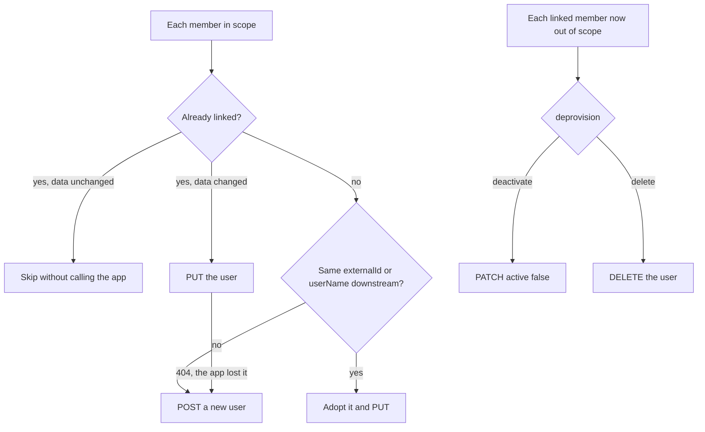

<Term id="scim">SCIM</Term> (System for Cross-domain Identity Management) is the standard HTTP API that applications
expose so that
another system can create, update, and remove their user accounts. Most business SaaS tools accept it: Slack,
GitHub, Zoom, Atlassian, and many more.

**The problem it solves.** When Better IAM knows who belongs to an organization, the people in that organization
also need accounts in the other tools they use, with the right name, email, and department. More importantly,
they need to lose those accounts when they leave. Doing that by hand leaves orphaned accounts behind, which is how
former employees keep access to company data.

`createScimProvisioner` fixes this by acting as a SCIM client. For each downstream application you add a
**target**: the application's SCIM URL and a token it issued. The provisioner then keeps that application's user
directory in step with the <Term id="tenant">tenant</Term>'s members: it creates accounts for people who join, updates them when their
details change, and deactivates or deletes them when people leave.

**Who configures it.** Your team sets up the provisioner and schedules its syncs once. An organization
administrator then adds targets in your admin UI or the console's App provisioning page, using a token from each
application's own admin console. Your platform can also add targets itself when it launches downstream services per
organization. This is the opposite direction to [SCIM inbound](/docs/federation/scim), where a customer's directory
pushes people to you.

## Set up the provisioner

Create the provisioner with the host callbacks and an encryption key for the stored tokens, mount its management
API, and keep it in sync both on events and on a schedule:

```ts title="provisioning.ts"
import { createScimProvisioner } from 'better-iam/scim';

export const provisioner = createScimProvisioner({
  ...iam.protocolHost,
  encryptionKey: secrets.base64Encoded32ByteKey,
  basePath: '/api/iam/provisioning',
});
iam.useProtocol(provisioner); // serves the JSON management API
provisioner.subscribe(iam.events); // sync after member changes
setInterval(() => void provisioner.syncAll(), 15 * 60_000).unref(); // and on a schedule
```

<TypeTable
  type={{
    encryptionKey: { type: 'string', description: 'Base64-encoded 32-byte key. Encrypts every downstream bearer token at rest (AES-256-GCM), so a database dump does not leak access to your SaaS apps.', required: true },
    previousEncryptionKeys: { type: 'string[]', description: 'Keys you are rotating away from. Tokens sealed with them still open until rotateKeys() re-seals them with encryptionKey.' },
    basePath: { type: 'string', description: 'Where handler serves the JSON management API. Mount it under the IAM path so the typed client can reach it.', default: "'/scim/provisioning'" },
    timeoutMs: { type: 'number', description: 'How long one downstream call may take before it counts as a failure and is retried next run.', default: '10000' },
    allowInsecureLocalhost: { type: 'boolean', description: 'Allow http:// targets on loopback addresses, for local development and tests against a fake SCIM server.', default: 'false' },
    fetch: { type: 'typeof fetch', description: 'A custom fetch implementation, for example to add an egress proxy.' },
    'store, authorize, authenticate': { type: 'host callbacks', description: 'The database and the permission checks for target management. Supplied by iam.protocolHost.', required: true },
  }}
/>

## Add a target

A target is one downstream application for one organization. Adding it needs only the application's SCIM URL and
the token it issued; nothing is sent until the next sync:

```ts
const target = await provisioner.createTarget(credential, {
  tenantId,
  name: 'Slack',
  baseUrl: 'https://api.slack.com/scim/v2',
  token: slackScimToken,
  groupIds: [engineeringGroupId], // omit for every member
  attributeMapping: { department: 'department', title: 'jobTitle' },
});
```

<TypeTable
  type={{
    tenantId: { type: 'string', description: 'The organization whose members this target receives.', required: true },
    name: { type: 'string', description: 'A label for administrators, up to 200 characters, such as the app name.', required: true },
    baseUrl: { type: 'string', description: "The application's SCIM 2.0 base URL: the part before /Users. HTTPS, no query string.", required: true },
    token: { type: 'string', description: 'The bearer token the application issued for provisioning. Encrypted, write-only, never returned.', required: true },
    groupIds: { type: 'string[]', description: 'Provision only members of these groups (up to 50). Use it when only some teams should have the app. Empty means every active member.', default: '[]' },
    deprovision: { type: "'deactivate' | 'delete'", description: 'What happens downstream when someone leaves scope. deactivate keeps the account (and its data) but blocks it; delete removes it.', default: "'deactivate'" },
    attributeMapping: { type: 'Partial<Record<ProvisioningAttribute, string>>', description: 'Fills title, department, division, or employeeNumber from the named identity attributes.', default: '{}' },
    pushGroups: { type: 'boolean', description: 'Also create the groupIds groups downstream with the provisioned users as members, for apps that assign access by group.', default: 'false' },
    enabled: { type: 'boolean', description: 'false pauses the target: the next run deprovisions everyone it provisioned.', default: 'true' },
  }}
/>

`createTarget` returns the target summary: its settings, `provisioned` (the number of linked, active downstream
accounts), `tokenUpdatedAt`, and `lastRun` once a sync has run. The token is never returned.

## What the application receives

Each target receives every active user member in scope as a SCIM user. With the mapping above, a member with the
identity attributes `department: "Research"` and `jobTitle: "Principal Engineer"` is sent as:

```json
{
  "schemas": [
    "urn:ietf:params:scim:schemas:core:2.0:User",
    "urn:ietf:params:scim:schemas:extension:enterprise:2.0:User"
  ],
  "externalId": "5d1c9f3e-7a2b-4c8d-9e0f-1a2b3c4d5e6f",
  "userName": "ada@acme.com",
  "displayName": "Ada Lovelace",
  "name": { "formatted": "Ada Lovelace" },
  "emails": [{ "value": "ada@acme.com", "type": "work", "primary": true }],
  "title": "Principal Engineer",
  "active": true,
  "urn:ietf:params:scim:schemas:extension:enterprise:2.0:User": { "department": "Research" }
}
```

`externalId` is the Better IAM identity ID, which never changes, and `userName` plus the primary work email are the
member's email address.

**Who is in scope.** A member is provisioned when they are a user (not a
<Term id="service-account">service account</Term>), active, have an email address, are not past their expiry, and,
when `groupIds` is set, belong to one of those <Term id="group">groups</Term>. Temporary and
<Term id="access-package">access-package</Term> memberships stop counting at their end, before the purge worker
removes them.

## How a sync works



- **Adoption.** A first sync adopts an existing downstream user with the same `externalId` or `userName` instead
  of creating a duplicate, so turning provisioning on for an app people already use is safe. If several
  downstream users match, that member fails and is reported.
- **Updates.** Later runs replace users whose data changed and skip unchanged ones without calling the service.
  A user the service lost (`404`) is recreated.
- **Leaving scope.** Members who are disabled, deleted, past their expiry, or no longer in the scoped groups are
  deactivated downstream (`PATCH active: false`), or deleted when `deprovision: 'delete'`.
- **Returning.** The same downstream account is reactivated when they come back.
- **Everything off.** A disabled target, or a suspended tenant, deprovisions everyone at the next run.

A failure is retried by the next run and never stops the rest of the run. One run per target executes at a time;
concurrent requests for the same target share the running one.

## Keep targets current

Three calls run syncs, for different situations:

| Call | Use it for |
| --- | --- |
| `subscribe(iam.events, { debounceMs?, onError? })` | Near-real-time updates. It schedules a sync of the tenant's targets after identity, group, access-package, tenant, SCIM, and invitation events, waiting `debounceMs` (default 2 seconds) so a burst of changes becomes one run. It ignores the provisioner's own events and returns an unsubscribe function. |
| `syncAll({ tenantId? })` | A periodic safety net that also catches changes without events, such as expiries. A deployment operation for schedulers: it takes no credential, so never expose it over HTTP. See [Protocol jobs](/docs/operations/jobs#protocol-jobs). |
| `syncTarget(credential, { tenantId, targetId })` | A "Sync now" button. Runs one target on demand (`iam:scim:targets:sync`) and returns the run report. |

Because inbound SCIM changes are IAM events too, a person deactivated by their company's directory is deactivated
in every connected application at the next dispatch of audit events plus the debounce: within about a minute when
you dispatch every minute. Subscriptions fire only when `iam.events.dispatch()` runs in the same process; see
[Protocol jobs](/docs/operations/jobs#protocol-jobs) and
[Offboarding end to end](/docs/federation/enterprise-onboarding#offboarding-end-to-end).

## Preview a sync

Before turning on a new target, or after changing its scope, check what would happen:

```ts
const preview = await provisioner.previewTarget(credential, { tenantId, targetId: target.id });
// preview.counts: { create, adopt, update, reactivate, deactivate, delete, unchanged }
// preview.changes: [{ identityId, email, action }], the first 200
// preview.errors: lookups that failed
```

`previewTarget` (`iam:scim:targets:read`) shows what the next sync would do without doing it. It sends only the
read-only lookups that detect adoptable accounts, writes nothing to the store, and leaves `lastRun` untouched.

## Push groups

Some applications grant access by group rather than per user. With `pushGroups: true`, the target's `groupIds`
groups are maintained downstream as SCIM groups:

- `externalId` is the group ID, `displayName` the group name, and `members` the provisioned users of that group.
- Groups are adopted by `externalId` or `displayName`, and replaced only when the name or membership changes.
- They are deleted downstream when they leave `groupIds`, are deleted, or `pushGroups` is turned off.

`pushGroups` needs at least one group in `groupIds`. `lastRun.groups` counts created, updated, deleted, and
unchanged groups, and group failures are reported with `groupId`.

## Read the run report

Each target keeps its latest run in `lastRun`:

<TypeTable
  type={{
    'startedAt, finishedAt': { type: 'number', description: 'When the run started and ended (milliseconds).' },
    'created, updated, unchanged': { type: 'number', description: 'Users created, replaced (including adoptions and reactivations), and skipped because nothing changed.' },
    'deactivated, deleted': { type: 'number', description: 'Users deprovisioned in this run.' },
    failed: { type: 'number', description: 'Users and groups that failed. They are retried by the next run.' },
    groups: { type: '{ created, updated, deleted, unchanged }', description: 'Group changes when pushGroups is on.' },
    errors: { type: '{ identityId?, groupId?, status?, message }[]', description: "The first 20 failures, with the HTTP status and the service's detail message, to show administrators what to fix." },
  }}
/>

## Manage targets

| Method | Permission on `scim/outbound/{targetId}` | What it does |
| --- | --- | --- |
| `createTarget(credential, input)` | `iam:scim:targets:create` | Adds an application. Audited as `iam:scim:CreateTarget`. |
| `listTargets(credential, { tenantId })` | `iam:scim:targets:read` | The tenant's targets with provisioned counts and last runs. |
| `getTarget(credential, { tenantId, targetId })` | `iam:scim:targets:read` | One target. |
| `updateTarget(credential, { tenantId, targetId, ...changes })` | `iam:scim:targets:update` | Changes settings; `token` replaces the stored token. Scope changes apply at the next sync. Audited as `iam:scim:UpdateTarget`. |
| `deleteTarget(credential, { tenantId, targetId })` | `iam:scim:targets:delete` | Removes the target and its links. Downstream accounts are left as they are. Audited as `iam:scim:DeleteTarget`. |
| `previewTarget(credential, { tenantId, targetId })` | `iam:scim:targets:read` | The plan of the next sync. |
| `syncTarget(credential, { tenantId, targetId })` | `iam:scim:targets:sync` | Runs one target now. Audited as `iam:scim:SyncTarget`. |

<Callout type="info" title="Deleting a target does not deprovision">
  Deleting a target stops syncing and forgets the links, but leaves the downstream accounts as they are. To remove
  everyone first, set `enabled: false`, let a sync run, then delete the target.
</Callout>

`provisioner.handler` serves the same operations as a JSON API for browsers: `POST
{basePath}/targets/{list,get,create,update,delete,sync,preview}` with the caller's IAM cookie or bearer token. It
applies the IAM API's CSRF rule (`X-Better-IAM: 1` and a JSON body of at most 64 KiB) and answers with the
`{ data }` / `{ error }` envelope. Mounted under the IAM path, the [typed client](/docs/frameworks/client) reaches
it through `$request`:

```ts title="Browser"
const targets = await client.$request('provisioning/targets/list', { tenantId });
```

The console's App provisioning page works this way.

## Rotate the encryption key

To replace `encryptionKey`, deploy the new key with the old one in `previousEncryptionKeys`, then re-seal the
stored tokens:

```ts
const provisioner = createScimProvisioner({
  ...iam.protocolHost,
  encryptionKey: secrets.newProvisioningKey,
  previousEncryptionKeys: [secrets.oldProvisioningKey],
});
const { resealed, current, unreadable } = await provisioner.rotateKeys();
```

`rotateKeys()` is a deployment operation (not served over HTTP) and is idempotent. Once `unreadable` is 0 and
every instance runs with the new key, remove the old one.

## Security

- The downstream bearer token is encrypted with `encryptionKey` (AES-256-GCM), is write-only, and is replaced
  through `updateTarget({ token })`.
- Downstream calls require HTTPS (`allowInsecureLocalhost` permits loopback HTTP for development), time out after
  `timeoutMs` (10 seconds), and do not follow redirects, so the token is never sent anywhere but the configured
  URL.
- Target management is authorized per target and audited as `iam:scim:{Create,Update,Delete,Sync}Target`.

## Next steps

<Cards>
  <Card title="SCIM inbound" href="/docs/federation/scim">
    Let a customer's directory push people to you.
  </Card>
  <Card title="Access packages" href="/docs/guides/privileged-access/access-packages">
    Time-bound group access that the provisioner deprovisions at its end.
  </Card>
</Cards>
