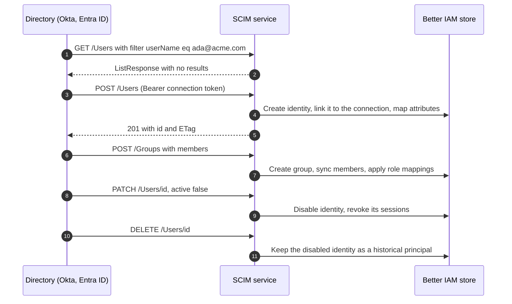

<Term id="scim">SCIM</Term> (System for Cross-domain Identity Management, RFC 7643 and RFC 7644) is a standard REST
API for managing user accounts and groups from another system. Identity providers (IdPs) such as Okta and Microsoft
Entra ID use it to keep the applications a company uses in step with the company's directory.

**The problem it solves.** Single sign-on creates an account only when someone first signs in, and it never removes
one. Without provisioning, a company's IT team has to create accounts by hand before people start, update them when
people change teams, and remember to remove them when people leave. The last step is the one that gets missed, and
a former employee keeps access. With SCIM, the company's directory does all three automatically: it creates the
account when someone joins, updates their name, department, and manager as they change, and deactivates them the
moment they leave.

`createScimService` makes Better IAM a SCIM 2.0 service provider (the side that receives these calls). Each
organization gets its own **connection** with its own bearer token. A connection belongs to exactly one
<Term id="tenant">tenant</Term>, and the users and groups it provisions are isolated from every other connection.

**Who configures it.** Your team mounts the service once and builds a provisioning screen (or uses the console). An
organization's administrator, usually the customer's IT team, then creates a connection on that screen, pastes its
URL and token into their IdP's provisioning settings, and maps directory groups to roles.

Going the other way, pushing your members into SaaS applications, is [SCIM outbound](/docs/federation/scim-outbound).

## Set up the service

Create the service with the host callbacks, choose where its two sets of routes live, and mount it. `mapAttributes`
here copies a job title and department from the directory into identity attributes:

```ts title="iam.ts"
import { createScimService } from 'better-iam/scim';

export const scim = createScimService({
  ...iam.protocolHost,
  basePath: '/api/iam/scim/v2',
  adminBasePath: '/api/iam/scim-admin',
  mapAttributes: ({ title, enterprise }) => ({
    ...(title ? { title } : {}),
    ...(typeof enterprise?.department === 'string' ? { department: enterprise.department } : {}),
  }),
});
iam.useProtocol(scim);
```

Mount both paths under the IAM handler's path, and forward `PUT`, `PATCH`, and `DELETE` as well as `GET` and
`POST` to `iam.handler`, so identity providers reach the protocol endpoints. See
[Protocol mounts](/docs/operations/deployment/protocol-mounts).

<TypeTable
  type={{
    basePath: { type: 'string', description: 'Where the SCIM endpoints that identity providers call are served. Must be absolute.', default: "'/scim/v2'" },
    adminBasePath: { type: 'string', description: 'Where the JSON administration routes for your admin UI are served. Must be absolute and must not overlap basePath.', default: "'/scim/admin'" },
    mapAttributes: { type: '(user: ProvisionedUser) => Record<string, unknown> | undefined', description: 'Turns provisioned SCIM fields (title, department, cost center) into your declared identity attributes, so policies can use them. Return undefined to leave attributes untouched.' },
    mapManager: { type: 'boolean', description: "Sets each person's manager from the enterprise extension's manager field, so approvals route to the directory's reporting line.", default: 'true' },
    'store, authorize, authenticate, validateIdentityAttributes, syncRoleMappings': { type: 'host callbacks', description: 'Database access, permission checks for administration, attribute validation, and the trusted callback that applies group role mappings. Supplied by iam.protocolHost.', required: true },
  }}
/>

## Create a connection

A connection is one directory's credential for one organization. Create one per IdP that provisions into a tenant:

```ts
const connection = await scim.createConnection(credential, {
  tenantId,
  name: 'Okta provisioning',
  expiresIn: 180 * 86400, // optional, seconds
});
// connection.path: '/api/iam/scim/v2/{connection.id}'
// connection.token: shown once
```

`createConnection` requires `iam:scim:connections:create`. It returns the bearer token once, its expiry, and a
connection-specific base path. Configure that path (with your origin) and the token in the provisioning client.
The token is stored only as a hash, lasts 90 days by default (60 seconds to one year), and is restricted to exactly
one connection and tenant. Put a reminder on the expiry date, or rotate earlier with `rotateToken`.

<Tabs items={['Okta', 'Entra ID']}>
<Tab value="Okta">

In the app integration's provisioning settings, set:

- **SCIM connector base URL**: `https://identity.example/api/iam/scim/v2/{connectionId}`
- **Unique identifier field for users**: `userName`
- **Authentication Mode**: HTTP Header, with the connection token

Then enable the provisioning actions you want (create, update, deactivate) and push the groups whose roles you
[map](#groups-and-role-mappings).

</Tab>
<Tab value="Entra ID">

In the enterprise application's **Provisioning** settings, choose automatic provisioning and set:

- **Tenant URL**: `https://identity.example/api/iam/scim/v2/{connectionId}`
- **Secret Token**: the connection token

Entra ID's dialect is handled: case-insensitive operation names, `"True"` and `"False"` strings for booleans,
bare-ID manager values, and member removal by value.

</Tab>
</Tabs>

## How provisioning works



The IdP first searches for the person, creates them if they are missing, keeps them updated, and deactivates or
deletes them when they leave. Every request runs in one transaction: the mutation and its audit event commit
together. The connection's `lastUsedAt` is recorded at most once a minute, so you can see whether an IdP is still
calling.

## Users

A SCIM user becomes a Better IAM <Term id="identity">identity</Term>. Users support create, retrieve, list, replace,
PATCH, and delete. These fields are stored and returned as provisioned:

| Schema | Fields |
| --- | --- |
| `urn:ietf:params:scim:schemas:core:2.0:User` | `userName` (required), `displayName`, `externalId`, `active`, `name` (`formatted`, `familyName`, `givenName`, `middleName`, `honorificPrefix`, `honorificSuffix`), `emails` (up to 20, one primary), `title` |
| `urn:ietf:params:scim:schemas:extension:enterprise:2.0:User` | `employeeNumber`, `costCenter`, `organization`, `division`, `department`, `manager` |

The second row is the **enterprise user extension**, a standard add-on schema for HR-style fields. Supply
`mapAttributes` to turn any of these into the identity attributes the product declares
(`permissions.identityAttributes`). `validateIdentityAttributes` from `iam.protocolHost` validates the mapping, so
a directory can drive `principal.department`-style [policy conditions](/docs/guides/authorization/conditions).

- **Uniqueness.** `userName` is unique per connection, ignoring case. The identity's email is the primary email
  (or the first one, or `userName` when it is an email address).
- **No takeover.** A provisioning request cannot take over an existing local account based on email. An email
  that belongs to another identity in the tenant fails with `409 uniqueness`.
- **Deactivation.** `active: false` disables the local identity and revokes its user, API, and assumed-role
  <Term id="session">sessions</Term>, so access ends at once. `active: true` enables it again.
- **Deletion.** `DELETE` disables the identity, revokes its sessions, and removes it from the connection's groups.
  The disabled identity is preserved as a historical principal, so audit history still names who did what.
- **Protected identities.** Protected owners and root administrators cannot be modified by SCIM (`403
  mutability`), so a directory mistake cannot lock you out of a tenant.
- **Administrator deletions win.** An identity an administrator deleted can no longer be updated through SCIM
  (`403 mutability`): SCIM never reactivates it or adds it back to groups, while a SCIM delete of it still
  succeeds.

### Manager mapping

The enterprise extension's `manager.value` becomes the person's `Identity.managerId` (`mapManager`, on by default),
so [approvals](/docs/guides/privileged-access/elevation) and manager-review
<Term id="certification">certification campaigns</Term> route to the directory's reporting line without anyone
maintaining it twice.

- The value may be the manager's SCIM ID, `externalId`, or `userName` within the same connection. A reference
  naming the person themself is ignored.
- A report provisioned before their manager is linked once the manager arrives, so the order the IdP sends people
  in does not matter.
- A manager that would close a reporting loop, or a deleted one, is skipped rather than refused.
- SCIM clears only a manager it set itself, never one an administrator chose. Deleting the manager through SCIM
  releases the reports it linked.

## Groups and role mappings

Directory groups ("Engineering", "Finance") usually decide who should have which access. Groups support the same
operations as users. Each SCIM group maintains a local IAM <Term id="group">group</Term> with its `displayName` as
the name. Group membership accepts users of the same connection only (up to 1000 member references per request);
nested groups are not supported.

A directory group carries no authority by itself: the IdP decides who is in "Engineering", but an administrator of
your product decides what "Engineering" may do, by mapping the group to <Term id="role">roles</Term>:

```ts
await scim.setRoleMappings(credential, {
  tenantId,
  connectionId: connection.id,
  groupId: scimGroupId, // the SCIM group ID, from listGroups
  roleIds: [engineeringRoleId],
});
```

- The caller needs `iam:scim:mappings:update` on the connection and `iam:bindings:create` on every role, so nobody
  can map a role they could not grant directly. At most 100 roles; protected roles are refused.
- The host's transactional `syncRoleMappings` callback creates the group <Term id="binding">bindings</Term> with
  the administrator's credential. Subsequent membership updates inherit that configured binding and its original
  delegated authority, so joining "Engineering" in the directory grants the engineering role here.
- A SCIM token cannot create policies, roles, boundaries, or trust relationships. It only moves people in and out
  of groups an administrator has already mapped.
- Deleting a SCIM group removes the bindings its mapping created and the local group. Revoking the connection
  removes all of its mapped bindings.

`scim.listGroups(credential, { tenantId, connectionId })` (`iam:scim:connections:read`) lists the groups an
identity provider pushed through a connection, with their SCIM ID, local `groupId`, member counts, and mapped
`roleIds`. Use it to build the "map directory groups to roles" screen.

## Filtering, sorting, and paging

Before creating anyone, IdPs search for existing users and groups, usually by `userName` or `externalId`. Filtering
implements the full RFC 7644 grammar, so any IdP's queries work:

```http
GET /Users?filter=userName eq "ada@acme.com"
GET /Users?filter=emails[type eq "work" and primary eq true]
GET /Users?filter=name.familyName sw "Lov" and not (active eq false)
GET /Users?filter=urn:ietf:params:scim:schemas:extension:enterprise:2.0:User:department eq "Research"
GET /Users?filter=meta.lastModified gt "2026-09-01T00:00:00Z"&sortBy=name.familyName&count=50
```

- `and`, `or`, `not (...)`, parentheses, value paths (filters inside a multi-valued attribute, like
  `emails[...]`), sub-attributes, schema-qualified names, and the operators `eq ne co sw ew pr gt ge lt le`
  (equals, not equals, contains, starts with, ends with, present, and comparisons).
- Filters evaluate against the rendered resource, so any returned attribute is filterable. A multi-valued
  attribute matches when any value does.
- IDs, external IDs, and member values are case-exact; other strings compare case-insensitively. `active` and
  `primary` require booleans, and booleans allow only `eq` and `ne`.
- Filters are bounded: 2048 characters, 64 comparisons, and 16 levels of nesting. Anything outside the grammar
  fails with `invalidFilter`, never an unfiltered result.
- `sortBy` and `sortOrder` sort by any attribute (multi-valued attributes by their primary value; unassigned values
  last).
- `attributes` and `excludedAttributes` choose which fields a response includes; `id` and `schemas` are always
  returned.
- `POST /Users/.search` and `POST /Groups/.search` accept the same query as a `SearchRequest` body, for queries too
  long for a URL.
- Pagination uses a one-based `startIndex` and `count` (default 100), with at most 200 results per response.

## PATCH

`PATCH` changes part of a resource instead of replacing all of it. IdPs use it for most updates, such as
deactivating a user or adding one member to a group:

```json title="PATCH /Users/{id}"
{
  "schemas": ["urn:ietf:params:scim:api:messages:2.0:PatchOp"],
  "Operations": [
    { "op": "replace", "path": "name.givenName", "value": "Ada" },
    { "op": "replace", "path": "emails[type eq \"work\"].value", "value": "ada@acme.com" },
    { "op": "replace", "path": "urn:ietf:params:scim:schemas:extension:enterprise:2.0:User:manager.value", "value": "u-42" },
    { "op": "Replace", "value": { "active": "False" } }
  ]
}
```

- Pathless `add` and `replace`, including schema-qualified keys and whole extension objects.
- Sub-attribute paths (`name.givenName`, `urn:…:enterprise:2.0:User:manager.value`) and value paths with optional
  sub-attributes (`emails[type eq "work"].value`, `members[value eq "…"]`).
- Removal of listed members: `{ "op": "remove", "path": "members", "value": [{ "value": "…" }] }`.
- An `add` to a value path that matches nothing creates the entry, seeded from the filter's `eq` comparisons. A
  `replace` that matches nothing returns `noTarget`.
- Operation names are case-insensitive, and `"True"`/`"False"` strings are accepted for boolean attributes,
  matching Microsoft Entra ID.
- Every PATCH (1 to 100 operations) is applied to a copy and saved through the same validation as `PUT`, so a
  failing operation leaves the resource unchanged. Required attributes cannot be removed.

## Bulk

`Bulk` sends many operations in one HTTP request, which IdPs use for large initial imports. `POST
{connection}/Bulk` accepts up to 100 operations in one `BulkRequest` of at most 1 MiB:

```json title="POST /Bulk"
{
  "schemas": ["urn:ietf:params:scim:api:messages:2.0:BulkRequest"],
  "failOnErrors": 5,
  "Operations": [
    { "method": "POST", "path": "/Groups", "bulkId": "eng", "data": { "displayName": "Engineering", "members": [{ "value": "bulkId:ada" }] } },
    { "method": "POST", "path": "/Users", "bulkId": "ada", "data": { "userName": "ada@acme.com" } },
    { "method": "PATCH", "path": "/Users/2819c223", "version": "W/\"3\"", "data": { "schemas": ["urn:ietf:params:scim:api:messages:2.0:PatchOp"], "Operations": [{ "op": "replace", "value": { "active": false } }] } }
  ]
}
```

- Each operation commits in its own transaction, so a failed operation never leaves partial writes.
- `bulkId:` references let one operation point at a resource created by another in the same request, regardless of
  order: forward references (like the group above, which names a user created after it) are deferred. Cycles and
  references to failed operations return `409`, unknown references `400`.
- `POST` operations need a `bulkId`. `failOnErrors` stops processing after that many failures, and `version` maps
  to `If-Match`.

## Versions and ETags

Every resource has a weak version (`meta.version`, for example `W/"3"`), also sent as the `ETag` header. It prevents
lost updates when two changes race. `GET` honours `If-None-Match` (`304`, nothing changed), and writes honour
`If-Match` (`412 invalidVers` when the resource changed since it was read).

## Manage connections

These methods back the provisioning screen of your admin UI. They take an administrator's credential, never the
SCIM token, and check the listed permission in the connection's tenant:

| Method | Permission | What it does and when to use it |
| --- | --- | --- |
| `createConnection(credential, { tenantId, name, expiresIn? })` | `iam:scim:connections:create` | Starts provisioning for an organization. Returns `{ id, token, expiresAt, path }`; the token is shown once. |
| `listConnections(credential, { tenantId })` | `iam:scim:connections:read` | Shows each connection's name, path, expiry, revocation, creation, last-use and rotation times, provisioned user and group counts, and role mappings. Never the token. Use it for a status page. |
| `rotateToken(credential, { tenantId, connectionId, expiresIn? })` | `iam:scim:credentials:create` | Issues a replacement token once, before expiry or after a leak. The previous token stops working immediately; provisioned users, groups, and mappings are kept. |
| `revokeConnection(credential, { tenantId, connectionId })` | `iam:scim:connections:delete` | Ends provisioning: invalidates the token immediately and removes the connection's configured role bindings. |
| `listGroups(credential, { tenantId, connectionId })` | `iam:scim:connections:read` | Lists pushed groups with member counts and mapped roles. |
| `setRoleMappings(credential, { tenantId, connectionId, groupId, roleIds })` | `iam:scim:mappings:update` | Maps one SCIM group to roles. |

The same administration is available as JSON routes for browser consoles: `handler` serves
`POST {adminBasePath}/connections/{list,create,rotate,revoke,groups,mappings}`. The routes authenticate the
caller's session cookie or bearer token like any IAM call. They require `X-Better-IAM: 1` and a JSON body of at
most 64 KiB, refuse a mismatched `Origin`, and answer `{ data }` or `{ error: { code, message } }`.

## Discovery and limits

IdPs read `ServiceProviderConfig`, `ResourceTypes`, and `Schemas` to learn what the server supports, including the
enterprise user extension.

| Limit | Value |
| --- | --- |
| Request body | 1 MiB, `application/scim+json` or `application/json` |
| Results per page | 100 by default, at most 200 |
| Bulk operations | 100 per request |
| PATCH operations | 100 per request |
| Group member references | 1000 per request |
| Filters | 2048 characters, 64 comparisons, 16 levels of nesting |

Password changes, nested groups, and extension schemas other than the enterprise user extension are not enabled.

## Audit

Mutation records and audit events commit together. Administrative events (`iam:scim:CreateConnection`,
`iam:scim:RotateToken`, `iam:scim:RevokeConnection`, `iam:scim:SetRoleMappings`) retain the authenticated
administrator. Provisioning events (`iam:scim:CreateUser`, `iam:scim:UpdateUser`, `iam:scim:DeleteUser`,
`iam:scim:CreateGroup`, `iam:scim:UpdateGroup`, `iam:scim:DeleteGroup`) identify the SCIM connection as the actor
(`scim:{connectionId}`).

## Next steps

<Cards>
  <Card title="SCIM outbound" href="/docs/federation/scim-outbound">
    Push the members your directory provisioned on to SaaS applications.
  </Card>
  <Card title="Enterprise onboarding" href="/docs/federation/enterprise-onboarding">
    SSO, SCIM, and offboarding for one customer, end to end.
  </Card>
</Cards>
