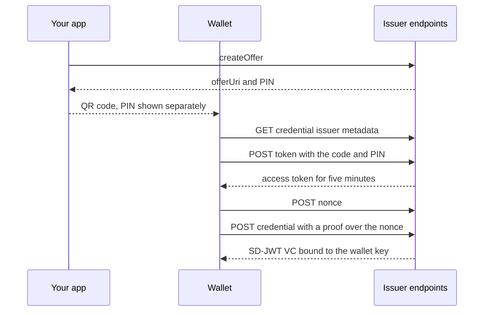

When someone has to prove where they work or what they may do (at a partner's front desk, in another company's
app, at an event), the usual answers are a call back to the organization's systems or a screenshot. The first ties
every verifier to your API and tells you about every check; the second proves nothing.

A **verifiable credential** is a signed statement about a person, such as an employee badge, that the person keeps
in a digital wallet and shows to anyone who asks. The verifier checks the issuer's signature and the credential's
current status on its own, and the person reveals only what the verifier needs: "works at Acme", without their email
address.

Every <Term id="tenant">organization</Term> in Better IAM can issue them. Credentials are **SD-JWT VCs**, the IETF
format behind the EU digital identity wallet and the OpenID for Verifiable Credentials ecosystem:

- **Selective disclosure** (SD-JWT, RFC 9901). Each claim can be revealed or withheld per presentation.
- **Holder binding.** A credential is bound to a key the holder proved they own, so a copied credential is useless
  without that key.
- **Revocation and suspension** through an IETF **Token Status List**: a compressed bitstring the issuer signs and
  serves.
- **Wallet issuance** over **OpenID4VCI** (pre-authorized code flow, with an optional PIN), plus a direct API for apps
  that embed their own wallet.
- **Verification** of presentations offline with the issuer's public keys, or through Better IAM.

## Turn it on

```ts title="iam.ts"
const iam = betterIam({
  // ...
  verifiableCredentials: true, // or an options object
});
```

Without the option, every method of the `verifiableCredentials` group fails with `FEATURE_DISABLED` and the wallet
endpoints are not mounted. Values out of range are refused with `INVALID_CONFIG`.

<TypeTable
  type={{
    maxLifetimeMs: {
      type: 'number',
      description: 'The longest lifetime any credential type may set, from 5 minutes to 5 years.',
      default: '365 days',
    },
    statusListSize: {
      type: 'number',
      description: 'Entries per status list: 1024 to 1048576, a multiple of 1024. A list takes new credentials until it is half full, then a new list starts.',
      default: '65536',
    },
    offerLifetimeMs: {
      type: 'number',
      description: 'How long a wallet offer can be redeemed, from 1 minute to 24 hours.',
      default: '10 minutes',
    },
    statusListLifetimeMs: {
      type: 'number',
      description: 'How long a signed status list token is valid, from 10 minutes to 30 days.',
      default: '24 hours',
    },
    statusListTtlSeconds: {
      type: 'number',
      description: 'How long verifiers may cache a status list (its ttl claim and the Cache-Control max-age), 10 to 86400 seconds.',
      default: '300',
    },
    recordRetentionDays: {
      type: 'number',
      description: 'How long issued-credential records stay after the credential expired, 1 to 3650 days.',
      default: '30',
    },
  }}
/>

Each tenant is an issuer. Its identifier, which is also the base URL of its wallet endpoints, is
`{origin}{basePath}/vc/{tenantId}` on the deployment's `baseURL`, for example
`https://iam.example.com/api/iam/vc/ten_123`.

## Credential types

A credential type says which claims a credential carries and where each value comes from. Administrators manage
types with `iam:vc:manage`:

```ts
await iam.api.verifiableCredentials.createType(admin, {
  tenantId,
  name: 'employee',
  displayName: 'Acme employee',
  description: 'Works at Acme',
  claims: [
    { name: 'email', source: 'email', label: 'Email' },
    { name: 'name', source: 'name', selective: false }, // always shown
    { name: 'organization', source: 'tenantName', selective: false },
    { name: 'department', source: 'department' },
    { name: 'teams', source: 'teams' },
    { name: 'title', source: 'attribute:title', required: true },
    { name: 'clearance', source: 'static', value: 'standard' },
  ],
  lifetimeMs: 90 * 86_400_000, // default 30 days
  requireMfa: true,
  backgroundColor: '#0b2545',
  textColor: '#ffffff',
});
```

Each claim takes these fields:

<TypeTable
  type={{
    name: {
      type: 'string',
      description: 'The claim name in the credential: a letter or underscore, then up to 63 letters, digits or underscores. Names SD-JWT VC reserves (iss, sub, iat, nbf, exp, cnf, vct, status, jti, aud, _sd and others) are refused, and so are repeats.',
      required: true,
    },
    source: { type: 'string', description: 'Where the value comes from (see the table below).', required: true },
    value: {
      type: 'Json',
      description: 'The value of a static claim: at most 2 KiB of JSON, without _sd, _sd_alg or ... keys.',
    },
    selective: {
      type: 'boolean',
      description: 'The holder chooses whether to reveal it. false puts it in every presentation.',
      default: 'true',
    },
    required: {
      type: 'boolean',
      description: 'Refuse to issue when the person has no value (CLAIM_UNAVAILABLE). Otherwise a missing claim is left out.',
      default: 'false',
    },
    label: { type: 'string', description: 'How wallets label the claim, 1 to 64 characters.' },
  }}
/>

| Source | Value |
| --- | --- |
| `email`, `emailVerified`, `name`, `identityId`, `kind` | The person's account (`emailVerified` only when the account has an email) |
| `tenantId`, `tenantName` | The organization |
| `teams` | The names of the [teams](/docs/guides/teams-and-departments) the person is on |
| `department` | The name of the person's department |
| `attribute:{name}` | A declared identity attribute (`permissions.identityAttributes`) |
| `static` | The claim's fixed `value` |

A type's `name` is 1 to 64 lowercase letters, digits, `_` or `-`, starting with a letter. It has 1 to 32 claims, a
`displayName` of up to 128 characters, an optional `description` of up to 512, and optional wallet card colors as
`#rrggbb`. Its `lifetimeMs` runs from 5 minutes to the deployment's `maxLifetimeMs`. The first type also creates the
tenant's issuer key.

The type identifier (`vct`) defaults to `{issuer}/types/{name}`, which serves SD-JWT VC type metadata: the display
name, colors, claim labels, and which claims are selectively disclosable. A type can pass its own `vct` instead (at
most 256 characters, no whitespace), such as a shared schema URL. It may not be one under another organization's
issuer on this deployment (`INVALID_INPUT`), because verifiers match on it.

`updateType` changes the display, claims, lifetime, `requireMfa` or `enabled`; the name and `vct` never change.
`deleteType` also removes the type's pending offers. It is refused with `RESOURCE_IN_USE` while valid credentials of
the type exist: disable the type, or revoke them first.

## Who gets credentials

People get credentials for themselves when <Term id="policy">policies</Term> allow `vc:request` on
`credential-type/{name}`. The resource's `name`, `vct` and `requireMfa` attributes are available to
<Term id="condition">conditions</Term>:

```json title="Engineers may request the employee badge"
{
  "effect": "allow",
  "actions": ["vc:request"],
  "resources": ["credential-type/employee"],
  "conditions": { "StringEquals": { "principal.department": "Engineering" } }
}
```

A self-service request is refused, and audited as a denied `vc:request`:

- from an <Term id="impersonation">impersonation</Term> ("view as") session (`IMPERSONATION_RESTRICTED`);
- from an agent acting for the person in a
  [delegated session](/docs/guides/ai-agents#letting-an-agent-act-for-a-person), which would otherwise bind the
  person's credential to a key of the agent's choosing (`ACCESS_DENIED`);
- from a principal of another organization, including the platform root override (`ACCESS_DENIED`);
- without an MFA session when the type has `requireMfa` (`MFA_REQUIRED`);
- for a disabled type (`TYPE_DISABLED`).

`available` lists the enabled types the caller may request right now, which is what a "get your badge" page shows.

**A credential never outlives the access behind it.** When `vc:request` comes from a time-limited grant (an
[expiring binding](/docs/guides/authorization/temporary-access#expiring-bindings) or group membership, a
[just-in-time](/docs/guides/privileged-access/elevation) <Term id="activation">activation</Term>, an
<Term id="access-window">access window</Term>), the credential ends with that grant. Credentials requested from an
assumed role or temporary credentials end with that session. Every credential also ends at the type's lifetime and
at the person's scheduled account expiry, whichever comes first. When the result is less than a minute away, the
request fails with `ACCESS_EXPIRING`.

Administrators with `iam:vc:issue` can offer a credential to someone else: `createOffer` with `identityId`, for an
active member (`IDENTITY_INACTIVE` otherwise) and an enabled type. The person redeems the offer in their wallet,
which binds the credential to the wallet's key. Offers made for someone else are not decided against that person's
`vc:request`.

## Issue to a wallet (OpenID4VCI)

`createOffer` returns an OpenID4VCI credential offer with a pre-authorized code. Show `offerUri` as a QR code, or
open it on the phone:

```ts
const offer = await iam.api.verifiableCredentials.createOffer(session, {
  tenantId,
  type: 'employee',
  txCode: true, // the wallet asks for a 6-digit PIN
});
// offer.offerUri: 'openid-credential-offer://?credential_offer=%7B...'
// offer.txCode: '482913' (show it separately from the QR code)
```

The wallet then talks to the issuer's endpoints:



These endpoints are mounted next to the HTTP API with no extra setup (`{issuer}` is the tenant's issuer URL):

| Endpoint | Serves |
| --- | --- |
| `GET /.well-known/openid-credential-issuer{basePath}/vc/{tenantId}` | Credential issuer metadata: the enabled types and their wallet display |
| `GET /.well-known/oauth-authorization-server{basePath}/vc/{tenantId}` | Token endpoint metadata |
| `GET /.well-known/jwt-vc-issuer{basePath}/vc/{tenantId}` | The issuer's public keys, for SD-JWT VC verifiers |
| `POST {issuer}/token` | Pre-authorized code (and PIN) for an access token |
| `POST {issuer}/nonce` | A proof nonce (`c_nonce`) |
| `POST {issuer}/credential` | The credential, bound to the key in the proof |
| `GET {issuer}/types/{name}` | SD-JWT VC type metadata |
| `GET {issuer}/status/{listId}` | The Token Status List (`application/statuslist+jwt`) |
| `GET {issuer}/jwks.json` | The issuer's public keys |

<Callout type="warn" title="Forward the well-known paths">
  The `{issuer}/...` endpoints are under the base path already. When the HTTP handler is mounted inside a framework
  route (such as a Next.js catch-all at `/api/iam`), also forward `/.well-known/openid-credential-issuer/*`,
  `/.well-known/oauth-authorization-server/*` and `/.well-known/jwt-vc-issuer/*` to `iam.handler`. See
  [Protocol mounts](/docs/operations/deployment/protocol-mounts).
</Callout>

What each step checks:

- **The code.** Each offer's pre-authorized code works once and expires after `offerLifetimeMs`. The token endpoint
  takes a form-encoded request and only the pre-authorized code grant.
- **The PIN.** A token request without the PIN is answered `invalid_request` and does not count as a guess. Each
  wrong PIN is audited as a denied `vc:offer:redeem`, and the fifth ends the offer.
- **The access token** lasts five minutes and yields one credential.
- **The proof** is an `openid4vci-proof+jwt` of at most 8 KiB, signed with ES256, ES384 or EdDSA. It names its
  public key in the `jwk` header only (no `kid` or `x5c`), names the issuer as `aud`, is at most five minutes old,
  and carries a fresh nonce (valid five minutes). Each nonce works once. Nonces are signed rather than stored, so
  handing them out writes nothing.
- **Access, again.** For self-service offers, policy and MFA (as the session that made the offer had it) are decided
  again when the wallet redeems the offer, and the credential ends with the grants that allow it. Taking
  `vc:request` away in the meantime stops the offer with `access_denied`, audited as a denied `vc:offer:redeem`. A
  holder who is no longer an active member is refused as well (`invalid_credential_request`).

The credential records the offer it came from. For an offer an administrator made for someone else, the
administrator is recorded as its `issuedBy`.

The wallet endpoints allow cross-origin requests from any origin, so browser-based wallets can call them. They answer
with OAuth-style errors: `invalid_request`, `unsupported_grant_type`, `invalid_grant`, `invalid_token`,
`invalid_proof`, `invalid_nonce`, `invalid_credential_request`, `unknown_credential_configuration` and
`access_denied`. Request bodies are limited to 8 KiB at the token endpoint and 16 KiB at the credential endpoint. A
suspended organization's endpoints refuse every request.

## Issue through the API

Apps that hold the holder key themselves (a mobile app with its own wallet, a test harness) call `request` with a
proof:

```ts
import { SignJWT } from 'jose';

const { nonce } = await iam.api.verifiableCredentials.nonce({ tenantId });
const proof = await new SignJWT({ aud: issuer, nonce, iat: Math.floor(Date.now() / 1000) })
  .setProtectedHeader({ alg: 'ES256', typ: 'openid4vci-proof+jwt', jwk: publicJwk })
  .sign(privateKey);
const { credential, record } = await iam.api.verifiableCredentials.request(session, {
  tenantId,
  type: 'employee',
  proof,
});
// credential: '<issuer-signed JWT>~<disclosure>~<disclosure>~'
```

Holder keys may be ES256, ES384 or EdDSA (Ed25519). Issuing is audited as `vc:credential:issue` with the type, the
holder key's thumbprint and the claim names, never the values.

The issuer-signed JWT has `typ: dc+sd-jwt` and is signed with the tenant's ES256 key. Anyone holding the credential
sees `iss`, `iat`, `exp`, `vct`, the holder key (`cnf.jwk`), the status list reference (`status.status_list` with
`idx` and `uri`) and the claims marked `selective: false`. Every other claim is a disclosure that the holder decides
to reveal, and the digests of the disclosures come with up to three random decoys, which hide how many claims exist.

## Present and verify

A holder presents a credential with only the claims a verifier needs, plus a key-binding JWT over the verifier's
audience and nonce. `presentSdJwt` does this for Node wallets and tests:

```ts
import { presentSdJwt } from '@better-iam/server';

const presentation = await presentSdJwt(credential, {
  disclose: ['email'], // or 'all'
  holderKey: privateKey,
  alg: 'ES256',
  audience: 'https://shop.example',
  nonce: challengeFromTheVerifier,
});
```

Remote verifiers call the public `verify` method, which reports instead of throwing:

```ts
const result = await iam.api.verifiableCredentials.verify({
  presentation,
  audience: 'https://shop.example',
  nonce: challengeFromTheVerifier,
});
if (result.valid) result.claims.email; // 'alice@acme.test'; undisclosed claims are absent
else result.reason; // 'revoked', 'suspended', 'wrong-nonce', 'bad-disclosure', ...
```

A verifier running next to the deployment calls `iam.verifiableCredentials.verify(presentation, options)` instead,
which throws `SdJwtError` with the same `reason`. It also accepts `requireKeyBinding: false` for credentials checked
without a holder, such as an issuer-side audit.

<Callout type="warn" title="Audience and nonce are required">
  Without them (`INVALID_INPUT`), a presentation captured by one verifier would verify for any other. Use a fresh
  nonce per presentation and remember the ones you accepted: the result's `keyBinding` (`audience`, `nonce`,
  `issuedAt`) is there for that bookkeeping.
</Callout>

A verification checks, in order:

1. The issuer's signature, with one of that tenant's current or previous keys (by `kid`), and the validity times.
2. That every disclosure matches a digest the issuer signed, exactly once. A disclosure can never overwrite a signed
   or reserved claim.
3. The key-binding JWT: signed by the holder key in `cnf.jwk`, with an `sd_hash` over the exact presentation, the
   expected audience and nonce, and at most five minutes old.
4. The credential's entry in the status list.
5. The holder's standing: a credential of someone who is no longer an active member fails as `revoked`, and one of a
   suspended organization as `suspended`, even before the sweep acts.

The failure reasons are `malformed`, `unsupported-type`, `unknown-issuer`, `bad-signature`, `expired`,
`not-yet-valid`, `bad-disclosure`, `key-binding-required`, `bad-key-binding`, `wrong-audience`, `wrong-nonce`,
`stale-key-binding`, `revoked`, `suspended` and `status-unavailable`.

Verifiers elsewhere can check the first four steps offline with any SD-JWT VC library. They fetch the keys from
`/.well-known/jwt-vc-issuer{basePath}/vc/{tenantId}` and the status list from the URI in the credential's
`status.status_list`. `verifySdJwt`, `readStatusList` and `statusAt` are exported from `@better-iam/server` for Node
verifiers.

## Revoke and suspend

- `revoke` ends a credential for good. Holders may revoke their own credentials from a session acting in their own
  right. Impersonation and delegated sessions, credentials narrowed by a session policy, and anyone revoking someone
  else's credential need `iam:vc:revoke`.
- `suspend` and `reinstate` (`iam:vc:revoke`) turn a credential off and on again, for a lost phone.
- A transition that does not apply, such as revoking a revoked credential or reinstating one that is not suspended,
  fails with `INVALID_TRANSITION`.

Each credential has a random, never-reused index in a status list with two bits per entry: 0 valid, 1 revoked, 2
suspended. Verifiers see a change within the list's `ttl`. Random indexes keep a credential's position from
revealing when it was issued. `mine` lists a person's own credentials (the last 100, not for delegated agent
sessions), and `listIssued` lists the
tenant's by type, identity or state (`valid`, `suspended`, `revoked`, `expired`) for administrators with
`iam:vc:read`. Records hold claim names, never values.

<Callout title="Schedule the sweep">
  Run `iam.verifiableCredentials.sweep()` hourly. It revokes the credentials of people who are no longer active
  members (reason `identity-inactive`). It also decides `vc:request` again for self-service credentials, with the MFA
  state of the session that obtained them, and revokes those no longer allowed (`access-changed`). Both are audited
  as `vc:credential:revoke` by `deployment-operator`. A suspended organization's credentials already fail
  verification, so the sweep leaves them for its reinstatement. The
  [retention sweep](/docs/operations/jobs#retention-sweep) (`iam.sweepExpired()`) removes expired offers and nonces,
  and issued-credential records `recordRetentionDays` after the credential expired.
</Callout>

## Issuer keys

Each tenant signs with an ES256 (P-256) key created with its first credential type. The key is sealed under the
deployment secret and re-sealed by `iam.rotateSecrets()` (see [Secrets](/docs/operations/deployment/secrets)).

- `rotateKey` starts signing with a new key. The old one stays published as `previous`, so its credentials keep
  verifying.
- `retireKey` removes a previous key from the published keys, after which its credentials no longer verify. It is
  refused for the active key (`INVALID_TRANSITION`), and with `RESOURCE_IN_USE` while valid credentials signed by the
  key exist, unless `force: true`, which revokes them (reason `key-retired`).

## Access, errors and audit

| Method | Access |
| --- | --- |
| `createType`, `updateType`, `deleteType`, `rotateKey`, `retireKey` | `iam:vc:manage` |
| `status`, `getType`, `listTypes`, `listIssued`, `listKeys` | `iam:vc:read` |
| `createOffer` for someone else | `iam:vc:issue` |
| `revoke` (someone else's), `suspend`, `reinstate` | `iam:vc:revoke` |
| `request`, `createOffer` for yourself, `available`, `mine`, `revoke` (your own) | A session; `vc:request` decides requests |
| `nonce`, `verify`, `issuerMetadata` | Public |

Errors: `FEATURE_DISABLED`, `TYPE_DISABLED`, `IDENTITY_INACTIVE`,
[`CLAIM_UNAVAILABLE`](/docs/reference/errors#claim_unavailable),
[`INVALID_PROOF`](/docs/reference/errors#invalid_proof),
[`INVALID_NONCE`](/docs/reference/errors#invalid_nonce), `MFA_REQUIRED`, `IMPERSONATION_RESTRICTED`,
[`ACCESS_EXPIRING`](/docs/reference/errors#access_expiring), `RESOURCE_IN_USE` and `INVALID_TRANSITION`.

Audit events: `vc:credential:issue`, `vc:credential:revoke` (a holder's own revocation and the sweep's),
`vc:offer:create`, denied `vc:offer:redeem` (wrong PIN, lockout, access changed), denied `vc:request`, and the
`iam:vc:*` administration operations. The public metadata, key, type and status list endpoints only read.

## Next steps

<Cards>
  <Card title="verifiableCredentials API reference" href="/docs/reference/api/verifiable-credentials">
    Every method with its permission, audit events, and errors.
  </Card>
  <Card title="Temporary access" href="/docs/guides/authorization/temporary-access">
    Expiring bindings and access windows, which also end the credentials they allow.
  </Card>
  <Card title="Scheduled jobs" href="/docs/operations/jobs">
    Where the hourly credential sweep fits with the other jobs.
  </Card>
</Cards>
