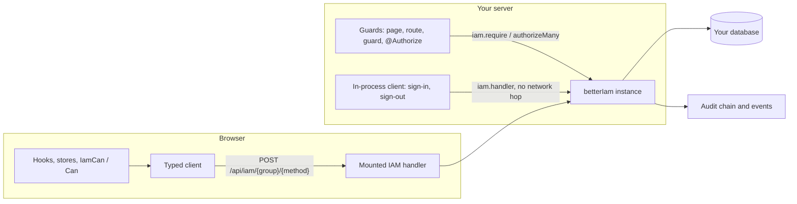

import { Atom, Cat, Flame, Globe, Leaf, Mountain, Route, Server, Triangle } from 'lucide-react';

Every framework integration wraps the same `betterIam()` instance. None of them has its own session format,
policy engine, or audit trail. They read the <Term id="session">session</Term> the server issued, ask the server for decisions, and call
the server's HTTP handler in process when they need to sign someone in. A page guarded in Next.js, a NestJS
controller, and an Express route therefore enforce the same <Term id="role">roles</Term>, <Term id="policy">policies</Term>, <Term id="condition">conditions</Term>, <Term id="boundary">boundaries</Term>, and
<Term id="relationship">relationships</Term>, and write the same audit events.

## Why use an integration

You can always call the core directly: mount `iam.handler`, pass a request's headers as the <Term id="credential">credential</Term> to
`iam.api.*`, and call `iam.require` before a mutation. The integrations exist because every web framework needs
the same glue around those calls, and the glue is where mistakes creep in:

- **Getting the credential.** Each request carries a session cookie or a bearer token. The integration reads it
  the way your framework exposes requests, and looks the session up once per request instead of once per call.
- **Answering refusals the framework's way.** A signed-out visitor on a page should be redirected to the login
  page with a safe `?next=`. The same refusal on an API route should be a 401 JSON body, and in a form action it
  should come back to the form. The integrations map every IAM refusal to the right shape.
- **Setting cookies from the server.** When a server-side form signs someone in, the new session cookie has to
  land on the response with the attributes the server chose. The integrations run sign-in through the IAM HTTP
  handler in process and copy its `Set-Cookie` headers through your framework's cookie API.
- **Cross-site protection.** Browsers attach cookies automatically, even to a form another site's page submits,
  so a cookie-authenticated `POST` must be checked for its `Origin` (a CSRF check). Most server integrations run
  the same rule the IAM handler uses; [Cross-site checks](#cross-site-checks) lists where each one does it.
- **Fast, consistent UI.** Permission checks for a page full of buttons are batched into one call. Sessions and
  decisions loaded on the server are handed to the browser, so the first render needs no extra requests. It also
  matches the server's HTML, so there is no hydration mismatch (a browser render that differs from the HTML).

## Pick an integration

Choose the package for the framework your application runs on. The browser packages (the typed client, React,
and Vue) decide what to render and pair with any server. The full-stack and server packages mount the API, read
sessions on the server, and enforce access.

How to read the columns:

- **Session on the server**: how server code reads the signed-in person.
- **Guards**: what enforces access, or in the browser, decides what to show.
- **Mutations**: where state changes are checked.
- **Server rendering**: how a session loaded on the server reaches the browser for hydration.

| Stack | Package (umbrella subpath) | Session on the server | Guards | Mutations | Browser | Server rendering |
| --- | --- | --- | --- | --- | --- | --- |
| Any browser app | `@better-iam/client` (`better-iam/client`) | not applicable | not applicable | every API method | typed client, session store, passkeys | not applicable |
| React | `@better-iam/react` (`better-iam/react`) | not applicable | `Can`, `useAuthorize` (advisory) | through the client | `IamProvider`, hooks | `initialSession` |
| Vue | `@better-iam/vue` (`better-iam/vue`) | not applicable | `IamCan`, `useCan` (advisory) | through the client | plugin, composables | `createHydration` |
| Next.js | `@better-iam/next` (`better-iam/next`, `/edge`, `/client`) | `getSession`, `requireSession` | `page`, `route`, `apiRoute`, middleware | `action`, `authActions`, `client()` | `IamNextProvider` | `sessionForClient` |
| Nuxt | `@better-iam/nuxt` (not in the umbrella), `/h3` | `getIamSession(event)` | `definePageMeta({ iam })`, `requireIamAccess` | server routes | auto-imported composables, `IamCan` | automatic payload hydration |
| SvelteKit | `@better-iam/svelte` (`better-iam/svelte`, `/kit`) | `locals.iam.getSession()` | `protect` rules, `guard` | `action` returns `fail()` | Svelte stores | `sessionData`, `initial` |
| React Router | `@better-iam/react-router` (`better-iam/react-router`) | `helpers(args).getSession()` | `guard` | `action` returns `data()` | `@better-iam/react` | `sessionData` |
| NestJS | `@better-iam/nestjs` (`better-iam/nestjs`) | `@CurrentPrincipal()` | `IamGuard`, `@Authorize` | `IamService.require` | not applicable | not applicable |
| Express, Hono, Fastify | `@better-iam/middleware` (`better-iam/express`, `/hono`, `/fastify`) | `req.iam.getSession()` | `requireSession()`, `authorize()` | `req.iam.require()` | not applicable | not applicable |

The umbrella package `better-iam` installs everything and exposes each integration as a subpath. The scoped
packages (`@better-iam/next`, ...) are the same code for applications that install only what they use.
`@better-iam/nuxt` is the exception: install it directly, because it is a Nuxt module and is not part of the
umbrella. See [Installation](/docs/guides/installation) for the full import map.

## How they share one core

Browser code reaches the instance over HTTP, through the API your server mounts. Server code (guards, loaders,
actions) calls the same instance directly in the same process, with no network hop.

The server-side integrations are built from the same pieces. Not every integration has every piece; the notes
in each item say which ones do.

- **A mounted HTTP API.** The browser client needs somewhere to send its calls. The IAM handler serves
  `POST {basePath}/{group}/{method}` (default `/api/iam`), plus `/health`, `/metrics`, and the OAuth and
  <Term id="oidc">OpenID Connect</Term>, <Term id="saml">SAML</Term>, and <Term id="scim">SCIM</Term> protocol mounts. Next.js exports it from a catch-all route handler, Nuxt
  mounts it as a Nitro route, SvelteKit serves it from `handle`, React Router from a resource route, NestJS
  mounts it as middleware, and the Node adapters answer it before your routes run.
- **Sessions from the request.** Server helpers read the session cookie (`__Host-better-iam.session` on HTTPS,
  `better-iam.session` on loopback HTTP) or a bearer token, and memoize the lookup for the request. Missing,
  expired, revoked, and step-up-required credentials read as signed out instead of throwing.
- **Server-side decisions.** Guards enforce with `iam.require` (NestJS records each rule with `iam.authorize`).
  Batched advisory checks, such as Next.js `allowed()` and `req.iam.can()`, go through `authorizeMany` with at
  most 50 checks per call and one call per <Term id="tenant">tenant</Term>. The <Term id="resource">resource</Term> defaults to the tenant itself (`iam/{tenantId}`) and the
  tenant to the session's.
- **An in-process client.** Next.js, SvelteKit, React Router, and the Node adapters give server code the full
  typed client with `iam.handler` as its transport. It forwards the caller's cookies and forwarding headers, sets
  `Origin` to the IAM origin, and writes the `Set-Cookie` headers the server returns through the framework's own
  cookie API. That is what lets a plain `<form>` sign someone in without client JavaScript. Nuxt's server
  rendering uses a smaller bound client (session and decisions only), and NestJS has `IamService` instead.
- **CSRF checks.** Cookie-authenticated `POST`, `PUT`, `PATCH`, and `DELETE` requests must come from the
  application's own origin (or `Sec-Fetch-Site: same-origin`), the IAM origin, or a configured trusted origin.
  Bearer credentials skip the check because browsers never attach them on their own. See
  [Cross-site checks](#cross-site-checks) for where each integration applies it.
- **Step-up.** `stepUp: { mfa?: true | 'fresh', maxAgeMs?: number }` asks for <Term id="step-up">step-up authentication</Term> the same way in the
  Next.js, SvelteKit, React Router, and Node guards, through the shared `checkStepUp` rules. Failures carry
  `MFA_REQUIRED`, `RECENT_AUTH_REQUIRED`, or `IMPERSONATION_RESTRICTED` and a `reason` of `mfa`, `recent`, or
  `impersonation`. NestJS offers `@RequireMfa()`.
- **Safe redirects.** `safeRedirectPath(value, fallback)` (Next.js, SvelteKit, React Router, and the Node
  adapters) accepts only same-origin paths, so a `?next=` parameter cannot become an open redirect.

<Callout type="warn" title="Rendering decisions are advisory">
  `Can`, `IamCan`, `useAuthorize`, the Svelte stores, and `iamNext.allowed()` make <Term id="advisory">advisory decisions</Term>: they decide what to render. Enforce the
  operation itself on the server, immediately before performing it, with a guard or `iam.require`, and load
  resource ownership from trusted storage.
</Callout>

## Cross-site checks

A CSRF (cross-site request forgery) attack makes a signed-in visitor's browser send a request to your
application from another site's page, and the browser attaches the session cookie on its own. Session cookies
are `SameSite=Lax` by default, which blocks most of these. Browsers still send them with form posts from sibling
subdomains (`evil.example.com` posting to `app.example.com`), though. The IAM HTTP API refuses such requests
itself. Your own routes need the same check, and this is where each integration provides it:

| Integration | Where the `Origin` of cookie-authenticated mutations is checked |
| --- | --- |
| Typed client, React, Vue | Not applicable: they run in the browser. The client sends the `X-Better-IAM: 1` header the IAM API requires |
| Next.js | `route()`, `apiRoute()`, and `pages.api()`. Server actions are checked by Next itself |
| Nuxt | The mounted IAM API only. Check your own state-changing server routes yourself ([how](/docs/frameworks/nuxt#cross-site-requests)) |
| SvelteKit | SvelteKit's own origin check for form posts (`csrf.checkOrigin`, on by default) |
| React Router | `guard()` and `action()` (the `csrf` option) |
| NestJS | `IamGuard` (the `csrf` module option) |
| Express, Hono, Fastify | `requireSession()` and `authorize()` guards (the `csrf` option); `checkRequestOrigin` for unguarded routes |

## Packages

Each card shows the package's version, its description, its subpath entries, and the framework versions it
expects (peer dependencies).

<PackageTable
  filter={[
    '@better-iam/client',
    '@better-iam/react',
    '@better-iam/vue',
    '@better-iam/next',
    '@better-iam/nuxt',
    '@better-iam/svelte',
    '@better-iam/react-router',
    '@better-iam/nestjs',
    '@better-iam/middleware',
  ]}
/>

## Choose your stack

<Cards>
  <Card icon={<Globe />} title="Typed client" href="/docs/frameworks/client">
    `createIamClient` for any browser or Node code, the session store, and passkey helpers.
  </Card>
  <Card icon={<Atom />} title="React" href="/docs/frameworks/react">
    `IamProvider`, `useSession`, `useAuthorize`, `Can`, and self-service hooks.
  </Card>
  <Card icon={<Leaf />} title="Vue" href="/docs/frameworks/vue">
    The Vue plugin, composables, `IamCan`, and server-rendering hydration.
  </Card>
  <Card icon={<Triangle />} title="Next.js" href="/docs/frameworks/nextjs">
    App Router guards, server actions, auth forms, middleware, and the Pages Router.
  </Card>
  <Card icon={<Mountain />} title="Nuxt" href="/docs/frameworks/nuxt">
    A Nuxt module with page meta guards, server utilities, and hydrated sessions.
  </Card>
  <Card icon={<Flame />} title="SvelteKit" href="/docs/frameworks/sveltekit">
    A `handle` hook, `locals.iam`, guarded loads and form actions, and Svelte stores.
  </Card>
  <Card icon={<Route />} title="React Router" href="/docs/frameworks/react-router">
    Framework-mode middleware, guarded loaders and actions, and the API resource route.
  </Card>
  <Card icon={<Cat />} title="NestJS" href="/docs/frameworks/nestjs">
    A module, a guard, `@Authorize` decorators, audit event handlers, and assertions.
  </Card>
  <Card icon={<Server />} title="Express, Hono, Fastify" href="/docs/frameworks/node">
    Middleware that serves the API, adds `req.iam`, and guards routes.
  </Card>
</Cards>
