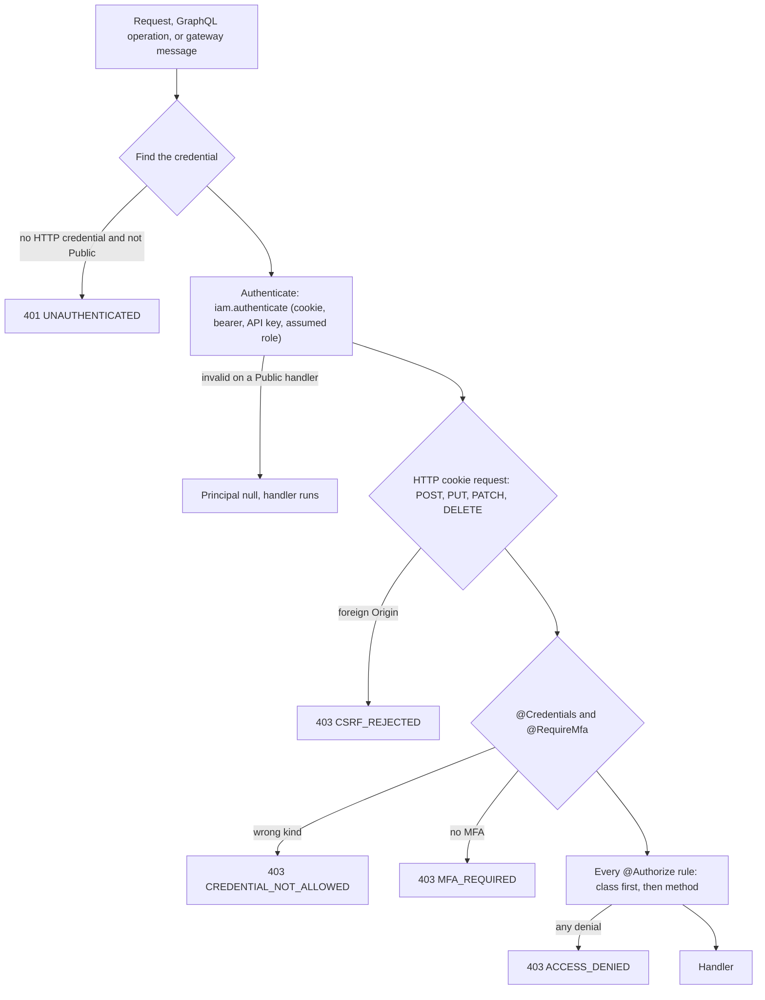

`@better-iam/nestjs` integrates Better IAM with NestJS 11 and 12, on Express or Fastify. Nest applications
describe access with guards and decorators, and this package lets you do the same. Instead of calling
`iam.authenticate` and `iam.authorize` at the top of every handler, you declare `@Authorize('projects:read', ...)`.
A global guard enforces it before the handler runs, with the right status codes and audit records.

Compared with calling the core yourself, the guard takes care of:

- **Sessions on the server.** It finds the credential on HTTP requests, GraphQL contexts, and WebSocket
  handshakes, and authenticates it once per request (once per message on gateways). Parameter decorators hand
  the result to your handler.
- **Access rules.** Decorators declare the credential kind, MFA, and permissions a handler needs, and every rule
  is a recorded decision.
- **Cross-site checks.** Cookie-authenticated `POST`, `PUT`, `PATCH`, and `DELETE` requests from another site's
  page are refused before the handler runs ([details](#what-the-guard-does-in-order)).
- **Errors.** Refusals render as the IAM `{ error: { code, message } }` body with the right status.

There is no hydration step: Nest serves APIs, and a browser front end loads its session through the
[typed client](/docs/frameworks/client). The package gives you:

- **`IamModule`**, which provides everything below and can serve the IAM HTTP API from your Nest app.
- **`IamGuard`**, which authenticates every request (HTTP, GraphQL, WebSocket gateways) and enforces the handler's
  decorators.
- **Decorators**: `@Authorize`, `@Public`, `@RequireMfa`, `@Credentials`, `@FilterAccessible`, and parameter
  decorators for the principal, identity, session, and tenant.
- **`IamService`**, request-scoped IAM calls for controllers and providers.
- **`@OnIamEvent`** handlers for committed audit events, **`IamAssertionModule`** for downstream services, and
  **`createTestingIam`** for tests without a database.

## Install

```npm
npm i @better-iam/nestjs better-iam
```

The umbrella exposes the package as `better-iam/nestjs` and `better-iam/nestjs/testing`. Its peers are
`@nestjs/common` and `@nestjs/core` 11 or 12, `reflect-metadata`, and `rxjs`.

## Setup

<Steps>
<Step>

### Create the instance

```ts title="src/iam.ts"
import { betterIam } from '@better-iam/server';
import { sqliteAdapter } from '@better-iam/adapter-sqlite';

export const iam = betterIam({
  database: sqliteAdapter({ filename: process.env.BETTER_IAM_DATABASE ?? 'iam.db' }),
  secret: process.env.BETTER_IAM_SECRET!,
  baseURL: process.env.BETTER_IAM_BASE_URL ?? 'http://localhost:3000',
  permissions: {
    resourceTypes: {
      // Registered with IAM, so list endpoints can use the listAccessible reverse query.
      project: { managed: true, actions: ['projects:read', 'projects:manage'] },
    },
  },
});
```

</Step>
<Step>

### Import the module

```ts title="src/app.module.ts"
import { Module } from '@nestjs/common';
import { IamModule } from '@better-iam/nestjs';
import { iam } from './iam.js';
import { ProjectsController } from './projects.controller.js';

@Module({
  imports: [
    IamModule.forRoot({
      iam,
      guard: true, // every route needs a session unless @Public()
      mount: true, // serve /api/iam/* (sign-in, admin API, OAuth/SAML/SCIM mounts) from Nest
      dispatchIntervalMs: 1000, // deliver audit events to @OnIamEvent handlers
    }),
  ],
  controllers: [ProjectsController],
})
export class AppModule {}
```

</Step>
<Step>

### Create the app with `rawBody`

```ts title="src/main.ts"
import 'reflect-metadata';
import { NestFactory } from '@nestjs/core';
import { AppModule } from './app.module.js';
import { iam } from './iam.js';

await iam.initialize();
// rawBody lets the IAM mount forward form posts (SAML) byte for byte.
const app = await NestFactory.create(AppModule, { rawBody: true });
app.enableShutdownHooks(); // unsubscribes @OnIamEvent handlers and stops the dispatch timer
await app.listen(3000);
```

</Step>
<Step>

### Declare access on controllers

```ts title="src/projects.controller.ts"
import { Controller, Get, Param, Post } from '@nestjs/common';
import type { Identity } from '@better-iam/core';
import { Authorize, CurrentIdentity, FilterAccessible, Public, RequireMfa, TenantId } from '@better-iam/nestjs';

@Controller()
export class ProjectsController {
  constructor(private readonly projects: ProjectsService) {}

  @Public()
  @Get('status')
  status() {
    return { ok: true };
  }

  @Get('projects')
  @FilterAccessible('projects:read', { type: 'project' }) // drops projects the caller may not read
  list() {
    return this.projects.findAll();
  }

  @Get('projects/:id')
  @Authorize('projects:read', { resource: { type: 'project', id: { param: 'id' } } })
  read(@Param('id') id: string, @TenantId() tenantId: string, @CurrentIdentity() me: Identity) {
    return this.projects.find(id);
  }

  @Post('projects/:id/archive')
  @RequireMfa()
  @Authorize('projects:manage', { resource: { type: 'project', id: { param: 'id' } } })
  archive(@Param('id') id: string) {
    return this.projects.archive(id);
  }
}
```

</Step>
</Steps>

`IamModule` is global by default, so any module can inject `IamService` without importing it again.

## What the guard does, in order



1. **Find the credential.** HTTP uses the request (Express or Fastify). GraphQL uses `context.req`,
   `context.request`, or `context.reply.request` (Apollo and Mercurius). WebSocket gateways use the socket.io
   handshake (`client.handshake`, `client.request`). Other transports have no HTTP credential and are refused
   unless the handler is `@Public()`.
2. **Authenticate** with `iam.authenticate`, which accepts session cookies, bearer session tokens, API keys, and
   <Term id="role-assumption">assumed-role</Term> credentials. On a `@Public()` handler, a missing or invalid credential yields a `null` principal
   instead of an error. The result, the <Term id="principal">principal</Term>, is stored per request (per message for gateways) for the parameter decorators
   and later guards.
3. **CSRF** (HTTP only). Browsers attach session cookies to cross-site form posts, so cookie-authenticated `POST`,
   `PUT`, `PATCH`, and `DELETE` requests must come from the request's own host (`Origin`, or
   `Sec-Fetch-Site: same-origin`) or from `csrf.trustedOrigins`. Bearer credentials skip this check because
   browsers never attach them implicitly, and so do non-browser clients that send neither `Origin` nor
   `Sec-Fetch-Site`.
4. **Credential kind and MFA:** `@Credentials(...)` and `@RequireMfa()`.
5. **Authorization:** every `@Authorize` rule on the class, then on the method, through `iam.authorize`. Each rule
   is a separate, recorded decision, so denials and root overrides are audited exactly as elsewhere. The first
   denial stops the request.

| Failure | Status | `error.code` |
| --- | --- | --- |
| No credential, expired, revoked | 401 | `UNAUTHENTICATED` |
| Step-up required by tenant policy | 403 | `MFA_REQUIRED` |
| `@RequireMfa()` on a non-MFA login | 403 | `MFA_REQUIRED` |
| `@Credentials()` mismatch | 403 | `CREDENTIAL_NOT_ALLOWED` |
| Cross-site cookie request | 403 | `CSRF_REJECTED` |
| Any rule denies | 403 | `ACCESS_DENIED` |
| Missing resource id for a rule | 400 | `INVALID_INPUT` |
| Inactive tenant, rate limits, ... | the server's | the server's code (`TENANT_INACTIVE`, `RATE_LIMITED`) |

Guard failures are `HttpException`s with the IAM `{ error: { code, message } }` body, so they render correctly with
or without `IamExceptionFilter`. The filter covers `IamError`s thrown later, inside handlers and providers.

## Decorators

Method and class decorators tell `IamGuard` what a handler requires; parameter decorators hand the handler what
the guard found.

| Decorator | What it does |
| --- | --- |
| `@Authorize(action, { resource?, tenant? })` | Enforces `action` before the handler runs. Class and method rules accumulate, and every one must allow. The resource defaults to the tenant (`iam/{tenantId}`) |
| `@Public()` | No session is required. A valid credential is still resolved, and invalid ones are ignored |
| `@RequireMfa()` | The session must have completed multi-factor authentication |
| `@Credentials(...kinds)` | Accepts only these session kinds: `user`, `api-key`, or `role`. `@Credentials('api-key')` marks a machine-only endpoint |
| `@FilterAccessible(action, { type, id?, path?, tenant? })` | Removes the items the caller may not act on from the handler's array result (or `result[path]`) |
| `@CurrentPrincipal()` | The authenticated `{ identity, session }`, or `null` on a public route without a credential |
| `@CurrentIdentity()` | The caller's identity, or `null` |
| `@CurrentSession()` | The caller's session record, or `null` |
| `@TenantId()` | The tenant the request's `@Authorize` rules were evaluated in, or the session's tenant when there were none |
| `@OnIamEvent(pattern \| patterns)` | Subscribes a provider method to audit events; see [Audit events](#audit-events) |

`resource` is `{ type, id }` where `id` is a value source, or a function `(request, principal) => ({ type, id })`.
A value source is one of:

| Source | Reads |
| --- | --- |
| `'fixed-id'` | A fixed string |
| `{ param: 'id' }` | A route parameter |
| `{ query: 'id' }` | A query string key |
| `{ body: 'projectId' }` | A body field |
| `{ header: 'x-project' }` | A header |
| `{ arg: 'id' }` | A GraphQL resolver argument, or a field of the WebSocket message |
| `(request, principal) => value` | Anything your code computes, sync or async |

### Tenancy

A rule is evaluated in exactly one <Term id="tenant">tenant</Term>. The guard resolves it in this order:

1. The rule's own `tenant` source.
2. The module's `tenant` option.
3. The `tenantId` route parameter, then the `x-tenant-id` header.
4. The tenant of the caller's session.

```ts
// Path-scoped APIs: /orgs/:tenantId/projects/:id (the default picks up :tenantId).
@Authorize('projects:read', { resource: { type: 'project', id: { param: 'id' } } })

// Subdomain tenancy, resolved once for the whole app.
IamModule.forRoot({
  iam,
  tenant: async (request) => tenantIdForHost(new Headers(request.headers as HeadersInit).get('host')),
});

// A resource that knows its own tenant: resolve both from your storage.
@Authorize('invoices:approve', {
  tenant: async (request) => (await invoices.get(request.params!.id as string)).tenantId,
  resource: { type: 'invoice', id: { param: 'id' } },
})
```

Resolving the tenant from the request never widens access. The decision still checks that the principal holds a
<Term id="grant">grant</Term> in that tenant, and a session from one organization has no grants in another.

### GraphQL and gateways

Resolvers use the same decorators. `{ arg: 'name' }` reads a resolver argument; on a gateway, it reads a field of
the incoming message.

```ts title="src/projects.resolver.ts"
@Resolver(() => Project)
export class ProjectsResolver {
  @Query(() => Project)
  @Authorize('projects:read', {
    tenant: { arg: 'tenantId' },
    resource: { type: 'project', id: { arg: 'id' } },
  })
  project(@Args('tenantId') tenantId: string, @Args('id') id: string) {}
}
```

Gateways authenticate from the handshake but authorize each message separately. The principal is re-resolved for
every message, so a revoked session stops working at the next message, not at reconnect. Put
`@UseGuards(IamGuard)` on each gateway explicitly: `guard: true` is written for HTTP controllers and resolvers, and
whether a global guard also reaches gateways depends on the Nest version and application type.

### List endpoints

`@Authorize` protects one resource. To list resources, either query IAM first or filter afterwards:

- **Query first.** `IamService.listAccessible(request, { tenantId, action, type })` returns the registered
  resources the caller may act on. Use their `resourceId`s in your database query, which keeps pagination
  correct.
- **Filter afterwards.** `@FilterAccessible(action, { type })` removes inaccessible items from the handler's
  result (or `result[path]`; `id` picks each item's id, default `item.id`). It's simpler to adopt, but a page can
  come back shorter than requested.

Both use the <Term id="reverse-query">reverse query</Term> ([how it works](/docs/guides/authorization/queries)), never one decision per item, so the audit log
does not fill with denials; `@FilterAccessible` pages through it 1000 registered resources at a time. Both apply
only to managed (registered) resource types, and `@FilterAccessible` always drops unregistered items. For
resources resolved through `resolveResource`, use `IamService.can` with at most 50 checks per call.

## IamService

`IamService` makes request-scoped calls: every method takes the incoming request (Express, Fastify, or anything
with `headers`) and forwards its credential, so decisions are always made for the actual caller.

| Method | What it does |
| --- | --- |
| `principal(request)` | The caller's `{ identity, session }`, or `null` when the request carries no usable credential |
| `authorize(request, { tenantId, action, resource })` | A recorded decision; never throws for a denial |
| `require(request, { tenantId, action, resource })` | Throws the server's `ACCESS_DENIED` error (403) unless allowed |
| `can(request, { tenantId, checks })` | Advisory decisions for UI state, keyed `${action}@${type}/${id}`; all false when unauthenticated |
| `listAccessible(request, { tenantId, action, type, limit?, offset? })` | The registered resources of a managed type the caller may act on |
| `assertion(request, { tenantId, audience, ttlSeconds?, claims? })` | A short-lived signed assertion for a downstream service |
| `credential(request)` | The caller's credential for any `iam.api.*` call |
| `health()` | `{ status: 'up' \| 'down', latencyMs? }` from the server's `/health`, in process: for Terminus or a readiness route |
| `iam` | The underlying instance, for administrative calls with an explicit credential |

```ts
@Get()
async list(@Req() request: Request, @TenantId() tenantId: string) {
  const { resources } = await this.iam.listAccessible(request, { tenantId, action: 'projects:read', type: 'project' });
  const flags = await this.iam.can(request, { tenantId, checks: [{ action: 'projects:create' }] });
  return { resources, canCreate: flags[`projects:create@iam/${tenantId}`] };
}
```

## Module options

`IamModule.forRoot(options)` takes the options below. `forRootAsync`, described after the table, builds the same
options from other providers, such as a configuration service.

<TypeTable
  type={{
    iam: {
      type: 'IamInstance',
      description: <>The <code>betterIam()</code> instance.</>,
      required: true,
    },
    guard: {
      type: 'boolean',
      description: <>Install <code>IamGuard</code> as a global guard: every route needs a session unless marked <code>@Public()</code>. Without it, apply the guard with <code>@UseGuards(IamGuard)</code>.</>,
      default: 'false',
    },
    mount: {
      type: 'boolean',
      description: <>Serve the IAM HTTP API at <code>mountPath</code> from this application, so the browser client and protocol mounts share your app's port.</>,
      default: 'false',
    },
    mountPath: {
      type: 'string',
      description: <>Where the API is mounted, relative to the global prefix (Nest prefixes middleware routes too).</>,
      default: "the server's basePath, '/api/iam'",
    },
    filter: {
      type: 'boolean',
      description: <>Install <code>IamExceptionFilter</code> globally so <code>IamError</code>s render with their status and code instead of a 500.</>,
      default: 'true',
    },
    global: {
      type: 'boolean',
      description: <>Register the module globally so <code>IamService</code> and <code>IamGuard</code> are injectable everywhere.</>,
      default: 'true',
    },
    tenant: {
      type: 'ValueSource',
      description: <>Resolves the tenant a rule is evaluated in when the rule names none, for example from the host name.</>,
      default: 'tenantId param, then x-tenant-id header, then the session tenant',
    },
    csrf: {
      type: 'boolean | { trustedOrigins?: string[] }',
      description: <>Reject cookie-authenticated unsafe requests from foreign origins. <code>trustedOrigins</code> adds allowed origins; <code>false</code> turns the check off, only when another layer enforces it.</>,
      default: 'true',
    },
    dispatchIntervalMs: {
      type: 'number',
      description: <>Run <code>iam.events.dispatch()</code> on this interval (an integer of at least 100) to deliver audit events to <code>@OnIamEvent</code> handlers, plugins, and <code>events.onEvent</code>. Leave it unset when a separate worker dispatches.</>,
    },
  }}
/>

`forRootAsync` builds the options from other providers: `useFactory` with `inject` and `imports`, `useClass`, or
`useExisting`, where the class implements `IamOptionsFactory` (`createIamOptions()`). The switches that shape the
module graph (`guard`, `mount`, `filter`, `global`) are static arguments in both forms.

```ts
IamModule.forRootAsync({
  imports: [ConfigModule],
  inject: [ConfigService],
  useFactory: (config: ConfigService) => ({
    iam,
    csrf: { trustedOrigins: [config.getOrThrow<string>('ADMIN_ORIGIN')] },
  }),
  guard: true,
  mount: true,
});
```

Besides the module, decorators, and service, the package exports the pieces the module wires together, for custom
setups:

- `IamGuard`: the guard itself, for `@UseGuards(IamGuard)`.
- `IamExceptionFilter`: the filter that renders `IamError`s ([Errors](#errors)).
- `IamFilterInterceptor`: the interceptor behind `@FilterAccessible`.
- `IamHttpMiddleware` and `createIamRequestHandler`: the API mount ([below](#serving-the-iam-api-from-nest)).
- `IamEventsExplorer`: subscribes `@OnIamEvent` methods at bootstrap and runs the dispatch timer; its
  `dispatch()` delivers queued events now.
- The injection tokens `IAM_INSTANCE` (the instance), `IAM_OPTIONS` (the resolved module options), and
  `IAM_ASSERTION_OPTIONS` (the options of `IamAssertionModule`).

## Serving the IAM API from Nest

With `mount: true`, the IAM handler serves `mountPath` as Nest middleware, so the browser client, OAuth/OIDC, SAML,
and SCIM mounts share your app's port. The handler keeps its own protections: the `X-Better-IAM` header, exact
trusted origins for cookie requests, and body limits.

- **Bodies.** Nest's body parsers usually consume the body before middleware runs. With
  `NestFactory.create(App, { rawBody: true })`, form posts (SAML ACS) pass through unchanged; without it, the mount
  re-serializes the parsed body. Bodies over 2 MiB answer 413 `PAYLOAD_TOO_LARGE`.
- **Global prefix.** Under `app.setGlobalPrefix('v1')`, give `mountPath` relative to the prefix, because Nest
  prefixes middleware routes too.
- **Custom setups.** `createIamRequestHandler(iam)` returns a plain `(req, res, next)` handler for
  `app.use('/api/iam', ...)`; `IamHttpMiddleware` is its Nest middleware form.

## Errors

`IamExceptionFilter` is registered globally by default (`filter: false` turns it off). It renders `IamError`s thrown
in handlers, for example by `IamService.require` or direct `iam.api.*` calls, with their status and code instead of
a 500, and sets `Cache-Control: no-store`. GraphQL gets an `HttpException`, WebSocket clients get an `exception`
event, and RPC callers get an error payload. `toHttpException(error)`, `isIamError(error)`,
`isAuthenticationError(error)`, and `credentialOf(request)` are exported for your own code.

## Audit events

Your application often has to react when access changes: clean up data when an identity is deleted, notify a
team when someone is invited. Every IAM change is an audit event, and a provider method can run for each one
that matches a pattern.

```ts title="src/audit.listener.ts"
import { Injectable, Logger } from '@nestjs/common';
import type { AuditEvent } from '@better-iam/core';
import { OnIamEvent } from '@better-iam/nestjs';

@Injectable()
export class AuditListener {
  private readonly logger = new Logger('Audit');

  @OnIamEvent(['identity:*', 'iam:identities:create'])
  record(event: AuditEvent) {
    this.logger.log(`${event.action} ${event.outcome} by ${event.actorId}`);
  }
}
```

`@OnIamEvent(pattern | patterns)` subscribes a provider method to audit events, using the same action globs as
<Term id="webhook">webhooks</Term> (`identity:*`, `iam:identities:*`). Handlers are subscribed at bootstrap and unsubscribed at shutdown.
List the listener class in a module's `providers` (the example registers `AuditListener` in `AppModule`), so Nest
creates it and the module finds its methods. Providers with request or transient scope are skipped.

- **Delivery.** Events are delivered after the transaction commits, at least once. Make handlers idempotent:
  `event.id` is stable across retries.
- **Who dispatches.** Delivery happens when something calls `iam.events.dispatch()`. `dispatchIntervalMs` runs it
  inside the app on a timer, one run at a time. For multi-instance deployments, dispatch from a single worker and
  leave the option unset elsewhere.

See [Lifecycle events](/docs/guides/events/lifecycle-events) and [Webhooks](/docs/guides/events/webhooks) for the
event catalog and patterns.

## Microservices: assertions instead of shared sessions

A gateway or backend-for-frontend authenticates the user and issues a short-lived <Term id="assertion">assertion</Term> for each downstream
call, so downstream services never need the IAM database or the user's session:

```ts
const { token } = await this.iam.assertion(request, { tenantId, audience: 'billing', ttlSeconds: 60 });
await fetch('http://billing/invoices', { headers: { authorization: `Bearer ${token}` } });
```

The billing service verifies it offline:

```ts title="billing/src/app.module.ts"
import { IamAssertionModule } from '@better-iam/nestjs';

@Module({
  imports: [
    IamAssertionModule.forRoot({
      key: process.env.IAM_ASSERTION_KEY!, // iam.assertionKey() of the issuing deployment
      audience: 'billing',
      issuer: 'https://iam.example.com',
      guard: true,
    }),
  ],
})
export class BillingModule {}

@Controller('invoices')
export class InvoicesController {
  @Get()
  @RequireClaims({ roles: ['role_billing_admin'], mfa: true })
  list(@AssertionClaims() claims: { sub: string; tid: string; roles: string[] }) {}
}
```

| Piece | What it does |
| --- | --- |
| `IamAssertionModule.forRoot({ key, audience, issuer?, toleranceSeconds?, header?, guard?, global? })` | Configures verification. `key` is `iam.assertionKey()` (64 hex characters) or the list from `iam.assertionKeys()` during secret rotation; `toleranceSeconds` defaults to 30; `header` defaults to `authorization` with the `Bearer` scheme |
| `IamAssertionGuard` | Verifies the token (signature, audience, issuer, lifetime) without a database or network call, then checks `@RequireClaims`. Installed globally with `guard: true`; honors `@Public()` |
| `@RequireClaims({ roles?, groups?, mfa?, kinds? })` | Requires at least one of the roles, at least one of the groups, an MFA session, or one of the credential kinds; otherwise 403 `ACCESS_DENIED` |
| `@AssertionClaims()` | The verified claims (`sub`, `tid`, `roles`, `groups`, `ext`, ...), or `null` on a public handler |

The caller needs `iam:assertions:create` on `iam/billing`, so administrators decide which services each role may
call. This path imports only `@better-iam/server/assertions`, so the verifying service never loads the IAM server
or its native dependencies. Keep the TTL short: the downstream service cannot see revocations before an assertion
expires.

## Testing

Pick the level by what the test must prove: controller wiring and decorators need no database, while policy
behavior needs a real instance.

| Level | Use |
| --- | --- |
| Unit and controller e2e | `createTestingIam` from `@better-iam/nestjs/testing`: principals by bearer token, decisions from a callback, a `decisions` log, `emit()` for listeners |
| Policy-accurate e2e | A real `betterIam()` with `sqliteAdapter({ filename: ':memory:' })`. Bootstrap, create a tenant and members through `iam.api`, and sign in to get tokens |
| Guards in isolation | `new IamGuard(new Reflector(), { iam })` with `ExecutionContextHost` from `@nestjs/core/helpers/execution-context-host.js` |

```ts title="test/projects.e2e.ts"
import { Test } from '@nestjs/testing';
import { IamModule } from '@better-iam/nestjs';
import { createTestingIam } from '@better-iam/nestjs/testing';

const iam = createTestingIam({
  principals: {
    alice: { identity: { email: 'alice@example.test', tenantId: 't1' } },
    admin: { identity: { tenantId: 't1' }, session: { mfa: true } },
    ci: { identity: { kind: 'service', tenantId: 't1' } }, // an API key session
  },
  decide: ({ principal, action, resource }) =>
    principal.session.mfa || (action === 'projects:read' && resource.id === 'apollo'),
  resources: { project: ['apollo', 'gemini'] }, // for listAccessible and @FilterAccessible
});
const moduleRef = await Test.createTestingModule({
  imports: [IamModule.forRoot({ iam, guard: true })],
  controllers: [ProjectsController],
}).compile();
// Requests with `authorization: Bearer alice` now run as Alice.
```

`createTestingIam` uses no database and no password hashing. `iam.decisions` records every check with its outcome,
`iam.principal(token)` returns the principal a token resolves to, and `iam.emit({ action: 'identity:create' })`
delivers an event to `@OnIamEvent` handlers. It serves no HTTP API and does not issue assertions. For end-to-end
tests against real policies, use a real instance instead.

Library code uses explicit `@Inject()` tokens, so the integration also works in test runners that don't emit
decorator metadata (Vitest, esbuild). Your own providers need `emitDecoratorMetadata` or explicit `@Inject()` as
usual.

## Next steps

<Cards>
  <Card title="Policies" href="/docs/guides/authorization/policies">
    What each `@Authorize` rule actually evaluates.
  </Card>
  <Card title="Batches and reverse queries" href="/docs/guides/authorization/queries">
    How `listAccessible` and `@FilterAccessible` find what a caller may act on.
  </Card>
  <Card title="Webhooks" href="/docs/guides/events/webhooks">
    Deliver the same audit events to other services.
  </Card>
</Cards>
