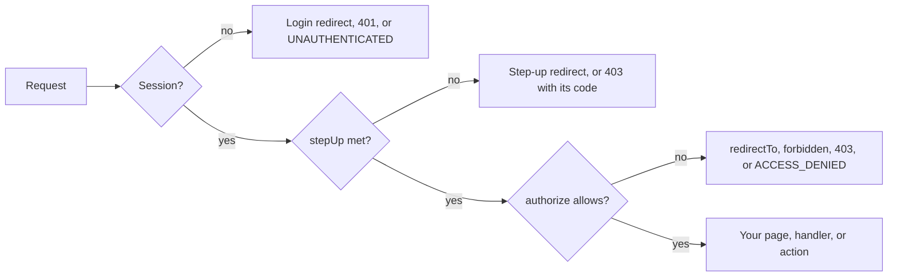

Guards run on the server before anything renders or responds. Each one authenticates the request, then checks
<Term id="step-up">step-up</Term> ([details](/docs/frameworks/nextjs/advanced#step-up)) when you ask for it, then authorizes, and only then calls your
code. Decisions come from `iam.require`, so <Term id="policy">policies</Term>, <Term id="boundary">boundaries</Term>, <Term id="condition">conditions</Term>, <Term id="relationship">relationships</Term>, and audit behave
exactly as they do everywhere else.



## Pages and layouts

`iamNext.page(render, spec)` wraps a page or layout. It requires a session, optionally a step-up, optionally
enforces an action, and then calls `render(props, { session, params })` with the params already resolved.

```tsx title="app/[org]/documents/[id]/page.tsx"
import { iamNext } from '@/lib/iam-next';

// Denied visitors see app/forbidden.tsx through Next's forbidden() (interrupts: 'forbidden').
export default iamNext.page(
  async (_props: { params: Promise<{ org: string; id: string }> }, { session, params }) => (
    <main>
      <h1>Document “{params.id}”</h1>
      <p>
        {session.identity.name} holds <code>documents:read</code> on <code>document/{params.id}</code>.
      </p>
    </main>
  ),
  {
    authorize: {
      action: 'documents:read',
      resource: ({ params }) => ({ type: 'document', id: params.id }),
    },
  },
);
```

| Spec field | Meaning |
| --- | --- |
| `authorize.action` | The action to enforce |
| `authorize.resource` | `({ session, params }) => ({ type, id })`; defaults to the tenant itself (`iam/{tenantId}`) |
| `authorize.tenantId` | `({ session, params }) => tenantId`; defaults to the session's tenant |
| `authorize.redirectTo` | Where denied visitors go; without it the denial throws (or calls `forbidden()` with `interrupts`) |
| `stepUp` | `{ mfa?: true \| 'fresh', maxAgeMs?, redirectTo? }`, checked after sign-in and before `authorize` |
| `returnTo` | `(params) => path` for `?next=`; defaults to the path the middleware forwarded |
| `loginRedirect` | Where signed-out visitors go instead of `loginPath` |

Pass the render function first and the spec second. TypeScript then infers the params from the render
function's annotation and checks the `resource` callback against them.

### Lower-level helpers

`requireSession({ headers?, redirectTo?, returnTo?, stepUp? })` returns the session or redirects to the login
page with `?next=`. `require({ tenantId, action, resource, headers?, redirectTo? })` enforces one action before
rendering: denial redirects to `redirectTo` when given and throws otherwise.

```tsx title="app/settings/page.tsx"
export default async function Settings() {
  const session = await iamNext.requireSession();
  await iamNext.require({
    tenantId: session.session.tenantId,
    action: 'iam:identities:update',
    resource: { type: 'iam', id: session.session.tenantId },
    redirectTo: '/forbidden',
  });
  return <SettingsForm />;
}
```

## What each guard does on failure

Each guard answers a refusal the way its context allows: pages redirect or interrupt, route handlers answer JSON,
and server actions return a result the form can show.

| Helper | Signed out | Step-up missing | Denied | Other IAM errors |
| --- | --- | --- | --- | --- |
| `requireSession()` / `page()` | redirect to `loginPath?next=` (or `unauthorized()`) | redirect to `stepUpPath?next=&reason=`, else throw ([details](/docs/frameworks/nextjs/advanced#without-a-step-up-page)) | `authorize.redirectTo`, else throw (or `forbidden()`) | thrown |
| `require({ ..., redirectTo })` | `redirectTo`, else throw (or `unauthorized()`) | not applicable | `redirectTo`, else throw (or `forbidden()`) | thrown |
| `route()` / `apiRoute()` / `pages.api()` | `401` JSON envelope | `403` with `MFA_REQUIRED`, `RECENT_AUTH_REQUIRED`, or `IMPERSONATION_RESTRICTED` | `403` JSON envelope | JSON envelope with the server's status |
| `action(fn, spec)` | `{ ok: false, error: { code: 'UNAUTHENTICATED' } }` | `{ ok: false, error }` with `MFA_REQUIRED`, `RECENT_AUTH_REQUIRED`, or `IMPERSONATION_RESTRICTED` | `{ ok: false, error: { code: 'ACCESS_DENIED' } }` | `{ ok: false, error }` |

Route handlers and server actions never redirect or interrupt; they always report through their response.
[Server actions](/docs/frameworks/nextjs/server-actions) covers `action()`, and
[Advanced](/docs/frameworks/nextjs/advanced#pages-router) the Pages Router.

### Auth interrupts

"(or ...)" in the table applies with `interrupts: true`, which uses Next's `unauthorized()` and `forbidden()`.
Enable `experimental.authInterrupts` in `next.config` and add `unauthorized.tsx` and `forbidden.tsx`. Without
the flag those calls throw an error in Next 15.

`interrupts: 'forbidden'` interrupts denials only, so signed-out visitors are still redirected to the login page.
This is the usual choice, and the example app uses it:

```tsx title="app/forbidden.tsx"
import Link from 'next/link';

export default function Forbidden() {
  return (
    <main>
      <h1>403 · Not allowed</h1>
      <p>Your account is signed in but no policy grants this action.</p>
      <Link href="/">Back home</Link>
    </main>
  );
}
```

## Route handlers

`iamNext.route(handler, spec)` wraps an App Router route handler. It authenticates the request with a session
cookie or a bearer session token, applies `stepUp` and `authorize`, and turns the handler's result into a
response.

```ts title="app/api/documents/[id]/route.ts"
import { iamNext } from '@/lib/iam-next';

export const runtime = 'nodejs';

export const GET = iamNext.route<{ id: string }>(
  async (_request, { session, params }) => ({
    id: params.id,
    reader: session.identity.email,
    tenantId: session.session.tenantId,
  }),
  {
    authorize: {
      action: 'documents:read',
      resource: ({ params }) => ({ type: 'document', id: params.id }),
    },
  },
);
```

- **Results.** A plain value is sent as JSON with `Cache-Control: no-store`, `undefined` answers `204`, and a
  `Response` passes through unchanged.
- **Errors.** Only `IamError` and `IamClientError` become the JSON error envelope
  (`{ error: { code, message } }`) with the server's status: 401, 403, 429, and so on. Other errors, even ones
  with a `code` field such as `ENOENT`, and Next control flow (`redirect()`, `notFound()`) propagate unchanged,
  so internal messages never reach a client.
- **Resource and tenant callbacks** receive `{ session, params, request }`.
- **Machine callers.** `route()` accepts user sessions only. `apiRoute()` also accepts API keys and assumed-role
  sessions and hands the handler a sanitized principal; see
  [Service credentials](/docs/frameworks/nextjs/advanced#service-credentials).

### Cross-site requests

Browsers attach the session cookie to requests on their own, including form posts started by other pages. The
cookie is `SameSite=Lax`, which still sends it with posts from sibling subdomains, so without a check a page on
another subdomain could change data as the signed-in person. The wrappers therefore check where cookie
requests come from.

Cookie-authenticated mutations to `route()`, `apiRoute()`, and `pages.api()` must come from this application (a
matching `Origin`, or `Sec-Fetch-Site: same-origin`), the IAM origin, or an origin listed in `trustedOrigins`.
That covers every method other than GET, HEAD, and OPTIONS that carries the session cookie and no `Authorization`
header. Anything else is refused with `CSRF_REJECTED` (no `Origin`) or `UNTRUSTED_ORIGIN` (403) before the
handler runs, the same boundary the IAM handler draws. Server actions are exempt because Next checks their
origin itself.

## Rendering by permission

<Term id="advisory">Advisory checks</Term> decide what to render: which buttons, links, and badges appear. Enforce the mutation itself with
`action()`, `route()`, or the API.

<Tabs items={['iamNext.Can', 'allowed()', 'can()']}>
<Tab value="iamNext.Can">

```tsx
<iamNext.Can
  action="documents:write"
  resource={{ type: 'document', id: 'roadmap' }}
  fallback={<p>Read-only: no documents:write on the roadmap.</p>}
>
  <p>You may edit the roadmap.</p>
</iamNext.Can>
```

An async server component. It renders `children` when the current session may perform the action and
`fallback` otherwise. `tenantId` defaults to the session's tenant.

</Tab>
<Tab value="allowed()">

```ts
const canInvite = await iamNext.allowed('iam:identities:create'); // tenant defaults to the session's
const canEdit = await iamNext.allowed('documents:write', { type: 'document', id }, { tenantId });
```

One boolean per call; signed-out requests get `false` without a call.

</Tab>
<Tab value="can()">

```tsx
const access = await iamNext.can({
  tenantId: session.session.tenantId,
  checks: [
    { action: 'documents:read', resource: { type: 'document', id: 'roadmap' } },
    { action: 'documents:write', resource: { type: 'document', id: 'roadmap' } },
    { action: 'iam:identities:read' }, // the tenant itself
  ],
});
access['documents:write@document/roadmap']; // true or false
```

One `authorizeMany` call. The result is keyed `${action}@${type}/${id}`, and every key is `false` when the
request is not authenticated.

</Tab>
</Tabs>

`allowed()` and `<iamNext.Can>` batch per request. Checks made while a render is in flight wait for one macrotask,
so sibling server components reach their checks after their own awaits. Then they go out as a single
deduplicated `authorizeMany`: 50 checks per call, one queue per tenant. A page full of permission-dependent
buttons costs one round trip, and answers are reused for the rest of the render.

## Next steps

<Cards>
  <Card title="Server actions and forms" href="/docs/frameworks/nextjs/server-actions">
    Guarded mutations with `useActionState`, and sign-in without client JavaScript.
  </Card>
  <Card title="Step-up" href="/docs/frameworks/nextjs/advanced#step-up">
    Require MFA or a recent sign-in for sensitive pages.
  </Card>
  <Card title="Policies" href="/docs/guides/authorization/policies">
    What `authorize` actually evaluates.
  </Card>
</Cards>
