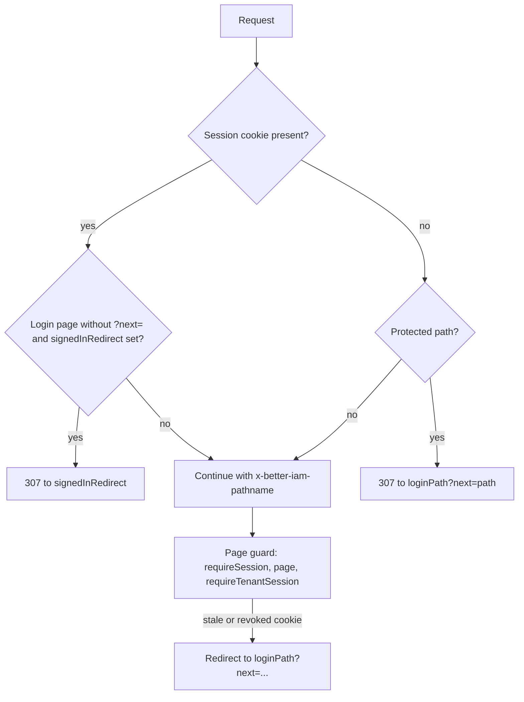

`createIamMiddleware` from `@better-iam/next/edge` sends visitors without a <Term id="session">session</Term> cookie to the login page
before a protected page starts rendering, and forwards the requested path to your server components. It is a
routing convenience, not authorization.

Why use it: a signed-out visitor is redirected at the edge, before any server component runs or queries anything.
Also, App Router server components are not given the full path of the request they render. Without the forwarded
path, a guard deep in a layout would not know where to send the person back after sign-in.

<Callout type="warn" title="Middleware checks presence, not validity">
  Middleware runs on the edge and cannot open the database. It only checks that the session cookie is present:
  `__Host-better-iam.session` on HTTPS and `better-iam.session` on loopback HTTP. Pages must still authenticate
  with `requireSession`, `page`, or `requireTenantSession`. A stale cookie gets through the middleware, and the
  page's guard then redirects.
</Callout>

## Setup

```ts title="middleware.ts"
import { NextResponse } from 'next/server';
import { createIamMiddleware } from '@better-iam/next/edge';

export const middleware = createIamMiddleware({
  loginPath: '/login',
  publicPaths: ['/', '/pricing', '/docs/**', '/invite/*'],
  signedInRedirect: '/dashboard',
  next: (init) => NextResponse.next(init),
});
export const config = { matcher: ['/((?!_next|favicon.ico).*)'] };
```

Import middleware helpers from `@better-iam/next/edge`. That entry has no Node, React, or database imports, so the
edge bundle stays small. The main entry re-exports everything in it.

<TypeTable
  type={{
    loginPath: {
      type: 'string',
      description: <>Where visitors without a session cookie are sent, with the original path in <code>?next=</code>.</>,
      required: true,
    },
    publicPaths: {
      type: 'string[]',
      description: <>Extra public path globs for the default rule: <code>*</code> matches within one segment, <code>**</code> across segments.</>,
    },
    protect: {
      type: '(pathname: string) => boolean',
      description: <>Which paths need a session. Replaces the whole default rule.</>,
      default: 'everything except loginPath, /api/iam, and publicPaths',
    },
    signedInRedirect: {
      type: 'string',
      description: <>Visitors who carry a session cookie and open the login page without <code>?next=</code> are sent here.</>,
      default: 'off',
    },
    next: {
      type: '(init) => Response',
      description: <>Pass <code>(init) =&gt; NextResponse.next(init)</code>. Requests that continue then carry the <code>x-better-iam-pathname</code> header.</>,
    },
    nextParam: {
      type: 'string | false',
      description: <>The query parameter carrying the original path; <code>false</code> omits it.</>,
      default: "'next'",
    },
    secure: {
      type: 'boolean',
      description: <>Overrides cookie security detection, which picks the host-prefixed cookie on HTTPS.</>,
      default: 'true on https: URLs',
    },
  }}
/>

## What it does, per request



- **Public paths.** The default rule protects everything except the login path (and paths below it), anything
  under `/api/iam`, and the `publicPaths` globs. `publicPaths` adds to those defaults; `protect` replaces the
  whole rule.
- **Redirects.** A protected request without the cookie gets a 307 to `loginPath` with `?next=` set to the path
  and query it asked for.
- **Path forwarding.** With `next`, every request that continues carries `x-better-iam-pathname`.
  `requireSession`, `page`, and `requireTenantSession` use it as the default `?next=`, so a deep link survives
  sign-in without passing `returnTo` by hand. `iamNext.currentPath()` reads it (when present and safe).

## Signed-in redirects and stale cookies

`signedInRedirect` sends visitors who carry a cookie away from a bare login page, for example to the dashboard. A
login URL with `?next=` always renders.

That rule is what keeps a stale cookie from looping. When a server guard rejects a request that still carries a
session cookie (revoked, expired, or from a reset database), it always attaches `?next=` (at least `/`). The
middleware sees `?next=`, lets the login page render, and the visitor signs in again instead of bouncing between
the guard and the middleware.

## Safe redirects

`safeRedirectPath(value, fallback = '/')` returns `value` only when it is a same-origin path. It rejects absolute
URLs, protocol-relative `//host`, backslashes, control characters, values over 2048 characters, and dot segments
that normalize into `//host`. Run every `next` parameter through it before redirecting:

```ts
import { safeRedirectPath } from '@better-iam/next/edge';

redirect(safeRedirectPath(searchParams.get('next'), '/dashboard'));
```

The auth forms and guards already do this. The edge entry also exports `matchPath(pattern, pathname)`, the glob
matcher behind `publicPaths`, and `sessionCookieName(secure)`, which returns the cookie name the middleware looks
for.

## Next steps

<Cards>
  <Card title="Guards" href="/docs/frameworks/nextjs/guards">
    The server-side checks that authenticate and authorize after the middleware lets a request through.
  </Card>
  <Card title="Organizations in the URL" href="/docs/frameworks/nextjs/organizations">
    `requireTenantSession`, which also uses the forwarded path for `?next=`.
  </Card>
</Cards>
