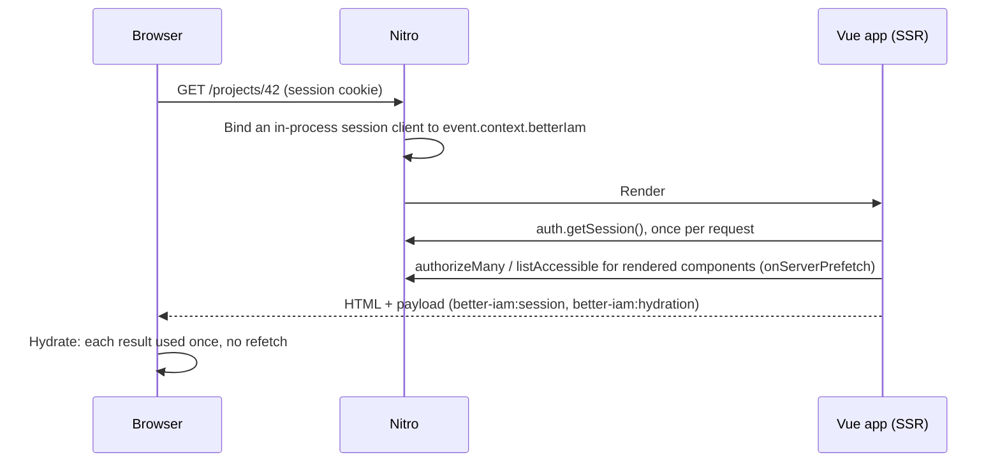

`@better-iam/nuxt` is a module for Nuxt 3.14+ and 4. Add it to `nuxt.config.ts`, point it at your instance, and it:

- **mounts the IAM HTTP API** in Nitro at `/api/iam/**`, and runs `iam.initialize()` before first use;
- **installs the [Vue bindings](/docs/frameworks/vue)** with the <Term id="session">session</Term> loaded during server rendering and the
  <Term id="advisory">advisory decisions</Term> resolved before the HTML is sent;
- **guards pages** from `definePageMeta({ iam })`, on the server and during client navigation;
- **auto-imports** the composables, the `<IamCan>` component, and server utilities for your API routes, all typed
  from your instance.

Why a module instead of wiring the pieces yourself? A Nuxt app renders the same pages on the server and in the
browser, and calling the core API directly would leave you to:

- **mount the API** in Nitro and initialize the instance before the first request;
- **load the session on the server** without an HTTP round trip, because the HTTP API refuses cookie requests
  that carry no `Origin` (which is what a server-side call looks like);
- **hydrate**: pass the session and any permission results to the browser, so its first render matches the HTML;
- **guard both sides of navigation**, because after the first page load Nuxt navigates in the browser.

The module does all of that from one line of configuration. One thing it leaves to you: the server utilities do
not check where a request came from, so state-changing server routes that rely on the session cookie need their
own `Origin` check ([Cross-site requests](#cross-site-requests)).

Two related entries work without the module: `@better-iam/vue` holds the framework-level Vue bindings, and
`@better-iam/nuxt/h3` holds the h3/Nitro server helpers.

## Install

```npm
npm i @better-iam/nuxt better-iam
```

The module is not part of the umbrella package; install `@better-iam/nuxt` directly. The server instance can come
from the umbrella (`better-iam`) or from `@better-iam/server` and an adapter.

## Setup

<Steps>
<Step>

### Create the instance

Export the `betterIam()` result as `iam` (or as the default export) from `server/iam.ts`.

```ts title="server/iam.ts"
import { betterIam } from 'better-iam';
import { sqliteAdapter } from 'better-iam/adapter-sqlite';

export const iam = betterIam({
  database: sqliteAdapter({ filename: '.data/iam.db' }),
  secret: process.env.BETTER_IAM_SECRET!,
  baseURL: process.env.BETTER_IAM_BASE_URL ?? 'http://localhost:3000',
  permissions: { actions: ['projects:read', 'projects:manage'] },
  resolveResource: async (reference) => loadProjectOwnership(reference),
});
```

</Step>
<Step>

### Add the module

```ts title="nuxt.config.ts"
export default defineNuxtConfig({
  modules: ['@better-iam/nuxt'],
  betterIam: {
    instance: '~~/server/iam', // default
    loginPath: '/login',
  },
});
```

</Step>
<Step>

### Declare page access

```vue title="app/pages/account.vue"
<script setup lang="ts">
// A session is required; signed-out visitors go to /login?next=/account.
definePageMeta({ iam: true });
const { session } = useIamSession();
</script>

<template>
  <h1>{{ session?.identity.email }}</h1>
</template>
```

</Step>
<Step>

### Enforce in server routes

```ts title="server/api/projects/[id].delete.ts"
export default defineEventHandler(async (event) => {
  const { session } = await requireIamSession(event); // 401 without a session
  const id = getRouterParam(event, 'id')!;
  await requireIamAccess(event, {
    tenantId: session.tenantId,
    action: 'projects:manage',
    resource: { type: 'project', id },
  }); // 401/403/429 with data.code = the IAM error code
  await deleteProject(id);
  return { ok: true };
});
```

Page meta only decides what to render; server routes like this one are where operations are enforced. Because
this route changes data on the strength of the session cookie, give it the `Origin` check from
[Cross-site requests](#cross-site-requests) as well.

</Step>
</Steps>

## Module options

<TypeTable
  type={{
    instance: {
      type: 'string',
      description: <>The server file exporting the <code>betterIam()</code> result as <code>iam</code> or <code>default</code>, resolved with Nuxt aliases.</>,
      default: "'~~/server/iam'",
    },
    apiPath: {
      type: 'string',
      description: <>Where the handler is mounted. It must equal the instance's <code>basePath</code>.</>,
      default: "'/api/iam'",
    },
    handler: {
      type: 'boolean',
      description: <>Mount the IAM handler at <code>{'${apiPath}/**'}</code>. Turn it off to mount the handler yourself.</>,
      default: 'true',
    },
    initialize: {
      type: 'boolean',
      description: <>Run <code>iam.initialize()</code> (migrations, audit backfill) before first use. Turn it off when the CLI migrates.</>,
      default: 'true',
    },
    loginPath: {
      type: 'string',
      description: <>Where the route middleware sends signed-out visitors.</>,
      default: "'/login'",
    },
    requireAuth: {
      type: 'boolean',
      description: <>Every page needs a session unless it sets <code>iam: false</code>.</>,
      default: 'false',
    },
    ssrSession: {
      type: 'boolean',
      description: <>Load the session while rendering on the server.</>,
      default: 'true',
    },
    nextParam: {
      type: 'string',
      description: <>The query parameter carrying the original path to the login page. An empty string omits it.</>,
      default: "'next'",
    },
  }}
/>

`loginPath`, `requireAuth`, `ssrSession`, and `nextParam` live in `runtimeConfig.public.betterIam`, so
`NUXT_PUBLIC_BETTER_IAM_LOGIN_PATH` and similar variables override them at runtime. The module also writes a type
template that registers your instance, so `useIamSession()` and the server utilities return its concrete session
type, and `definePageMeta` accepts a typed `iam` key.

## Page access

`definePageMeta({ iam })` declares who may open a page, so signed-out visitors are sent to sign in and people
without the permission never see a half-rendered page. Use `true` for "any signed-in person", or an object that
also names an action:

```vue title="app/pages/projects/[id]/settings.vue"
<script setup lang="ts">
// A session plus an advisory decision. The tenant defaults to the session's; the resource to iam/{tenantId}.
definePageMeta({
  iam: {
    action: 'projects:manage',
    resource: (route) => ({ type: 'project', id: String(route.params.id) }),
    redirectTo: '/projects', // omit to render a 403 error page
  },
});
</script>
```

| `iam` value | Meaning |
| --- | --- |
| `true` | A session is required |
| `false` | Opts the page out when `requireAuth` is on |
| `{ action, resource?, tenantId?, redirectTo? }` | A session plus an allow decision. `resource` is an object or `(route) => ({ type, id })`; `tenantId` is a string or `(route, session) => tenantId` |

The global route middleware runs during server rendering, where a redirect becomes a 302 and a denial a 403
response. It also runs during client navigation, where a denial renders the error page (a fatal `ACCESS_DENIED`
error). It has to run in both places. After the first page load, Nuxt navigates in the browser without asking the
server for HTML, so a check that ran only on the server would miss every later navigation.

Signed-out visitors go to `loginPath` with `?next=` set to the full path. The middleware only decides what to
render: server routes and the IAM API still enforce every operation.

## Composables and components

The module auto-imports the [Vue bindings](/docs/frameworks/vue) under `useIam*` names, typed from your instance,
so pages and components read the session and ask for decisions without imports.

```vue title="app/pages/projects/[id].vue"
<script setup lang="ts">
const props = defineProps<{ id: string }>();
const { session, isAuthenticated, signOut } = useIamSession();
const { resources } = useIamAccessible(() => ({
  tenantId: session.value!.session.tenantId,
  action: 'projects:read',
  type: 'project',
}));
const { allowed } = useIamCan(() => ({
  tenantId: session.value!.session.tenantId,
  action: 'iam:identities:create',
}));
</script>

<template>
  <IamCan :tenant-id="session!.session.tenantId" action="projects:manage" :resource="{ type: 'project', id }">
    <button>Manage</button>
    <template #fallback>Read only</template>
    <template #loading>…</template>
  </IamCan>
</template>
```

| Auto-import | From `@better-iam/vue` | Notes |
| --- | --- | --- |
| `useIamSession` | `useSession` | Typed from the registered instance: `session.identity.email` |
| `useIamClient` | `useIamClient` | The typed browser client (the in-process session client during SSR) |
| `useIamAuthorize` | `useAuthorize` | Batched checks; `allowed(action, resource?)` |
| `useIamCan` | `useCan` | One decision as a `ComputedRef<boolean>` |
| `useIamAccessible` | `useAccessible` | The reverse query for managed resource types |
| `<IamCan>` | `IamCan` | `default`, `fallback`, and `loading` slots |

Inputs accept refs or getters and re-run when they change or when the signed-in identity changes. A session
refresh for the same identity does not re-run them. The [Vue page](/docs/frameworks/vue#composables) describes
each composable.

### Server rendering and hydration



During SSR the plugin does not call the HTTP API, which refuses cookie requests without an `Origin`. Instead, a
Nitro plugin binds an in-process session client to each request (`event.context.betterIam`). The session is read
once per request and handed to the browser in the payload (`better-iam:session`). Decision and accessible-resource
queries used by rendered components are awaited with `onServerPrefetch`, and their results travel in
`better-iam:hydration`. The browser consumes each result once instead of refetching, so the first paint shows the
right buttons with no hydration mismatch. After that, queries fetch normally.

During SSR, `useIamClient()` returns the bound client, which has only `auth.getSession`, `authorizeMany`, and
`listAccessible` (its `auth.signOut` throws: sign out from the browser). Call other API methods from server
routes.

### Signing in

The client signs in through the mounted API, and the HTTP handler sets the session cookie. Then tell the store:

```ts title="app/pages/login.vue (script)"
const route = useRoute();
const client = useIamClient();
const { setSession } = useIamSession();

const result = await client.auth.signIn({ tenantId, email, password });
if ('token' in result) {
  setSession(await client.auth.getSession());
  await navigateTo(typeof route.query.next === 'string' ? route.query.next : '/');
} else {
  await navigateTo('/login/mfa'); // result.challenge → client.auth.verifyMfa(...)
}
```

## Server routes

Page guards only decide what to render, so every operation that changes data is enforced again in a server route.
These utilities are auto-imported into Nitro server routes, middleware, and plugins:

| Server auto-import | Purpose |
| --- | --- |
| `getIamSession(event)` | The session, or `null`; memoized per request |
| `requireIamSession(event)` | The session, or a 401 h3 error |
| `requireIamAccess(event, { tenantId, action, resource? })` | Enforce one action (the default resource is `iam/{tenantId}`) |
| `iamCan(event, { tenantId, checks })` | Advisory decisions keyed `action@type/id`, all false for anonymous requests |
| `issueIamAssertion(event, input)` | A short-lived signed assertion for a downstream service |
| `iamCredential(event)` | `{ headers }` for direct `iam.api.*` calls |
| `useIam()` | The initialized instance |

```ts title="server/api/me.get.ts"
export default defineEventHandler(async (event) => {
  const { identity, session } = await requireIamSession(event);
  const access = await iamCan(event, {
    tenantId: session.tenantId,
    checks: [{ action: 'iam:identities:read' }],
  });
  return {
    id: identity.id,
    email: identity.email,
    canReadMembers: access[`iam:identities:read@iam/${session.tenantId}`],
  };
});
```

Errors are h3 errors with the IAM status. Their `statusMessage` and `data.code` carry the IAM code, so the JSON
error body a client receives names it (`UNAUTHENTICATED`, `ACCESS_DENIED`, `RATE_LIMITED`, ...). For direct API
calls, pass the caller's credential:
`(await useIam()).api.identities.list(iamCredential(event), { tenantId })`.

### Cross-site requests

Browsers attach the session cookie to requests on their own, including a form another site's page submits. The
cookie is `SameSite=Lax` by default, which still lets a page on a sibling subdomain post to your app as the
signed-in person. The mounted IAM API refuses such requests, but the server utilities above do not check where a
request came from. For a server route that changes data and relies on the session cookie, check the `Origin`
with `checkRequestOrigin` from `better-iam/middleware` (or `@better-iam/middleware`), the same rule the other
integrations use:

```ts title="server/api/projects/[id].delete.ts"
import { checkRequestOrigin } from 'better-iam/middleware';
import { eventHeaders } from '@better-iam/nuxt/h3';

export default defineEventHandler(async (event) => {
  // Cookie requests other than GET, HEAD, and OPTIONS must come from this app's own origin.
  const refusal = checkRequestOrigin({
    method: event.method,
    url: getRequestURL(event),
    headers: eventHeaders(event),
  });
  if (refusal)
    throw createError({ statusCode: refusal.status, statusMessage: refusal.code, data: { code: refusal.code } });
  const { session } = await requireIamSession(event);
  // ...
});
```

It refuses a cookie-authenticated request with `CSRF_REJECTED` when it has no `Origin` and `UNTRUSTED_ORIGIN`
when the origin is foreign. Requests that carry an `Authorization` header or `Sec-Fetch-Site: same-origin` pass.
Pass extra allowed origins, such as a separate front end, as the second argument.

## Without Nuxt

Any h3 v1/v2 or Nitro app can use the server helpers directly:

```ts title="server.ts"
import { createApp, createError, defineEventHandler, toWebRequest } from 'h3';
import { createIamH3 } from '@better-iam/nuxt/h3';
import { iam } from './iam.js';

const iamH3 = createIamH3(iam, { toRequest: toWebRequest, createError });
const app = createApp();
app.use(
  '/api/iam',
  defineEventHandler((event) => iamH3.handler(event)),
);
app.use(
  '/me',
  defineEventHandler(async (event) => (await iamH3.requireSession(event)).identity),
);
```

`createIamH3(iam, options)` accepts the instance or a factory and returns:

| Member | What it does |
| --- | --- |
| `handler(event)` | Passes the request to `iam.handler` and returns its Web `Response`, which h3 sends as is; mount it at `/api/iam/**` |
| `getSession(event)` | The session, or `null`; memoized on the event |
| `requireSession(event)` | The session, or a 401 error with `data.code` `UNAUTHENTICATED` |
| `require(event, { tenantId, action, resource? })` | Enforces one action; a refusal throws an error with the IAM status (401, 403, 429) and code |
| `can(event, { tenantId, checks })` | Advisory decisions keyed `action@type/id`, all false for anonymous requests |
| `assertion(event, input)` | A short-lived signed assertion about the caller for a downstream service |
| `credential(event)` | `{ headers }` for direct `iam.api.*` calls |
| `bind(event)` | A session client (`auth.getSession`, `authorizeMany`, `listAccessible`) bound to the event, for server rendering; the Nuxt plugin uses it |
| `resolve()` | The instance |

| Option | Meaning |
| --- | --- |
| `toRequest` | Converts an event into a Web `Request`; pass h3's `toWebRequest`. Without it, the helper reads h3 v2 `event.req`, h3 v1 `event.web.request`, or the Node request stream |
| `createError` | Builds the errors `requireSession` and `require` throw; pass h3's `createError`. Without it, they throw `IamH3Error`, which h3 treats as one of its own errors in both majors (`statusCode`, `status`, `statusMessage`, `data.code`) |

The entry also exports three helpers:

- `eventHeaders(event)` turns an h3 v1 or v2 event into Web `Headers`.
- `eventRequest(event)` turns it into a Web `Request`. The Node fallback buffers the body, so call it before
  anything else reads the body.
- `isAuthenticationError(error)` recognizes the errors `getSession` treats as signed out.

Any Vue 3.3+ app can use the bindings directly: `app.use(createIam({ client: createIamClient<typeof iam>() }))`.
For custom SSR, pass `server: true`, an in-process client, and `createHydration()` on the server; see
[Vue](/docs/frameworks/vue#server-rendering-and-hydration).

## Next steps

<Cards>
  <Card title="Vue" href="/docs/frameworks/vue">
    Every composable the module auto-imports, in detail.
  </Card>
  <Card title="Sign-in methods" href="/docs/guides/authentication/sign-in-methods">
    Passwords, MFA, passkeys, and federated sign-in for your login page.
  </Card>
  <Card title="Policies" href="/docs/guides/authorization/policies">
    What `requireIamAccess` and page meta actually evaluate.
  </Card>
</Cards>
