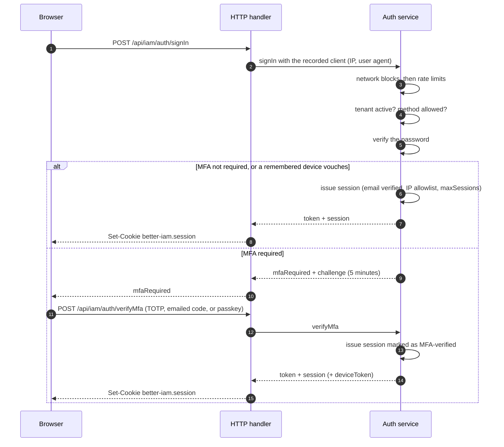

import { FingerprintPattern, Globe, LifeBuoy, LogIn, MonitorSmartphone, ShieldCheck, SlidersHorizontal, VenetianMask } from '@/lib/icons';

Before your application can decide what someone may do, it has to know who they are. Authentication covers how
people and services prove their identity, what the resulting session carries, and which knobs the deployment and
each organization control.

Every sign-in happens **in a [tenant](/docs/guides/concepts#key-terms)**, an organization's isolated account: the
same email in two tenants is two separate identities with separate credentials, factors, and sessions. The
[security model](/docs/operations/security) explains the guarantees; these pages explain the flows.

## Methods at a glance

Different people and situations call for different proofs: a password for most people, a passkey for
phishing-resistant sign-in, a company identity provider for enterprise customers, and API keys for machines. You
enable the methods your product needs, and each organization can narrow the list.

| Method | Calls | Session `method` | Notes |
| --- | --- | --- | --- |
| Password | `auth.signIn({ tenantId, email, password })` | `password` | Argon2id; tenant password rules apply on creation, reset, and change. |
| Magic link or emailed code | `auth.startPasswordless`, then `auth.finishPasswordless` | `passwordless-email` | Needs `passwordlessEmail` and `sendEmail`. Never links accounts by matching an address. |
| SMS code | `auth.startPasswordless`, then `auth.finishPasswordless` | `passwordless-sms` | Needs `passwordlessSms` and `sendSms`, and a verified phone number. |
| Passkey | `auth.beginPasskeyAuthentication`, then `auth.finishPasskeyAuthentication` | `passkey` | Discoverable passkeys sign in without an email (browser autofill). Satisfies MFA. |
| Federated (OAuth/OIDC, SAML) | The protocol packages complete the ceremony and call `protocolHost.completeAuthentication` | `federated` | `mapAttributes` stores provider attributes on the identity. |
| API key (service accounts) | `Authorization: Bearer <key>` | none | Issued with `credentials.create`; expiring, rotatable, labeled, with `lastUsedAt`. |
| Assumed role | `roles.assume({ tenantId, trustId })` | none | Platform-controlled trust; sessions are short and cannot chain. |
| Impersonation ("view as") | `identities.impersonate` | `impersonation` | An administrator's session as a member; opt-in per tenant, restricted, and fully attributed. |

The session's `method` reaches policies as `principal.authMethod`, so a policy can, for example, require a passkey
for a sensitive action. [Sign-in methods](/docs/guides/authentication/sign-in-methods) covers each method in
detail.

## How a sign-in works

Whatever the method, a sign-in follows the same shape, so your login UI only has to handle two outcomes. The first
factor (a password, a code, a passkey, or a federated assertion) ends either with a **session**, or with a
**challenge** that asks for a second factor.



Every sign-in returns one of two shapes:

```ts title="SignInResult"
type SignInResult =
  | { token: string; session: SafeSession }
  | {
      mfaRequired: true;
      challenge: string; // single-use, valid for five minutes
      enrollmentRequired: boolean; // true when no authenticator is enrolled yet
      emailCodeAvailable?: boolean; // requestMfaCode may email a one-time code
      passkeyAvailable?: boolean; // a registered passkey may satisfy the challenge
    };
```

A typical login page first finds the tenant with `tenants.lookup` (from an organization alias), then calls
`auth.signIn`, which checks the password and returns one of those two shapes. Through the HTTP handler, a returned
session is also set as a cookie, so the page only needs to navigate on.

```ts title="login.ts"
import { createIamClient, IamClientError } from 'better-iam/client';
import type { iam } from './iam';

const client = createIamClient<typeof iam>();

const { tenantId } = await client.tenants.lookup({ slug: 'acme' });
try {
  const result = await client.auth.signIn({ tenantId, email, password });
  if ('mfaRequired' in result) {
    // Show the second-factor step; see the MFA guide.
    return goToSecondFactor(tenantId, result);
  }
  // Signed in: the handler set the session cookie.
} catch (error) {
  if (error instanceof IamClientError && error.code === 'RATE_LIMITED') {
    showRetryIn(error.retryAfterMs);
  } else throw error;
}
```

### What every sign-in checks

In order, before any session is issued:

1. **Network blocks** refuse a blocked client address with `IP_BLOCKED`, before rate limits or credentials are
   examined.
2. **Rate limits** count the attempt against the client IP (when `ipAttempts` is set) and the account, and
   refuse with `RATE_LIMITED`.
3. **The tenant** and every ancestor must be active (`TENANT_UNAVAILABLE`).
4. **The method** must be in the tenant's `allowedMethods` (`METHOD_NOT_ALLOWED`). This happens before any
   credential is examined, so a rejected method never reveals whether a password was right.
5. **The credential** is verified. Unknown addresses perform the same password-hash work as real ones and return
   the same `INVALID_CREDENTIALS`, so responses do not reveal which accounts exist.
6. **Email verification** is required when `requireEmailVerification` is on (`EMAIL_UNVERIFIED`), and an expired
   password is refused with `PASSWORD_EXPIRED` only after it was verified.
7. **MFA**, when required, returns a challenge instead of a session.
8. **Session issuance** re-checks the tenant's IP allowlist (`IP_NOT_ALLOWED`) and blocks, applies the tenant's
   session lifetime, ends the oldest session beyond `maxSessions`, records the client, and may queue a new-sign-in
   notice.

After issuance, the session is re-validated on every use. See [sessions](/docs/guides/authentication/sessions).

## When MFA is required

A password alone falls to phishing, reuse, and guessing. Multi-factor authentication (MFA) adds a second proof,
such as an authenticator code or a passkey. MFA is required:

- for root administrators, always;
- for anyone with an authenticator enrolled;
- when the tenant policy sets `requireMfa` (or `requireMfaForOwners`, for owners);
- when the deployment's `authentication.requireMfa(tenant, identity)` callback returns true.

The requirement also applies to federated sign-in and to sessions that already exist: requiring MFA in a tenant
locks out sessions that did not complete it on their next use. See
[multi-factor authentication](/docs/guides/authentication/mfa).

## Recent authentication

A session can live for days, and a laptop left unlocked for a minute should not let someone change the password or
remove the second factor. So sensitive operations (password, email, factor, device, session, and ownership changes,
impersonation, and policy changes) require **recent authentication**: the session must have been established within
`recentAuthenticationMs` (five minutes by default). Otherwise they fail with `RECENT_AUTH_REQUIRED`, and the person
confirms their password with `auth.reauthenticate({ password })`, which issues a fresh session.
See [sessions](/docs/guides/authentication/sessions#recent-authentication).

## In this section

<Cards>
  <Card icon={<LogIn />} title="Sign-in methods" href="/docs/guides/authentication/sign-in-methods">
    Passwords and password screening, magic links, email and SMS codes, federation, API keys, and assumed roles.
  </Card>
  <Card icon={<ShieldCheck />} title="Multi-factor authentication" href="/docs/guides/authentication/mfa">
    TOTP, recovery codes, emailed codes, remembered devices, and step-up.
  </Card>
  <Card icon={<FingerprintPattern />} title="Passkeys" href="/docs/guides/authentication/passkeys">
    Passkeys for sign-in and as a second factor, discoverable sign-in, and naming.
  </Card>
  <Card icon={<MonitorSmartphone />} title="Sessions" href="/docs/guides/authentication/sessions">
    Lifetimes, idle timeouts, device metadata, sign-out everywhere, and sign-in records.
  </Card>
  <Card icon={<LifeBuoy />} title="Verification and recovery" href="/docs/guides/authentication/recovery">
    Email verification, password reset and change, email changes, and lockouts.
  </Card>
  <Card icon={<SlidersHorizontal />} title="Tenant policy" href="/docs/guides/authentication/tenant-policy">
    Per-organization MFA, methods, password rules, session limits, and network restrictions.
  </Card>
  <Card icon={<VenetianMask />} title="Impersonation" href="/docs/guides/authentication/impersonation">
    Audited "view as" sessions for support.
  </Card>
  <Card icon={<Globe />} title="HTTP and configuration" href="/docs/guides/authentication/http">
    Cookies, CSRF and Origin checks, rate limits, request IDs, deployment options, and email templates.
  </Card>
</Cards>
