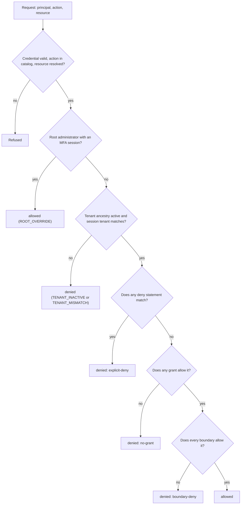

import { Clock, Funnel, FileBraces, Library, ListFilter, ClipboardCheck, Share2, Split, UserCog } from 'lucide-react';

Authentication tells you who is calling. Authorization decides what they may do. Every protected operation in an
application that uses Better IAM asks the same question: may this <Term id="principal">principal</Term> (the
person or service account making the request) perform this <Term id="action">action</Term> (such as
`documents:delete`) on this <Term id="resource">resource</Term> (such as `document/q3-plan`), in this
<Term id="tenant">tenant</Term>?

Better IAM answers that question with one evaluator for everything: your product's own checks, the
administrative API, the console, and the CLI. You describe access once, in roles and policies, instead of
scattering `if (user.isAdmin)` checks through your code. When the rules change, you change a role, not a
deployment.

In short: people receive <Term id="role">roles</Term> through <Term id="binding">bindings</Term>, roles are made
of JSON <Term id="policy">policy</Term> documents, and <Term id="boundary">boundaries</Term> cap what any role can
reach. The format is Better IAM's own versioned format, inspired by
[AWS's policy evaluation concepts](https://docs.aws.amazon.com/IAM/latest/UserGuide/reference_policies_evaluation-logic.html);
it is not an AWS JSON-policy parser.

You can try policy documents and requests in the [policy playground](/playground), which runs the real evaluator
from `@better-iam/core` in your browser.

## The model at a glance

These are the building blocks, and the words the rest of this section uses:

| Building block | What it is | Read more |
| --- | --- | --- |
| Principal | The caller: a person or service account, authenticated by a session, API key, or role session, always acting in one tenant. | [Tenants and identities](/docs/guides/concepts/tenants-and-identities) |
| Action | A verb on a kind of thing, such as `documents:read` or `iam:roles:create`. Policies may only name actions in the permission catalog. | [Permission catalog](/docs/guides/authorization/catalog) |
| Resource | The thing being acted on, written `type/id` inside the tenant, such as `document/q3-plan`. Administrative operations use `iam/...` resources. | [Permission catalog](/docs/guides/authorization/catalog#resource-types-and-resources) |
| Policy | A versioned JSON document of allow and deny statements. Each statement names actions, resources, and optional conditions. | [Policy documents](/docs/guides/authorization/policies) |
| <Term id="condition">Condition</Term> | A test on the request inside a statement, such as "the session used MFA" or "the caller owns the resource". | [Conditions](/docs/guides/authorization/conditions) |
| Role | A named job function, such as _Editor_: the union of its attached policies, its inline document, and the roles it inherits. | [Roles and bindings](/docs/guides/authorization/roles) |
| Binding | The link that gives one role to one person or group. It can be temporary, future-dated, limited to business hours, or activated on demand. | [Roles and bindings](/docs/guides/authorization/roles#bindings) |
| <Term id="grant">Grant</Term> | What a principal receives through its bindings: the allow and deny statements of its roles. Grants add up. | [How a decision is made](#how-a-decision-is-made) |
| Boundary | A ceiling document that limits what grants can reach. Boundaries only take access away; they never grant it. | [Boundaries](/docs/guides/authorization/policies#boundaries) |
| <Term id="authority">Grant authority</Term> | The delegated right to hand out access. Every role, policy, and binding is created under one, and its ceiling bounds everything issued under it. | [Grant authorities](/docs/guides/authorization/roles#grant-authorities) |
| <Term id="relationship">Relationship</Term> | A fact such as "alice is an `owner` of `folder/plans`", which policies read as `resource.relations`. | [Relationships](/docs/guides/authorization/relationships) |

A request names an action and a resource. The tenant is resolved first, from the request and the credential, so
resource patterns only ever match `type/id` inside that tenant and can never reach another one.

Here is a policy that lets its holders read any document, but only from an MFA-verified session:

```ts title="A policy document"
import { definePolicy } from 'better-iam';

const reader = definePolicy({
  version: 1,
  statements: [
    {
      sid: 'ReadWithMfa',
      effect: 'allow',
      actions: ['documents:read'],
      resources: ['document/*'],
      conditions: { Bool: { 'principal.mfa': true } },
    },
  ],
});
```

`definePolicy` checks the document's shape when your code loads and returns a copy you can store in a role or
policy. Nothing is granted until the document is attached to a role and the role is bound to someone.

## How a decision is made

Knowing the order of evaluation explains every surprising "access denied": a deny statement somewhere, a missing
grant, or a boundary that caps the grant. The server evaluates every request in the same order:

1. Validate the credential, the current identity and tenant, and the requested action and resource. An action
   outside the catalog is denied (`UNKNOWN_ACTION`); a resource that cannot be resolved is refused.
2. Apply the protected universal root override, but only to authenticated root administrators: a root-tenant
   person with root authority, signed in with an MFA-verified user session.
3. For every other principal, require an active tenant ancestry and a session that belongs to the target tenant.
4. Collect the role grants of the identity, from its own bindings and its groups' bindings, and intersect them
   with the tenant, principal, issuer (grant authority), and session ceilings.
5. An applicable explicit deny overrides any allow. Without an effective allow, deny access.



The core of the flowchart is the policy evaluator, `evaluatePolicy` from `@better-iam/core`, and its four
reasons:

| Reason | Meaning |
| --- | --- |
| `explicit-deny` | A deny statement matched. A deny in any role you hold applies to every grant, and a deny inside a boundary denies too. |
| `no-grant` | No allow statement in the grants matched. Grants form a union: one matching allow is enough. |
| `boundary-deny` | A grant allowed it, but at least one boundary has no matching allow. Every boundary is an independent intersection. |
| `allowed` | No deny matched, a grant allowed it, and every boundary allowed it. |

On the server, grants arrive through grant paths: each binding brings its role's documents together with the
ceilings of the authorities that issued the binding, the role, and each attached policy. A request that no grant
path allows within its own ceilings is reported as `NO_APPLICABLE_GRANT`, the server's form of `no-grant`. The
full list of server reasons is in [Access reviews](/docs/guides/authorization/reviews#explain-one-decision).

## Check access in your code

Your server code asks for decisions at the moment it is about to do something protected. Two calls cover almost
every case, and both take the caller's credential (the request `headers` or a `token`) alongside the tenant,
action, and resource:

- `iam.require` is the guard. It throws `IamError` with code `ACCESS_DENIED` (403) unless the request is
  allowed, so you call it on the line before the protected operation and let the error become a 403 response.
- `iam.authorize` returns the decision instead of throwing. Call it when a denial is not an error, for example to
  choose between two code paths.

```ts title="app/documents/delete.ts"
import { iam } from '@/lib/iam';

export async function deleteDocument(request: Request, tenantId: string, documentId: string) {
  // Enforce immediately before the protected operation.
  await iam.require({
    headers: request.headers,
    tenantId,
    action: 'documents:delete',
    resource: { type: 'document', id: documentId },
  });
  await db.documents.delete(documentId);
}
```

```ts title="A decision you can branch on"
const decision = await iam.authorize({
  token,
  tenantId,
  action: 'documents:share',
  resource: { type: 'document', id: documentId },
});
// { allowed: true, reason: 'allowed', matched: [] }
// { allowed: false, reason: 'ACCESS_DENIED', matched: [] }
```

Public authorization responses omit matched statements and report every denial as `ACCESS_DENIED`; the
administrator-only [simulation API](/docs/guides/authorization/reviews) explains why. Denied decisions and root
overrides are written to the audit log.

Menus and lists need many decisions at once, and two calls exist so you do not make fifty round trips:

- `iam.authorizeMany` evaluates up to fifty checks for one tenant in a single transaction. Use it to decide which
  buttons and menu entries to show.
- `iam.listAccessible` returns the registered resources of one managed type that the caller may perform an
  action on, with paging and a `total`. Use it to build a list page without knowing resource IDs in advance.

The browser client exposes the same three calls as `client.authorize`, `client.authorizeMany`, and
`client.listAccessible`, and the framework packages wrap them in hooks such as `useAuthorize` and `Can`. See
[Batches and reverse queries](/docs/guides/authorization/queries).

<Callout type="warn" title="Client checks are advisory">
  Decisions returned to a browser are <Term id="advisory">advisory</Term>: they only decide what to render. The
  server must call `iam.require` (or `authorize`) immediately before performing the protected operation, every
  time.
</Callout>

## Rules that always hold

These guarantees hold whatever your roles and policies say, so you can rely on them when you design access:

- **Deny wins.** An <Term id="explicit-deny">explicit deny</Term> overrides every allow, whichever role it came
  from.
- **Boundaries never grant.** A tenant, principal, authority, trust, or session ceiling can only remove access.
  Principal and tenant ceilings are platform-controlled.
- **No implicit inheritance across tenants.** Membership in a parent tenant grants nothing in its descendants.
- **Delegation only narrows.** Every grant stays bounded by the authority chain it was issued under, and there is
  no arbitrary policy-containment solver: ceilings are enforced when a request is evaluated.
- **"View as" never exceeds the administrator.** An <Term id="impersonation">impersonation</Term> session is
  allowed only what both the member and the impersonating administrator may do.
- **Role sessions carry only the role.** With <Term id="role-assumption">role assumption</Term>, the assumed
  role's policies replace the source identity's application permissions; the target's boundaries and the session
  policy still apply.

## In this section

<Cards>
  <Card icon={<Library />} title="Permission catalog" href="/docs/guides/authorization/catalog">
    Built-in `iam:*` actions, product actions, resource types, managed resources, and tenant-defined catalogs.
  </Card>
  <Card icon={<UserCog />} title="Roles and bindings" href="/docs/guides/authorization/roles">
    Custom roles, inheritance, bindings to people and groups, and delegated grant authorities.
  </Card>
  <Card icon={<FileBraces />} title="Policy documents" href="/docs/guides/authorization/policies">
    Statement fields and limits, evaluation, boundaries, variables, versions, testing, and lint.
  </Card>
  <Card icon={<Funnel />} title="Conditions" href="/docs/guides/authorization/conditions">
    All 21 operators, negation and missing-key rules, and every context key the server provides.
  </Card>
  <Card icon={<Share2 />} title="Relationships" href="/docs/guides/authorization/relationships">
    Relationship-based access: owners, editors, and viewers without listing IDs in policies.
  </Card>
  <Card icon={<ListFilter />} title="Batches and reverse queries" href="/docs/guides/authorization/queries">
    `authorizeMany`, `listAccessible`, and UI patterns built on advisory decisions.
  </Card>
  <Card icon={<ClipboardCheck />} title="Access reviews" href="/docs/guides/authorization/reviews">
    Simulate decisions, ask who can act on a resource, audit effective actions, and scan for risk.
  </Card>
  <Card icon={<Split />} title="Separation of duties" href="/docs/guides/authorization/separation-of-duties">
    Roles nobody may hold together, enforced on every operation that grants a role.
  </Card>
  <Card icon={<Clock />} title="Temporary access" href="/docs/guides/authorization/temporary-access">
    Expiring and future-dated bindings, access windows, access requests, role sessions, and API keys.
  </Card>
</Cards>
