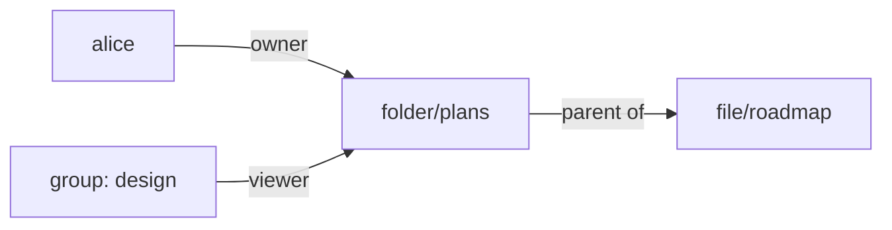

<Term id="role">Roles</Term> work well for "all editors may edit all documents". They work badly for sharing:
"Alice may edit this one folder, and the design team may view it". Writing a <Term id="policy">policy</Term> per
folder does not scale, and people share things all day. Relationship-based access control (ReBAC) handles this
case.

A <Term id="relationship">relationship</Term> (or tuple) records that a person or a
<Term id="group">group</Term> stands in a named relation to one <Term id="resource">resource</Term>: _alice is an
`owner` of `folder/plans`_, _the design group are `viewer`s of `folder/plans`_. A role then says "viewers may
read" once, and sharing a folder becomes a matter of adding a tuple rather than editing a policy. Policies see the
relations the <Term id="principal">principal</Term> (the caller) holds as `resource.relations`.



With the tuples above, a policy evaluated for a member of the design group on `folder/plans` sees
`resource.relations` as `["viewer"]`, and on `file/roadmap` sees `resource.parentRelations` as `["viewer"]`.

## Declare relations

First decide which relations make sense for each type of thing, such as `viewer`, `editor`, and `owner` for
folders. Declaring them up front means a typo like `veiwer` is refused instead of silently granting nothing. A
resource type declares the relations it supports in `permissions.resourceTypes`, in a plugin's `resourceTypes`,
or, for tenant-defined types, on `resourceTypes.register` and `resourceTypes.update`:

```ts title="lib/iam.ts"
permissions: {
  resourceTypes: {
    folder: { managed: true, actions: ['folders:read', 'folders:share'], relations: ['viewer', 'editor', 'owner'] },
    file: { managed: true, parent: 'folder', actions: ['files:read'], relations: ['viewer'] },
  },
},
```

Relation names are lowercase identifiers (a letter, then letters, digits, `_`, or `-`), at most 32 per type.
Tuples naming an undeclared relation are rejected, and a relation someone still holds cannot be dropped from its
type (`RESOURCE_IN_USE`).

## Record relationships

Your product records a tuple whenever someone shares something or creates something they should own. Call
`iam.api.relationships.create` from the code path that handles the share:

```ts
await iam.api.relationships.create(credential, {
  tenantId,
  type: 'folder',
  id: 'plans',
  relation: 'viewer',
  subjectType: 'group', // or 'identity'
  subjectId: design.id,
  expiresAt: Date.now() + 30 * 86_400_000, // optional
});
```

- It requires `iam:relationships:create` on `iam/{type}/{id}`, so who may share what is itself a policy decision.
- The type must be known (`INVALID_RESOURCE_TYPE`) and the relation declared for it (`INVALID_INPUT`). Managed
  resources must be registered (`NOT_FOUND`); application-owned resources are accepted as named.
- The subject is an identity of the tenant (not deleted) or a group of the tenant.
- `expiresAt` (epoch milliseconds, in the future, within ten years) makes the tuple temporary. An expired tuple
  grants nothing.
- Creating a tuple that already exists updates it in place, replacing its expiry (or clearing it when you omit
  `expiresAt`).

To show a "shared with" panel, call `relationships.list`. It returns tuples filtered by `type`, `id`, `relation`,
`subjectType`, and `subjectId`, newest first, and omits expired tuples unless you pass `includeExpired: true`. It
requires `iam:relationships:read` on `iam/{type}/{id}` when you filter by both type and ID, on `iam/{type}/*` when
you filter by type, and on `iam/*` otherwise.

To stop sharing, call `relationships.delete({ tenantId, relationshipId })`, which removes one tuple and requires
`iam:relationships:delete` on the tuple's resource.

Tuples are removed together with their identity, group, or managed resource. Role sessions hold no relations,
even when the source identity does.

## Use relations in policies

A tuple on its own grants nothing; a policy has to say what each relation allows. During evaluation, the
principal's live relations on the evaluated resource, held directly or through group
membership, appear as `resource.relations`, a sorted list of relation names. Those held on the resource's
registered parent appear as `resource.parentRelations`. Test them with the `ArrayContains`
<Term id="condition">condition</Term>, which holds when the principal has any of the listed relations:

```ts title="A role that turns relations into permissions"
await iam.api.roles.create(credential, {
  tenantId,
  name: 'Sharing',
  document: {
    version: 1,
    statements: [
      {
        effect: 'allow',
        actions: ['folders:read'],
        resources: ['folder/*'],
        conditions: { ArrayContains: { 'resource.relations': ['viewer', 'editor', 'owner'] } },
      },
      {
        effect: 'allow',
        actions: ['files:read'],
        resources: ['file/*'],
        conditions: { ArrayContains: { 'resource.parentRelations': ['viewer', 'editor', 'owner'] } },
      },
    ],
  },
});
```

Bind a role like this to a group everyone belongs to. The role grants nothing by itself; the tuples decide which
folders each person reaches.

<TryInPlayground
  grants={[
    {
      version: 1,
      statements: [
        {
          sid: 'ReadSharedFolders',
          effect: 'allow',
          actions: ['folders:read'],
          resources: ['folder/*'],
          conditions: { ArrayContains: { 'resource.relations': ['viewer', 'editor', 'owner'] } },
        },
        {
          sid: 'ReadFilesInSharedFolders',
          effect: 'allow',
          actions: ['files:read'],
          resources: ['file/*'],
          conditions: { ArrayContains: { 'resource.parentRelations': ['viewer', 'editor', 'owner'] } },
        },
      ],
    },
  ]}
  action="files:read"
  resource="file/q3-budget"
  context={{ 'principal.id': 'usr_bob', 'resource.parentRelations': ['viewer'] }}
>
  Try the sharing role in the playground
</TryInPlayground>

In the playground, the context stands in for the tuples: `resource.parentRelations` is what the server would
derive from a `viewer` tuple on the file's folder. Empty the list and the read is no longer allowed.

- `resource.parentRelations` looks one level up, to the registered parent only. Relations on a grandparent are
  not consulted, so record tuples at the level your policies read.
- Both keys are lists. `StringEquals` never matches them; use `ArrayContains` (any of) or `ArrayContainsAll`
  (all of). The linter reports the mistake as `array-key-string-operator`.
- A principal without relations sees an empty list, so `ArrayContains` is false and the statement does not apply.

## Let owners share

Sharing is only self-service if the people who own things can share them without being administrators. Recording a
tuple is itself an administrative action (`iam:relationships:create`), so the trick is a policy that allows it
only to owners of the resource.

For administrative actions on `iam/{type}/{id}` that name a registered managed resource, `resource.relations`,
`resource.parentRelations`, `resource.ownerId`, `resource.parentId`, and the registered attributes describe that
resource. That is what lets an `owner` share a folder without holding a tenant-wide administrative role:

```json title="Owners may share their own folders"
{
  "effect": "allow",
  "actions": ["iam:relationships:create", "iam:relationships:delete"],
  "resources": ["iam/folder/*"],
  "conditions": { "ArrayContains": { "resource.relations": ["owner"] } }
}
```

```ts title="An owner shares a folder"
// The server checks the caller's owner relation on iam/folder/plans.
await iam.api.relationships.create(ownerCredential, {
  tenantId,
  type: 'folder',
  id: 'plans',
  relation: 'viewer',
  subjectType: 'group',
  subjectId: designTeam.id,
});
```

The same works with registered ownership instead of a relation, using a
[policy variable](/docs/guides/authorization/policies#policy-variables):
`{ "StringEquals": { "resource.ownerId": "${principal.id}" } }` on `iam/folder/*`.

## Lists and reviews

Shared resources should show up in lists, and reviewers should see who reaches a resource through sharing.
<Term id="reverse-query">Reverse queries</Term> see relationships too:
[`listAccessible`](/docs/guides/authorization/queries#list-accessible-resources)
returns the folders a person can read through their tuples, and
[`policies.whoCan`](/docs/guides/authorization/reviews#who-can-act-on-a-resource) lists everyone who reaches a
folder through one.

```ts
const { resources, total } = await iam.listAccessible({ token, tenantId, action: 'folders:read', type: 'folder' });
```

## Next steps

<Cards>
  <Card title="Sharing recipes" href="/docs/guides/recipes/sharing-and-reviews">
    Copy-ready sharing and review patterns.
  </Card>
  <Card title="Relationships API" href="/docs/reference/api/relationships">
    Signatures for create, list, and delete.
  </Card>
  <Card title="Managed resources" href="/docs/guides/authorization/catalog#managed-types">
    Register the resources relations point at.
  </Card>
</Cards>
