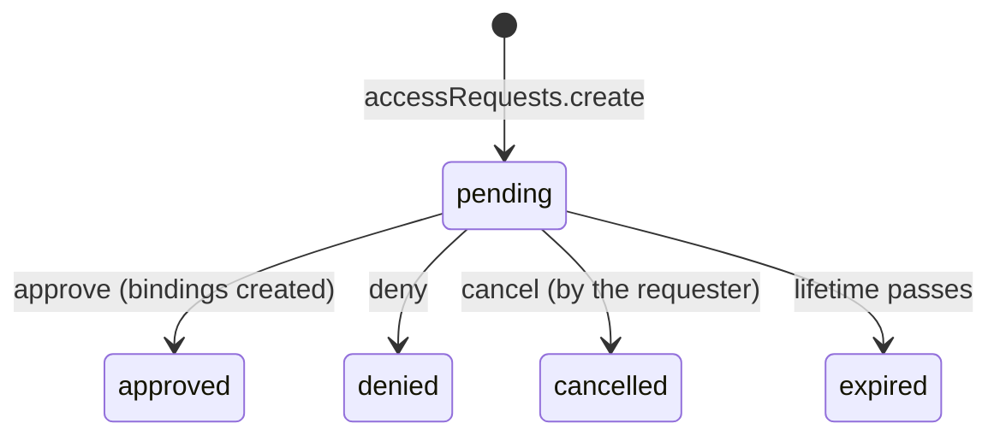

Access tends to pile up. A contractor finishes, an audit ends, someone moves teams, and the roles they were given
stay behind because nobody remembers to remove them. The cheapest access to review is access that ends by
itself. Better IAM lets you put an end, a start, or a schedule on almost every grant, and gives people a way to
ask for access that is time-boxed from the start.

| You need | Use |
| --- | --- |
| Access that ends on a date: a contractor, an audit, a project | [An expiring binding](#expiring-bindings) |
| Access that begins later: the first day of a contract | [A future-dated binding](#future-dated-bindings) |
| Team membership for a period, with every role the team holds | [A temporary group membership](#temporary-group-memberships) |
| Access only during business hours | [An access window](#access-windows) |
| People asking for a role, a reviewer approving it for a while | [Access requests](#access-requests) |
| Privileged roles held only while needed, with justification and approval | [Just-in-time elevation](#just-in-time-elevation-and-packages) |
| A short session with exactly one role, possibly in another tenant | [Role sessions](#role-sessions) |
| A short-lived, narrowed copy of your own credential for a script or CLI | [Session tokens](#session-tokens) |
| CI jobs and workloads that sign in with their platform's token, no stored secret | [Workloads without stored secrets](#workloads-without-stored-secrets) |
| Credentials for a machine that expire and can be scoped | [API keys](#api-keys) |

## Expiring bindings

A <Term id="binding">binding</Term> gives a <Term id="role">role</Term> to a person or group. By default it lasts
until someone removes it. Give it an `expiresAt` when you already know when the access should end:

```ts
await iam.api.bindings.create(credential, {
  tenantId,
  roleId: auditor.id,
  subjectType: 'identity',
  subjectId: externalAuditor.id,
  expiresAt: Date.parse('2026-12-31T23:59:59Z'), // epoch milliseconds
});
```

- `expiresAt` is in epoch milliseconds, in the future, and within ten years (`INVALID_INPUT` otherwise).
- An expired binding grants nothing from that instant. It disappears from `identities.listBindings`,
  `roles.listBindings`, and `bindings.list` (pass `includeExpired: true` to `bindings.list` to see it), and the
  purge worker deletes it.
- `bindings.update({ tenantId, bindingId, expiresAt })` extends or shortens the end, and `expiresAt: null` clears
  it. It follows the same rules as `bindings.delete`: the caller needs `iam:bindings:create` on the role and must
  own the binding's <Term id="authority">grant authority</Term>, or be root.

## Future-dated bindings

Sometimes you know access should start later: a new hire's first day, or a contract that begins next month.
Creating the binding now, with `startsAt`, means nobody has to remember to do it on the day.

```ts
await iam.api.bindings.create(credential, {
  tenantId,
  roleId: engineer.id,
  subjectType: 'identity',
  subjectId: newHire.id,
  startsAt: Date.parse('2026-10-01T08:00:00+02:00'),
  expiresAt: Date.parse('2027-03-31T18:00:00+02:00'), // optional; must be after startsAt
});
```

- A future-dated binding is listed with its start (in `identities.listBindings`, `roles.listBindings`, and the
  [access report](/docs/guides/privileged-access/access-report)'s `starting` section) but grants nothing until
  then.
- `startsAt` may not lie in the past (a minute of clock skew is tolerated) and must be within ten years and before
  `expiresAt`.
- `bindings.update` moves the start, or clears it with `startsAt: null` so the binding applies at once.
- [Separation-of-duties rules](/docs/guides/authorization/separation-of-duties) count future-dated bindings, so
  a conflict scheduled to start later is refused now.

## Temporary group memberships

When access comes from a <Term id="group">group</Term>, it is often the membership that should end: "join the
incident team for this week". A temporary membership ends at a set time, and with it every grant and activation
the membership carried.

```ts
await iam.api.groups.addMember(credential, {
  tenantId,
  groupId: incidentTeam.id,
  identityId: alice.id,
  expiresAt: Date.now() + 7 * 86_400_000,
});
```

- `groups.addMember` (and `groups.addMembers` for several people) accepts `expiresAt` under the same rules as
  bindings: in the future and within ten years.
- `groups.updateMember({ tenantId, groupId, identityId, expiresAt })` extends or shortens the membership, and
  `expiresAt: null` makes it permanent.
- `groups.listMembers` and `identities.listGroups` report `membershipExpiresAt`, so member lists can show when
  someone leaves.
- Re-adding a lapsed member renews the membership, and the purge worker removes lapsed records (reported as
  `expiredMemberships`).

## Access windows

Some access should only exist during working hours: a support role that should not be usable at 3 a.m., or
contractors who work a fixed schedule. An <Term id="access-window">access window</Term> on a binding limits it to
recurring hours in a time zone. Outside the window the binding grants nothing, exactly like an expired one, and
it starts applying again when the window next opens.

```ts
await iam.api.bindings.create(credential, {
  tenantId,
  roleId: support.id,
  subjectType: 'group',
  subjectId: supportTeam.id,
  window: { from: '09:00', to: '17:00', timeZone: 'Europe/Berlin', days: [1, 2, 3, 4, 5] },
});

// Change it, or clear it with window: null
await iam.api.bindings.update(credential, { tenantId, bindingId, window: null });
```

<TypeTable
  type={{
    from: {
      type: 'string',
      description: 'When the window opens each day, as HH:MM in the time zone.',
      required: true,
    },
    to: {
      type: 'string',
      description: 'When it closes, as HH:MM. A window whose end is not after its start wraps past midnight and counts as the day it starts on, so 22:00 to 06:00 is a night shift. The window may not be empty.',
      required: true,
    },
    timeZone: {
      type: 'string',
      description: 'An IANA time zone such as Europe/Berlin or America/New_York, so the window follows local time and daylight saving.',
      required: true,
    },
    days: {
      type: 'number[]',
      description: 'The weekdays the window opens on, 0 (Sunday) to 6 (Saturday), 1 to 7 entries.',
      default: 'every day',
    },
  }}
/>

`identities.listBindings` reports `inWindow` for windowed bindings, reviews such as `policies.whoCan` and
`policies.effectiveActions` reflect the window at evaluation time, and configuration sync carries `window` on
group bindings. A policy condition cannot express recurring hours (`DateBefore` and `DateAfter` compare fixed
instants), so windows are the tool for schedules.

## Access requests

Without a request flow, people ask for access in chat, an administrator binds a role by hand, and nobody remembers
to remove it. An <Term id="access-request">access request</Term> turns that into a recorded, time-boxed decision:
a member asks for roles with a reason, a reviewer approves or denies, and approved access can expire by itself.



<Steps>
<Step>

### A member asks

A member with `iam:access-requests:create` calls `accessRequests.create`, from an ordinary session of the tenant
(not a role session):

```ts
const request = await iam.api.accessRequests.create(memberCredential, {
  tenantId,
  roleIds: [reportsViewer.id],
  justification: 'Quarter-end close, ticket FIN-2231',
  durationSeconds: 14 * 86_400, // optional: how long the access should last
});
```

A request names 1 to 20 roles. Protected roles, such as _Owner_, cannot be requested. A member may hold at most
twenty pending requests (`TOO_MANY_REQUESTS`), and an identical pending request is rejected (`CONFLICT`). Requests
expire after `accessRequests.lifetimeMs` (default seven days).

</Step>
<Step>

### A reviewer decides

A reviewer with `iam:access-requests:review` calls `accessRequests.approve` or `accessRequests.deny`, with an
optional `note`:

```ts
await iam.api.accessRequests.approve(reviewerCredential, {
  tenantId,
  requestId: request.id,
  durationSeconds: 7 * 86_400, // optional: overrides the requested duration
  note: 'Approved for the close only',
});
```

Approval creates (or refreshes) one binding per role under the reviewer's own grant authority, and requires
`iam:bindings:create` on each role, exactly like `bindings.create`. A reviewer can therefore never grant more than
they could bind directly. A requester cannot approve their own request, and the requester must still be active.
The resulting bindings carry `accessRequestId`, and `expiresAt` whenever a duration was requested or set by the
reviewer; without a duration the access is standing until someone removes it.

</Step>
<Step>

### The member follows up

Requesters see their own requests with `accessRequests.listMine`, which needs only `iam:access-requests:create`,
and may withdraw a pending one with `accessRequests.cancel`. Administrators list every request with
`accessRequests.list` and read one with `accessRequests.get`, both under `iam:access-requests:read`.

</Step>
</Steps>

Two deployment options shape the flow:

<TypeTable
  type={{
    'accessRequests.lifetimeMs': {
      type: 'number',
      description: 'How long a pending request stays open before it reads as expired, from one minute to a year.',
      default: '604800000 (seven days)',
    },
    'accessRequests.maxDurationSeconds': {
      type: 'number',
      description: 'The longest temporary grant a request may ask for, or an approver may set, from 60 seconds to ten years.',
      default: '7776000 (90 days)',
    },
  }}
/>

A request reads as `expired` as soon as its lifetime passes, even before the purge worker marks it, and deciding
a request that is no longer pending fails with `INVALID_TRANSITION`. Approvals and denials are audited as
`access-request:approve` and `access-request:deny`, with the requester, the roles, and the resulting binding IDs in
the metadata.

## Just-in-time elevation and packages

Two larger features build on temporary access and have their own guides:

- **<Term id="eligible-binding">Eligible bindings</Term>** record that someone _may_ hold a privileged role. The
  person activates it for a bounded time, optionally with a justification, MFA, and an approver's decision, and
  the role stops applying when the activation ends. See
  [Just-in-time elevation](/docs/guides/privileged-access/elevation).
- **<Term id="access-package">Access packages</Term>** bundle roles and group memberships that are granted
  together, with an end date, by assignment, by request, or automatically by rule. See
  [Access packages](/docs/guides/privileged-access/access-packages).

## Role sessions

A binding gives someone a role for as long as it lasts. Sometimes you want less: a support engineer who needs a
customer tenant's support role for fifteen minutes, or an automation that should act with exactly one role and
nothing else it holds. <Term id="role-assumption">Role assumption</Term> covers this. A trusted identity starts a
short **role session** whose permissions are exactly the target role's.

Two steps set it up:

1. **A platform administrator establishes a <Term id="trust">trust</Term>.** `trust.create` records that one
   exact source identity may assume one exact target role. It is root only and needs recent authentication.
2. **The source identity assumes the role when needed.** `roles.assume` checks the trust and returns a bearer
   `token` for the target tenant, its `expiresAt`, and a `session` summary that names the role and the trust.

```ts title="Set up once (root administrator)"
const trust = await iam.api.trust.create(rootCredential, {
  tenantId: customerTenantId, // the tenant that owns the role
  sourceTenantId: rootTenantId,
  sourceIdentityId: supportEngineer.id,
  roleId: customerSupportRole.id,
  requireMfa: true, // the default
  externalId: 'ticket-system', // optional shared value the caller must present
});
```

```ts title="Assume the role when needed (the support engineer)"
const { token, session } = await iam.api.roles.assume(engineerCredential, {
  tenantId: customerTenantId,
  trustId: trust.id,
  externalId: 'ticket-system',
  durationSeconds: 900,
  sessionName: 'ticket-4711', // optional label, visible to policies and the audit trail
});
// Use { token } as the credential for calls in the customer tenant until session.expiresAt.
```

The trust's options decide how strict assumption is:

<TypeTable
  type={{
    sourceTenantId: {
      type: 'string',
      description: 'The tenant of the identity that may assume the role.',
      required: true,
    },
    sourceIdentityId: {
      type: 'string',
      description: 'The one identity that may assume the role. Trust is always exact: one source identity, one target role.',
      required: true,
    },
    roleId: {
      type: 'string',
      description: 'The target role, in the tenant named by tenantId. Protected roles are refused.',
      required: true,
    },
    requireMfa: {
      type: 'boolean',
      description: 'Refuse assumption from sessions that are not MFA-verified. API keys are never MFA-verified, so a trust that an API key uses needs requireMfa: false.',
      default: 'true',
    },
    externalId: {
      type: 'string',
      description: 'A value the caller must present to roles.assume, useful when a third-party system assumes on your behalf. It is stored hashed, and trust.list reports only requiresExternalId.',
    },
    ceiling: {
      type: 'PolicyDocument',
      description: "A boundary on the role's grants in sessions through this trust, so a trust can hand out less than the whole role.",
      default: 'unrestricted',
    },
  }}
/>

And `roles.assume` shapes the session itself:

<TypeTable
  type={{
    trustId: {
      type: 'string',
      description: 'The trust to use. It must name the caller as its source identity and tenant.',
      required: true,
    },
    externalId: {
      type: 'string',
      description: 'Required when the trust was created with one; it must match.',
    },
    durationSeconds: {
      type: 'number',
      description: "How long the role session lasts, from 60 seconds up to the session limit: the smaller of the deployment's sts.maxRoleSessionSeconds (3600 by default) and the trust's own limit (3600 unless the trust sets another). A value outside that range fails with INVALID_INPUT rather than being shortened. The session never outlives the credential that started it.",
      default: '900 (15 minutes), or the limit when it is lower',
    },
    policy: {
      type: 'PolicyDocument',
      description: 'A session policy that narrows this one session further, for example to read-only. It is validated against the catalog.',
    },
    sessionName: {
      type: 'string',
      description: 'A label for the session, such as a ticket or job name: 2 to 64 letters, digits, or the characters +=,.@_-. Policies read it as principal.sessionName, and the audit trail records it.',
    },
    sourceIdentity: {
      type: 'string',
      description: 'The person or job behind the call, in the same format as sessionName, exposed as principal.sourceIdentity. It is refused (ACCESS_DENIED) unless the trust admits a source identity, and by default a trust forbids one.',
    },
    tags: {
      type: 'Record<string, string>',
      description: 'Session tags: up to 50 key-value pairs that policies read as principal.sessionTags.{key}. Keys start with a letter and use at most 64 letters, digits, or underscores; values are at most 256 characters. Every key must be admitted by the trust (ACCESS_DENIED otherwise), and by default a trust admits none.',
    },
    format: {
      type: "'opaque' | 'jwt'",
      description: "opaque returns an opaque token that only Better IAM can check. jwt returns a session JWT signed by Better IAM, which downstream services can verify; it needs sts.jwt in the deployment (FEATURE_DISABLED otherwise), and sts.jwt.maxLifetimeSeconds also caps the duration.",
      default: "'opaque'",
    },
    audience: {
      type: 'string[]',
      description: "With format 'jwt' only: 1 to 5 audiences for the token, each from the deployment's sts.jwt.audiences. Every audience other than Better IAM itself needs the role to allow iam:assertions:create on iam/{audience}. The default is Better IAM itself.",
    },
  }}
/>

- Assumption also requires the source identity's `iam:roles:assume` permission on the target role
  (`iam/{targetRoleId}`), evaluated in the source identity's own tenant. The trust must name the caller as its
  source identity and tenant, MFA must be present when the trust requires it, and the external ID must match.
- A role can be assumed from an ordinary user session, an API key, or a session token. Role sessions cannot
  chain: assuming a role from a role session fails with `ROLE_CHAINING_DISABLED`. An impersonation session cannot
  assume roles either (`IMPERSONATION_RESTRICTED`). Protected roles cannot be the target of a trust.
- The target role's policies replace the source identity's application permissions. The target tenant's
  boundaries, the trust ceiling, and the session policy still constrain them, and the session carries no groups,
  no relationships, and no owner or root flags.
- The session keeps the MFA state and sign-in time of the credential that started it, and policies see the
  caller's own tenant as `principal.sourceTenantId`. See
  [Special sessions](/docs/guides/authorization/conditions#special-sessions) for the full context.
- A role session is re-checked on every request. It stops working as soon as the trust is revoked
  (`trust.revoke`, root only), the source credential or identity stops working, the source identity loses its
  `iam:roles:assume` permission, or a grant authority behind the role or the source's own grants is revoked.
- The target tenant's IP allowlist and network blocks apply to the address presenting the token and to the
  address it was issued from.
- Assumption is audited twice: as `iam:roles:assume` in the source tenant, and as `role:assumed` in the target
  tenant with the trust, source tenant, duration, format, and tag keys, so the target tenant sees who came in.
- `trust.list({ tenantId, includeRevoked? })` shows the trusts that target a tenant's roles, under
  `iam:trust:read`, without their external ID hashes.

The deployment-wide limits for role sessions live under `sts` in the server options; see
[Temporary credentials](/docs/operations/deployment/configuration#temporary-credentials).

## Session tokens

A command-line tool or a script should not carry someone's full browser session or a long-lived API key around. A
**session token** is a short-lived copy of your own credential for exactly that: you trade a signed-in session or an
API key for a token that lasts an hour (or up to the configured limit), optionally narrowed by a policy, and hand the
token to the script. If it leaks, it expires on its own.

```ts title="A one-hour, read-only token for a deploy script"
const { token, expiresAt } = await iam.api.sts.getSessionToken(
  { token: signedInToken },
  {
    mfaCode: '123456', // optional: a fresh authenticator code
    sessionName: 'deploy-cli',
    policy: {
      version: 1,
      statements: [{ effect: 'allow', actions: ['iam:roles:assume', 'documents:read'], resources: ['*'] }],
    },
  },
);
```

- The token acts with your own grants, bounded by `policy` and by its source (an API key's scopes and authority carry
  over). It never outlives its source and ends when the source ends.
- Passing `mfaCode` gives the token a fresh MFA time. Role assumption cannot take a code itself, so this is how a
  command-line tool assumes a role whose trust requires MFA: MFA first, then assume.
- Tokens cannot chain: a role session or another session token cannot mint one (`CREDENTIAL_CHAINING_DISABLED`). Each
  identity holds at most `sts.maxSessionTokensPerIdentity` live tokens (50 by default).
- Policies see these credentials as `principal.sessionKind: 'session-token'`, and
  [`sts.getCallerIdentity`](/docs/reference/api/sts#getcalleridentity) (the CLI's `whoami`) tells any holder what a
  token acts as.
- With `format: 'jwt'` (and `sts.jwt` configured), the token is a signed JWT that other services can verify offline
  with `createSessionTokenVerifier` from `better-iam/session-tokens`.

## Workloads without stored secrets

CI pipelines and cloud workloads traditionally hold an API key in a secret store, and a leaked key works from anywhere
until someone notices. Most platforms already give their jobs a short-lived OpenID Connect token that proves which
job, repository, or pod is running: GitHub Actions, GitLab CI, Kubernetes service accounts, and cloud workload
identity services all do. **Web-identity federation** lets such a job trade that token for a Better IAM role session,
so no IAM secret is stored anywhere.

<Steps>
<Step>

### Enable web identity

Set `sts: { webIdentity: { enabled: true } }` in the server options. It is off by default; see
[web-identity federation](/docs/operations/deployment/configuration#web-identity-federation) for the fetch limits and
issuer pinning.

</Step>
<Step>

### Register the provider

An administrator records whose tokens the organization accepts, and for which audience.

```ts
const github = await iam.api.oidcProviders.create(credential, {
  tenantId,
  name: 'GitHub Actions',
  issuer: 'https://token.actions.githubusercontent.com',
  audiences: ['https://iam.example.com'],
});
```

</Step>
<Step>

### Create a web-identity trust

The trust names the role, the service account the sessions act as, and conditions on the token's claims. The
conditions must pin `token.sub`, so a trust can never admit every job on the platform (`WEAK_TRUST_CONDITIONS`).

```ts
await iam.api.trust.create(credential, {
  tenantId,
  kind: 'web-identity',
  providerId: github.id,
  serviceAccountId: deployBot.id,
  roleId: deployRole.id,
  conditions: { StringEquals: { 'token.sub': 'repo:acme/app:ref:refs/heads/main' } },
  maxSessionSeconds: 900,
});
```

</Step>
<Step>

### Exchange the token in the job

The job asks its platform for a token and calls the public
[`sts.assumeRoleWithWebIdentity`](/docs/reference/api/sts#assumerolewithwebidentity). The answer is a role session
that lasts minutes, not months.

```bash
ID_TOKEN=$(curl -sH "Authorization: bearer $ACTIONS_ID_TOKEN_REQUEST_TOKEN" \
  "$ACTIONS_ID_TOKEN_REQUEST_URL&audience=https://iam.example.com" | jq -r .value)
curl -s https://iam.example.com/api/iam/sts/assumeRoleWithWebIdentity \
  -H 'Content-Type: application/json' -H 'X-Better-IAM: 1' \
  -d "{\"tenantId\":\"$TENANT_ID\",\"trustId\":\"$TRUST_ID\",\"webIdentityToken\":\"$ID_TOKEN\",\"sessionName\":\"deploy-$GITHUB_RUN_ID\"}"
```

</Step>
</Steps>

Every refusal that depends on the token or on stored state answers the same `WEB_IDENTITY_REJECTED`, so a caller
cannot probe which trusts exist. Only a malformed request, a spent exchange budget, or a switched-off feature is
refused earlier with its own code, and only a token already admitted by the trust can meet the ordinary limits (such
as network rules or the session cap). Administrators
see the real reason with [`trust.evaluateWebIdentity`](/docs/reference/api/trust#evaluatewebidentity), which checks a
token against a trust without issuing anything. A token can be redeemed once unless the provider turns replay
protection off. Disabling the provider, revoking the trust, or disabling the service account ends the sessions at
once, and [`oidcProviders.revokeSessions`](/docs/reference/api/oidc-providers#revokesessions) ends them without
changing anything else.

## API keys

A service or integration needs a credential that does not depend on a person's session and does not live forever.
API keys are opaque credentials for [service accounts](/docs/reference/api/service-accounts), and every key has
an expiry and can be scoped below what its service account may do.

```ts
const { token, credentialId, expiresAt } = await iam.api.credentials.create(credential, {
  tenantId,
  identityId: reportingService.id,
  name: 'Nightly export',
  scopes: ['reports:read', 'reports:export'], // or a full session `policy`
  expiresInSeconds: 30 * 86_400, // default 90 days
});
// `token` is shown once; store it in your secret manager.
```

- `credentials.create` issues a key for an active service account. It requires `iam:credentials:create` on the
  account, recent authentication, and a grant authority. Keys default to a 90-day expiry (60 seconds to 365
  days).
- The key retains its issuing authority's ceiling. If that authority is revoked, every request with the key is
  denied.
- `scopes` compiles to a session policy that allows exactly those actions on every resource; `policy` accepts a
  full session policy instead. Passing both fails with `INVALID_INPUT`.
- API key sessions are never MFA-verified (`principal.mfa` is `false`) and report `principal.sessionKind` as
  `api-key`.
- `credentials.rotate` replaces the key material: the old key stops working in the same transaction, and the
  replacement keeps the label, policy, and expiry. `credentials.revoke` deletes a key at once, and
  `credentials.update` relabels it or moves its expiry (in the future, at most a year out).

Finding unused keys, labels, and offboarding are covered in
[Access lifecycle](/docs/guides/privileged-access/lifecycle).

## Next steps

<Cards>
  <Card title="Just-in-time elevation" href="/docs/guides/privileged-access/elevation">
    Eligible roles that people activate when they need them.
  </Card>
  <Card title="Access report" href="/docs/guides/privileged-access/access-report">
    What ends soon, and what starts soon.
  </Card>
  <Card title="Bindings API" href="/docs/reference/api/bindings">
    Every bindings method with its signature.
  </Card>
</Cards>
