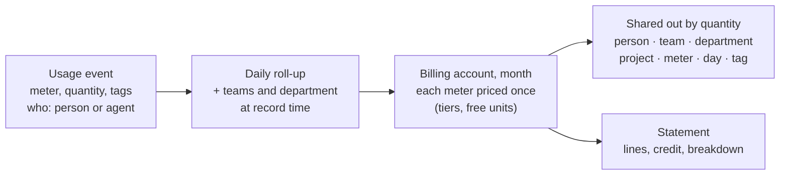
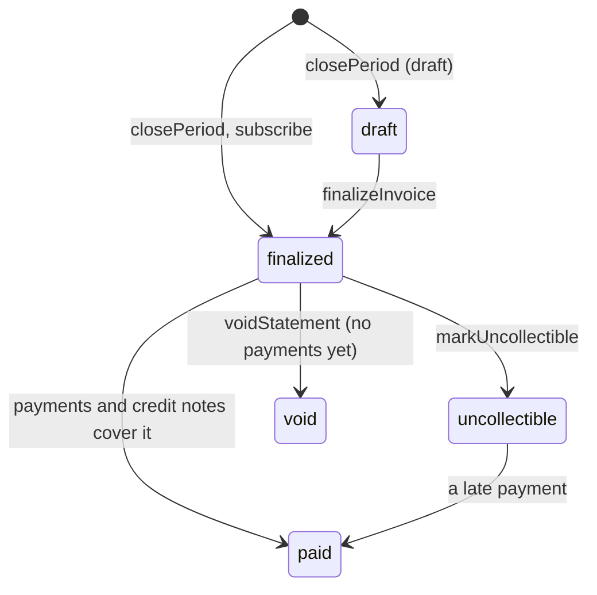

At the end of every month someone asks what the organization spent, and the next question is always who spent it.
The answer depends on things an IAM system already knows: which organization and project a request ran in, who made
it, which teams that person belongs to, which department they report into, and which agent acted for them. Billing
puts usage and money next to that directory, so finance sees the account's total, a team lead sees their team, a
department head sees their department, and everyone sees their own spend, and the numbers add up.

## The model



- **Meters** name what is billed: API calls, seat-days, GB-days, CI builds, AI inference. The root tenant defines
  **platform meters** billed to every organization; an organization or project can define **chargeback meters** for
  its own subtree, which show in its spend but never on a platform statement.
- A **rate card** prices each meter: per unit, graduated or volume tiers, packages, a free allowance, and negotiated
  prices for individual organizations.
- A **billing account** is an organization, or a tenant below it with a billing profile of its own. Each meter's
  month total is priced once per account and then shared out to the usage that produced it by quantity (for
  active-user meters, equally per person), so every breakdown adds up to the account's charges.

## Meters and prices

```ts
await iam.api.billing.createMeter(root, {
  tenantId: rootTenantId,
  key: 'api-calls',
  name: 'API calls',
  unit: 'request',
});
await iam.api.billing.setPrice(root, {
  tenantId: rootTenantId,
  meter: 'api-calls',
  price: {
    model: 'graduated',
    includedQuantity: 10_000,
    tiers: [
      { upTo: 1_000_000, unitAmount: 0.0004 },
      { upTo: null, unitAmount: 0.0002 },
    ],
  },
});
// A negotiated price for one organization and its projects:
await iam.api.billing.setPrice(root, {
  tenantId: rootTenantId,
  meter: 'api-calls',
  targetTenantId: acmeId,
  price: { model: 'per-unit', unitAmount: 0.0003 },
});
```

| Setting                   | Meaning                                                                                |
| ------------------------- | -------------------------------------------------------------------------------------- |
| `aggregation: 'sum'`      | Quantities add up (default).                                                           |
| `aggregation: 'unique'`   | Distinct people and agents with usage in the month: active users or active seats.     |
| `pricing: 'rate-card'`    | Priced from the rate card (default).                                                   |
| `pricing: 'reported'`     | Every event carries its own cost, as AI inference and chargeback entries do.          |

Keys belong to the tenant nearest the root, so an organization can never redefine a platform meter. A price applies
from `effectiveFrom` (a month) until a later entry, and the entry nearest the billing account wins. Past months can be
priced until they are invoiced.

## Recording usage

Server code records usage without a credential and without an audit event per call:

```ts
await iam.billing.record({
  tenantId: projectId,
  meter: 'api-calls',
  quantity: 1,
  identityId: session.identity.id,
  tags: { endpoint: 'search' },
  idempotencyKey: requestId,
});
```

Backends that only reach the HTTP API use `billing.record` or `billing.recordMany` with a service account holding
`iam:billing:record`. Each event is attributed when it is recorded: to the person, service account or agent, to the
teams they belong to directly, and to their department. An agent's usage counts toward its sponsor's teams and
department. Metered AI inference arrives by itself on the built-in `inference` meter, and `iam.billing.recordSeats()`
records one seat per active person each day for seat pricing.

## Reading spend

```ts
const byTeam = await iam.api.billing.spend(admin, { tenantId, groupBy: 'team' });
const platformTeam = await iam.api.billing.spend(admin, { tenantId, teamId, groupBy: 'identity' });
const sixMonths = await iam.api.billing.trend(admin, { tenantId, months: 6 });
```

Group by `meter`, `identity`, `agent`, `team`, `department`, `tenant` (projects), `day`, or a tag. Filters narrow to a
meter, a person, a team or department (with those below it), or a project; the current month includes a linear
forecast. People in several teams count toward each in equal parts, unless the `billing` option `teamAttribution` says
`primary` or `full`.

| Who               | Reads                                                   | Needs                      |
| ----------------- | ------------------------------------------------------- | -------------------------- |
| Billing managers  | `spend`, `trend`, budgets, credits, statements          | `iam:billing:read`         |
| Team maintainers  | `teamSpend` for their team and the teams below it       | maintaining the team       |
| Department heads  | `departmentSpend` for their department and those below  | heading the department     |
| Everyone          | `mySpend`: their own usage and their agents'            | a session of the tenant    |

In React, `useMySpend` and `useSpendCheck` show people their own spend and warn before a blocked action.

## Budgets

```ts
await iam.api.billing.createBudget(admin, {
  tenantId,
  name: 'Platform team monthly',
  subjectType: 'team',
  subjectId: platformTeamId,
  amount: 600,
  thresholds: [50, 80, 100],
  notify: { emails: ['finance@acme.test'] },
  enforce: false,
});
```

A budget covers a tenant subtree, a team with its sub-teams, a department with those below it, or one person, per
month, quarter or year. `iam.billing.checkBudgets()` alerts once per threshold and window, and when the projection
passes the budget: an audit event `billing:budget-alert` that webhooks can forward, and a `spend-alert` email to the
owners, the subject (the person, the team's maintainers, the department head) and any extra addresses. An enforced
budget refuses covered usage once it is spent (`SPEND_LIMIT_REACHED`, 402, for `record` with `enforceBudgets`), and
`billing.check` tells callers in advance.

[Inference budgets](/docs/guides/inference) stay the hard, per-call caps on model tokens and cost; billing budgets
watch money across every meter.

## Spikes, showback and exports

Budgets catch spend that adds up; `billing.anomalies` catches spend that jumps: people, teams and meters whose spend
yesterday was at least three times their usual daily amount (a looping pipeline, a leaked key, an agent retrying
forever). `iam.billing.detectAnomalies()` runs daily and alerts once per spike (`billing:anomaly`, `spend-anomaly`
email). For showback, `shareUnattributed: true` spreads spend nobody in the dimension caused over the teams,
departments or people that did, by their share. `billing.exportSpend` and `billing.exportStatement` return CSV for
spreadsheets.

## Profiles, credit and statements

A billing profile names who pays: company, billing emails, tax ID, address, purchase order, cost center and payment
terms. A profile on a project makes the project a billing account of its own, which is its parent's decision, so it is
created from the organization with `targetTenantId`. Root administrators grant credit to billing accounts.

`iam.billing.closePeriod()` issues last month's invoice for every billing account with something to bill: one line
per platform meter (with the tiers its quantity used), subscription fees and seats, pending invoice items, coupons,
credit applied earliest expiry first, tax, the total and due date, and a breakdown of usage by project, team,
department (with cost centers) and person. Invoices carry a content hash and bill whole cents, so their lines add up.

## Invoicing

Invoices follow the lifecycle Stripe uses:



- **Drafts.** With `billing.autoFinalize: false` (or `closePeriod({ draft: true })`) monthly invoices stay drafts,
  recomputed on every run, until a root administrator finalizes them. Their month still takes late usage.
- **Invoice items** are one-off charges, or credits with a negative amount, for an account's next invoice
  (`createInvoiceItem`). When credits exceed the charges the rest becomes account credit.
- **Payments** (`recordPayment`) may be partial; an overpayment becomes credit. Payment processors report payments
  with `iam.billing.recordPayment({ number, amount, idempotencyKey })` from their webhooks.
- **Credit notes** (`createCreditNote`) reduce the amount due first; a part already paid becomes credit or is
  recorded as refunded. Invoices with payments or credit notes are corrected with credit notes, never voided.
- **Reminders.** `iam.billing.sendPaymentReminders()` emails billing contacts before and after the due date
  (`billing.paymentReminderDays`, default 3 days before, on the day, 7 and 14 days after).
- **Printable invoices.** `renderInvoice` returns a self-contained HTML page with the issuer from `billing.issuer`, to
  print or save as PDF.

## Plans, subscriptions and coupons

```ts
await iam.api.billing.createPlan(root, {
  tenantId: rootTenantId,
  key: 'team',
  name: 'Team',
  selfServe: true,
  trialDays: 14,
  items: [
    { id: 'platform', kind: 'fee', name: 'Platform fee', amount: 99 },
    { id: 'seats', kind: 'seat', name: 'Seats', unitAmount: 12, includedSeats: 3 },
    { id: 'calls', kind: 'usage', meter: 'api-calls', price: { model: 'per-unit', unitAmount: 0.0003 } },
  ],
});
await iam.api.billing.subscribe(orgAdmin, { tenantId: acmeId, plan: 'team', seats: 8 });
await iam.api.billing.redeemCoupon(orgAdmin, { tenantId: acmeId, code: 'LAUNCH20' });
```

Fees and seats are billed a month ahead (or in arrears per item), prorated when a subscription starts, changes seats,
changes plan or ends mid-month; a plan's usage items replace the rate card for its subscribers. Outside a trial the
first month is invoiced at once. Organizations manage self-serve plans themselves (`iam:billing:manage`); root
administrators manage every plan, end subscriptions at once and create coupons (`percentOff` or `amountOff`, once,
for some months, or forever).

| Job                                  | CLI                 | Schedule |
| ------------------------------------ | ------------------- | -------- |
| `iam.billing.checkBudgets()`         | `billing-alerts`    | hourly   |
| `iam.billing.recordSeats()`          | `billing-seats`     | daily    |
| `iam.billing.closePeriod()`          | `billing-close`     | daily    |
| `iam.billing.sendPaymentReminders()` | `billing-reminders` | daily    |
| `iam.billing.detectAnomalies()`      | `billing-anomalies` | daily    |

## In the console

- **Organization → Billing**: spend this month by person, team, department, project, meter or day, the six-month
  trend, budgets, invoices with the amount due, the subscription (seats, cancel, keep), self-serve plans, promotion
  codes, charges waiting for the next invoice, the meters and prices that apply, the billing profile, and chargeback
  meters. People without billing permissions see their own spend there.
- **Invoice** pages: lines with tier sub-lines, service periods and prorations, coupons, payments, credit notes,
  breakdowns, the integrity check, and "Print or save as PDF".
- **Administration → Billing** (root): accounts and what they owe, invoices (finalize, mark paid, write off, void),
  payments, credit notes, invoice items, plans, subscriptions, coupons, closing a month (optionally as drafts),
  contract terms, credit, and platform meters and prices.

## Next steps

<Cards>
  <Card title="Billing API" href="/docs/reference/api/billing">
    Every method, permission, and error of the billing group.
  </Card>
  <Card title="Teams and departments" href="/docs/guides/teams-and-departments">
    The teams, maintainers and department heads that spend is attributed to.
  </Card>
  <Card title="Model access and budgets" href="/docs/guides/inference">
    Model access, per-call token and cost caps, and the gateway that feeds the inference meter.
  </Card>
</Cards>
