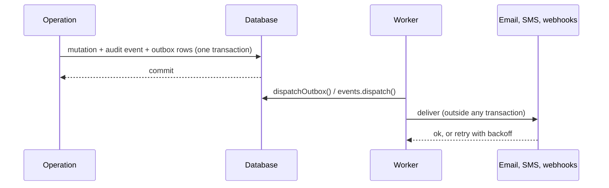

Better IAM keeps all of its state in your database, in a single table behind the `IamStore` contract. It trades
some write throughput for a simple guarantee: every authorization decision and every revocation sees the current
state, and every change is atomic with its record in the <Term id="audit-chain">audit chain</Term>. This page
explains the storage model, the transaction rules that make that guarantee hold, and how side effects, plugins,
and protocols fit around it.

## The storage model

Better IAM keeps all of its records in one generic table, so it can share a database with your product without
adding dozens of tables of its own. The SQL <Term id="adapter">storage adapters</Term> (SQLite, libSQL, and
PostgreSQL) share that schema. Records live in a versioned `iam_records` table:

| Column | Holds |
| --- | --- |
| `collection` | The record kind, such as `identities` or `sessions`. |
| `id` | The record ID. The primary key is `(collection, id)`. |
| `tenant_id` | The owning tenant. Tenant ownership of a record is immutable. |
| `unique_key` | An optional natural key, unique per `(collection, tenant_id)`. |
| `data` | The record as JSON. |

Two small tables track the schema: `iam_schema_version` and `iam_migrations`, which records named schema steps.
`iam.initialize()` applies pending migrations and chains any audit events recorded before the hash chain existed.
Run it, or the CLI's `migrate` command, once per deployment before serving traffic.

Composite database constraints enforce scoped uniqueness, such as one email per tenant. Where uniqueness must be
global, the record ID carries the natural key: the `tenantAliases` collection uses the alias as its record ID, so
the primary key makes aliases globally unique, and `domainOwners` is keyed by the verified domain. Services enforce
cross-record references (a binding's role, a membership's group) under transaction isolation.

Beyond identities and tenants, collections hold every kind of IAM state:

| Area | Collections |
| --- | --- |
| Tenancy | `tenants`, `tenantAliases`, `tenantDomains`, `domainOwners`, `ownerInvitations`, `memberInvitations` |
| Accounts and sessions | `identities`, `sessions`, `externalIdentities`, `identityLinks` |
| Authentication | `authChallenges`, `authMfa`, `authPasskeys`, `authDevices`, `authSignIns`, `authBlocks`, `authRateLimits`, `passwordHistory` |
| Access model | `policies`, `policyVersions`, `roles`, `bindings`, `groups`, `groupMembers`, `grantAuthorities`, `principalBoundaries`, `trusts` |
| Catalog | `actions`, `resourceTypes`, `resources`, `relationships` |
| Delivery and audit | `outbox`, `webhooks`, `auditHooks`, `audit`, `auditChains` (chain heads, keyed by tenant ID) |
| Protocols | OAuth, SAML, SCIM, and Shared Signals artifacts |

Product data stays in your product's own database. Better IAM does not make a write to a separate product
database atomic with an authorization check.

## Serialized transactions

Access control is full of check-then-write decisions. Picture two administrators each removing a different owner
of the same tenant at the same moment. Each request checks "is there another owner left?", sees yes, and proceeds,
and the tenant ends up with no owner at all. Better IAM prevents this class of bug by running such transactions one
at a time.

Transactions serialize writes and the reads that decide them:

- **SQLite** takes an immediate writer lock (`BEGIN IMMEDIATE`) before any application read.
- **PostgreSQL** takes a transaction-scoped advisory lock, shared by every adapter instance on the database.
- **libSQL** uses `BEGIN IMMEDIATE` for local files; remote servers (Turso, `sqld`) queue write transactions
  themselves.

Serialization is what makes check-and-write operations safe: consuming a single-use token, protecting the last
owner, enforcing a plan limit, and re-validating a principal all read and write inside one serialized
transaction. All writes go through `transaction()`, and nested transactions join the outer one and roll back with
it.

<Callout type="warn" title="Always go through the adapter">
  Every instance that touches these tables must use the adapter contract. Raw SQL writes can violate
  service-level integrity and revocation guarantees, for example by leaving a session alive after its identity was
  disabled.
</Callout>

This design favors consistent authorization and revocation over write throughput. Large installations should
measure transaction latency and record-scan costs; see [storage](/docs/operations/storage) for query pushdown,
indexes, and diagnostics.

## No permission cache

Better IAM keeps no cross-request permission cache. Token validity and the current role and policy state are
checked on use, inside the transaction of the request that uses them. Disabling an identity, revoking a binding,
ending a session, or tightening a tenant policy therefore takes effect on the very next request, in every process.

Two small, bounded exceptions trade exactness for write volume:

- A session's `lastSeenAt` is touched at most once a minute, or once per tenth of the idle timeout when that is
  shorter. Idle expiry is accurate to that interval and only ever earlier than configured, never later.
- Each process reuses a tenant's list of [network blocks](/docs/guides/authentication/tenant-policy#network-blocks)
  for five seconds, so a new block reaches other processes within that time.

## Side effects leave through the outbox

Sending an email inside a transaction is a trap: if the transaction then rolls back, the person received a reset
link for a change that never happened, and if the mail server is slow, every other write waits. So external side
effects never run inside a write transaction. Emails, SMS messages, and webhook deliveries are written to the
<Term id="outbox">outbox</Term> collection in the same transaction as the change that caused them, with payloads
sealed by authenticated encryption. A worker delivers them afterwards: nothing is sent until something calls the
dispatch functions below.

- **At least once.** Delivery is at least once, so callbacks must deduplicate by message ID.
- **Retries.** A failed attempt is retried with exponential backoff from thirty seconds to one hour and abandoned
  after `authentication.maxDeliveryAttempts` (25 by default), with `failedAt` and `lastError` recorded.
- **Events.** Subscribers, plugin `afterAudit` hooks, and webhook deliveries are queued inside the recording
  transaction and dispatched after it commits, so nothing is emitted for a change that rolled back and nothing
  committed is lost. See [events](/docs/guides/events).

Two calls drain the queues. Run both from your worker schedule, every few seconds or minutes depending on how
quickly people should receive their email:

- `iam.auth.dispatchOutbox()` delivers queued emails, SMS messages, and webhook deliveries through your callbacks
  and the webhook transport, and returns `{ delivered, failed, abandoned }`.
- `iam.events.dispatch()` runs plugin `afterAudit` hooks, the `events.onEvent` callback, and in-process subscribers
  for events that have committed.

The `outbox` CLI command runs both once, for a cron schedule. In-process subscribers exist only in your
application's process, so that process must call `iam.events.dispatch()` itself; the CLI serves plugin hooks and
`events.onEvent` only. See [scheduled jobs](/docs/operations/jobs).

## Retention

Deleted data has to disappear eventually, but an audit record that points at a vanished identity is useless. So
deletion is two-phase:

- Deleting a tenant tombstones its subtree and stamps `deletedAt`. The data stays for a retention window, during
  which the deletion can still be investigated.
- Deleting an identity leaves a tombstone without email or secrets, so audit records still name who acted.

Two jobs do the cleanup. Schedule both from your worker:

- `iam.purgeDeleted({ retentionMs })` (also the `purge` CLI command) removes every tenant-scoped record of tenants
  deleted longer ago than `retentionMs` (30 days by default), calling plugin `purge` callbacks in the same
  transaction; audit records are preserved. It also deletes expired temporary bindings and memberships, marks stale
  access requests expired, disables identities past their `expiresAt`, and removes expired challenges, rate-limit
  windows, and lapsed blocks.
- `iam.sweepExpired()` deletes expired sessions, protocol artifacts, and old delivery records in short batches, so
  those collections do not grow without bound.

Expired credentials and access are refused at their next use even before these jobs run, so the schedule only
affects how quickly storage and reports catch up.

## Plugins

Sometimes your product needs a feature of its own that should be governed like IAM data: a record type with its
own actions, HTTP endpoints, and audit trail, or a hook that must run inside every change. A plugin adds that
without forking Better IAM, and inherits the same guarantees because it runs inside the same pipeline.

A <Term id="plugin">plugin</Term> is a plain object with an `id`, passed in the `plugins` option. It extends the
same catalog, transaction, and audit pipeline that built-in operations use:

| Member | Purpose |
| --- | --- |
| `actions`, `resourceTypes` | Catalog entries, validated like the product's own. A name declared twice is rejected at construction. |
| `endpoints` | HTTP endpoints (`POST {basePath}/plugins/{id}/{path}`) that run inside a transaction with the authorized principal and may queue deliveries through `deliver`. |
| `hooks.beforeOperation`, `hooks.afterOperation` | Run inside every `operation` transaction, before the mutation and after it (before the audit record). Throwing aborts the operation. |
| `resolveContext` | Adds trusted, server-derived keys to the policy evaluation context. |
| `afterAudit` | Runs for committed events, from the dispatcher, at least once. |
| `migrate`, `purge` | Plugin migrations, and removal of plugin-owned records when a tenant is purged. |

`@better-iam/projects` is the reference implementation. See [extensions](/docs/operations/extensions) for the
adapter and plugin contracts.

## Federation composition

Enterprise customers bring their own identity providers and directories, but not every deployment needs every
protocol. So the protocol packages (OAuth/OIDC, SAML, SCIM, Shared Signals) are separate from the server and are
loaded only when you import them.

Each protocol service takes the `iam.protocolHost` callbacks, which let it sign people in and provision them
through the same pipeline as everything else, plus its own explicit configuration. `iam.useProtocol(service)` then
mounts the service on the handler under its base path. `protocolHost` is a trusted server capability, never an HTTP
endpoint.

- Standard protocol handlers use `Request`/`Response` and run through `iam.handler`.
- The OAuth issuer uses Node's request/response interface and must run through `iam.nodeHandler`.
- Protocol mounts that issue sessions run with the request's client details, so network allowlists, blocks, and
  IP binding judge those sessions like any other sign-in.

Federation maps `(tenant, provider, issuer, subject)` to an identity. Unmapped verified email claims may provision
a new account, but an existing email collision returns `ACCOUNT_LINK_REQUIRED`: the application must complete an
explicit, verified linking flow. No email-only association is performed. See [federation](/docs/federation) and
[protocol mounts](/docs/operations/deployment/protocol-mounts).
