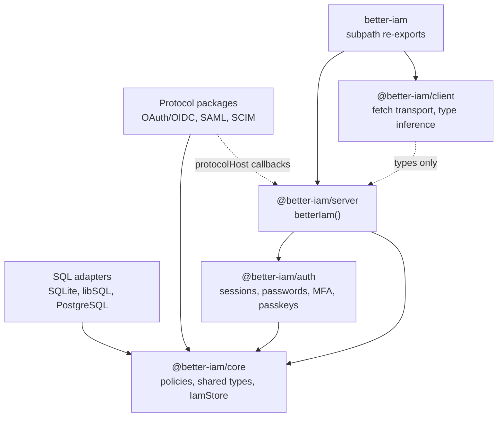
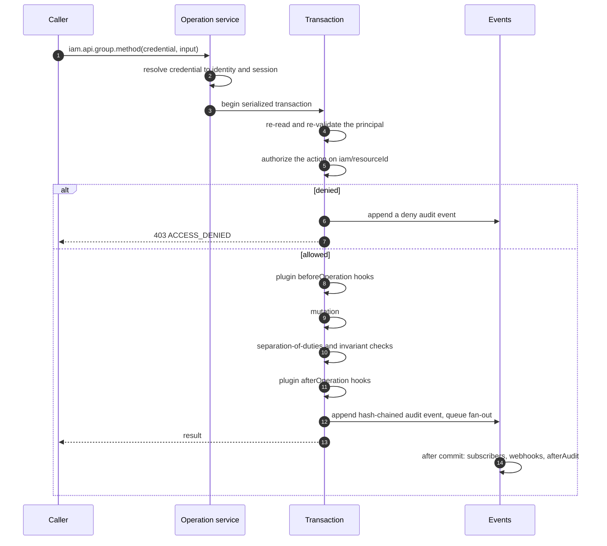

Better IAM is the identity layer of your application: it knows who is signing in, which organization they belong
to, and what they may do. Instead of calling a hosted service, you run it as a set of packages inside your own
process, against your own database. This page explains how those packages fit together and what happens to every
request, so the rest of the documentation has a map to hang on.

## Key terms

These words appear on almost every page. Throughout the documentation, a dotted underline marks a term; select it
for a short definition. The [glossary](/docs/reference/glossary) lists every term.

| Term | Meaning |
| --- | --- |
| **Tenant** | An isolated account, such as a customer organization or one of its projects. Tenants form a tree, and each has its own people, roles, and policies. See [tenants and identities](/docs/guides/concepts/tenants-and-identities). |
| **Identity** | A person (`kind: 'user'`) or a machine (`kind: 'service'`) in one tenant. |
| **Session** | The stored record behind a credential: a signed-in user session, an API key, or an assumed-role session. |
| **Principal** | The caller an authorization decision is about: an identity together with the session it presented. Policies read its properties as `principal.*`, such as `principal.mfa`. |
| **Action** | A named operation, such as `documents:read` or the built-in `iam:identities:create`. |
| **Resource** | The thing an action is performed on, named `type/id`, such as `document/42`. |
| **Policy** | A versioned JSON document of allow and deny statements over actions and resources, with optional conditions. |
| **Role** | A named set of permissions or policies that can be handed to people. |
| **Binding** | The grant of a role to an identity or a group in a tenant. Bindings can be temporary, or eligible for just-in-time activation. |
| **Boundary** | A policy that caps what a tenant or an identity can ever be granted. Boundaries constrain; they never grant access. |
| **Grant authority** | The delegation record under which an administrator hands out roles. It carries a ceiling (the most it may grant) and a chain back to whoever delegated it; revoking it disables what was granted under it. |

## How the packages fit together

Better IAM is a set of layered packages. Each layer depends only on the contracts below it, so you can read, test,
and replace them one at a time.

- The **pure core** (`@better-iam/core`) defines policies, shared types, and the `IamStore` storage contract.
- **SQL <Term id="adapter">adapters</Term>** implement `IamStore` for SQLite, libSQL, and PostgreSQL.
- The **authentication** and **protocol** packages (OAuth/<Term id="oidc">OIDC</Term>,
  <Term id="saml">SAML</Term>, <Term id="scim">SCIM</Term>) operate on that contract.
- The **server** (`@better-iam/server`) composes authentication, authorization, provisioning, and transport into
  one object: `betterIam(options)`.
- The **client** (`@better-iam/client`) contains only a fetch-based transport and type inference, so it is safe
  to ship to browsers.
- The **umbrella** package `better-iam` re-exports everything through subpath imports without eagerly importing
  the protocol implementations. A protocol is loaded only when you import its subpath.



## Public surfaces

You create one Better IAM instance with `betterIam(options)` and import it wherever your server code needs identity
or authorization. The object it returns is the whole public surface. Most applications use a handful of its
members:

| Member | What it is for |
| --- | --- |
| `api` | Every operation, grouped: `api.auth` for end-user authentication, plus the provisioning groups. |
| `authorize`, `authorizeMany`, `listAccessible` | Authorization queries: one decision, up to 50 decisions for one tenant, and a reverse query over managed resources. |
| `require` | `authorize` that throws `ACCESS_DENIED`; call it right before a protected operation. |
| `handler`, `nodeHandler` | The Fetch (`Request`/`Response`) and Node.js HTTP transports for the whole API. |
| `events` | In-process subscriptions to audit events: `events.subscribe(patterns, handler)` registers your code for committed events whose action matches, such as `iam:identities:*`, and returns an unsubscribe function. `events.dispatch()` delivers the queued events to it; run it on a timer in the same process. |
| `initialize` | Runs migrations and backfills the audit chain; normally run through the CLI. |

`api` is organized in groups, one per kind of record. `api.auth` holds what end users do for themselves (sign in,
manage factors and sessions). The other groups are **provisioning** operations that administrators and your
server perform on a tenant:

| Group | What it is for |
| --- | --- |
| `tenants` | Create organizations, rename, move, suspend, and delete them, and set their authentication policy and plan limits. |
| `identities` | Create, invite, update, offboard, and delete people; export their data; end their sessions. |
| `serviceAccounts`, `credentials` | Machine identities and the API keys they authenticate with. |
| `groups` | Sets of identities that receive roles together. |
| `roles`, `policies`, `bindings`, `authorities` | The access model: what roles allow, who holds them, and who may hand them out. |
| `actions`, `resourceTypes`, `resources`, `relationships` | The resource catalog: the vocabulary of actions and resource types, managed resources, and sharing. |
| `trust` | Platform-controlled permission for an identity to assume a role in another tenant. |
| `links` | Explicit links between one person's identities in different tenants, for account switching. |
| `root` | Grant and list platform root administrators. |
| `accessRequests` | Time-boxed requests for access that a reviewer approves. |
| `webhooks`, `audit` | Signed event deliveries and the tamper-evident audit log. |
| `assertions` | Short-lived signed tokens that tell your other services who is calling. |

Governance groups (certifications, separation of duties, role mining, and more) and federation groups build on
these. The [API reference](/docs/reference/api) lists every group and method with its HTTP route and TypeScript
signature.

### One operation, three ways to call it

Every group method takes `(credential, input)` on the server. The browser client and HTTP call the same
operation, with the request itself as the credential.

<Tabs groupId="api-surface" persist items={['Server', 'Browser client', 'HTTP']}>
<Tab value="Server">

```ts title="app/actions.ts"
import { iam } from './iam';

// The credential is the incoming request's headers (a cookie or bearer token), or { token }.
const credential = { headers: request.headers };
await iam.api.identities.invite(credential, { tenantId, email: 'alice@example.com' });
```

</Tab>
<Tab value="Browser client">

```ts title="app/invite.ts"
import { createIamClient } from 'better-iam/client';
import type { iam } from './iam';

const client = createIamClient<typeof iam>({ baseURL: 'https://identity.example.com' });
await client.identities.invite({ tenantId, email: 'alice@example.com' }); // the session cookie is the credential
```

</Tab>
<Tab value="HTTP">

```bash
curl -X POST https://identity.example.com/api/iam/identities/invite \
  -H "Authorization: Bearer $BETTER_IAM_TOKEN" \
  -H "Content-Type: application/json" \
  -H "X-Better-IAM: 1" \
  -d '{ "tenantId": "3f2c9a4e-…", "email": "alice@example.com" }'
```

</Tab>
</Tabs>

The credential says **who is calling**. It contains request headers (with a session cookie or a bearer token) or
an opaque token, never caller-supplied identity claims such as a user ID. The server looks the credential up and
resolves it to the current identity and session records itself, so a caller cannot claim to be someone else.

A few operations happen before anyone holds a credential, so they are public:

- `tenants.lookup` resolves an organization's sign-in alias, such as `acme`, for a login page.
- `domains.discover` finds the organization that owns an email domain, for "sign in with your work email".
- `tenants.acceptInvitation` and `identities.acceptInvitation` redeem an invitation and create the invitee's
  account.
- The sign-in ceremonies in `api.auth`, such as `signIn` and `verifyMfa`, are public for the same reason.
- `sts.assumeRoleWithWebIdentity` exchanges a token from an external OpenID Connect provider for a role session;
  that external token is its credential.

### Deployment-only capabilities

Some members exist for trusted server code and deployment tooling only:

| Member | What it is for |
| --- | --- |
| `iam.auth` | Low-level authentication primitives for trusted integrations, such as `withClient` (record client details on sessions you create) and `dispatchOutbox` (deliver queued emails, SMS messages, and webhooks). |
| `iam.store` | The raw storage adapter, for migrations, snapshots, and diagnostics. |
| `iam.bootstrap`, `iam.recoverRoot` | Create the root tenant and first root administrator, or a replacement administrator when everyone is locked out. |
| `iam.assertionKey` | The derived key your other services use to verify assertions. |
| `iam.protocolHost` | The trusted callbacks that the OAuth, SAML, and SCIM packages use to sign people in and provision them. |
| Jobs | Scheduled maintenance such as `purgeDeleted` (retention), `sweepExpired` (expired sessions and artifacts), and `rotateSecrets` (re-seal data after a secret rotation). See [scheduled jobs](/docs/operations/jobs). |

<Callout type="warn" title="Never expose these through RPC">
  The HTTP router explicitly excludes root bootstrap, recovery, raw storage, cryptographic helpers, and
  session-issuance primitives. Do not re-expose `iam.auth`, `iam.store`, `bootstrap`, `recoverRoot`,
  `assertionKey`, or `protocolHost` through application RPC reflection.
</Callout>

## Module layout

You do not need the module layout to use Better IAM, but it helps when you read the source, debug a decision, or
write a plugin. The server package is a set of small modules that `betterIam()` composes in `src/index.ts`:

| Module | Responsibility |
| --- | --- |
| `options.ts` | Option types and `resolveConfig`, which validates and defaults configuration once. |
| `catalog.ts` | The permission catalog: built-in and declared actions, resource types, tenant-defined registrations, policy validation. |
| `plugins.ts` | Plugin validation at construction. |
| `context.ts` | The shared `ServerContext`: configuration, storage, auth, catalog, and record helpers (tenants, ancestry, authorities, scoping, owner setup). |
| `events.ts` | Chained audit recording, in-transaction fan-out, webhook signing and transport, post-commit dispatch, subscriptions. |
| `decisions.ts` | Grant paths, relationships, resource resolution, `prepareDecision`, `decide`, and simulated principals for reviews. |
| `observe.ts` | Observability spans around operations, authorization queries, authentication calls, and HTTP requests. |
| `assertions.ts` | Stateless HS256 assertions: key derivation, issuance (the `assertions` group), and `verifyAssertion`. |
| `sync.ts` | Configuration as code: the `config` group (`export`, `plan`, `apply`) over the mutation helpers the `api/*` files export. |
| `usage.ts` | Access usage tracking (the `accessUsage` option): an in-memory recorder behind `ctx.usage`, flushed in batches. |
| `invariants.ts` | Access invariants: evaluation, the snapshot and verify pair `operation` runs around access-changing actions, and the `checkInvariants` job. |
| `agreements.ts` | Terms of use: acceptance currency and the `principal.agreements` and `principal.pendingAgreements` context. |
| `principals.ts` | Credential resolution for user sessions, API keys, and assumed roles; per-transaction re-validation. |
| `operations.ts` | The transactional `operation` envelope, `authorize`, `authorizeMany`, `listAccessible`, plugin calls. |
| `flows.ts` | Multi-step flows: invitation redemption, account linking and switching, role assumption. |
| `api/*.ts` | One file per API group; `api/index.ts` composes them. |
| `lifecycle.ts` | `initialize` (migrations and audit-chain backfill), `bootstrap`, `recoverRoot`, and the retention worker `purgeDeleted`. |
| `retention.ts` | `sweepExpired`: deletes expired sessions, protocol artifacts, and old deliveries by walking the expiry indexes. |
| `self-check.ts` | `selfCheck`: the configuration and storage findings behind `doctor` (schema, durability, secrets, transports, scheduled jobs). |
| `secrets.ts` | `rotateSecrets`: re-seals values encrypted with `previousSecrets` using the current deployment secret. |
| `federation.ts` | `protocolHost` callbacks for the OAuth, SAML, and SCIM packages. |
| `http.ts` | Fetch and Node transports, the CSRF boundary, cookies, CORS, protocol mounts, and the auth route table. |

Modules reach each other through the context at call time (`ctx.decisions.decide(...)`). That keeps them free of
import cycles and lets you read each one on its own.

The other packages follow the same idea:

- **Authentication.** `service/base.ts` holds configuration and the session core. `sessions.ts`, `account.ts`,
  `passwordless.ts`, `mfa.ts`, and `passkeys.ts` each extend the previous class with one feature. `outbox.ts` and
  `rate-limit.ts` are plain modules.
- **SCIM** separates its filter grammar, discovery documents, provisioning logic, and HTTP handler.
- **OAuth** separates the provider adapter from the provider service.

## The request pipeline

Every operation runs through the same pipeline, whether it comes from a browser, a server action, the CLI, or a
SCIM connector: resolve the credential, authorize, apply the change in one serialized transaction, and append an
audit event. Direct calls and HTTP enter the same operation service.

Having one path is what makes the guarantees hold everywhere. A permission check, a revocation, or an audit rule
enforced in the pipeline cannot be skipped by calling the API a different way.



<Steps>
<Step>

### Resolve the credential

The principal service turns the credential into an identity and a session. User sessions resolve through the
authentication service; API keys and assumed-role sessions resolve in the server. When a call carries request
headers, the client details (IP, user agent) are derived from them the same way the HTTP handler derives them,
so network allowlists and session binding judge the presenting address. See
[sessions](/docs/guides/authentication/sessions).

</Step>
<Step>

### Re-validate inside the transaction

The credential was resolved a moment ago, but an administrator may have disabled the person or ended the session
since. So the transaction re-reads the identity and session and re-checks every revocation condition before
anything is used:

- the identity is active and not past its `expiresAt`;
- the session exists, is unexpired, and has not passed its idle timeout;
- the tenant and all of its ancestors are active;
- MFA requirements still hold, and an impersonation's source session is still live;
- the recorded address is allowed and not blocked.

API keys also need an unrevoked issuing authority; assumed roles need an intact trust, role, and source session.

</Step>
<Step>

### Authorize

Every provisioning operation is itself an action on a resource. Inviting a person, for example, is the action
`iam:identities:create` on `iam/{tenantId}`. It is authorized like any product action: against the principal's
roles, policies, boundaries, and grant authorities (see [key terms](#key-terms)). A denial records a `deny` audit
event and commits only that record; the caller receives `ACCESS_DENIED`. An impersonation session is allowed only
what both the member and the impersonating administrator may do.

</Step>
<Step>

### Mutate

Plugin `beforeOperation` hooks run, then the change itself. Afterwards the transaction checks
[separation-of-duties](/docs/guides/authorization/separation-of-duties) rules (one person may not hold two
conflicting roles) and [access invariants](/docs/guides/governance/change-safety) (guardrails that must always
hold), then runs plugin `afterOperation` hooks. Any failure rolls the whole transaction back, so a change that
breaks a rule never becomes visible.

</Step>
<Step>

### Audit and fan out

One audit event is appended in the same transaction. Events form a hash chain per tenant (each includes the hash
of the one before), so altering, reordering, or removing a record is detectable. Subscribers, plugin `afterAudit`
hooks, and webhook deliveries are queued in that transaction and dispatched after it commits, so nothing is
emitted for a change that rolled back. See [events](/docs/guides/events).

</Step>
</Steps>

No cross-request permission cache exists. Token validity and the current role and policy state are checked on
every use, so a revocation takes effect on the next request. See
[data and consistency](/docs/guides/concepts/data-and-consistency).

<Callout type="info" title="Client decisions are advisory">
  `authorizeMany` and `listAccessible` exist to render menus and lists. Enforce authorization on the server
  immediately before performing the protected operation, with resource ownership loaded from trusted storage:
  call `iam.require` (or `authorize`) there.
</Callout>

## Next steps

<Cards>
  <Card title="Tenants and identities" href="/docs/guides/concepts/tenants-and-identities">
    Tenant trees, identity directories, invitations, root administration, and account linking.
  </Card>
  <Card title="Resources and catalog" href="/docs/guides/concepts/resources-and-catalog">
    Actions, resource types, managed resources, and relations.
  </Card>
  <Card title="Data and consistency" href="/docs/guides/concepts/data-and-consistency">
    The storage model, serialized transactions, the outbox, plugins, and federation composition.
  </Card>
  <Card title="Authentication" href="/docs/guides/authentication">
    Sign-in methods, MFA, passkeys, sessions, and tenant policies.
  </Card>
</Cards>
