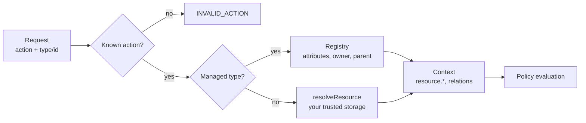

Authorization in Better IAM always asks the same question: may this <Term id="principal">principal</Term> (the
signed-in caller) perform this <Term id="action">action</Term> on this <Term id="resource">resource</Term>? The
resource catalog defines both halves: it lists the action names a policy may use and the resource types those
actions apply to, with their attributes and relations.

Declaring them up front means a typo in a policy is caught when the policy is saved, not discovered later when
access silently fails. This page explains the concepts; the [catalog guide](/docs/guides/authorization/catalog)
covers configuration and validation in depth.

## The permission catalog

The <Term id="permission-catalog">permission catalog</Term> is the set of action names a
<Term id="policy">policy</Term> may use. It combines four sources:

| Source | Example | Where it comes from |
| --- | --- | --- |
| Built-in actions | `iam:identities:create`, `iam:bindings:create`, `iam:audit:read` | The platform's own operations. |
| Product actions | `documents:read`, `reports:export` | `permissions.actions` and each resource type's `actions`. |
| Plugin actions | `projects:read` | A plugin's `actions` list. |
| Tenant-defined actions | `invoice:approve` | Registered by a tenant when `permissions.mode` is `'tenant-defined'`. |

Registering an action grants nothing; it only makes the name valid in policies. Policy documents are validated
against the catalog when they are stored: an exact action name that does not exist is rejected with
`INVALID_ACTION`. Wildcard patterns such as `documents:*` are stored as written. Products and plugins cannot
declare names under the reserved `iam:` or `tenant/` prefixes, or names containing `*`, `?`, or whitespace.

## Resource types

A <Term id="resource-type">resource type</Term> names a kind of thing your product protects, such as documents or
projects, and says which actions apply to it and which attributes policies may test. You declare types in
`permissions.resourceTypes`:

```ts title="iam.ts"
export const iam = betterIam({
  // ...
  permissions: {
    resourceTypes: {
      document: {
        actions: ['documents:read', 'documents:write'],
        attributes: { ownerId: 'string', classification: 'string' },
        relations: ['viewer', 'editor'],
      },
      project: {
        managed: true,
        actions: ['projects:read', 'projects:manage'],
        attributes: { archived: 'boolean' },
      },
      task: { managed: true, parent: 'project', actions: ['tasks:read', 'tasks:write'] },
    },
  },
});
```

<TypeTable
  type={{
    actions: {
      type: 'string[]',
      description: <>Fully qualified action names that apply to this type. They join the permission catalog.</>,
    },
    attributes: {
      type: "Record<string, 'string' | 'number' | 'boolean'>",
      description: <>The attribute schema, at most 64 attributes. Policies read the values as <code>{'resource.{name}'}</code>.</>,
    },
    relations: {
      type: 'string[]',
      description: <>Relation names (such as <code>viewer</code> or <code>editor</code>) identities and groups may hold on resources of this type. At most 32 lowercase names.</>,
    },
    parent: {
      type: 'string',
      description: <>The parent resource type, for hierarchical resources. A managed type needs a managed parent.</>,
    },
    managed: {
      type: 'boolean',
      default: 'false',
      description: <>Managed types are registered with IAM and resolved from its registry instead of <code>resolveResource</code>.</>,
    },
    description: {
      type: 'string',
      description: <>A human-readable description, at most 512 characters.</>,
    },
  }}
/>

Type names are lowercase identifiers (a letter, then letters, digits, or hyphens, up to 64 characters). A small
set of names is reserved for the platform: `iam`, `role`, `oauth-client`, `scim`, `saml`, `ssf`, `tenant`,
`identity`, and `session`. Declaring a reserved name, or the same name twice (including across plugins), fails at
construction with `INVALID_CONFIG`.

Resource patterns in policies match `type/id` within an already-resolved tenant, for example `document/*` or
`folder/home-${principal.id}`. Once `resourceTypes` is configured, an exact type in a pattern must exist
(`INVALID_RESOURCE_TYPE`).

## Application-owned and managed resources

Every resource type is either application-owned or managed. The difference is where Better IAM finds a
resource's tenant, owner, and attributes at decision time.

| | Application-owned | Managed |
| --- | --- | --- |
| Declared as | A type without `managed` | `managed: true`, and every tenant-defined type |
| Records live in | Your product's database | IAM's `resources` collection |
| Resolved by | Your `resolveResource` callback | The registry; no callback |
| Registered with | Nothing; your product owns the data | The `resources` group (see below) |
| Extra context | Whatever your resolver returns | `resource.ownerId`, `resource.parentId`, `resource.parentType` |
| Reverse queries | Not enumerable; use `authorizeMany` with IDs you already have | `listAccessible` lists what a caller may act on |

For application-owned types, `resolveResource` must load ownership and attributes from trusted storage:

```ts title="iam.ts"
resolveResource: async ({ tenantId, type, id }) => {
  const document = await documents.find(id); // your database
  return { tenantId: document.tenantId, type, id, attributes: { ownerId: document.ownerId } };
},
```

<Callout type="warn" title="Resolve from trusted storage">
  Never copy the request's tenant ID into a fetched record to satisfy the resolver. The tenant the resolver
  returns is what authorization checks the caller against.
</Callout>

The resolver must return the same `type` and `id` it was asked about, and the record's tenant must be the tenant
the check names; anything else fails with `RESOURCE_MISMATCH` (403). Without a `resolveResource` option, checks on
application-owned types fail with `RESOURCE_RESOLVER_REQUIRED`.

Choose managed resources when you would rather not write a resolver, or when you need
<Term id="reverse-query">reverse queries</Term> such as "which projects may this person open?". You then tell
Better IAM about each resource with the `resources` group:

- `resources.register` records one resource with its attributes, an optional owner (`ownerId`), and an optional
  parent (`parentId`), for example when a project is created in your product.
- `resources.registerMany` records up to 100 in one transaction, for imports. A denied item rejects the batch.
- `resources.update` changes a resource's attributes or owner, and `resources.delete` removes it, together with
  its relationship tuples, when the product deletes it.
- `resources.get` reads one registration, and `resources.list` lists them by type, parent, or owner.

```ts
await iam.api.resources.register(credential, {
  tenantId,
  type: 'project',
  id: project.id,
  ownerId: creatorIdentityId,
  attributes: { archived: false },
});
```

Attribute values are validated against the declared schema, `ownerId` must be an identity of the same tenant, and
a parent must be a registered resource of the declared parent type. Registering requires `iam:resources:create` on
`iam/{type}/{id}`, so policies can scope who may register which resources. Managed registrations are trusted
authorization inputs: the `iam:resources:*` permissions decide who may create and edit them.

## Relations and relationship tuples

Roles answer "what can editors do?", but sharing needs "who may edit **this** document?". Writing a policy per
document does not scale. Relations express sharing and ownership without listing resource IDs in policies.

A <Term id="relationship">relationship</Term> tuple records that an identity or a group stands in a named relation
to one resource: _alice is an `editor` of `document/plans`_, _the design group are `viewer`s of `folder/specs`_.
Only relations the resource type declares are accepted.

- `relationships.create` adds a tuple, optionally with an `expiresAt`, for example when someone shares a document.
- `relationships.list` finds tuples by resource, relation, or subject, for a "shared with" panel.
- `relationships.delete` removes one, when access is unshared.

During evaluation, the principal's live relations on the resource (held directly or through a group) appear as
`resource.relations`, and those on its registered parent as `resource.parentRelations`:

```ts
{
  effect: 'allow',
  actions: ['documents:read'],
  resources: ['document/*'],
  conditions: { ArrayContains: { 'resource.relations': ['viewer', 'editor'] } },
}
```

A relation still held by someone cannot be dropped from its type. See
[relationships](/docs/guides/authorization/relationships).

## Identity attributes

Policies often depend on facts about the person rather than the resource: their department, clearance level, or
region. `permissions.identityAttributes` declares these as typed attributes. Administrators set them with
`identities.update` (or `serviceAccounts.update`), federation and SCIM can fill them from a directory, and policies
read them as `principal.{name}`:

```ts
permissions: {
  identityAttributes: { department: 'string', clearance: 'number' },
},
```

Attribute names cannot shadow the principal keys the server derives itself, such as `id`, `tenantId`, `mfa`,
`mfaTime`, `kind`, `owner`, `rootAdmin`, `groups`, `roles`, `sessionId`, `sessionKind`, `authMethod`,
`impersonated`, and `impersonatorId`, so an attribute can never impersonate a fact the server vouches for.

## Tenant-defined resource types

Platforms whose customers model their own data, such as a workflow or low-code product, cannot declare every
resource type in advance. With `permissions.mode: 'tenant-defined'`, each tenant can extend the catalog for itself.
An organization owner registers a type, with its actions, attributes, and relations, using
`resourceTypes.register`:

```ts
await iam.api.resourceTypes.register(ownerCredential, {
  tenantId,
  name: 'invoice',
  actions: ['read', 'approve'], // registered as invoice:read and invoice:approve
  attributes: { amount: 'number' },
  relations: ['approver'],
});
```

- Tenant-defined types are always managed, and exist only in the tenant that registered them.
- Their actions are namespaced under the type as `{type}:{verb}`. The `actions` list on `resourceTypes.register`
  creates them, `actions.register` adds one later, and `actions.list` shows the whole catalog a tenant can use.
- `resourceTypes.update` changes a type's description, attributes, or relations and adds verbs;
  `resourceTypes.delete` and `actions.unregister` remove what is no longer used.
- Names cannot collide with reserved names, platform resource types, or the namespace of any platform action
  (`INVALID_RESOURCE_TYPE`, `INVALID_ACTION`), so tenant-created actions cannot redefine platform namespaces.
- Deleting a type or action is refused while resources, relationships, child types, or policies still use it
  (`RESOURCE_IN_USE`).
- In the default `'catalog'` mode, only developer-defined names are allowed and these calls fail with
  `CATALOG_LOCKED`.

## From request to decision



Whichever way a resource is resolved, its attributes, owner, parent, and relations become `resource.*` context
keys, and the policy engine evaluates the principal's roles and policies against them. Continue with
[policies](/docs/guides/authorization/policies) and [conditions](/docs/guides/authorization/conditions).
