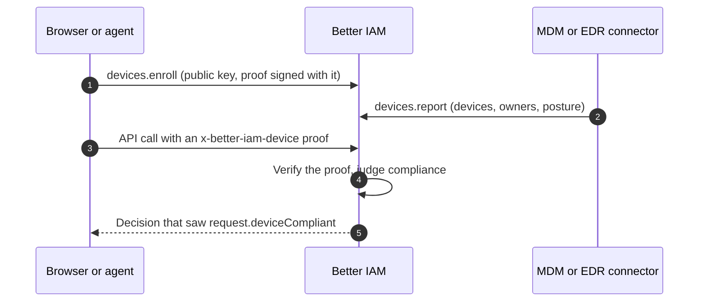

A session token works from any machine that holds it. Policies that decide on roles and attributes cannot tell a
company laptop with an encrypted disk from a personal phone, or from an attacker's machine replaying a stolen cookie.
Your MDM or EDR knows which machines are managed and healthy, but that knowledge never reaches the authorization
decision.

Device posture closes the gap. A browser or agent keeps a private key and enrolls the public half once. After that,
every request can carry a short-lived signed proof, bound to the <Term id="session">session</Term> it travels with.
The server checks the proof against the enrolled key and gives <Term id="policy">policies</Term> five context keys:
`request.deviceAssurance`, `request.deviceManaged`, `request.deviceCompliant`, `request.deviceId` and
`request.devicePlatform`.

- **Registered devices** are browsers and agents that proved they hold an enrolled key.
- **Managed devices** are registered devices that an active MDM or EDR integration reports on.
- **Compliant devices** are managed devices whose last report meets your organization's requirements.

```json title="Payroll only from compliant devices"
{
  "effect": "allow",
  "actions": ["payroll:read"],
  "resources": ["*"],
  "conditions": { "Bool": { "request.deviceCompliant": true } }
}
```

The feature is always on, with nothing to configure in the deployment. It is the `devices` API group
(`client.devices.*` over HTTP), and the browser and Node helper is `@better-iam/client/device` (also
`better-iam/client/device`).



## Registered, managed, compliant

Each request gets one assurance level, weakest first:

| `request.deviceAssurance` | The request | `deviceManaged` | `deviceCompliant` |
| --- | --- | --- | --- |
| `none` | carries no proof, or a proof that did not verify | false | false |
| `registered` | proves an active device that no active integration manages | false | false |
| `managed` | proves a device an active integration manages, but it misses a requirement | true | false |
| `compliant` | proves a managed device that meets every [requirement](#compliance-requirements) | true | true |

A device record comes from one of two places:

- **Self-enrollment** creates an unmanaged device. A person runs `devices.enroll` from their browser or agent.
- **An integration report** creates a managed device, named by the vendor's own id. `devices.report` sends it on a
  schedule, from an MDM such as Intune, Jamf or Kandji, or from an EDR such as CrowdStrike or SentinelOne.

A managed record proves nothing until a key is bound to it. [Enrollment codes](#enrollment-codes-for-managed-devices)
and [reported key thumbprints](#keys-reported-by-the-integration) bind keys to managed records.

Devices have a status. `active` devices prove things. `lost` devices prove nothing until an administrator marks them
`active` again. `retired` is final: the device's keys and pending enrollment codes are deleted, and later reports keep
it retired.

## Not "remember this device"

Better IAM also has <Term id="trusted-device">remembered devices</Term>: the "Remember this device" box at sign-in.
The two features never mix.

|  | Remembered device | Registered device |
| --- | --- | --- |
| What it is for | Skipping the second factor at the next sign-in | Telling policies which device a request comes from |
| What it is | A bearer token in a cookie, one per person and browser | A key pair; the private key never leaves the device |
| When it is used | At sign-in | On every request that carries the `x-better-iam-device` header |
| What it knows | Nothing about the device | Platform, owner, managing integration and posture |
| Managed with | `auth.listTrustedDevices`, `auth.revokeTrustedDevice` | The `devices` API group |
| Audited as | `auth:device:*` | `device:*` |

A registered device never satisfies MFA or a <Term id="recent-authentication">recent sign-in</Term>, and a remembered
browser never counts as a registered device. Removing one leaves the other alone: the threat response
[`forget-devices`](/docs/guides/threat-detection#responding), for example, forgets remembered devices and does not touch
registered ones.

## How a request proves its device

The device signs a proof: a compact JWS whose protected header and payload are

```json title="Protected header"
{ "alg": "ES256", "typ": "device-proof+jwt", "kid": "NzbLsXh8uDCcd-6MNwXF4W_7noWXFZAfHkxZsRGC9Xs" }
```

```json title="Payload"
{ "iat": 1790078400, "sid": "ses_4kJ2wX9cQe1Lr0bTn7aVh3", "tid": "<tenant id>" }
```

`kid` is the RFC 7638 SHA-256 thumbprint of the enrolled public key (43 base64url characters). `iat` is the signing
time in seconds, and `sid` is the id of the session the request authenticates with. `tid` is optional; when present it
must be that session's tenant. The request sends the proof in the `x-better-iam-device` header, next to its usual
credential (session cookie, bearer token or API key).

A proof counts only when all of these hold. Anything else means "no device" (`none`), never an error:

- It is a compact JWS of at most 2048 characters.
- The protected header holds exactly `alg`, `typ` and `kid`. A header with `jwk`, `jku`, `x5u`, `x5c`, `crit` or any
  other member is refused.
- `typ` is exactly `device-proof+jwt`.
- `kid` names a key enrolled in the identity's home tenant.
- `alg` is the one the stored key allows: `ES256` for an EC P-256 key, `EdDSA` for an Ed25519 key. The signature is
  checked with the stored key only.
- `iat` is within 300 seconds of the server clock, in either direction.
- `sid` equals the id of the session that authenticated the request. This holds for every session kind: a sign-in
  session, an API key, a role session or session token, or a delegated session.
- The device is `active`, lives in the same tenant as its key, and is shared (no owner) or owned by the identity.

Decisions verify the proof only when a policy document they read names `request.device`, and at most once per request
(a batch of `authorizeMany` checks shares one verification). Decisions never write anything; `devices.check` records
when a device and key were last seen, at most once a minute. Simulated principals never have a device.

A few decisions are made for another principal than the request's own, and they see the same device: the source
identity of a role session, whose right to assume the role is decided again on every use, and the administrator behind
a "view as" session (the device must be theirs or shared). The [SSH certificate](/docs/guides/ssh-access) sweep has no
request, so it judges device conditions by the device the issuing request proved, as that device stands now. A session
acting in another tenant than the device's (a cross-tenant role session) gets `registered` at most: that tenant neither
manages the device nor set the requirements it was judged by.

### Security properties

- **The algorithm is pinned.** The stored key decides the algorithm, and the verifier accepts only that one, so
  algorithm confusion (`none`, or HMAC keyed with a public key) cannot work.
- **Key material comes only from enrollment.** A proof cannot bring its own key: header members that carry or point to
  keys are refused, and the key is rebuilt from the stored public members.
- **Proofs are bound to the session.** A proof made for one session proves nothing for another. A stolen session token
  alone gets no device assurance, and a captured proof does not move to another session.
- **Private keys stay put.** In browsers, `indexedDbKeyStore` keeps the private key non-extractable: page scripts can
  sign with it but can never read it out.
- **Only the server sets the keys.** The server removes any `request.device*` value that `resolveContext` or a plugin
  supplies before it assigns its own, so an application or plugin cannot claim a compliant device.
- **Proofs cannot break other calls.** A missing, malformed or stale proof only lowers the assurance to `none`. Calls
  whose policies never mention devices behave exactly as before.

<Callout type="warn" title="A proof is not a per-request signature">
  It does not cover the method, URL or body, and it can be reused with the same session for up to five minutes (the
  client helper reuses each proof for four). What it proves is that the holder of the session could sign with the
  device's key in the last five minutes.
</Callout>

## Enrolling devices

### Self-service

A person enrolls the browser or agent they are using. The call must come from their own sign-in session or API key in
their own tenant, never while impersonating. <Term id="service-account">Service accounts</Term> and agents cannot
enroll devices.

```ts
const { device, keyId } = await client.devices.enroll({
  tenantId,
  name: 'Work laptop',
  platform: 'macos', // windows, macos, linux, ios, android, chromeos or other
  publicKey: await prover.publicJwk(),
});
```

- The public key is an EC P-256 or Ed25519 JWK with public members only; a key with private members is refused. Its
  thumbprint becomes `keyId`, and a key already enrolled anywhere in the deployment is refused with `CONFLICT`.
- The new device is unmanaged and owned by the caller. A person may have 20 devices that are not retired, a device may
  hold 20 keys, and enrollment is rate limited to 30 attempts per person per rate-limit window.
- **Enrolling proves possession of the key.** The request must carry a device proof signed with the key being
  enrolled, for the enrolling session (`x-better-iam-device`, which the helper's `headers()` adds once the session id
  is known), or it is refused with `INVALID_INPUT`. Otherwise anyone who saw a public key (one proof is enough to
  recover it) could enroll it first and lock its holder out.
- **Enrolling and `retireMine` need a recent sign-in** (`RECENT_AUTH_REQUIRED`), so a stolen session cannot bring a
  key of its own or take the person's devices away.

People look after their own devices without any permission:

- `devices.mine` lists their devices that are not retired. Each one has its compliance and assurance, and the device
  this request proves comes first (`current: true`).
- `devices.retireMine` retires one of their unmanaged devices and deletes its keys. Managed devices are retired by
  administrators.
- `devices.check` says what the device presenting the current request proves. `proof` is `absent`, `invalid` or
  `verified`, and `reasons` explains why a verified device is not compliant.

### Enrollment codes for managed devices

When the integration already reports a machine, bind the machine's browser or agent key straight to the managed record
with a one-time code:

```ts
const { code, expiresAt } = await iam.api.devices.createEnrollment(admin, {
  tenantId,
  deviceId: managedDevice.id, // the record the integration created
  ownerIdentityId: alice.id, // optional: only Alice may use the code
  expiresInMs: 7 * 86_400_000, // 10 minutes to 30 days; 7 days by default
});
// Deliver `code` (biam_denr_…) to that machine through the MDM, for example as managed app configuration.
```

On the machine, the person signs in and the app enrolls with the code:

```ts
await client.devices.enroll({
  tenantId,
  name: 'Work laptop', // ignored: the managed record keeps its name and platform
  platform: 'macos',
  publicKey: await prover.publicJwk(),
  enrollmentCode: code,
});
```

The key is bound to the managed record, so proofs from it are `managed` or `compliant` at once. A code works only once
and only until it expires. When it names an owner, or its device has an owner, only that person can use it, and the
device must still be `active`. A code without `deviceId` creates a new device at enrollment, owned by the code's
person, or shared when the code names nobody. A shared device may be presented by any identity of the tenant.

Only a hash of each code is stored; the code is shown once, in the answer to `createEnrollment`. Administrators see
the codes' status with `devices.listEnrollments` and withdraw one with `devices.revokeEnrollment`. A tenant can hold
1000 pending codes, and expired codes are deleted by the <Term id="retention-sweep">retention sweep</Term>
(`iam.sweepExpired()`).

### Keys reported by the integration

The MDM or EDR agent on a machine can also enroll a key the ordinary way (self-service, or with a code without a
device) and tell its console which key it holds. The integration then reports that key's thumbprint with the machine:

```json
{
  "externalId": "jamf-42",
  "platform": "macos",
  "keyThumbprint": "NzbLsXh8uDCcd-6MNwXF4W_7noWXFZAfHkxZsRGC9Xs",
  "posture": {}
}
```

The key moves onto the managed record. If it came from the same person's self-enrolled record of the machine, and
that record has no keys left, the old record is retired. Only a key already enrolled in the tenant can move, and only
from an active device of the owner the report names: that person's self-enrolled device or another record of the same
integration. A key stays where it is when its device was marked `lost`, is shared, belongs to someone else, or is
managed by another integration, and when the report names no owner. An unknown thumbprint is ignored. The thumbprint is
what the client helper's `keyId()` returns.

## The client helper

`@better-iam/client/device` creates and keeps an ECDSA P-256 key pair and signs proofs with WebCrypto. It has no
dependencies and runs in browsers in a secure context (HTTPS or localhost) and in Node 22 or later.

| Export | What it does |
| --- | --- |
| `createDeviceProver(options)` | Returns `publicJwk()`, `keyId()`, `proof(sessionId, tenantId?)`, `headers(sessionId, tenantId?)` and `reset()` |
| `indexedDbKeyStore(name?)` | Keeps the key pair in IndexedDB with a non-extractable private key; the default in browsers |
| `memoryKeyStore()` | Keeps the key pair in memory only; the default elsewhere |
| `deviceProofHeader` | `'x-better-iam-device'` |

<TypeTable
  type={{
    store: {
      type: 'DeviceKeyStore',
      description: 'Where the key pair lives: an object with load, save and clear.',
      default: 'indexedDbKeyStore() in browsers, memoryKeyStore() elsewhere',
    },
    scope: {
      type: 'string',
      description: 'A separate key pair per scope in the default store, such as the signed-in identity id (1 to 64 printable characters without spaces). Ignored when store is given.',
    },
    algorithm: { type: "'ES256'", description: 'The only supported signature algorithm.', default: "'ES256'" },
    now: {
      type: '() => number',
      description: "The clock for a proof's iat, in milliseconds. Pass one corrected with limits.now from auth.getSession() on devices whose clock drifts more than five minutes.",
      default: 'Date.now',
    },
    onError: {
      type: '(error: unknown) => void',
      description: 'Called when headers() could not produce a proof; the request then goes out without one.',
    },
  }}
/>

`headers(sessionId)` resolves to `{ 'x-better-iam-device': proof }`, or to no headers when the session id is unknown
or no proof could be made. It never fails the request that asked for them.

<Tabs items={['In a browser', 'In a Node agent']}>
<Tab value="In a browser">

```ts
import { createIamClient } from 'better-iam/client';
import { createDeviceProver } from 'better-iam/client/device';
import type { DevicePlatform } from 'better-iam/server';
import type { iam } from './iam';

const prover = createDeviceProver({ onError: (error) => console.warn('No device proof', error) });
let sessionId: string | undefined;

export const client = createIamClient<typeof iam>({
  headers: () => prover.headers(sessionId),
});

// After sign-in, on every page load, and after switching accounts:
export async function refreshDevice(tenantId: string) {
  sessionId = (await client.auth.getSession()).session.id;
  const status = await client.devices.check({ tenantId });
  if (status.proof === 'absent' || status.proof === 'invalid') {
    // Not enrolled yet (or the device was retired): offer to register this browser.
  }
  return status;
}

// The person names the device and confirms the platform.
export async function registerThisBrowser(tenantId: string, name: string, platform: DevicePlatform) {
  return client.devices.enroll({ tenantId, name, platform, publicKey: await prover.publicJwk() });
}
```

The key pair is created on first use and kept in the IndexedDB database `better-iam-registered-device`. Tabs opened
together agree on one key. Session cookies are `HttpOnly`, so the page learns the session id from
`auth.getSession()`; the session id is an identifier, not a credential. Clear `sessionId` when the person signs out.

Clearing site data, a private window, or another browser profile means another key and another enrollment. The old
device stays listed until it is retired, and it counts toward the person's 20 devices.

A key is enrolled for one account only, across the whole deployment. When one browser is used with several accounts
(including one person's accounts in several organizations), give each account a prover of its own with
`createDeviceProver({ scope: identityId })`.

</Tab>
<Tab value="In a Node agent">

A desktop or command-line agent acting for a person works the same way, with its bearer token:

```ts
import { createIamClient } from 'better-iam/client';
import { createDeviceProver, memoryKeyStore } from 'better-iam/client/device';
import type { iam } from './iam';

const prover = createDeviceProver({ store: memoryKeyStore() });
let sessionId: string | undefined;

const client = createIamClient<typeof iam>({
  baseURL: 'https://iam.example.com',
  token: process.env.BETTER_IAM_TOKEN, // the person's session token
  headers: () => prover.headers(sessionId),
});

sessionId = (await client.auth.getSession()).session.id;
const status = await client.devices.check({ tenantId });
```

`memoryKeyStore()` forgets the key when the process exits, which suits tests and short-lived scripts. A long-running
agent should keep its key, or every start would enroll a new device. Supply your own `DeviceKeyStore`, for example
one backed by the operating system's keychain, or this file-based one:

```ts
import { readFile, rm, writeFile } from 'node:fs/promises';
import type { DeviceKeyStore } from 'better-iam/client/device';

const ecdsa = { name: 'ECDSA', namedCurve: 'P-256' };

export function fileKeyStore(path: string): DeviceKeyStore {
  return {
    // Creates the key on first use, so `save` is never needed.
    async load() {
      let saved: { privateKey: JsonWebKey; publicKey: JsonWebKey };
      try {
        saved = JSON.parse(await readFile(path, 'utf8'));
      } catch {
        const pair = await crypto.subtle.generateKey(ecdsa, true, ['sign', 'verify']);
        saved = {
          privateKey: await crypto.subtle.exportKey('jwk', pair.privateKey),
          publicKey: await crypto.subtle.exportKey('jwk', pair.publicKey),
        };
        await writeFile(path, JSON.stringify(saved), { mode: 0o600 });
      }
      return {
        privateKey: await crypto.subtle.importKey('jwk', saved.privateKey, ecdsa, false, ['sign']),
        publicKey: await crypto.subtle.importKey('jwk', saved.publicKey, ecdsa, true, ['verify']),
      };
    },
    async save() {},
    async clear() {
      await rm(path, { force: true });
    },
  };
}
```

<Callout type="warn" title="A key in a file is only as safe as the file">
  Anyone who can read the file can sign as the device.
</Callout>

</Tab>
</Tabs>

### On your server

The proof reaches decisions whenever the credential is the request's headers:

- the HTTP handler (`iam.handler`), which also allows the header cross-origin;
- `iam.authorize({ headers: request.headers, ... })`, `iam.authorizeMany` and `iam.require`;
- the in-process clients of [`@better-iam/next`](/docs/frameworks/nextjs) and of the
  [Express, Hono and Fastify](/docs/frameworks/node) and [SvelteKit](/docs/frameworks/sveltekit) integrations, which
  forward `x-better-iam-device` with the cookie and `authorization` headers.

A credential given as `{ token }` alone carries no proof. Add the header next to it:
`{ token, headers: { 'x-better-iam-device': proof } }`.

Only requests the helper signs carry a proof. Page navigations, server-rendered pages and form posts send cookies but
no custom headers, so decisions made for them see `none`. Put device rules on the API calls your client makes.

## MDM and EDR integrations

An integration stands for one MDM or EDR tenant that reports devices. Its connector (a scheduled job you run, or a
webhook handler) reads devices from the vendor's API and posts them with `devices.report`. Better IAM never calls the
vendor itself.

### Set one up

<Steps>
<Step>

**Create the integration.** `vendor` is `intune`, `jamf`, `kandji`, `workspace-one`, `google-endpoint`,
`crowdstrike`, `sentinelone` or `custom`. A tenant can have 20 integrations, with unique names.
`trustVendorCompliance` (on by default) counts the vendor's own verdict next to your requirements.

</Step>
<Step>

**Give the connector its own service account**, allowed only `iam:devices:report` on this integration.

</Step>
<Step>

**Issue the service account an API key** scoped to that action, and hand the key to the connector.

</Step>
</Steps>

```ts
const integration = await iam.api.devices.createIntegration(admin, {
  tenantId,
  name: 'Intune',
  vendor: 'intune',
  trustVendorCompliance: true,
});

const reporter = await iam.api.serviceAccounts.create(admin, { tenantId, name: 'intune-connector' });
const role = await iam.api.roles.create(admin, {
  tenantId,
  name: 'Intune device reporter',
  document: {
    version: 1,
    statements: [
      {
        effect: 'allow',
        actions: ['iam:devices:report'],
        resources: [`iam/devices/integrations/${integration.id}`],
      },
    ],
  },
});
await iam.api.bindings.create(admin, {
  tenantId,
  roleId: role.id,
  subjectType: 'identity',
  subjectId: reporter.id,
});
const { token } = await iam.api.credentials.create(admin, {
  tenantId,
  identityId: reporter.id,
  name: 'intune-connector',
  scopes: ['iam:devices:report'],
});
```

Reports need no recent sign-in, so the API key works on its own. It expires like any API key; rotate it with
`credentials.rotate`. `devices.updateIntegration` renames an integration, disables it, or turns the vendor verdict on
and off. While it is disabled its devices stop counting as managed, and its reports are refused
(`INVALID_TRANSITION`). `devices.deleteIntegration` refuses while the integration manages devices
(`RESOURCE_IN_USE`), unless `detach: true` makes them unmanaged.

### Report devices

A report lists up to 500 devices and is applied as a whole or not at all:

```bash
curl -X POST https://iam.example.com/api/iam/devices/report \
  -H "Authorization: Bearer $DEVICE_REPORTER_KEY" \
  -H "Content-Type: application/json" \
  -H "X-Better-IAM: 1" \
  -d @report.json
```

```json title="report.json"
{
  "tenantId": "<tenant id>",
  "integrationId": "<integration id>",
  "devices": [
    {
      "externalId": "3f2c9b1e-6d4a-4c1f-9a57-2b8e0f5d7c11",
      "name": "MBP-ALICE",
      "platform": "macos",
      "serialNumber": "C02XYZ123",
      "model": "MacBookPro18,3",
      "osVersion": "14.5 (23F79)",
      "ownerEmail": "alice@acme.test",
      "posture": { "compliant": true, "encrypted": true, "firewall": true, "screenLock": true },
      "checkedInAt": 1790078400000
    },
    {
      "externalId": "7a1d0c44-2e90-4b6f-8c3a-5f9e1b2d4a60",
      "platform": "windows",
      "osVersion": "10.0.22631",
      "ownerIdentityId": "<identity id>",
      "posture": { "compliant": false, "encrypted": true }
    }
  ]
}
```

Each entry of `devices` takes:

<TypeTable
  type={{
    externalId: {
      type: 'string',
      description: "The device's id at the vendor: printable ASCII, at most 200 characters, once per report.",
      required: true,
    },
    platform: {
      type: "'windows' | 'macos' | 'linux' | 'ios' | 'android' | 'chromeos' | 'other'",
      description: 'The operating system family.',
      required: true,
    },
    name: { type: 'string', description: 'Up to 128 characters. Falls back to the model, serial number or id.' },
    serialNumber: { type: 'string', description: 'Up to 128 characters.' },
    model: { type: 'string', description: 'Up to 128 characters.' },
    osVersion: {
      type: 'string',
      description: 'Up to 64 characters. The leading dotted number is kept (14.5 (23F79) reads as 14.5); anything else is unknown.',
    },
    ownerEmail: { type: 'string', description: 'The person the device belongs to, by email.' },
    ownerIdentityId: {
      type: 'string',
      description: 'Or by identity id. The owner must be a person of the tenant; an unknown owner leaves the device without one.',
    },
    keyThumbprint: {
      type: 'string',
      description: 'The thumbprint of a key already enrolled on the machine: the key moves onto this record.',
    },
    posture: {
      type: '{ compliant?, encrypted?, firewall?, screenLock?, edrHealthy?, jailbroken? }',
      description: "Booleans. compliant is the vendor's own verdict. A field left out is unknown.",
    },
    checkedInAt: {
      type: 'number',
      description: 'When the device last checked in with the vendor, in epoch milliseconds; at most five minutes ahead.',
      default: 'now',
    },
  }}
/>

How reports are applied:

- Devices are matched by `externalId` within the integration, and created the first time they are reported.
- `null` and empty strings count as absent. Unknown fields are refused, so a misspelled field fails loudly.
- **Each report replaces the posture.** A posture field left out becomes unknown, and an unknown field fails every
  requirement that needs it.
- A report that names an owner sets the owner, and a report that names none keeps the current one. A device with an
  owner proves nothing for anyone else's session.
- A report older than the device's last check-in is ignored. A repeated check-in that changes nothing is written at
  most once a minute.
- Reports never change a device's status. Lost and retired devices stay lost and retired. A deleted device comes back
  with the next report.
- The answer counts `created`, `updated`, `unchanged` and `complianceChanged` devices.

Run the connector well inside the tenant's `maxCheckInAgeHours` (24 hours by default), for example every 15 minutes.
Devices that stop checking in become non-compliant (`stale`).

<Accordions>
<Accordion title="Example: a Microsoft Intune connector">

A connector for Microsoft Intune maps Microsoft Graph `managedDevice` objects:

```ts
import type { DevicePlatform, DeviceReport } from '@better-iam/server';

interface ManagedDevice {
  id: string;
  deviceName?: string;
  operatingSystem?: string;
  osVersion?: string;
  serialNumber?: string;
  model?: string;
  userPrincipalName?: string;
  complianceState?: string;
  isEncrypted?: boolean;
  jailBroken?: string;
  lastSyncDateTime?: string;
}

const platforms: Record<string, DevicePlatform> = {
  Windows: 'windows',
  macOS: 'macos',
  iOS: 'ios',
  iPadOS: 'ios',
  Android: 'android',
};

function fromIntune(device: ManagedDevice): DeviceReport {
  const synced = Date.parse(device.lastSyncDateTime ?? '');
  const state = device.complianceState;
  return {
    externalId: device.id,
    name: device.deviceName,
    platform: platforms[device.operatingSystem ?? ''] ?? 'other',
    serialNumber: device.serialNumber,
    model: device.model,
    osVersion: device.osVersion,
    ownerEmail: device.userPrincipalName, // must match the person's email in Better IAM
    posture: {
      // Intune's other states (inGracePeriod, unknown, error, ...) stay unknown.
      compliant: state === 'compliant' ? true : state === 'noncompliant' ? false : undefined,
      encrypted: device.isEncrypted,
      jailbroken: device.jailBroken === 'True' ? true : device.jailBroken === 'False' ? false : undefined,
    },
    ...(Number.isFinite(synced) ? { checkedInAt: synced } : {}),
  };
}

const reports = managedDevices.map(fromIntune);
for (let start = 0; start < reports.length; start += 500)
  await reporterClient.devices.report({
    tenantId,
    integrationId,
    devices: reports.slice(start, start + 500),
  });
```

An EDR connector reports `edrHealthy` (the sensor is installed, running and up to date), usually with an empty or
partial posture otherwise.

</Accordion>
</Accordions>

Each integration keeps its own record of a machine, and a key belongs to one record. When both an MDM and an EDR report
the same machine, the posture that counts is the one on the record that holds the key. Either merge the EDR's signal
into the MDM connector's report, or report `keyThumbprint` from the integration you want to decide.

## Compliance requirements

Only an active, managed device can be compliant. Its latest report is judged against the tenant's requirements, which
administrators set with `devices.configure` and read with `devices.getSettings`:

| Setting | Default | Fails with | A device fails when |
| --- | --- | --- | --- |
| `requireEncrypted` | false | `not-encrypted` | `encrypted` is not reported `true` |
| `requireScreenLock` | false | `no-screen-lock` | `screenLock` is not reported `true` |
| `requireFirewall` | false | `no-firewall` | `firewall` is not reported `true` |
| `requireEdr` | false | `edr-unhealthy` | `edrHealthy` is not reported `true` |
| `blockJailbroken` | true | `jailbroken` | `jailbroken` is reported `true` |
| `minOsVersions` | none | `os-too-old`, `os-unknown` | The platform has a minimum and the version is lower, or unknown |
| `maxCheckInAgeHours` | 24 | `stale` | The last check-in is older (1 to 720 hours) |

These always apply as well:

- The device is not `active`: it is `lost` or `retired`.
- No integration manages it (`not-managed`), or its integration is disabled (`integration-disabled`).
- Its integration trusts the vendor's verdict (`trustVendorCompliance`) and the vendor said `compliant: false`
  (`vendor-noncompliant`). An unknown verdict leaves the decision to your own requirements.

```ts
await iam.api.devices.configure(admin, {
  tenantId,
  requireEncrypted: true,
  requireScreenLock: true,
  minOsVersions: { macos: '14.0', windows: '10.0.19045', ios: '17.0' },
  maxCheckInAgeHours: 12,
});
```

Fields left out keep their values, and `minOsVersions` replaces the whole map. Versions compare part by part as
numbers. Compliance is worked out at decision time, so a settings change, a disabled integration, or a device going
stale takes effect on the next request.

<Callout type="warn" title="The defaults require almost nothing">
  With only the defaults, any fresh managed device that is not jailbroken and not failed by its vendor is compliant.
  Set the requirements you mean to enforce.
</Callout>

## Policies

Name the keys in any policy document a decision reads: role documents, policies of people and groups, and
ceilings.

| Key | Type | Present |
| --- | --- | --- |
| `request.deviceAssurance` | string | Whenever a document names `request.device`: `none`, `registered`, `managed` or `compliant` |
| `request.deviceManaged` | boolean | Same; false without a verified device |
| `request.deviceCompliant` | boolean | Same; false without a verified device |
| `request.deviceId` | string | Only when a proof verified |
| `request.devicePlatform` | string | Only when a proof verified |

Only people enroll devices, so rules that deny without a device should leave machines out with `principal.kind`
(`user` for people, `service` for service accounts, `agent` for agents). In a delegated session `principal.kind` is
the person's, so an agent acting for a person meets the person's device rules; test `principal.delegated` to treat it
differently.

```json title="Device rules"
{
  "version": 1,
  "statements": [
    {
      "sid": "CustomerExportsFromCompliantDevices",
      "effect": "deny",
      "actions": ["customers:export"],
      "resources": ["*"],
      "conditions": {
        "StringEquals": { "principal.kind": "user" },
        "Bool": { "request.deviceCompliant": false }
      }
    },
    {
      "sid": "FinanceFromManagedDevices",
      "effect": "allow",
      "actions": ["invoices:*"],
      "resources": ["invoice/*"],
      "conditions": { "StringEquals": { "request.deviceAssurance": ["managed", "compliant"] } }
    },
    {
      "sid": "NoMobileDownloads",
      "effect": "deny",
      "actions": ["documents:download"],
      "resources": ["*"],
      "conditions": {
        "Exists": { "request.devicePlatform": true },
        "StringEquals": { "request.devicePlatform": ["ios", "android"] }
      }
    },
    {
      "sid": "TreasuryWorkstation",
      "effect": "allow",
      "actions": ["payments:approve"],
      "resources": ["*"],
      "conditions": { "StringEquals": { "request.deviceId": "<device id>" } }
    }
  ]
}
```

- A deny on `request.deviceCompliant: false` works because the key is always present once a document names it.
- `request.deviceId` and `request.devicePlatform` are absent without a verified device, and a
  [missing key](/docs/guides/authorization/conditions#missing-keys) never satisfies an operator. Prefer allow
  statements with them. A deny that tests them never applies to requests without a verified device: say so with
  `Exists: true`, as `NoMobileDownloads` does, or cover those requests with a second deny whose only condition is
  `Exists: false`. Policy lint suggests both.
- **Try rules first.** `policies.test` fills `request.deviceAssurance` with `none` and the two booleans with false
  unless the context passes them. Simulations (`policies.simulate`, `policies.whoCan`, `impact.preview`) evaluate
  people without a device, so they show what each person can do when they come without one.
- Root administrators use the platform override, so device rules do not constrain them.

## Administration

| Permission | Methods |
| --- | --- |
| `iam:devices:read` | `list` on `iam/devices`, `get` on `iam/devices/{id}`, `getSettings` on `iam/devices/settings`, `listIntegrations` on `iam/devices/integrations` |
| `iam:devices:manage` | `update`, `retire`, `delete` and `removeKey` on `iam/devices/{id}`; `createEnrollment`, `listEnrollments` and `revokeEnrollment` on `iam/devices/enrollments`; `configure` on `iam/devices/settings`; `createIntegration` on `iam/devices/integrations`; `updateIntegration` and `deleteIntegration` on `iam/devices/integrations/{id}` |
| `iam:devices:report` | `report` on `iam/devices/integrations/{id}` |
| None | `enroll`, `mine` and `retireMine` from a person's own session, and `check` from any session of the tenant |

Every `iam:devices:manage` method except `listEnrollments` and `revokeEnrollment` needs a recent sign-in.

- `devices.list` filters by owner, status, platform, `managed`, `compliant` and a `query` over names, serial numbers,
  models, vendor ids and owners. Each device comes with its compliance, the assurance a proof from it would get now,
  and its number of keys.
- `devices.get` adds the device's keys: thumbprint, algorithm, and when each was created and last seen.
- `devices.update` renames a device, reassigns it (`ownerIdentityId`, or `null` for a shared device), or marks it
  `lost` or `active`. A new owner drops the keys the previous owner enrolled.
- `devices.retire` retires a device for good. `devices.delete` removes it with its keys and codes; a managed device
  reappears with the next report. `devices.removeKey` removes one key, such as a lost browser profile or a replaced
  agent.

Deleting a person retires their self-enrolled devices with their keys. Their managed devices lose their owner and the
keys the person enrolled, and codes issued for them are withdrawn.

### Audit events

Every change is audited under `device:*`, with the device (`devices/{deviceId}`), `devices/enrollments`,
`devices/settings` or the integration as the resource. Subscribe a <Term id="webhook">webhook</Term> to
`device:compliance-change` to hear when an integration's report takes a device out of compliance.

| Event | Recorded when |
| --- | --- |
| `device:enroll` | A person enrolled a key, creating a device or binding the key to one with a code |
| `device:retire` | The owner (`self: true`) or an administrator retired a device |
| `device:update`, `device:delete`, `device:key-remove` | An administrator changed or deleted a device, or removed one key |
| `device:enrollment-create`, `device:enrollment-revoke` | An enrollment code was issued (never the code itself) or withdrawn |
| `device:settings` | The compliance requirements changed |
| `device:integration-create`, `device:integration-update`, `device:integration-delete` | An integration was added, changed, or removed |
| `device:report` | An integration reported devices, once per call, with the counts |
| `device:compliance-change` | A report made an existing device compliant or took it out of compliance |

## Limits

- **No hardware attestation.** A registered device proves possession of a key enrolled from a browser profile or
  agent, not that the hardware is genuine or that the key lives in a TPM or secure enclave. Anyone who copies the
  browser profile or the agent's key store can sign as the device. Script running in the page (for example after a
  cross-site scripting flaw) can make proofs while it runs, even though it cannot read the key.
- **Posture is only as good as the integration.** Better IAM does not inspect devices. It believes whatever the holder
  of `iam:devices:report` for an integration reports, so a compromised connector key can make any reported device
  compliant. Keep the key scoped and rotated, and watch `device:report` events. A key bound to the wrong record (a code
  delivered to the wrong machine, or a thumbprint the vendor reported for the wrong machine) carries that record's
  posture.
- **Proofs are short-lived bearer proofs.** With the same session they can be reused for five minutes, and they do
  not cover the method, URL or body.
- **Only signed requests count.** Navigations, server-rendered pages, and calls made with a bare token see `none`.
- **`device:compliance-change` comes from reports only.** Compliance that changes because of new settings, a disabled
  integration, or a device going stale shows up in decisions and in `devices.list`, but records no event.
- **The client helper signs with ES256 only.** The server also accepts Ed25519 keys (`EdDSA`) that other agents
  enroll.
- **A registered device is never a factor.** It never satisfies MFA or a recent sign-in.

## Errors

| Code | Status | When |
| --- | --- | --- |
| [`INVALID_INPUT`](/docs/reference/errors#invalid_input) | 400 | A key that is not a public P-256 or Ed25519 JWK, no proof signed with the key being enrolled, an invalid, used or expired enrollment code, a caller that is not a person, or a malformed report |
| [`CONFLICT`](/docs/reference/errors#conflict) | 409 | The key is already enrolled, or an integration name is in use |
| [`RECENT_AUTH_REQUIRED`](/docs/reference/errors#recent_auth_required) | 403 | Enrolling, `retireMine`, or an administrative change without a recent sign-in |
| [`IMPERSONATION_RESTRICTED`](/docs/reference/errors#impersonation_restricted) | 403 | Enrolling or `retireMine` from a "view as" session |
| [`ACCESS_DENIED`](/docs/reference/errors#access_denied) | 403 | Self-service from a role session, session token, delegated session, or another tenant, or a code or device that belongs to someone else |
| [`LIMIT_EXCEEDED`](/docs/reference/errors#limit_exceeded) | 409 | 20 devices per person, 20 keys per device, 1000 pending codes, or 20 integrations |
| [`RATE_LIMITED`](/docs/reference/errors#rate_limited) | 429 | More than 30 enrollment attempts by one person in a rate-limit window |
| [`INVALID_TRANSITION`](/docs/reference/errors#invalid_transition) | 409 | A code whose device is not active, a report to a disabled integration, retiring a managed device yourself, or changing a retired device |
| [`RESOURCE_IN_USE`](/docs/reference/errors#resource_in_use) | 409 | Deleting an integration that manages devices without `detach: true` |

## Next steps

<Cards>
  <Card title="devices API reference" href="/docs/reference/api/devices">
    Every method with its permission, audit events, and errors.
  </Card>
  <Card title="Policy conditions" href="/docs/guides/authorization/conditions">
    Operators such as Bool, StringEquals and Exists, and how missing keys behave.
  </Card>
  <Card title="Threat detection" href="/docs/guides/threat-detection">
    Risk scores and automatic responses to attacks on identities.
  </Card>
  <Card title="Multi-factor authentication" href="/docs/guides/authentication/mfa">
    Second factors and remembered devices at sign-in.
  </Card>
</Cards>
