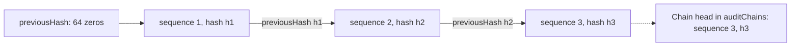

An audit log is only useful as evidence if nobody can quietly change it. Someone with database access could
delete the record of what they did, or edit a denial into an approval. Better IAM makes that detectable: every
tenant's audit log is an <Term id="audit-chain">audit chain</Term>, a hash chain where each event carries the hash
of the one before it. Changing, reordering, or removing a stored event breaks the chain, and verification says
exactly where.

This page explains how the chain works, how to verify it, how to keep an independent copy, and how to delete old
events without breaking verification.

## How the chain works



Each event carries three chain fields:

- `sequence`: its position in the tenant's chain, from 1.
- `previousHash`: the hash of the previous event, or sixty-four zeros for the first.
- `hash`: SHA-256 over the canonical JSON of the event without `hash`. Canonical JSON sorts object keys
  recursively and omits `undefined` values; `canonicalJson` from `better-iam/core` produces it.

The chain head per tenant (the last sequence and hash) is stored in `auditChains` and advanced inside the
transaction that records the event. Every writer goes through the same append: provisioning operations, denials,
authentication events, SCIM provisioning, the OAuth provider, and deployment operations.

Events recorded by versions without the chain are chained once, in timestamp order per tenant, the next time
`initialize()` runs. On very large logs, run that first `initialize()` after upgrading during a maintenance
window, because it backfills in one transaction.

<Callout type="warn" title="What the chain proves">
  A chain proves that stored events were not altered, reordered, or removed after the fact by anyone without write
  access to both the events and the chain head. It does not stop someone with full database access from
  rewriting both. Export regularly to independent storage and compare heads.
</Callout>

## Verify

Verification recomputes the chain from storage and reports the first place it breaks. Run it on a schedule, and
before you rely on the log as evidence.

<Tabs items={['API', 'CLI']}>
<Tab value="API">

```ts
const status = await iam.api.audit.verify(credential, { tenantId });
if (!status.valid) alert(`Audit chain broken at ${status.failure?.sequence}: ${status.failure?.reason}`);
// { valid, checked, unchained, first, last, lastHash, head, failure? }
```

</Tab>
<Tab value="CLI">

```sh
better-iam audit-verify --config better-iam.config.mjs --tenant TENANT_ID
```

</Tab>
</Tabs>

`audit.verify({ tenantId, fromSequence?, toSequence? })` (`iam:audit:read`) walks the stored events and checks
contiguous sequences, linked hashes, recomputable hashes, and, for a full verification, a chain head equal to the
last event. With `fromSequence` or `toSequence` it verifies that window against its own links.

The result counts the events it `checked` and the `unchained` ones (recorded before the chain existed and not
yet backfilled, never counted as failures), names the `first` and `last` sequence and the `lastHash`, and
returns the stored `head`. When verification fails, `failure` names the sequence, the event ID, and the reason:

| Reason                   | Meaning                                                                                  |
| ------------------------ | ---------------------------------------------------------------------------------------- |
| `sequence-gap`           | A sequence number is missing: an event was deleted from the middle of the chain.         |
| `previous-hash-mismatch` | An event does not link to the one before it: events were removed or reordered.          |
| `hash-mismatch`          | An event's content no longer matches its hash: it was edited.                            |
| `head-mismatch`          | The last stored event is not the recorded chain head: events were removed from the end.  |

The CLI `audit-verify` does the same straight from storage as a deployment operation: it needs no credential,
records no audit event, and exits non-zero (`AUDIT_CHAIN_BROKEN`) when the chain does not verify.

## Export

Export copies the chain out of the database, so a copy exists that a database administrator cannot rewrite.

```ts title="Page through the chain"
let from = 1;
for (;;) {
  const page = await iam.api.audit.export(credential, { tenantId, fromSequence: from, limit: 5000 });
  await archive.append(page.body); // JSON Lines in sequence order, without a trailing newline
  if (!page.nextSequence) break;
  from = page.nextSequence;
}
```

`audit.export({ tenantId, fromSequence?, limit? })` (`iam:audit:read`) returns chained events in sequence order as
JSON Lines (`body`), with `count`, `firstSequence`, `lastSequence`, `nextSequence` for the following page, and the
current `head`. `limit` is 1 to 10 000 (1000 by default). Archive pages as they are.

The CLI `audit-export --tenant ID --output audit.jsonl` writes the whole chain to a new file (it refuses to
overwrite one), also without a credential or an audit event.

### Verify an archive anywhere

`verifyAuditChain(events, { previousHash?, head? })`, exported by `better-iam` and `@better-iam/core`, verifies
events outside the server. It uses Web Crypto, so it runs in browsers and workers too. Pass the last hash of the
previous page as `previousHash` so pages link, and a known `head` to check the end.

```ts title="Verify an exported page"
import { verifyAuditChain } from 'better-iam';

const events = page.body.split('\n').map((line) => JSON.parse(line));
const result = await verifyAuditChain(events, { previousHash: lastHashOfPreviousPage });
if (!result.valid) throw new Error(`Archive broken at ${result.failure?.sequence}`);
lastHashOfPreviousPage = result.lastHash;
```

Events are sorted by sequence first, so exports and database reads can be passed as they come. A run that starts
mid-chain without `previousHash` links from its first event's own `previousHash`.

## Continuous archiving

Exporting by hand is easy to forget. Configure `auditArchive` and schedule `iam.archiveAudit()` (CLI
`audit-archive`) every few minutes to keep an independent copy of every tenant's chain automatically.

```ts title="iam.ts"
import { createJsonlAuditArchive } from 'better-iam/server';

const iam = betterIam({
  // ...
  auditArchive: createJsonlAuditArchive({ directory: '/var/lib/better-iam/audit' }),
  // or your own sink, write-once per range:
  // auditArchive: { write: (batch) => putObjectIfAbsent(`${batch.tenantId}/${batch.fromSequence}-${batch.toSequence}`, batch) },
});
```

Each run reads every tenant's events after its archive cursor (collection `auditArchiveCursors`), in chain order
and in batches (`batchSize`, 1000 by default, up to 10 000). Each batch is checked with `verifyAuditChain`
against the previous batch's `lastHash` before it is handed to `write`.

The cursor moves only after `write` resolves. After a crash, a batch can therefore be written again, possibly
covering a longer range. A sink must:

- key stored batches by `tenantId`, `fromSequence`, and `toSequence`;
- never replace a stored batch with different content, and throw instead.

<TypeTable
  type={{
    write: {
      type: '(batch: AuditArchiveBatch) => Promise<void>',
      description: 'Stores one verified batch ({ tenantId, fromSequence, toSequence, previousHash, lastHash, events }) durably and resolves only when it is safe.',
      required: true,
    },
    batchSize: { type: 'number', description: 'Events per batch, 1 to 10 000.', default: '1000' },
    leaseMs: {
      type: 'number',
      description: 'How long one run may hold a tenant before another may take it over, one minute to one hour. Keep it well above the slowest write.',
      default: '600000 (10 minutes)',
    },
  }}
/>

One run at a time holds a tenant: a lease on its cursor that the run renews before each batch. A second run skips
the tenant and lists it under `busy`, so overlapping schedules or instances never race each other's batches.

`archiveAudit({ tenantId?, limit? })` archives at most `limit` events per run (100 000 by default) and returns:

- `archived` per tenant and the number of `batches`;
- `failed`: a chain that does not verify (for example an edited row) with `AUDIT_CHAIN_BROKEN`, a failing sink
  with `ARCHIVE_WRITE_FAILED`, or a batch that conflicts with a stored one with `ARCHIVE_CONFLICT`. Nothing past a
  failure is archived, and the CLI exits non-zero (`AUDIT_ARCHIVE_FAILED`);
- `gaps`: sequences deleted before they were archived;
- `busy` tenants and `truncated` when the run stopped at its limit.

Without `auditArchive`, `archiveAudit` fails with `NO_AUDIT_ARCHIVE`.

### The file archive

`createJsonlAuditArchive` writes one file per batch, `{tenantId}/{fromSequence}-{toSequence}.jsonl` with
zero-padded sequences, so files sort in chain order. Files are write-once: each is written under a unique
temporary name, flushed, and published with a hard link that never replaces an existing file, and the directory
is flushed too (not possible on Windows). Writing the same batch again is accepted; different events under an
existing name are refused with `ARCHIVE_CONFLICT`, so a restored or tampered database cannot overwrite archived
events. After a crash, files can overlap; read them by `sequence`.

`better-iam audit-verify-archive --directory DIR --tenant ID` checks one tenant's archive on its own, without the
database. It verifies that overlapping copies agree, that no sequence is missing, and that every hash and link
recomputes, and exits non-zero (`AUDIT_ARCHIVE_INVALID`) otherwise.

## Prune with checkpoints

Audit logs grow forever unless you delete old events, but deleting from the start of a chain would normally break
verification. Pruning leaves a checkpoint instead.

<Tabs items={['API', 'CLI']}>
<Tab value="API">

```ts
const result = await iam.pruneAudit({ tenantId, retentionMs: 365 * 86400_000 });
// { deleted, prunedThroughSequence, prunedThroughHash, heldForArchive? }
```

</Tab>
<Tab value="CLI">

```sh
better-iam audit-prune --config better-iam.config.mjs --tenant TENANT_ID --retention-days 365
```

</Tab>
</Tabs>

`iam.pruneAudit({ tenantId, retentionMs })` (CLI `audit-prune`, `--retention-days` 365 by default) deletes the
longest prefix of a tenant's chain older than the cutoff and appends an `audit:prune` checkpoint. Its metadata
records the deleted count and the sequence and hash the chain now starts after (`prunedThroughSequence`,
`prunedThroughHash`). Verification keeps working from the checkpoint because a run may start mid-chain, and the
archive you exported before pruning still links to it through `previousHash`. It is a deployment operation with
no credential.

<Callout type="info" title="Pruning never outruns the archive">
  Once a tenant has an archive cursor, or wherever `auditArchive` is set, `pruneAudit` deletes only events the
  archive already holds. This holds in every process, including ones without the option. It reports
  `heldForArchive: true` when it stopped early, so the database never drops an event the archive lacks.
</Callout>

A retention routine for one tenant:

<Steps>
<Step>

### Archive

Run `audit-archive` every few minutes, or export pages with `audit.export` to independent storage.

</Step>
<Step>

### Verify

Verify the stored chain with `audit-verify` and the archive with `audit-verify-archive` or `verifyAuditChain`,
and compare heads.

</Step>
<Step>

### Prune

Run `audit-prune` with your retention period. `doctor` reports `audit-archive-behind` when a tenant has
unarchived events older than a day.

</Step>
</Steps>

<Cards>
  <Card title="audit API reference" href="/docs/reference/api/audit">
    list, verify, and export.
  </Card>
  <Card title="Background jobs" href="/docs/operations/jobs">
    Scheduling archive and prune runs.
  </Card>
</Cards>
