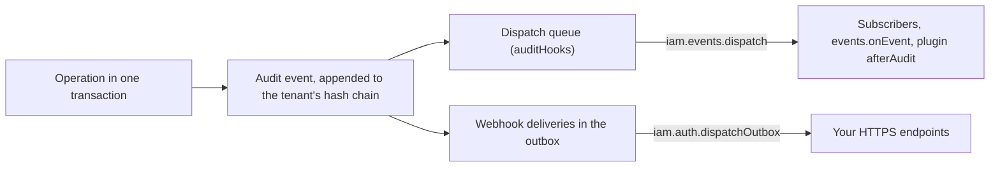

import { Link2, ListTree, Webhook } from 'lucide-react';

Your application and your security team both need to know when access changes. The application may sync a new
member to a billing system or invalidate a cache when a role changes; the security team wants every administrator
elevation in its SIEM and an alert on repeated failed sign-ins. And auditors want a record of all of it that
nobody can quietly edit.

Better IAM serves all three from one source: the audit log. Every audit record is also an event you can react to.
Each of these produces one audit record inside the transaction that made the change: provisioning operations,
authentication events (`auth:session:create`, `auth:mfa:enable`, and so on), denials, root overrides, invitation
redemptions, access-request decisions, and deployment operations.

The record is appended to the tenant's tamper-evident <Term id="audit-chain">audit chain</Term> and fanned out in
that same transaction. So nothing is emitted for a change that rolled back, and nothing committed is lost.

You can consume events three ways:

- **In-process subscribers** run your code in the application for matching events. Use them to update caches,
  metrics, or other systems in the same codebase.
- **<Term id="webhook">Webhooks</Term>** send signed HTTPS requests to an endpoint. Use them for SIEMs, alerting,
  and services outside your application.
- **The audit log** answers questions after the fact, such as "who changed this role last week?".



There is one deliberate exception to "nothing is emitted for a change that rolled back". `auth:signin:fail`
records a wrong password, factor, or recovery code presented for a real account. The refused sign-in rolled back,
so the event is appended in a transaction of its own, with `metadata.reason`, `metadata.ip`, and
`metadata.userAgent`. That makes it a good subscription for brute-force alerting.

## The event

Every event has the same shape, whichever way you receive it:

<TypeTable
  type={{
    id: { type: 'string', description: 'The event ID. Stable across redeliveries: deduplicate on it.', required: true },
    tenantId: { type: 'string', description: 'The tenant whose log the event belongs to.', required: true },
    action: {
      type: 'string',
      description: 'The event type, such as iam:identities:create, auth:session:create, or binding:activate. Webhooks call it type.',
      required: true,
    },
    actorId: {
      type: 'string',
      description: 'Who acted: an identity ID, or deployment-operator for scheduler jobs. During impersonation, the member.',
      required: true,
    },
    originalActorId: {
      type: 'string',
      description: 'The source identity behind an assumed-role session, so actions taken in a role trace back to a person.',
    },
    impersonatorId: {
      type: 'string',
      description: 'The administrator behind a "view as" (impersonation) session, while actorId stays the member.',
    },
    resourceId: {
      type: 'string',
      description: 'What the event is about, such as the identity, binding, or tenant ID.',
      required: true,
    },
    outcome: {
      type: "'allow' | 'deny'",
      description: 'Whether the operation was allowed. Lifecycle events that report a problem also use deny.',
      required: true,
    },
    rootOverride: {
      type: 'boolean',
      description: 'Set when only the root administrator override allowed it, which deserves a closer look.',
    },
    timestamp: { type: 'number', description: 'Epoch milliseconds.', required: true },
    metadata: {
      type: 'Record<string, Json>',
      description: 'What the operation recorded, such as the justification of an activation.',
    },
    sessionContext: {
      type: 'AuditSessionContext',
      description: 'Which session the actor used: its sessionId and kind, plus the role, trust, or web-identity details behind a temporary credential. Never hashes, policies, or tokens.',
    },
    sequence: { type: 'number', description: "The event's position in the tenant's audit chain, from 1." },
    previousHash: { type: 'string', description: 'The hash of the previous event in the chain.' },
    hash: { type: 'string', description: 'SHA-256 over the canonical JSON of the event without hash.' },
  }}
/>

Audit records omit passwords, keys, and token bodies, so nothing that consumes events ever receives them. The
[audit chain](/docs/guides/events/audit-chain) page explains `sequence`, `previousHash`, and `hash`, and the
[lifecycle events](/docs/guides/events/lifecycle-events) page lists the metadata of the access lifecycle events.

## In-process subscribers

When the reaction lives in your own codebase, subscribe to events directly instead of running a webhook endpoint.
`iam.events.subscribe(patterns, handler)` registers a handler for events whose action matches any of the patterns
and returns a function that unsubscribes it:

```ts title="worker.ts"
const stop = iam.events.subscribe(['iam:identities:*', 'access-request:*'], async (event) => {
  await metrics.count(event.action, { tenant: event.tenantId, outcome: event.outcome });
});

// Later
stop();
```

- Patterns use the policy glob syntax (`*` and `?`) and may be a single string or a list.
- The `events.onEvent` option receives every event, for a single catch-all handler configured with the instance.
- Plugin `afterAudit` hooks share the same queue, so plugins react to events the same way.

### Dispatch

Handlers do not run inside the request that caused the event. If they did, a slow or failing handler could delay
or break the operation that already committed. Instead the event is queued, and a dispatcher delivers it.

Call `iam.events.dispatch()` (the same function as `iam.dispatchAuditHooks()`) from your worker schedule, next to
`iam.auth.dispatchOutbox()`, which delivers emails and webhooks. It runs the queued events through every handler
and returns `{ dispatched }`.

```ts title="worker.ts"
setInterval(async () => {
  await iam.events.dispatch();
  await iam.auth.dispatchOutbox();
}, 60_000);
```

- Dispatch is at least once. A handler that throws leaves its row queued for the next run, so handlers must be
  idempotent by `event.id`.
- Subscribers live in memory, so dispatch in the process that registers them. The CLI `outbox` command serves
  only plugins and `events.onEvent`.
- `doctor` reports audit hooks that have waited more than 15 minutes, a sign that nothing is dispatching.

Framework integrations wrap this. In NestJS, `@OnIamEvent('identity:*')` subscribes a provider method, and
`dispatchIntervalMs` runs dispatch inside the app on a timer; for multi-instance deployments, dispatch from a
single worker. See [NestJS](/docs/frameworks/nestjs) and [background jobs](/docs/operations/jobs).

## Query the audit log

For questions after the fact, such as a member's activation history or last week's denials, read the log.
`audit.list` (`iam:audit:read`) returns a tenant's events newest first, filtered as you need:

```ts
const denials = await iam.api.audit.list(credential, {
  tenantId,
  action: 'iam:bindings:*', // exact name or glob
  outcome: 'deny',
  from: Date.now() - 7 * 86400_000,
  limit: 100,
});
```

`limit` is 1 to 1000 (100 by default) with an `offset`. `action` accepts an exact name or a glob pattern;
`actorId`, `resourceId`, and `outcome` match exactly; `from` and `to` bound the timestamp.

## Where to go next

<Cards>
  <Card icon={<Webhook />} title="Webhooks" href="/docs/guides/events/webhooks">
    Signed HTTPS deliveries with filters, retries, and redelivery.
  </Card>
  <Card icon={<ListTree />} title="Lifecycle events" href="/docs/guides/events/lifecycle-events">
    Every binding, identity, package, invariant, and configuration event with its metadata.
  </Card>
  <Card icon={<Link2 />} title="Audit chain" href="/docs/guides/events/audit-chain">
    The tamper-evident hash chain: verify, export, archive, and prune.
  </Card>
</Cards>
