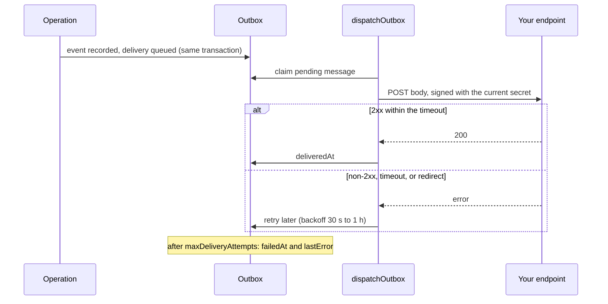

Security tools, alerting, and other services need to hear about access changes as they happen, and they usually
live outside your application. Polling the audit log is slow and wasteful; a callback that can be lost or forged
is worse.

A <Term id="webhook">webhook</Term> subscription sends a tenant's audit events to an HTTPS endpoint: a SIEM, an
alerting channel, a ticketing system, or your own service. Each delivery is:

- queued in the same transaction as the event, so it cannot be lost;
- signed, so the receiver can prove it came from Better IAM;
- retried with backoff until the endpoint accepts it (25 attempts by default).

## Create a subscription

`webhooks.create` subscribes an endpoint to the events whose action matches your patterns. It returns the
subscription (`webhook`) and its signing `secret`, which your endpoint needs to verify deliveries:

```ts title="A SIEM feed"
const { webhook, secret } = await iam.api.webhooks.create(credential, {
  tenantId,
  url: 'https://hooks.example.com/iam',
  events: ['iam:identities:*', 'iam:bindings:*', 'auth:session:create'],
  description: 'SIEM feed',
});
// Store `secret` now: it is returned only once.
```

<TypeTable
  type={{
    url: {
      type: 'string',
      description: 'Where to send events: an absolute HTTPS URL without credentials or fragment, stored as given. HTTP is accepted only for loopback development installations.',
      required: true,
    },
    events: {
      type: 'string[]',
      description: 'Which events to send: 1 to 50 action patterns using the policy glob syntax (* and ?), such as binding:* or iam:identities:*.',
      required: true,
    },
    description: {
      type: 'string',
      description: 'What the subscription is for, such as "SIEM feed", so the next administrator knows. Up to 512 characters.',
    },
    outcomes: {
      type: "('allow' | 'deny')[]",
      description: 'Send only events with these outcomes, for example only denials for a security feed.',
    },
    resources: {
      type: 'string[]',
      description: "Send only events whose resourceId matches one of these 1 to 20 glob patterns (up to 256 characters each), for example iam/*.",
    },
    scope: {
      type: "'tenant' | 'subtree'",
      description: "subtree also receives the events of every descendant tenant, for a platform-wide feed. Root administrators only.",
      default: "'tenant'",
    },
  }}
/>

- `iam:webhooks:create`, `read`, `update`, and `delete` gate the API group. Creating, updating, rotating, and
  deleting require recent authentication.
- A subscription belongs to one tenant and receives that tenant's events. Root administrators may create a
  subscription with `scope: 'subtree'` on any tenant to receive its descendants' events as well. Ordinary
  administrators cannot, because parent membership grants nothing in child tenants.
- A tenant holds at most 50 subscriptions (`LIMIT_EXCEEDED`), and a plan limit on webhooks can lower that.

### Filters

Endpoints should receive only what they act on; a security feed that gets every sign-in is noise. Action patterns
choose which events a subscription wants, and `outcomes` and `resources` narrow it further:

```ts title="Only denials on IAM resources"
const { webhook } = await iam.api.webhooks.create(credential, {
  tenantId,
  url: 'https://siem.example.com/iam',
  events: ['*'],
  outcomes: ['deny'],
  resources: ['iam/*'],
});
```

Useful subscriptions: `binding:*` to alert on elevation, `invariant:*` for broken guardrails, `package:auto-*` for
package rules, and `auth:signin:fail` for brute-force attempts. The
[lifecycle events](/docs/guides/events/lifecycle-events) page explains each.

### Manage subscriptions

| Call                                                            | Permission             | What it does, and when to use it                                                                          |
| --------------------------------------------------------------- | ---------------------- | --------------------------------------------------------------------------------------------------------- |
| [`webhooks.list`](/docs/reference/api/webhooks#list), [`get`](/docs/reference/api/webhooks#get) | `iam:webhooks:read`    | Return subscriptions without their secret, for a settings page.                                         |
| [`webhooks.update`](/docs/reference/api/webhooks#update)        | `iam:webhooks:update`  | Change the URL, event patterns, description, filters, or `active` flag; `null` clears `outcomes`, `resources`, or the description. Set `active: false` to pause during endpoint maintenance: a paused subscription drops its pending deliveries rather than piling them up. |
| [`webhooks.rotateSecret`](/docs/reference/api/webhooks#rotatesecret) | `iam:webhooks:update` | Issue a new signing secret, returned once. Use it on a schedule or when a secret may have leaked.       |
| [`webhooks.ping`](/docs/reference/api/webhooks#ping)            | `iam:webhooks:update`  | Queue a synthetic `webhook:ping` event, to test a new endpoint end to end before real events arrive.     |
| [`webhooks.listDeliveries`](/docs/reference/api/webhooks#listdeliveries) | `iam:webhooks:read` | Return the newest deliveries (100 by default, at most 1000) with their status, to debug a failing endpoint. |
| [`webhooks.redeliver`](/docs/reference/api/webhooks#redeliver)  | `iam:webhooks:update`  | Queue the event behind an earlier delivery again, after an outage or to replay an event.                 |
| [`webhooks.delete`](/docs/reference/api/webhooks#delete)        | `iam:webhooks:delete`  | Remove the subscription and its pending deliveries.                                                      |

## Delivery

A delivery must survive a crash between the change and the HTTP call, so it is not sent from the request.
Deliveries travel through the encrypted, transactional <Term id="outbox">delivery outbox</Term> as
`kind: 'webhook'` messages. They are written in the same transaction as the event and sent afterwards by
`iam.auth.dispatchOutbox()` (CLI `outbox`). Schedule it from your worker, every minute for example.



The built-in transport POSTs the JSON body with these headers:

| Header                   | Value                                                          |
| ------------------------ | -------------------------------------------------------------- |
| `Content-Type`           | `application/json`                                             |
| `User-Agent`             | `better-iam-webhooks/1`                                        |
| `X-Better-IAM-Event`     | The event type (audit action), for example `iam:groups:create` |
| `X-Better-IAM-Delivery`  | The outbox message ID; deduplicate on it                       |
| `X-Better-IAM-Webhook`   | The subscription ID                                            |
| `X-Better-IAM-Timestamp` | Unix seconds at signing time                                   |
| `X-Better-IAM-Signature` | `v1=` followed by hex HMAC-SHA256 of `${timestamp}.${body}`    |

The body:

```json title="Webhook body"
{
  "id": "...",
  "type": "binding:activate",
  "tenantId": "...",
  "actorId": "...",
  "resourceId": "...",
  "outcome": "allow",
  "timestamp": 1790000000000,
  "metadata": { "activationId": "...", "roleId": "...", "expiresAt": 1790003600000, "justification": "INC-4211" },
  "sequence": 1842,
  "hash": "9f2c..."
}
```

Its fields are `id`, `type` (the audit action), `tenantId`, `actorId`, `resourceId`, `outcome`, and `timestamp`,
plus `originalActorId`, `impersonatorId`, `rootOverride`, `metadata`, `sessionContext`, `sequence`, and `hash` when
present. `impersonatorId` names the administrator behind an <Term id="impersonation">impersonation</Term> ("view
as") session while `actorId` stays the member. `sessionContext` says which session acted (its ID and kind, and the
role or trust behind a temporary credential). `sequence` and `hash` locate the event in the tenant's
<Term id="audit-chain">audit chain</Term>, so a consumer can detect gaps and verify what it stored. See
[audit chain](/docs/guides/events/audit-chain).

### Retries

Endpoints go down for deploys and outages. Retries mean a short outage loses nothing:

- A non-2xx response or a timeout (`events.webhookTimeoutMs`, ten seconds by default) counts as a failed attempt.
  Redirects are never followed.
- Failed messages retry with exponential backoff starting at thirty seconds and capped at one hour.
- After `authentication.maxDeliveryAttempts` (25 by default) the message is abandoned with `failedAt` and
  `lastError` set.
- Delivery is at least once. Endpoints must deduplicate, by the event `id` or the delivery header.

### Custom transport

Some deployments cannot make outbound HTTP calls from the worker, or want deliveries on their own queue with its
own retry policy. Supply `events.deliverWebhook` to replace the built-in HTTP transport. It receives
`{ id, tenantId, webhookId, url, event, body, headers }` with the signature already computed, and must throw to
signal failure so the outbox retries. `events.webhookTimeoutMs` sets the built-in transport's timeout.

```ts title="iam.ts"
const iam = betterIam({
  // ...
  events: {
    webhookTimeoutMs: 5_000,
    async deliverWebhook(delivery) {
      await queue.send({ url: delivery.url, body: delivery.body, headers: delivery.headers });
    },
  },
});
```

## Verify deliveries

Your endpoint URL is not a secret, so anyone could POST a fake "role granted" event to it. Every delivery is
therefore signed with the subscription's secret, and the timestamp is part of the signature so an old delivery
cannot be replayed later. `verifyWebhookSignature` from `better-iam` checks both; reject any request it refuses.

The signing secret is returned once by `create` and `rotateSecret`; only its sealed form is stored. Pending
deliveries are signed with the secret current at delivery time, so a rotation applies to messages still in the
queue.

```ts title="app/api/iam-webhook/route.ts"
import { verifyWebhookSignature } from 'better-iam';

export async function POST(request: Request) {
  const body = await request.text();
  const valid = verifyWebhookSignature({
    secret: process.env.IAM_WEBHOOK_SECRET!,
    timestamp: request.headers.get('x-better-iam-timestamp')!,
    body,
    signature: request.headers.get('x-better-iam-signature')!,
  });
  if (!valid) return new Response('invalid signature', { status: 401 });
  const event = JSON.parse(body);
  await handleOnce(event.id, event); // deduplicate: delivery is at least once
  return new Response(null, { status: 204 });
}
```

Verification uses a constant-time comparison and rejects timestamps more than five minutes from the current time
by default (`toleranceSeconds`). Verify the raw body exactly as received, before parsing it.

Next.js applications can use `createWebhookHandler({ secret, onEvent })` from `better-iam/next/edge` instead. It
verifies against every configured secret (so you can list the new and the previous one while rotating), rejects
stale timestamps and bodies over 1 MiB before parsing, and answers 500 when `onEvent` throws so the delivery is
retried. See [Next.js](/docs/frameworks/nextjs).

## Delivery history and redelivery

When an endpoint was down longer than the retries last, or a bug dropped events on the receiving side, you need
to see what failed and send it again:

```ts title="After an endpoint outage"
const history = await iam.api.webhooks.listDeliveries(credential, { tenantId, webhookId: webhook.id });
for (const delivery of history.filter((item) => item.status === 'failed'))
  await iam.api.webhooks.redeliver(credential, {
    tenantId,
    webhookId: webhook.id,
    deliveryId: delivery.id,
  });
```

- `listDeliveries` returns the newest deliveries with attempt counts, timestamps, the last error, the audit
  `eventId` they carried, and a `pending`, `delivered`, or `failed` status. Payloads are never returned.
- `redeliver({ webhookId, deliveryId })` queues the event behind an earlier delivery again, rebuilt from the
  audit record and signed with the subscription's current secret at delivery time. Use it after an endpoint
  outage abandoned deliveries, or to replay an event. Endpoints must still deduplicate by event `id`.
- `ping` and `redeliver` refuse a paused subscription (`INVALID_TRANSITION`). Redelivery fails with `NOT_FOUND`
  once the audit event was pruned.
- The retention sweep deletes delivered and abandoned messages older than `deliveryRetentionMs` (30 days by
  default), which also bounds the delivery history and what can be redelivered.

## What webhooks carry

Webhook endpoints receive audit metadata only: identifiers, action names, outcomes, and the metadata a mutation
recorded. Tokens, secrets, and passwords never appear in audit records and therefore never reach a webhook. The
deployment `secret` seals the signing secrets and undelivered payloads; rotating it re-seals them (see
[secrets](/docs/operations/deployment/secrets)).

<Cards>
  <Card title="webhooks API reference" href="/docs/reference/api/webhooks">
    Every method with its HTTP route.
  </Card>
  <Card title="Lifecycle events" href="/docs/guides/events/lifecycle-events">
    Events worth subscribing to, with their metadata.
  </Card>
</Cards>
