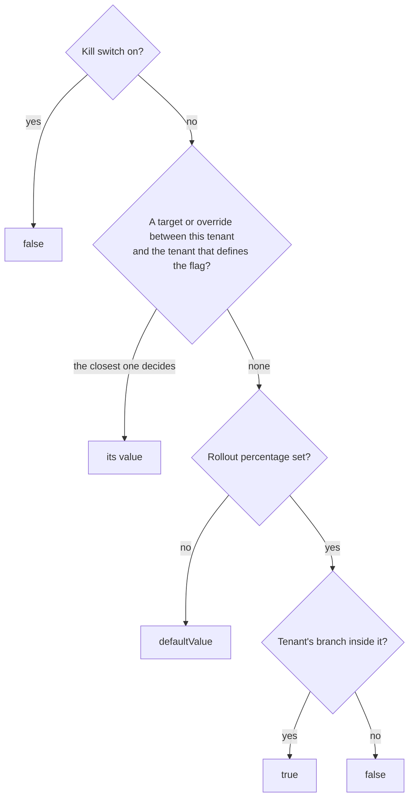

A new feature rarely reaches every customer on the same day. You want to try it with a design partner first, roll it
out to a quarter of your customers, let each organization opt in to a beta, and switch it off everywhere in seconds
when something goes wrong, all without a deploy. Feature flags do that, and because they live in Better IAM next to
your organizations, a flag can decide what the UI shows and what authorization allows with the same switch.

Every flag is a boolean, and flags work at two levels:

- **Platform flags** are defined on the root tenant by root administrators (or anyone the root tenant grants
  `iam:features:manage`). They reach every organization and project.
- **Organization flags** are defined by an organization (or a project) for its own subtree, for example to roll a
  feature out to some of its projects, or to let each project choose.

## How a value is decided

A flag's value for a tenant comes from the first of four rules that applies:



1. **Kill switch.** `killSwitch: true` turns the flag off everywhere. Targets and overrides stay stored and apply
   again when the switch is lifted.
2. **The closest target or override.** Walking from the tenant up to (but not including) the tenant that defines the
   flag, the first tenant with a value decides:
   - A **target** is a value the flag's managers pin for a tenant below them with `features.setTarget`, such as "on
     for Acme until the end of the trial". It applies to that tenant and everything below it, unless a closer target
     or override decides, and it can lapse (`expiresAt`).
   - An **override** is a tenant's own choice with `features.setOverride`, allowed only for flags defined with
     `tenantOverridable: true`. On the same tenant, the tenant's override beats an unlocked target. Overrides are
     refused for internal flags and on the tenant that defines the flag (change the flag itself there with
     `features.update`). Withdrawing a choice with `value: null` is always allowed, even while locked.
   - A **locked** target (`locked: true`) silences overrides at its tenant and below, so an organization cannot undo
     it. A closer target from the flag's own managers still wins over it.
3. **Rollout.** `rolloutPercentage` (0 to 100) turns an off-by-default flag on for a stable share of the branches
   directly below the defining tenant, and off for the rest. For a platform flag those branches are organizations, so
   an organization's projects always land on the same side as the organization. Raising the percentage only adds
   tenants; nobody who had the feature loses it. `rolloutBucket(key, tenantId)` from `@better-iam/server` shows where
   a tenant falls.
4. **Default.** When no rollout is set, `defaultValue`.

A flag with a rollout must default to off (`defaultValue: false`), because the rollout is the share that is turned
on.

**Keys belong to the tenant closest to the root.** A tenant cannot define a key an ancestor already defines, and a
platform flag created later takes precedence over an organization flag with the same key (`features.list` shows the
organization's flag as `shadowed`). So an organization can never switch a platform-gated feature on for itself. Keys
start with a lowercase letter and join lowercase letters and digits with single `-`, `_`, or `.` characters
(`new-billing`, `reports.v2`; not `1st`, `a--b`, or `trailing-`), up to 64 characters, with at most 200 flags per
tenant.

## Managing flags

```ts
const root = { token: rootSessionToken };

// A platform flag that organizations may turn on for themselves.
await iam.api.features.create(root, {
  tenantId: rootTenantId,
  key: 'new-billing',
  description: 'The redesigned billing pages',
  tenantOverridable: true,
});

// A two-week trial for one organization.
await iam.api.features.setTarget(root, {
  tenantId: rootTenantId,
  key: 'fast-search',
  targetTenantId: acmeId,
  value: true,
  expiresAt: Date.now() + 14 * 86_400_000,
  note: 'Design partner trial',
});

// A gradual rollout to a quarter of all organizations.
await iam.api.features.update(root, { tenantId: rootTenantId, key: 'reports-v2', rolloutPercentage: 25 });

// Acme's administrators opt in to the new billing pages.
await iam.api.features.setOverride(acmeAdmin, { tenantId: acmeId, key: 'new-billing', value: true });

// Incident: off everywhere, now.
await iam.api.features.update(root, { tenantId: rootTenantId, key: 'fast-search', killSwitch: true });
```

Each flag is the resource `iam/features/{key}` (`features.list` uses `iam/features`), so a policy can delegate one
flag: for example `iam:features:override` on `iam/features/new-*` for a product team. Targets are set and listed in
the defining tenant; an override is authorized in the tenant making the choice. Every change is audited (`feature:create`,
`feature:update` with the settings before and after, `feature:delete`, `feature:target`, `feature:override`) and
reaches webhooks like any audit event. The [API reference](/docs/reference/api/features) describes every method.

**Internal flags** (`internal: true`) are for trusted server code and policies only. They are hidden from
`features.evaluate` and from the `features.list` of tenants below the defining one (root administrators still see
them). Targets can reach them, but tenants cannot override them, so `tenantOverridable` is refused for them.

Target notes are for the flag's managers (`features.listTargets`). An organization sees that a target exists, its
value, whether it is locked, and when it ends, but never the note.

## Reading flags in your application

On the server, deployment code reads flags without a credential, internal flags included:

```ts
if (await iam.features.isEnabled(tenantId, 'new-billing')) showNewBilling();
const values = await iam.features.values(tenantId); // { 'new-billing': true, ... }
const [detail] = await iam.features.evaluate(tenantId, { keys: ['new-billing'] });
// { key, value, reason: 'OVERRIDE', scope: 'platform', definedBy, decidedBy, locked, overridable }
```

From a browser or another service, `features.evaluate` needs only a credential of the tenant: a user session, an API
key, a role session, or a session token whose tenant it is (root administrators may evaluate any tenant). It is not
audited and leaves out ancestors' internal flags:

```ts
const { flags } = await client.features.evaluate({ tenantId });
```

In React:

```tsx
import { useFeatureFlag, useFeatureFlags } from 'better-iam/react';

function Billing({ tenantId }: { tenantId: string }) {
  const { value } = useFeatureFlag({ tenantId, key: 'new-billing' });
  return value ? <NewBilling /> : <ClassicBilling />;
}
function Toolbar({ tenantId }: { tenantId: string }) {
  const features = useFeatureFlags({ tenantId });
  return features.isEnabled('fast-search') ? <FastSearch /> : null;
}
```

The hooks return `false` while loading, when signed out, and for unknown keys. Hiding a button is not enforcement, so
gate the server side as well, in code or in a policy.

## Flags in policies

Decisions see the keys of every flag that is on for the decision's tenant, internal flags included, as the list
`tenant.features`. A policy can then allow an action only where a feature is on:

```json title="Exports only where the exports feature is on"
{
  "effect": "allow",
  "actions": ["documents:export"],
  "resources": ["*"],
  "conditions": { "ArrayContains": { "tenant.features": "exports" } }
}
```

The server reads flags only for decisions whose documents name `tenant.features`, so policies that do not use flags
pay nothing. Applications cannot supply the key through `resolveContext` or plugins, because the server removes it.
Policy lint treats it as a list, so test it with `ArrayContains`, not string operators.
[`policies.test`](/docs/guides/authorization/reviews) fills it with the tenant's current flags when the candidate
document names it, and a `tenant.features` value you pass in the test's `context` takes precedence.

## In the console

- **Administration → Feature flags** (root): platform flags with their settings and kill switch, every target and
  organization choice, a form to target an organization or project (optionally locked or lapsing), and new flags.
- **Organization → Features**: the platform's flags as they apply to the organization, with **Turn on**,
  **Turn off**, and **Use default** where the platform allows a choice, plus the organization's own flags with
  per-project targets.

## Next steps

<Cards>
  <Card title="Features API" href="/docs/reference/api/features">
    Every method, permission, and error of the features group.
  </Card>
  <Card title="Conditions" href="/docs/guides/authorization/conditions">
    The operators and context keys policies can test, including lists like tenant.features.
  </Card>
</Cards>
