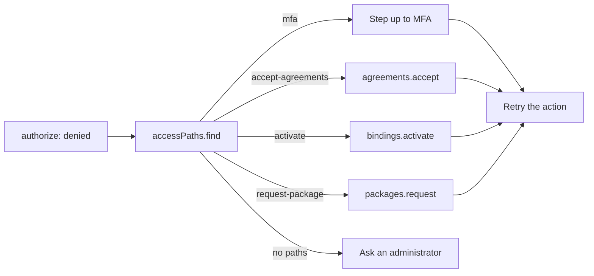

"Access denied" is a dead end. The person files a ticket, an administrator investigates, and often the answer was
something the person could have done alone: sign in with their second factor, accept the new terms, or activate a
role they are already eligible for.

_Access paths_ answer the question "how can I get access?" at the moment of the denial, with the options the
person can take on their own:

- <Term id="step-up">step up</Term> to MFA;
- accept pending <Term id="agreement">terms of use</Term>;
- activate an <Term id="eligible-binding">eligible role</Term>;
- request a requestable <Term id="access-package">access package</Term>.

Every option is verified before it is offered, so the list never promises access that would still be refused.



## Find the paths

Call `accessPaths.find` right after an authorization check fails, with the same action and resource, and turn
each path into a button or a hint:

```ts title="After a denial"
const check = await iam.authorize({ token, tenantId, action: 'documents:delete', resource });
if (!check.allowed) {
  const { paths } = await iam.api.accessPaths.find(
    { token },
    { tenantId, action: 'documents:delete', resource },
  );
  for (const path of paths) {
    if (path.kind === 'mfa') showStepUp();
    if (path.kind === 'accept-agreements') showTerms(path.agreements); // then agreements.accept
    if (path.kind === 'activate')
      offerActivation(path.bindingId, path.role, path.requireJustification); // bindings.activate
    if (path.kind === 'request-package') offerRequest(path.package); // packages.request
  }
  if (!paths.length) showAskAnAdministrator();
}
```

`accessPaths.find({ tenantId, action, resource })` returns `{ allowed, reason, paths }`. When the request is
already allowed, `paths` is empty. When it is denied, `paths` lists what the person could do alone, and an empty
list means only an administrator can help.

| Kind                | Fields                                                                                           | What the person does next                                                          |
| ------------------- | ------------------------------------------------------------------------------------------------ | ---------------------------------------------------------------------------------- |
| `mfa`               | none                                                                                             | Step up to a second factor ([MFA](/docs/guides/authentication/mfa)).              |
| `accept-agreements` | `agreements`: `id`, `name`, and `version` of each required agreement owed                         | Accept them with [`agreements.accept`](/docs/guides/governance/agreements#accept). |
| `activate`          | `bindingId`, `role`, `requireApproval`, `requireJustification`, `requireMfa`, `maxActivationMs`   | Activate the [eligible binding](/docs/guides/privileged-access/elevation#activate). |
| `request-package`   | `package` (`id`, `name`, `description`), `requireJustification`                                   | Ask for the [package](/docs/guides/privileged-access/access-packages#self-service-requests). |

The approval requirements are reported so the UI can say "your request goes to an approver" before the person
asks. `requireMfa` on an `activate` path gates the activation itself, not the grants it brings, so a person
holding a password-only session may need to step up before activating.

## How paths are verified

A suggestion that does not work is worse than none. So each candidate is applied inside a transaction that is
always rolled back, and the ordinary decision runs again; only candidates that turn the denial into an allow are
offered. Nothing is saved.

- **MFA.** The request is re-evaluated as if the session were MFA-verified.
- **Terms.** The required agreements the person owes are recorded as accepted, then removed again.
- **Eligible roles.** Each eligible binding the person holds, directly or through a group, is simulated as
  activated. It is offered only when the person also holds `iam:bindings:activate` for its role.
- **Packages.** Each requestable package is simulated as assigned. It is offered only when the person holds
  `iam:packages:request` on it.

At most 50 eligible bindings and 50 requestable packages are considered. Like `authorize`, a denial's `reason` is
always `ACCESS_DENIED`, so the call does not reveal which rule refused.

The call needs only the person's own ordinary session of the tenant. Assumed-role sessions and sessions of another
tenant are refused with `ACCESS_DENIED`, and impersonation sessions with `IMPERSONATION_RESTRICTED`. An action the
catalog does not know fails with `INVALID_ACTION`.

## In React and Vue

In a React or Vue application, the `useAccessPaths` hook runs the same call for a component, so a button can
explain how to get access instead of disappearing. It returns `allowed`, `reason`, `paths`, `status`, `error`, and
`refresh`, and takes `enabled: false` to skip loading.

```tsx title="components/delete-button.tsx"
import { useAccessPaths } from 'better-iam/react';

export function DeleteButton({ tenantId, documentId }: { tenantId: string; documentId: string }) {
  const { allowed, paths, status } = useAccessPaths({
    tenantId,
    action: 'documents:delete',
    resource: { type: 'document', id: documentId },
  });
  if (status === 'loading') return null;
  if (allowed) return <button>Delete</button>;
  if (!paths.length) return <p>Ask an administrator for access.</p>;
  return (
    <ul>
      {paths.map((path, index) => (
        <li key={index}>
          {path.kind === 'mfa' && 'Sign in with your second factor'}
          {path.kind === 'accept-agreements' && 'Accept the terms of use'}
          {path.kind === 'activate' && `Activate ${path.role.name}`}
          {path.kind === 'request-package' && `Request ${path.package.name}`}
        </li>
      ))}
    </ul>
  );
}
```

The Vue composable of the same name, from `better-iam/vue`, accepts its input as a ref or getter and returns
computed refs. See [React](/docs/frameworks/react) and [Vue](/docs/frameworks/vue).

<Callout type="info" title="Advisory, like authorize">
  Access paths are <Term id="advisory">advisory</Term>: advice for the UI. The server still calls `iam.require`
  (or `authorize`) immediately before performing the protected operation.
</Callout>

<Cards>
  <Card title="accessPaths.find" href="/docs/reference/api/access-paths#find">
    Signature and HTTP route.
  </Card>
  <Card title="Just-in-time elevation" href="/docs/guides/privileged-access/elevation">
    The eligible bindings behind activate paths.
  </Card>
</Cards>
