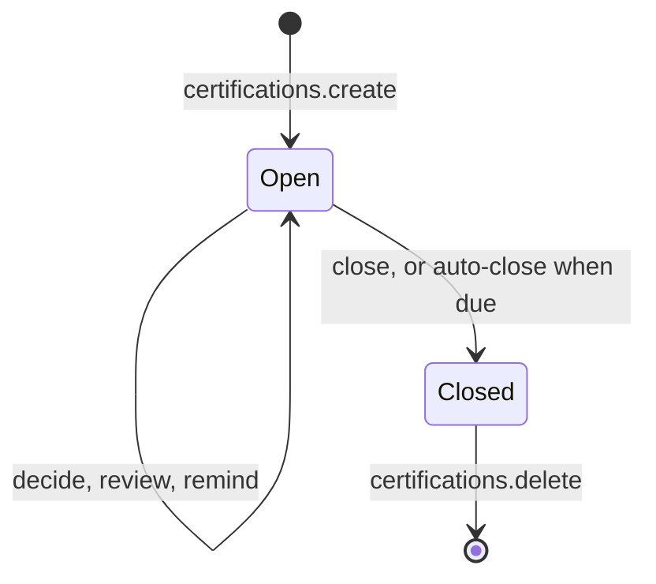

Regulations and customers often require proof that someone regularly checks who has access to what, and removes
what is no longer needed. Doing that in a spreadsheet is slow, and the decisions rarely make it back into the
system.

An access <Term id="certification">certification campaign</Term> turns the review into a recorded decision. It
takes a snapshot of the role <Term id="binding">bindings</Term> under review and asks reviewers to _keep_ or
_revoke_ each one. When it closes, it applies the result: revoked bindings are removed and every item records what
happened. Reviewers can be named people or each person's manager, recommendations put usage evidence beside every
item, and campaigns can close themselves when they are due.



## Create a campaign

Open one campaign per review cycle, such as a quarterly review of the administrator roles.
`certifications.create` opens it and needs `iam:certifications:manage`. It returns the campaign with `items`, the
number of bindings it covers.

```ts title="Quarterly review of the admin roles"
const campaign = await iam.api.certifications.create(credential, {
  tenantId,
  name: 'Q3 admin review',
  roleIds: [admin.id, billingAdmin.id],
  reviewerMode: 'manager',
  reviewerIds: [securityLead.id], // items without an active manager go here
  dueAt: Date.parse('2026-10-15T17:00:00Z'),
  autoClose: true,
  undecided: 'revoke',
});
// campaign.items: how many bindings the campaign covers
```

<TypeTable
  type={{
    name: {
      type: 'string',
      description: 'What reviewers see, such as "Q3 admin review". Up to 200 characters.',
      required: true,
    },
    roleIds: {
      type: 'string[]',
      description: 'Review only bindings of these roles, for a focused review of sensitive roles. Without it, every non-protected role is reviewed. Protected roles cannot be listed.',
    },
    subjectType: {
      type: "'identity' | 'group'",
      description: 'Review only bindings held by people, or only bindings held by groups.',
    },
    reviewerIds: {
      type: 'string[]',
      description: 'Active identities allowed to decide. When empty, anyone holding iam:certifications:review may decide.',
    },
    reviewerMode: {
      type: "'named' | 'manager'",
      description: "named sends every item to the reviewers. manager sends each person's items to their active manager, who knows their work best; the rest go to the named reviewers.",
      default: "'named'",
    },
    dueAt: {
      type: 'number',
      description: 'A future due date in epoch milliseconds. Shown to reviewers and used by auto-close.',
    },
    autoClose: {
      type: 'boolean',
      description: 'Let the deployment job close and apply the campaign once dueAt has passed, so a review cannot stay open forever. Requires dueAt.',
      default: 'false',
    },
    undecided: {
      type: "'keep' | 'revoke'",
      description: 'What closing does with items nobody decided. revoke makes silence mean removal, a stricter review.',
      default: "'keep'",
    },
  }}
/>

The campaign snapshots the live bindings of every non-protected role, or of the listed roles and subject type.
It covers at most 5000 bindings (`LIMIT_EXCEEDED` otherwise; narrow it by role or subject type). Each item records
the role, the subject, the binding's end, and whether it is eligible.

When email delivery is configured, each reviewer receives a `certification-review` email so they know they have
work. It is queued in the campaign's transaction and carries `campaignId`, `campaignName`, `items` (their own item
count), and `dueAt` when set.

## Decide

Reviewers go through their items and record keep or revoke, optionally with a note that explains the decision.
`certifications.decide` records decisions in batches of 1 to 200 items and returns how many it `recorded`:

```ts
await iam.api.certifications.decide(reviewerCredential, {
  tenantId,
  campaignId: campaign.id,
  decisions: [
    { itemId: 'item-1', decision: 'keep' },
    { itemId: 'item-2', decision: 'revoke', note: 'Moved to finance in July' },
  ],
});
```

- `decide` needs `iam:certifications:review`. When the campaign names `reviewerIds`, only they may decide.
- Nobody decides on their own access, directly or through a group (`SELF_REVIEW`), because a review of yourself is
  no review.
- A decision can be changed until the campaign closes; a closed campaign refuses decisions (`CONFLICT`).

To follow progress, `certifications.list` lists campaigns (optionally by `status`) and `certifications.get` returns
one campaign with its items. With `mine: true`, `get` leaves out items about the caller's own access, which they
may not decide. Both report `progress` (`total`, `decided`, `keep`, `revoke`) and need `iam:certifications:read`.

### Manager reviews

The best reviewer for a person's access is usually their manager. With `reviewerMode: 'manager'`, each person's
items go to their active manager (`Identity.managerId`, which SCIM can maintain). Items without one, and group
items, go to the named reviewers, or to anyone holding `iam:certifications:review` when none are named.

Managers do not need an administrator role for this:

- `certifications.listMine({ tenantId })` returns the open campaigns with items assigned to the caller, which is
  all a manager's review screen needs.
- `certifications.review({ tenantId, campaignId, decisions })` records the manager's decisions. It needs no
  certification permission, only an ordinary session of the tenant (not <Term id="impersonation">impersonation</Term>)
  and the assignment, and is audited as `certification:review`.
- Through `decide`, a manager-assigned item may be decided only by that manager or by a holder of
  `iam:certifications:manage`.
- Each reviewer is emailed once with their own item count.

### Recommendations

Reviewers approve almost everything when they have nothing to go on. Recommendations give them evidence.
`roleMining.reviewRecommendations({ tenantId, campaignId, unusedDays? })` (`iam:analysis:read`) suggests a
decision for every item, with a reason:

```ts
const { usageComplete, recommendations } = await iam.api.roleMining.reviewRecommendations(credential, {
  tenantId,
  campaignId: campaign.id,
});
// recommendations: [{ itemId, recommendation: 'keep' | 'revoke' | 'none', basis, reason, lastUsedAt }]
```

- `revoke` when the account is disabled, deleted, or expired, or when the person did not use the role within
  `unusedDays` (90 by default); `keep` when they did.
- The evidence (`basis`) is recorded [access usage](/docs/guides/governance/usage-and-mining#access-usage) once it
  covers the whole window (`usageComplete`), otherwise the person's last sign-in, or `status` for an inactive
  account.
- Group items and service accounts without usage data get `none`.

Reviewers still decide. The console's campaign page shows the suggestion and its reason next to each open item.

## Remind

Reviews stall when reviewers forget. `certifications.remind({ tenantId, campaignId })` (`iam:certifications:manage`)
emails every reviewer who still has undecided items a `certification-reminder` with their pending count, and
returns `{ reminded, pending }`. Send one a few days before `dueAt`. It needs an email delivery callback
(`DELIVERY_REQUIRED` otherwise), refuses closed campaigns, and is audited as `certification:remind`.

`renderDeliveryMessage` from `better-iam/auth/templates`, the built-in email renderer, renders both the
`certification-review` and `certification-reminder` emails. Give it a `links.certification({ tenantId, campaignId })`
function that returns your campaign page URL, and the emails get a button to it.

## Close

Closing is what makes the review count. `certifications.close({ tenantId, campaignId })`
(`iam:certifications:manage`, recent authentication) applies the campaign:

- Revoked items, and undecided ones when `undecided: 'revoke'`, are removed under the closer's
  <Term id="authority">grant authority</Term>. Each revocation is audited as `iam:bindings:delete`.
- Every item records its outcome: `kept`, `revoked`, `already-removed` (the binding was gone already), or
  `revocation-failed` (a binding a higher authority granted, left for that administrator). The result carries the
  counts per outcome.
- Enforced <Term id="invariant">invariants</Term> ([change safety](/docs/guides/governance/change-safety#access-invariants))
  guard closing a campaign like any other access change.

Closed campaigns keep their record, with every decision and outcome, as evidence for auditors.
`certifications.delete` removes a campaign and its items once you no longer need it; it only accepts closed
campaigns.

### Auto-close

A campaign with `autoClose: true` (and `dueAt`) closes itself when it is due. The deployment job
`iam.closeOverdueCertifications({ tenantId? })`, or CLI `close-certifications`, finds every due campaign and
applies it:

- Each campaign closes in its own transaction, under the creator's grant authority. Revocations the creator could
  not make, or every revocation when the creator no longer exists, are reported as `revocation-failed`.
- Each close is audited as `certification:auto-close` (with the outcome counts) by `deployment-operator`, plus one
  `iam:bindings:delete` per removed binding.
- It returns `{ closed, skipped }`, where `skipped` counts auto-closing campaigns that are not due yet. It needs no
  credential and no email transport.

```sh title="Scheduler, daily"
better-iam close-certifications --config better-iam.config.mjs
```

Enforced invariants do not guard scheduled jobs such as auto-closing campaigns; the
[invariant monitor](/docs/guides/governance/change-safety#monitor-and-alert) reports what they break.

<Cards>
  <Card title="certifications API reference" href="/docs/reference/api/certifications">
    Every method with its HTTP route.
  </Card>
  <Card title="Sharing and reviews recipes" href="/docs/guides/recipes/sharing-and-reviews">
    Copy-ready review workflows.
  </Card>
</Cards>
