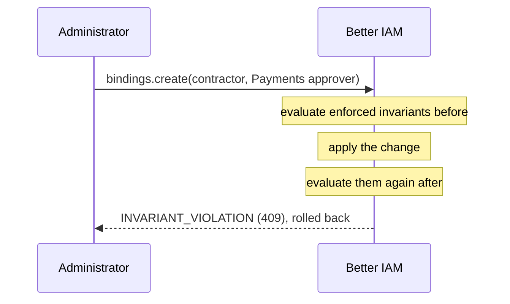

Access changes are risky because their effect is hard to see. Adding one action to a role changes access for
everyone who holds it, directly, through a group, or through a role that inherits it. Removing one can break a
team's work. And some things must never happen however roles evolve: a contractor approving payments, the on-call
team losing the ability to restart production.

Two tools make changes safe:

- An <Term id="impact-preview">impact preview</Term> answers "who gains or loses what if I make this change?"
  before you make it.
- An <Term id="invariant">access invariant</Term> writes down a line that must hold whatever roles and policies say.
  It reports when the line is crossed and, when enforced, refuses any change that would cross it.

## Impact preview

Use a preview before editing a <Term id="role">role</Term> or <Term id="policy">policy</Term> that many people
hold, or before deleting a role, to see exactly whose access changes on the resources you care about.

```ts title="Preview a role edit"
const preview = await iam.api.impact.preview(credential, {
  tenantId,
  change: { role: { roleId, permissions: ['payments:read', 'payments:approve'] } },
  resources: [{ type: 'ledger', id: 'main' }],
});
// preview.identities: who gains and loses which actions on each resource
// preview.invariants.broken: guardrails the change would break
```

`impact.preview({ tenantId, change, resources, actions?, assumeMfa? })` needs `iam:policies:simulate`. `change` is
exactly one of:

| Change                               | What it simulates                                                        | Permission it also needs |
| ------------------------------------ | ------------------------------------------------------------------------ | ------------------------ |
| `{ role: { roleId, ...update } }`    | A `roles.update`: new `permissions`, `document`, `policyIds`, or `inherits`. | `iam:roles:update`       |
| `{ policy: { policyId, document } }` | Replacing a policy's document.                                            | `iam:policies:update`    |
| `{ deleteRole: roleId }`             | Deleting the role.                                                        | `iam:roles:delete`       |

### How it works

The server makes the change the way the real call would, inside a transaction it always rolls back. The same
validation, the same permission on the item, and the same edit rights apply: a role others inherit cannot be
deleted, and a lower authority's role cannot be edited. Nothing is saved.

- **Who is evaluated.** The affected roles are the changed role, or the roles attaching the policy, plus every
  role inheriting them. Their holders are active identities with a binding to them, directly or through a live
  group membership, up to 200 (`truncated` is true when there were more).
- **What is evaluated.** Each holder is checked before and after the change against each of the 1 to 10
  `resources`, for every known action or only the `actions` you pass (up to 200). `assumeMfa` evaluates holders as
  if they had completed MFA, to see the most they could reach.
- **Everything counts.** The ordinary evaluator runs, so conditions, authority ceilings,
  <Term id="boundary">boundaries</Term>, <Term id="access-window">access windows</Term>, and just-in-time
  eligibility all count, exactly as they would in production.

The result names the affected `roles` and how many holders were `evaluated`, and lists, per holder and resource,
the actions `gained` and `lost`, with `gainedTotal` and `lostTotal`. Its `invariants` lists the
[access invariants](#access-invariants) the change would newly break (`broken`, with the new violations) or make
pass again (`fixed`).

The console's Change impact page previews role permissions, policy documents, and role deletion.

## Access invariants

Roles change all the time, and so do the people who edit them. Some rules should hold whatever anyone does:
"contractors can never approve payments", "the on-call group can always restart production". An access invariant
states such a rule as a check Better IAM can run: _these people_, _this action_, _this resource_, _must be denied_
(or _must be allowed_).

```ts title="A guardrail"
await iam.api.invariants.create(credential, {
  tenantId,
  name: 'Contractors never approve payments',
  subject: { attribute: { name: 'contractor', value: true } },
  action: 'payments:approve',
  resource: { type: 'ledger', id: 'main' },
  expect: 'deny',
  mode: 'enforce',
});
```

<TypeTable
  type={{
    name: {
      type: 'string',
      description: 'A readable statement of the rule, shown in alerts and reports. Unique per tenant, up to 100 characters.',
      required: true,
    },
    subject: {
      type: 'InvariantSubject',
      description: 'Who the rule is about. Exactly one of { identityId }, { groupId } (its live members), { attribute: { name, value } } (active identities whose attribute equals the value; the attribute must be declared in permissions.identityAttributes and the value must have its type), or { everyone: true }.',
      required: true,
    },
    action: {
      type: 'string',
      description: 'The action to check, such as payments:approve. It must exist in the catalog (INVALID_ACTION otherwise).',
      required: true,
    },
    resource: {
      type: '{ type, id }',
      description: 'The resource to check the action on. It must resolve.',
      required: true,
    },
    expect: {
      type: "'deny' | 'allow'",
      description: 'deny: nobody in the subject may be allowed (a prohibition). allow: everyone in it must be allowed (a guarantee).',
      required: true,
    },
    mode: {
      type: "'monitor' | 'enforce'",
      description: 'monitor only reports violations. enforce also refuses changes that would add violations.',
      default: "'monitor'",
    },
    assumeMfa: {
      type: 'boolean',
      description: 'Evaluate people as if they had completed MFA, the most they can reach, so a rule is not satisfied only because nobody happens to have MFA right now.',
      default: 'true',
    },
    description: { type: 'string', description: 'Why the rule exists, for the people who will read the alert. Up to 500 characters.' },
  }}
/>

The calls:

- `invariants.create` and `invariants.update` save a rule (`iam:invariants:manage`) and return it with its current
  result, so you see immediately whether it already holds.
- `invariants.run({ tenantId, invariantId? })` (`iam:invariants:read`) evaluates one or all rules against the
  current configuration with the ordinary evaluator. Each result has `passed`, the `violations` (the person and the
  decision reason), and an `error` when the rule can no longer be evaluated, for example because its group or
  resource is gone.
- `invariants.list` returns the rules with their last monitored outcome, and `invariants.delete` removes one.

A tenant holds at most 100 invariants. When running or monitoring, at most 500 people are evaluated per
invariant.

### Enforcement

A monitored rule tells you after the fact. An enforced rule (`mode: 'enforce'`) stops the change instead. It is
evaluated before and after every operation that can change access:

- role and policy edits and deletions;
- binding creation and deletion, just-in-time activation and approval;
- group membership changes, identity creation and attribute changes;
- package assignment and approval, configuration apply, access-request review;
- relationship and resource changes and deletions, boundary and authority changes, root grants;
- closing certification campaigns, publishing agreements, and `roleMining.apply`.

Enforcement evaluates every subject, not only the first 500. When the operation newly breaks a rule, or leaves it
impossible to evaluate (for example by deleting the group or resource it names), the operation is refused with
`INVARIANT_VIOLATION` (409) and its transaction rolls back.



<Callout type="info" title="Existing violations do not block unrelated work">
  Violations that already existed are reported but do not block unrelated work, so you can switch a rule to
  `enforce` while it is still broken and fix the violations at your own pace. Only changes that add violations are
  refused.
</Callout>

Changes made outside an operation are not guarded: scheduled jobs (purge, package reconciliation, auto-closing
campaigns), inbound SCIM provisioning, and members accepting agreements. The monitor below reports what they
break.

The console's Access invariants page lists rules with their status, toggles enforcement, and creates new ones.

### Monitor and alert

`iam.checkInvariants({ tenantId? })` (CLI `better-iam monitor-invariants`) is the scheduled check that tells you
when a rule starts failing. It is a deployment operation that evaluates every organization's invariants, or one
tenant's:

- It stores the outcome on each rule (`lastCheck`: `at`, `passed`, and the violating identity IDs).
- It records `invariant:broken` (with the new violators, outcome `deny`) when a rule starts failing or gains
  violators, and `invariant:restored` when it passes again, both as `deployment-operator`.
- Each change is reported once, so a webhook subscribed to `invariant:*` alerts without repeating itself.

Run it hourly, and route the events to your alerting:

```ts
await iam.api.webhooks.create(credential, {
  tenantId,
  url: 'https://alerts.example.com/iam',
  events: ['invariant:*'],
});
```

### Gate CI

`better-iam check-invariants --tenant ID --fail-on-broken` runs every rule as the `BETTER_IAM_TOKEN` holder
(`iam:invariants:read`), prints the result, and exits with `INVARIANTS_BROKEN` when any rule is broken or cannot be
evaluated. Run it after `config-apply`, so a deploy that crosses a line fails the pipeline.

```sh
BETTER_IAM_TOKEN=... better-iam config-apply --config better-iam.config.mjs --tenant TENANT_ID --input tenant.json
BETTER_IAM_TOKEN=... better-iam check-invariants --config better-iam.config.mjs --tenant TENANT_ID --fail-on-broken
```

### Invariants as code

Invariants are part of [configuration as code](/docs/guides/privileged-access/config-as-code), so they can live in
version control next to the roles they protect. In a document, the subject names groups and people portably
(`{ "group": "Contractors" }`, `{ "identity": "alice@example.com" }`). Enforced invariants are checked around the
whole apply against the rules as they were before it, so relaxing a rule and making the change it forbade take two
applies.

<Cards>
  <Card title="impact.preview" href="/docs/reference/api/impact#preview">
    Signature and result type.
  </Card>
  <Card title="invariants API reference" href="/docs/reference/api/invariants">
    create, run, update, list, and delete.
  </Card>
</Cards>
