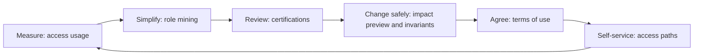

import { BadgeCheck, Clock, Pickaxe, ShieldCheck, Signature, Signpost } from '@/lib/icons';

<Term id="role">Roles</Term> and <Term id="binding">bindings</Term> say who _may_ do what on the day you set them
up. Then people change teams, projects end, roles grow, and exceptions pile up. A year later nobody can say
whether the access is still right, and auditors ask anyway.

_Governance_ is the loop that keeps access right over time. You measure which access is actually used, simplify
how it is granted, have the people who know certify it, check each change before making it, hold lines no change
may cross, get people to agree to the rules, and help them get what they need without an administrator.

## Questions and the features that answer them

Each governance feature answers one question an administrator or auditor asks. Start from the question you
have:

| Question                                        | Feature                       | API                                                    |
| ----------------------------------------------- | ----------------------------- | ------------------------------------------------------ |
| Which grants are redundant or could be simpler? | Role mining                   | `roleMining.suggest` / `apply`                         |
| Who holds access unlike their peers?            | Peer outliers                 | `roleMining.outliers`                                  |
| Which access is actually used?                  | Access usage and right-sizing | `accessUsage` option, `roleMining.usage` / `rightSize` |
| Should this person keep this role?              | Review recommendations        | `roleMining.reviewRecommendations`                     |
| What happens if I edit this role?               | Change impact preview         | `impact.preview`                                       |
| What must never (or always) be possible?        | Access invariants             | `invariants.*`, `iam.checkInvariants()`                |
| Have people accepted the rules?                 | Terms of use                  | `agreements.*`, `principal.pendingAgreements`          |
| How can I get access myself?                    | Self-service access paths     | `accessPaths.find`, `useAccessPaths`                   |

The administrator reads above each need a permission: `iam:analysis:read` (role mining, usage,
recommendations), `iam:policies:simulate` (impact), `iam:invariants:read`, or `iam:agreements:read`. Access paths
and a member's own agreements need only that person's session. The console's Organization section has a page for
each feature.

## The loop

<Steps>
<Step>

### Measure

You cannot remove unused access until you know what is used. Turn on
[access usage](/docs/guides/governance/usage-and-mining#access-usage) once and let it run for a review period.
Every allowed check is counted per person and action, so `roleMining.rightSize` can later show which grants
nobody touched.

</Step>
<Step>

### Simplify

Access granted one person at a time becomes hard to reason about. _Role mining_ reads who holds what and proposes
simpler grants: redundant bindings to remove, roles to bind to a group once, duplicate
roles, and bundles of roles to grant together as an <Term id="access-package">access package</Term>.
[Peer outliers](/docs/guides/governance/usage-and-mining#peer-outliers) show people whose access differs from
their colleagues', often access that outlived a move.

</Step>
<Step>

### Review

Auditors want proof that someone checks access regularly. A
<Term id="certification">certification campaign</Term> is that check: it asks named
reviewers, or each person's manager, to keep or revoke every role binding, and applies the decisions when it
closes. [Certifications](/docs/guides/governance/certifications) also suggest a decision for each item from usage
evidence.

</Step>
<Step>

### Change safely

A role edit can give or take access from many people at once. An
<Term id="impact-preview">impact preview</Term> shows who gains and loses what before you make the change. An
<Term id="invariant">access invariant</Term> is a rule that must hold whatever roles say, such as
"contractors never approve payments"; enforced invariants refuse any change that would break them. See
[change safety](/docs/guides/governance/change-safety).

</Step>
<Step>

### Agree

Some access should depend on people accepting rules first, such as an acceptable-use policy.
[Terms of use](/docs/guides/governance/agreements) are versioned <Term id="agreement">agreements</Term> that
members accept; an ordinary policy statement holds back access until they do.

</Step>
<Step>

### Help people help themselves

"Access denied" sends people to an administrator even when they could fix it themselves. When your application
refuses something, [access paths](/docs/guides/governance/access-paths) tell the person what they could do about
it: step up to MFA, accept terms, activate an <Term id="eligible-binding">eligible role</Term>, or request a
package.

</Step>
</Steps>

Two related tools live with authorization: <Term id="sod">separation-of-duties</Term> rules, which name roles
nobody may hold together, and the access analysis, a scan of a tenant's configuration for risky grants. See
[separation of duties](/docs/guides/authorization/separation-of-duties) and
[access reviews](/docs/guides/authorization/reviews).

## In this section

<Cards>
  <Card icon={<Pickaxe />} title="Usage and role mining" href="/docs/guides/governance/usage-and-mining">
    Record what people use, right-size roles, mine suggestions, and find peer outliers.
  </Card>
  <Card icon={<BadgeCheck />} title="Certifications" href="/docs/guides/governance/certifications">
    Campaigns, reviewer modes, reminders, recommendations, and auto-close.
  </Card>
  <Card icon={<ShieldCheck />} title="Change safety" href="/docs/guides/governance/change-safety">
    Impact previews and access invariants that refuse changes breaking a guardrail.
  </Card>
  <Card icon={<Signature />} title="Terms of use" href="/docs/guides/governance/agreements">
    Versioned agreements that members accept and policies can require.
  </Card>
  <Card icon={<Signpost />} title="Access paths" href="/docs/guides/governance/access-paths">
    Answer "how can I get access?" with options verified by simulation.
  </Card>
  <Card icon={<Clock />} title="Scheduling" href="/docs/guides/governance/scheduling">
    The jobs, CLI commands, and cadences that keep the loop running.
  </Card>
</Cards>
