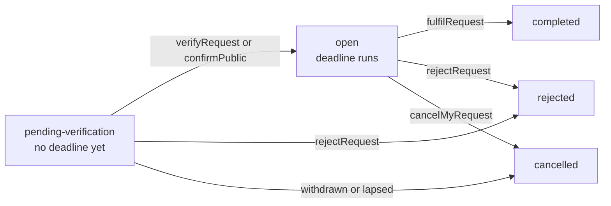

Privacy laws ask the same things of every organization that handles personal data: know why you process it, record
who agreed to what and prove it later, answer people who ask for their data (or ask you to delete it) within a legal
deadline, and never erase what a court needs kept. Those records usually live in a separate consent tool and a ticket
queue, far from the accounts they are about.

Better IAM keeps them next to the people. A tenant describes its **purposes**, each person's **consent** to them is
recorded with a signed receipt, **data-subject requests** run on the deadlines of GDPR, UK GDPR, CCPA/CPRA, LGPD and
PIPEDA, and **legal holds** stop erasure. Applications ask "may I process this purpose for this person?", and
<Term id="policy">policies</Term> see the answer as `principal.consents`.

## Purposes and legal bases

`privacy.createPurpose` (`iam:privacy:manage`) adds a purpose at version 1:

```ts
await iam.api.privacy.createPurpose(admin, {
  tenantId,
  key: 'marketing-email',
  name: 'Marketing email',
  description: 'Product news and offers by email.',
  legalBasis: 'consent',
  dataCategories: ['contact'],
  retentionDays: 730,
});
```

<TypeTable
  type={{
    key: {
      type: 'string',
      description: 'Permanent: 1 to 64 lowercase letters, digits, dots, underscores or hyphens, starting with a letter. Code and policies use it.',
      required: true,
    },
    name: { type: 'string', description: 'What people see, up to 120 characters.', required: true },
    description: {
      type: 'string',
      description: 'What is processed and why, as shown to people when they decide (up to 5000 characters).',
      required: true,
    },
    legalBasis: {
      type: "'consent' | 'legitimate-interests' | 'contract' | 'legal-obligation' | 'vital-interests' | 'public-task'",
      description: 'The lawful basis (GDPR Art. 6). Only consent and legitimate interests give people a say.',
      required: true,
    },
    mode: {
      type: "'opt-in' | 'opt-out'",
      description: 'Consent purposes only. Opt-out purposes are allowed until the person opts out (CCPA "do not sell or share").',
      default: "'opt-in'",
    },
    dataCategories: { type: 'string[]', description: 'Up to 32 lowercase identifiers such as contact or usage.' },
    retentionDays: { type: 'number', description: 'How long data for the purpose is kept (1 to 36500), for records of processing.' },
    consentLifetimeDays: {
      type: 'number',
      description: 'Consent purposes only: a grant lapses this many days after it was recorded (1 to 3650).',
    },
    reconsentOnVersion: {
      type: 'boolean',
      description: 'When a new version is published, opt-in grants for older versions stop counting.',
      default: 'true',
    },
  }}
/>

The legal basis decides who has a say, and how a missing decision is read:

| Basis                  | Who decides           | Processing is allowed                                                   |
| ---------------------- | --------------------- | ----------------------------------------------------------------------- |
| `consent`, opt-in      | The person            | Only with a recorded grant for the current version that has not lapsed. |
| `consent`, opt-out     | The person            | Until the person opts out.                                              |
| `legitimate-interests` | The person may object | Until the person objects.                                               |
| `contract`             | Nobody                | Always, unless processing is restricted.                                |
| `legal-obligation`     | Nobody                | Always, even while processing is restricted.                            |
| `vital-interests`      | Nobody                | Always, even while processing is restricted.                            |
| `public-task`          | Nobody                | Always, unless processing is restricted.                                |

A tenant holds at most 200 purposes. `privacy.updatePurpose` edits one: `newVersion: true` publishes the change as the
next version, so opt-in grants for older versions become `CONSENT_OUTDATED` and people are asked again. Changing the
legal basis or the consent mode is always material and needs `newVersion: true`. `archived: true` stops all
processing for a purpose and keeps its decisions; `deletePurpose` only removes purposes nobody has decided on.

## People decide for themselves

A person manages their privacy from their own signed-in session, without any permission. Role sessions, API keys and
agents acting for them are refused, and so is an administrator using <Term id="impersonation">impersonation</Term>.

```ts
const mine = await iam.api.privacy.mine(session, { tenantId });
// Every live purpose with `decidable`, `state` ({ allowed, reason }) and the person's decision,
// plus `restricted`, their requests, and the privacy contact.

const receipt = await iam.api.privacy.decide(session, {
  tenantId,
  purposeKey: 'marketing-email',
  version: 1, // the version you showed: a changed purpose answers VERSION_CONFLICT
  granted: true,
  evidence: 'Signup form v3',
});
```

`granted: false` withdraws consent, opts out, or objects to a legitimate-interest purpose. Every decision appends to
an append-only history (with the evidence, IP address and user agent) and returns a **consent receipt**: the decision
signed with an HMAC-SHA256 over its canonical JSON, keyed from the deployment secret. Receipts are rebuilt from the
history rather than stored. `privacy.verifyReceipt` (`iam:privacy:read`) checks one someone presents and says whether
it is still the current decision; receipts signed before a secret rotation keep verifying while the old secret is in
`previousSecrets`, and `myReceipt` hands the person a fresh copy.

The answer for each purpose is a `reason`: `CONSENT_GIVEN`, `NOT_OPTED_OUT`, `LEGITIMATE_INTERESTS` and `LEGAL_BASIS`
allow processing; `NO_CONSENT`, `CONSENT_WITHDRAWN`, `CONSENT_EXPIRED`, `CONSENT_OUTDATED`, `OBJECTED`, `RESTRICTED`,
`ERASED` and `PURPOSE_ARCHIVED` do not.

In React, `usePrivacy` from `@better-iam/react` loads the person's page and wraps the calls. `pending` lists the
opt-in purposes still waiting for an answer (never asked, or asked again for a new version), which is what a consent
banner shows, and `decide` records the choice for the version the person saw:

```tsx
const { pending, decide, request } = usePrivacy({ tenantId });
// A banner: one button per unanswered purpose.
pending.map((purpose) => (
  <button key={purpose.key} onClick={() => decide(purpose, true)}>
    Allow {purpose.name}
  </button>
));
// A privacy page: file an access request.
await request('access');
```

## Consent for your own customers

Applications often need consent from people without an account: shop customers, newsletter subscribers, website
visitors. Every method that takes a subject accepts `{ identityId }` or `{ externalId }`, an identifier your
application chooses (up to 256 characters).

```ts
// An API key with iam:privacy:record records a banner choice.
await iam.api.privacy.record(apiKey, {
  tenantId,
  subject: { externalId: 'cus_100' },
  purposeKey: 'marketing-email',
  granted: true,
  method: 'banner',
  ip: '203.0.113.9',
});

// A marketing send checks its recipients (iam:privacy:check).
const { allowed, refused } = await iam.api.privacy.filterSubjects(mailerKey, {
  tenantId,
  purposeKey: 'marketing-email',
  subjects: recipients.map((recipient) => ({ externalId: recipient.id })),
});
```

- `record` takes `source: 'import'` with the original `recordedAt`, and `importDecisions` imports up to 500 decisions
  at once. Imports must state the purpose `version` the person decided on, and an older decision never replaces a
  newer one.
- `check` answers for one subject; `filterSubjects` for up to 1000; `audience` lists everyone a purpose may be
  processed for now (names and emails only for callers who may read identities).
- Server code checks and records without a credential through `iam.privacy.check` and `iam.privacy.record`.

## Consent in policies

Decisions for a person in their own organization can read `principal.consents`: the keys of the consent and
legitimate-interest purposes that may be processed for them right now. A <Term id="condition">condition</Term> on it
grants something only to people who agreed:

```json title="Only for people who consented to marketing email"
{
  "effect": "allow",
  "actions": ["newsletters:read"],
  "resources": ["*"],
  "conditions": { "ArrayContains": { "principal.consents": ["marketing-email"] } }
}
```

The server computes the key only when a document names it. Assumed roles and the keys of
<Term id="service-account">service accounts</Term> and agents see an empty list.

## Data-subject requests

A request asks for `access`, `portability`, `erasure`, `rectification`, `restriction`, `objection` or `opt-out`. It is
answered under one regulation, whose deadline starts when the requester's identity is verified:

| Regulation        | Answer within | Extension |
| ----------------- | ------------- | --------- |
| GDPR, UK GDPR     | 30 days       | 60 days   |
| CCPA              | 45 days       | 45 days   |
| LGPD              | 15 days       | none      |
| PIPEDA, `other`   | 30 days       | 30 days   |

An organization can set shorter internal windows (`responseDays` in `privacy.updateSettings`), never longer ones.



Requests arrive three ways:

- **From the person**, with `submitRequest` from their own session. Signing in verified them, so the deadline starts
  at once and the privacy contact is emailed.
- **From staff**, with `createRequest` (`iam:privacy:handle`) for requests received by phone, mail or ticket. With
  `verified` (how the handler confirmed who is asking) it opens at once; otherwise it waits for `verifyRequest`.
- **From a public form**, when the organization turns on `publicIntake`. `submitPublic` and `confirmPublic` need no
  credential: the requester confirms their address through an emailed link, and unconfirmed requests lapse after
  seven days. A confirmed address that belongs to a person with a verified email links the request to their account.
  A request that names an `externalId` still waits for a handler's `verifyRequest`, because owning an address does
  not prove owning the identifier.

A request known only by an email address cannot be fulfilled (apart from a rectification, done by hand) until a
handler links it to the account or application subject it is about (`linkRequest`), or declines it as `no-data`.

### Fulfilling

`fulfilRequest` (`iam:privacy:handle`) does what the request asks and emails the subject:

- **Access** and **portability** build a JSON export (portability: only what the person provided), downloadable by the
  person from their own session or by a handler for a limited time (14 days by default). They also need
  `iam:identities:read` on the account and a recent sign-in.
- **Erasure** deletes the account, erases its remaining details, deletes consent decisions and redacts their
  history, and removes contact details from the person's requests. It needs `iam:identities:delete` on the account
  and a recent sign-in. An erased application subject stays suppressed (`ERASED`), so it cannot drift back to
  "allowed".
- **Restriction** holds back every purpose except legal obligations and vital interests until a handler lifts it.
- **Objection** and **opt-out** record withdrawals for the named purposes, or all the ones the person has a say in.
- **Rectification** is done by hand; completing it needs a note of what was corrected.

`extendRequest` extends a deadline once where the regulation allows, and `rejectRequest` declines a request with a
reason the person is emailed.

<Callout title="Schedule the deadline job">
  Run `iam.privacy.sendDeadlineReminders()` daily or hourly. It emails the assignee or the privacy contact once
  before a deadline and once when it passes, records `privacy:request:due-soon` and `privacy:request:overdue` for
  webhooks, and lapses unconfirmed public requests. `iam.sweepExpired()` deletes exports past their window.
</Callout>

## Legal holds

A legal hold (`placeHold`, `iam:privacy:manage`) keeps a subject's data while litigation needs it. While it is live,
erasure is refused with `LEGAL_HOLD`, and so is every deletion of the person's account, because identity deletion
checks for holds itself. Release it with `releaseHold`, or let it lapse at its `expiresAt`; to refuse an erasure
request because the data must be kept, reject it as `exempt`.

## Audit and emails

Consent decisions are audited as `privacy:consent` (imports as `privacy:consent-import`), requests as
`privacy:request:*` (submit, email-confirmed, verify, link, cancel, extend, complete, reject, due-soon, overdue),
erasures as `privacy:erasure`, export downloads as `privacy:export:download`, holds as `privacy:hold:place` and
`privacy:hold:release`, and lifted restrictions as `privacy:restriction:lift`. Subscribe a
<Term id="webhook">webhook</Term> to `privacy:erasure` to erase the person downstream too. The emails `privacy-request-verify`, `privacy-request-received`, `privacy-request-update` and
`privacy-request-due` link to your pages through the `links.privacy` template builder.

<Cards>
  <Card title="privacy API reference" href="/docs/reference/api/privacy">
    Every method with its permission, audit events, and errors.
  </Card>
  <Card title="Policy conditions" href="/docs/guides/authorization/conditions">
    Operators and context keys, including principal.consents.
  </Card>
</Cards>
