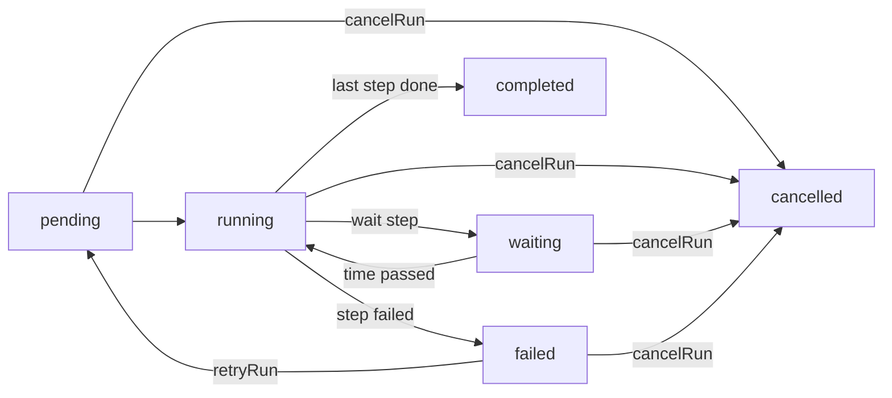

People join, change teams and leave, and each of those moments comes with chores: add the newcomer to the right
groups and say hello, take away what a mover no longer needs, sign a leaver out and delete the account once the
retention period is over. Done by hand, some of it is forgotten, and forgotten access is how former employees keep a
way in.

A **lifecycle workflow** does those chores for you. It has a **trigger** (what starts a run for a person), a
**scope** (which people it applies to) and **steps** (what a run does, in order). Steps run with the rights of the
administrator who saved the workflow, checked again before every step, so nobody automates what they could not do by
hand. <Term id="birthright">Birthright</Term> <Term id="access-package">access packages</Term> keep access in
line with who a person is; workflows do something once, when something happens.

```ts
await iam.api.workflows.create(admin, {
  tenantId,
  name: 'Engineering joiners',
  trigger: { kind: 'joiner' },
  scope: { include: [{ StringEquals: { 'principal.department': 'Engineering' } }] },
  steps: [
    { kind: 'add-to-group', groupId: engineering.id },
    {
      kind: 'send-email',
      to: 'subject',
      subject: 'Welcome to {organization}, {name}',
      body: 'You joined {attribute.department}.',
    },
  ],
});
```

<TypeTable
  type={{
    name: { type: 'string', description: 'Up to 120 characters, unique in the tenant.', required: true },
    trigger: { type: 'WorkflowTrigger', description: 'What starts a run for a person (below).', required: true },
    scope: {
      type: '{ include, exclude? }',
      description: 'Condition sets in the package rule language. Without one, the workflow applies to every person.',
    },
    steps: { type: 'WorkflowStep[]', description: '1 to 20 steps, run in order (below).', required: true },
    enabled: {
      type: 'boolean',
      description: 'A disabled workflow starts no runs; runs in progress carry on.',
      default: 'true',
    },
    includeExisting: {
      type: 'boolean',
      description: 'Joiner workflows: also run for people who were already active.',
      default: 'false',
    },
    maxRunsPerDay: {
      type: 'number',
      description: 'The daily brake, 1 to 10000: 25 when a step takes access away, otherwise 200.',
    },
  }}
/>

## Triggers

| Trigger                                   | A run starts for a person when                                                                             |
| ----------------------------------------- | ---------------------------------------------------------------------------------------------------------- |
| `{ kind: 'joiner' }`                      | They are active and joined after the workflow was enabled (or at any time, with `includeExisting`).       |
| `{ kind: 'mover', attributes }`           | A watched attribute (a declared identity attribute, or `managerId`) changed while they are active.         |
| `{ kind: 'leaver' }`                      | They went from active to disabled: by an administrator, offboarding, SCIM deprovisioning or expiry.        |
| `{ kind: 'date', attribute, offsetDays }` | `offsetDays` after (or before, when negative) `createdAt`, `expiresAt` or an ISO date attribute passed.    |
| `{ kind: 'manual' }`                      | Only when someone starts it with `workflows.run`.                                                          |

Each person runs each occurrence once: the joining, each move or departure, the target day of a date. The workflow
remembers the occurrences it started, so they do not fire again after old runs are swept away (180 days after they
end). Re-enabling a workflow or changing its trigger starts it afresh and forgets them.

- **Baselines.** Mover and leaver workflows record everyone's current values when they are created, re-enabled or
  given a new trigger, so only later changes fire. Changing back is a new change and fires again. A change made while
  the person is disabled or outside the scope becomes the new baseline without a run.
- **Joiners** count from the moment the workflow was enabled; `includeExisting: true` also covers everyone already
  there.
- **Dates** use `createdAt`, `expiresAt`, or a declared string attribute such as `startDate` holding `2026-10-01`
  (midnight UTC) or a date and time with its offset (`2026-10-01T09:00+02:00`); a time without an offset is ignored. A
  date that moves to another day fires again, and dates more than a day before the workflow started never fire, so a
  new workflow does not run for everyone who started years ago.
- **Only people** start runs: service accounts and agents never do.

## Scope

A scope uses the same keys as [package rules](/docs/guides/privileged-access/automatic-assignment#keys-a-rule-may-test):
`principal.*` for declared attributes, `principal.owner`, `identity.emailDomain`, `identity.managerId`,
`identity.groups`, `identity.teams`, `identity.departments` and the rest. `include` sets are ORed and a matching
`exclude` set leaves the person out.

```json title="Everyone in engineering or design, except contractors"
{
  "include": [{ "StringEquals": { "principal.department": ["Engineering", "Design"] } }],
  "exclude": [{ "Bool": { "principal.contractor": true } }]
}
```

The scope is checked when the trigger fires. `workflows.run` ignores it: whoever starts a run by hand chooses the
people.

## Steps

| Step                                    | Fields                     | The owner needs                                    |
| --------------------------------------- | -------------------------- | -------------------------------------------------- |
| `add-to-group`, `remove-from-group`     | `groupId`, `days?` (add)   | `iam:groups:update` on the group                   |
| `remove-from-all-groups`                |                            | `iam:groups:update` on each group, as it runs      |
| `assign-package`                        | `packageId`, `days?`       | `iam:packages:assign`, plus what assigning needs   |
| `revoke-packages`                       | `packageId?`               | `iam:packages:assign` on each package revoked      |
| `send-email`                            | `to`, `subject`, `body`    | `iam:identities:read` on the person                |
| `revoke-sessions`, `disable`, `enable`  |                            | `iam:identities:update` on the person              |
| `set-attributes`, `set-expiry`          | `attributes`, `days`       | `iam:identities:update` on the person              |
| `delete` (last step only)               |                            | `iam:identities:delete` on the person              |
| `emit-event`                            | `name`                     | nothing: records `workflow:event` for webhooks     |
| `wait` (at most 5, never last)          | `hours` (1 to 8760)        | nothing                                            |

- `remove-from-all-groups` leaves memberships a team or an access package manages to them, and `revoke-packages`
  leaves assignments a package rule made to the rule.
- A step with nothing to do (not in the group, already disabled, no packages) is recorded as `skipped`.
- `send-email` sends to the person (`subject`), their `manager`, or a fixed address that belongs to a member of the
  organization or is at one of its verified domains, so a workflow cannot mail people's details to outsiders. It
  fills `{name}`, `{email}`, `{organization}`, `{workflow}` and `{attribute.department}`-style placeholders, uses the
  `workflow-message` template, and is skipped when the deployment has no email delivery callback.

`remove-from-all-groups`, `revoke-packages`, `revoke-sessions`, `disable` and `delete` take access away. Saving,
running or retrying such a workflow by hand needs a <Term id="recent-authentication">recent sign-in</Term>, and its
daily brake defaults to 25 runs.

## Authority

Whoever saves a workflow becomes its **owner**, and must hold every permission its steps use, from their own session
or API key (not a role session, session token, delegated agent session or impersonation). A run records the owner
when it starts and acts as that owner to the end, so a later editor never lends their rights to runs someone else
approved:

- every step checks the owner's permissions again, on the person it acts on, and fails the run with `ACCESS_DENIED`
  when one is missing;
- an owner who was disabled, offboarded, deleted or expired fails the run with `OWNER_INACTIVE`. Someone with the
  rights retries it (`retryRun` makes them the run's owner) or cancels it, and saves the workflow so new runs have an
  active owner;
- runs are decided with the owner's `principal.mfa` as it was when they saved the workflow, so policies that require
  MFA for directory changes still apply;
- steps that take access away, `set-attributes` and `set-expiry` never act on <Term id="owner">owners</Term> or root
  administrators (`PROTECTED_RESOURCE`), or on the run's owner;
- nobody changes their own account through a workflow: `set-attributes`, `set-expiry` and `enable` refuse the run's
  owner and whoever started or retried the run (`ACCESS_DENIED`).

Starting a run by hand (`workflows.run`, `iam:workflows:run`) also needs the steps' permissions over each person
named, so both the caller and the owner must be allowed.

## Runs



Each step runs in its own transaction and adds a result (`done`, `skipped` or `failed`, with a detail). A run keeps
the steps it started with, so editing a workflow changes new runs only, unless the edit passes
`activeRuns: 'cancel'`. `retryRun` resumes a failed run at the step that failed with the caller's rights and never
repeats steps already done; `cancelRun` stops a run and leaves done steps done. Disabling or deleting a workflow stops
new runs; deleting it also cancels the runs in progress. Finished runs are kept for 180 days, then
`iam.sweepExpired()` removes them.

<Callout title="A leaver who comes back" type="warn">
  A run does not check whether its person came back. If someone is enabled again while their leaver run waits to
  delete the account, find the run with `workflows.listRuns({ identityId, status: 'waiting' })` and cancel it.
</Callout>

## The daily brake

`maxRunsPerDay` caps the runs a trigger starts per day. When more people qualify than the rest of the day's
allowance, the workflow starts runs up to the allowance and holds the others back, recording `workflow:brake` and
`brakedOn`. The held changes wait: they start on a later day, within that day's allowance, or as soon as someone
raises the limit. A directory sync that disables everyone should not become mass deletion, so look at what fired
before raising it. `workflows.preview` shows who is in scope,
who would start at the next evaluation, and upcoming dates, without changing anything.

## Running workflows

<Callout title="Schedule the workflow job">
  Call `iam.workflows.runDue()` every few minutes: it starts the runs triggers call for and carries on waiting runs,
  and it is the only thing that moves dates and waits forward. Call `iam.workflows.subscribe()` once in the process
  that runs `iam.dispatchAuditHooks()`, so joiners, movers and leavers are handled within moments of each change to
  people, groups, teams or departments. Changes made by workflow steps wait for the next `runDue()`.
</Callout>

```ts
const stop = iam.workflows.subscribe();
setInterval(() => void iam.dispatchAuditHooks(), 60_000);
setInterval(() => void iam.workflows.runDue(), 5 * 60_000);
```

`subscribe()` evaluates in the background; `iam.workflows.idle()` resolves once those evaluations have finished, for
tests and graceful shutdown. `workflows.evaluate` (`iam:workflows:run`) does the same for one organization on demand;
the console's "Run due now" button calls it.

## Audit

Runs record `workflow:run:start`, `workflow:step`, `workflow:run:complete`, `workflow:run:fail` and `workflow:brake`
(actor `deployment-operator`, except runs started by hand), and `emit-event` steps record `workflow:event`. The
changes steps make are recorded as their ordinary events, such as `iam:groups:update`, `package:assign`,
`package:revoke`, `identity:revoke-sessions`, `iam:identities:update` and `identity:delete`, with the run's owner as
the actor and `via: 'workflow'`. Subscribe a <Term id="webhook">webhook</Term> to `workflow:run:fail` and
`workflow:brake` to hear about runs that need a person.

## Examples

<Tabs items={['Joiner', 'Mover', 'Leaver']}>
<Tab value="Joiner">

```ts
await iam.api.workflows.create(admin, {
  tenantId,
  name: 'Welcome',
  trigger: { kind: 'joiner' },
  steps: [
    { kind: 'add-to-group', groupId: everyone.id },
    { kind: 'assign-package', packageId: laptopKit.id, days: 90 },
    {
      kind: 'send-email',
      to: 'manager',
      subject: '{name} joins {organization}',
      body: '{name} ({email}) starts in {attribute.department}. Their base access is ready.',
    },
  ],
});
```

</Tab>
<Tab value="Mover">

```ts
await iam.api.workflows.create(admin, {
  tenantId,
  name: 'Department moves',
  trigger: { kind: 'mover', attributes: ['department', 'managerId'] },
  steps: [
    { kind: 'remove-from-all-groups' },
    {
      kind: 'send-email',
      to: 'manager',
      subject: '{name} moved to {attribute.department}',
      body: 'Their earlier group memberships were removed. Request what they need in their new role.',
    },
    { kind: 'emit-event', name: 'person.moved' },
  ],
});
```

</Tab>
<Tab value="Leaver">

```ts
await iam.api.workflows.create(admin, {
  tenantId,
  name: 'Leavers',
  trigger: { kind: 'leaver' },
  steps: [
    { kind: 'remove-from-all-groups' },
    { kind: 'revoke-packages' },
    { kind: 'emit-event', name: 'person.left' },
    { kind: 'wait', hours: 720 },
    { kind: 'delete' },
  ],
});
```

</Tab>
</Tabs>

<Cards>
  <Card title="workflows API reference" href="/docs/reference/api/workflows">
    Every method with its permission, audit events, and errors.
  </Card>
  <Card title="Automatic assignment" href="/docs/guides/privileged-access/automatic-assignment">
    Birthright access packages and the rule language scopes use.
  </Card>
</Cards>
