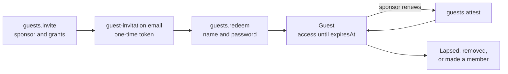

Organizations rarely work alone. A partner's engineers join a launch project, an agency's designers need the brand
folder, an auditor reads the books for a quarter. Making them ordinary members leaves accounts behind long after the
work ends, nobody remembers who asked for them, and their own company was never asked.

Better IAM lets an organization invite them as **guests**, by email, and keeps three things true for every guest:

- **Someone vouches for them.** Every guest has a sponsor, an active member of the host organization who is not a
  guest themselves. The sponsor renews the guest's access, or lets it end.
- **Access ends.** A guest's access lasts a limited time (90 days by default). Everything the invitation granted ends
  with it unless the sponsor renews it.
- **Both organizations agree.** The host's inbound settings decide who may join as a guest. When the invited address
  is on a domain another organization has verified, that organization's outbound settings must allow it too.

A guest is an ordinary person (`kind: 'user'`) of the host <Term id="tenant">tenant</Term> that carries a
server-owned marker, `Identity.guest` (`sponsorId`, `since`, `homeDomain`, and `homeTenantId` for people from another
organization). It is never an attribute and never a separate kind of identity, so everything the host already uses
applies to guests unchanged: roles and bindings, groups, <Term id="access-package">access packages</Term>,
<Term id="sod">separation of duties</Term>, <Term id="invariant">access invariants</Term>,
<Term id="certification">certifications</Term>, identity expiry, and offboarding.
<Term id="policy">Policies</Term> see `principal.guest`, `principal.guestSponsorId`, and `principal.homeTenantId`, and
a tenant can set a guest boundary that caps everything its guests do.

Everything lives in the `guests` API group (`client.guests.*` over HTTP), plus two scheduled jobs on `iam.guests`.



## Invite a guest

```ts
const invitation = await iam.api.guests.invite(admin, {
  tenantId,
  email: 'gina@partner.example',
  sponsorId: alice.id, // defaults to the caller, who must then be able to sponsor guests
  message: 'Welcome to the launch project',
  roleIds: [viewerRoleId],
  groupIds: [launchGroupId],
  packageIds: [partnerKitId],
  accessDays: 30, // how long access lasts after redemption: 1 to 365, default the tenant's (90)
  expiresInDays: 7, // how long the invitation can be redeemed: 1 to 30, default 14
});
```

`invite` needs `iam:guests:invite` and an email delivery callback (`authentication.sendEmail`; `DELIVERY_REQUIRED`
otherwise). It emails a personal `guest-invitation` with a token (`biam_gst_…`, a prefix secret scanners can look
for), stores only the token's hash, and returns the invitation without it. It is refused when:

- someone in the organization already has the address, or it already has a pending invitation (`CONFLICT`; send the
  pending one again or revoke it);
- the address is on one of the organization's own verified domains (`GUEST_NOT_ALLOWED`): that person is a member, so
  [invite them as one](/docs/guides/concepts/tenants-and-identities#member-invitations);
- the [cross-tenant access settings](#cross-tenant-access-settings) of either organization do not admit the person
  (`GUEST_NOT_ALLOWED`);
- the caller is impersonating someone (`IMPERSONATION_RESTRICTED`), the organization is not active
  (`TENANT_INACTIVE`), or it is the platform tenant (`INVALID_INPUT`);
- the caller acts through an assumed role (`ACCESS_DENIED`): redemption re-checks the inviter's own rights, which a
  role session does not carry, so such an invitation could never be redeemed.

Domains are compared in their canonical form: lowercase, an internationalized domain in its punycode form, and without
a trailing dot (`gil@globex.example.` is `gil@globex.example`). The invitation stores and emails that form, and an
address whose domain is not a DNS name is refused (`INVALID_INPUT`).

### Choose the sponsor

The sponsor is the caller unless `sponsorId` names someone else. A sponsor must be an active, unexpired person of the
organization who is not a guest (`INVALID_SPONSOR` otherwise). Callers who cannot sponsor, such as a root
administrator, a service account's API key, or a delegated session, name a sponsor explicitly. Naming someone else
also needs `iam:guests:manage` (`ACCESS_DENIED` otherwise, whoever the named person is), as giving a guest another
sponsor does: the sponsor answers for the guest, and policies may grant on `principal.guestSponsorId`.

### What an invitation may grant

Roles, groups, and packages are authorized when the invitation is sent, exactly as `identities.invite` and
`packages.assign` authorize them:

- `iam:bindings:create` on each role, never a protected role;
- `iam:groups:update` on each group, never a team's backing group (`TEAM_MANAGED`), with the authorities behind the
  group's own bindings;
- `iam:packages:assign` on each package, with the rights to assign it by hand.

Roles and groups also need a grant <Term id="authority">authority</Term> (`GRANT_AUTHORITY_REQUIRED`). An invitation
therefore never grants more than its inviter could grant directly, and redemption checks this again. A group that
holds a [license](/docs/guides/licenses#assign-products) product, named directly or included in a package, also needs
`iam:licenses:assign`.

### Link the email to your page

`renderDeliveryMessage` renders the email. Give it a `links.guestInvitation` builder that points at your own page
(without one, the email shows the token), and a `links.guests` builder for the review and missing-sponsor emails
(without one, they fall back to `links.account`):

```ts
import { renderDeliveryMessage } from 'better-iam/auth/templates';

sendEmail: async (message) => {
  const rendered = renderDeliveryMessage(message, {
    appName: 'Acme Cloud',
    links: {
      guestInvitation: ({ tenantId, token }) =>
        `https://app.acme.test/join?tenant=${tenantId}&token=${encodeURIComponent(token)}`,
      guests: ({ tenantId, guestId }) =>
        `https://app.acme.test/${tenantId}/guests${guestId ? `/${guestId}` : ''}`,
    },
  });
  if (rendered) await mailer.send({ to: message.to, ...rendered });
},
```

## Redeem an invitation

The invitee opens your page and chooses a name and a password. `guests.redeem` is public (the emailed token is the
credential) and works from the browser client:

```ts
const result = await client.guests.redeem({ tenantId, token, name: 'Gina', password });
if ('mfaRequired' in result) {
  // The tenant requires MFA: the new guest enrolls a factor before a session is issued.
}
```

Redemption happens in one transaction, so a refusal leaves the invitation usable:

<Steps>
<Step>

**Check the invitation.** Only a pending, unexpired invitation is accepted (`INVITATION_INVALID` for anything else).

</Step>
<Step>

**Check admission and authority again.** Either organization may have changed its settings, or verified the domain,
since the invitation was sent, so the host's inbound and the home organization's outbound settings must still admit
the person. The inviter must still be active and able to grant what the invitation grants, and the sponsor must still
be able to sponsor guests (`INVITATION_INVALID` for these two).

</Step>
<Step>

**Create the guest** with the invited address (marked verified, because the invitation reached it), the chosen
password under the tenant's password rules, the `guest` marker, and `expiresAt` set to redemption plus the
invitation's `accessDays`.

</Step>
<Step>

**Grant** the roles, groups, and packages under the inviter's authority, each ending when the guest's access ends (a
package's `maxDurationMs` can end its assignment sooner). Separation-of-duties rules (`SOD_CONFLICT`) and enforced
invariants (`INVARIANT_VIOLATION`) apply.

</Step>
<Step>

**Sign the guest in.** The guest account and the redeemed invitation are recorded, the
[birthright rules](#birthright-rules-and-guests) that test `identity.guest` run, and the guest gets a password session.
A tenant that does not accept password sign-in refuses the redemption (`METHOD_NOT_ALLOWED`), and one that requires
MFA returns an MFA challenge instead of a session.

</Step>
</Steps>

Over HTTP, `POST /api/iam/guests/redeem` sets the session cookie like the other invitation routes, and on an
organization's own <Term id="sign-in-address">sign-in address</Term> it acts in that organization only. Redemption is
rate limited per organization (500 attempts), per client address (20), and per token (10), each within the rate-limit
window (15 minutes by default), so tokens cannot be guessed. The client's own budget is counted first, so one client
cannot use up the organization's budget that every invitee shares. It is audited as `guest:redeem` with the new guest
as the actor.

The guest then signs in like any member (`auth.signIn` with their email and password), and the tenant's
authentication policy applies to them. Their email address cannot change: `identities.update` and the guest's own
`auth.requestEmailChange` refuse it (`INVALID_INPUT`), because the invitation proved that address and the cross-tenant
settings admitted it. Invite the new address instead.

## Manage invitations

- `listInvitations({ tenantId, status? })` lists invitations newest first, never with tokens. A pending invitation
  past its lapse is reported as `expired` before the sweep job records it.
- `revokeInvitation({ tenantId, invitationId })` withdraws a pending invitation (`iam:guests:manage`).
- `resendInvitation({ tenantId, invitationId, expiresInDays? })` sends a pending or lapsed invitation again with a new
  token (the old one stops working) and a new lifetime (`iam:guests:invite`). The address, the cross-tenant settings,
  the sponsor (`INVALID_SPONSOR`), and the original inviter's rights (`INVITATION_INVALID`) are checked again first,
  so only an invitation that can still be redeemed goes out.

When the inviter or the sponsor is disabled, offboarded, deleted, or contained by
[threat detection](/docs/guides/threat-detection#responding), their pending guest invitations are revoked
(`revokedReason: 'inviter-inactive'` or `'sponsor-inactive'`).

## The guest directory

`list({ tenantId, sponsorId?, status?, expiringWithinDays?, limit?, offset? })` returns guests by name with a `total`,
and `get({ tenantId, identityId })` returns one guest (`iam:guests:read`). Each guest carries the identity's `status`,
the guest account's `accountStatus`, the sponsor (`sponsorId`, `sponsorName`, and `sponsorMissing` when the sponsor
left), `homeTenantId` and `homeDomain`, the invitation and inviter, `redeemedAt`, the last renewal (`attestedAt`,
`attestedBy`), the next review (`reviewDueAt`), the access end (`expiresAt`), and the last sign-in (`lastSignInAt`).

| `accountStatus` | Meaning |
| --- | --- |
| `active` | The guest may use their access. |
| `expired` | The access ended (reported as soon as `expiresAt` passes, before the sweep job records it). |
| `removed` | `guests.remove` or offboarding ended the guest. |
| `converted` | The guest became an ordinary member with `convertToMember`. |

`expiringWithinDays` keeps guests whose access ends at most that many days from now, ended ones included (add
`status: 'active'` to leave them out). Sponsors see the guests they vouch for without any permission:
`mine({ tenantId })` lists their active guests, the soonest review first, from their own session or API key.

## Renew a guest's access

A guest's access ends at its `expiresAt`. Past it, every credential of the guest is refused at once, and the retention
worker (`iam.purgeDeleted`) disables the identity and records `identity:expire`, as for any
[identity with a deadline](/docs/guides/privileged-access/lifecycle#time-bound-identities). The sponsor keeps the guest
by renewing (attesting) their access:

```ts
await iam.api.guests.attest(aliceSession, { tenantId, identityId: ginaId, days: 90 });
```

- The guest's sponsor renews from their own session without any permission, never while impersonating. Anyone else
  needs `iam:guests:manage` on `iam/guests/{identityId}`. Guests renew nobody's access, their own included.
- The access then ends `days` from now (1 to 365, default the tenant's `accessDays`), and the next review is due after
  the tenant's `reviewEveryDays`, or at the new end if that comes first.
- What the invitation granted moves with it: its bindings, group memberships, and package assignments get the new
  end, also when an administrator changed the guest's `expiresAt` in between. Grants whose end was changed by hand
  keep theirs, and a package assignment keeps its end when the package's `maxDurationMs` does not allow the new one.
  Renewing lengthens only what the invitation granted at redemption, so it needs no `iam:licenses:assign` for
  licensed groups.
- A guest who owns the organization keeps an <Term id="owner">owner</Term>'s protection: renewing them needs an owner
  or root caller, as `identities.update` does for an owner's expiry (their sponsor alone cannot), and never gives the
  last owner an end.
- A guest whose access ended, or who is disabled, cannot be renewed (`INVALID_TRANSITION`). An administrator restores
  them with `identities.update` (a later `expiresAt`) and `identities.setStatus` (`active`); the next sweep reopens
  their guest account. A former guest's disabled identity keeps their address, so inviting the address again is
  refused (`CONFLICT`) until that identity is deleted.

### Change the sponsor

`setSponsor({ tenantId, identityId, sponsorId })` gives an active guest a new sponsor (`iam:guests:manage` and a
<Term id="recent-authentication">recent sign-in</Term>). The change reaches decisions at once through
`principal.guestSponsorId`. Guests never choose a sponsor, their own included, and never make anyone a member
(`ACCESS_DENIED`), whatever roles they hold.

When a sponsor leaves:

- [Offboarding](/docs/guides/privileged-access/lifecycle#offboarding) with a `successorId` who can sponsor guests
  hands the leaver's guests to the successor (each audited as `guest:sponsor-change`); without one they are flagged
  `sponsorMissing`. `identity:offboard` reports `guestsReassigned` and `guestsUnsponsored` when they are not zero.
- Deleting the sponsor flags their guests `sponsorMissing`.
- The sweep job flags guests whose sponsor was disabled, expired, or can otherwise no longer sponsor, and emails the
  organization's owners once per guest and loss (`guest-sponsor-missing`).

A flagged guest keeps their access until it ends. Assign a new sponsor with `setSponsor`, or remove the guest. The flag
clears when the sponsor can sponsor again.

## End a guest's access

- **Let it lapse.** Access ends at `expiresAt` unless the sponsor renews it.
- **Remove the guest.** `remove({ tenantId, identityId, reason })` (`iam:guests:manage`, a recent sign-in) disables
  the identity and, in one transaction, ends its sessions, keys, and delegations, removes every role binding, group
  and team membership, package assignment, activation, and relationship it holds (whichever authority granted them),
  cancels its pending requests and invitations, revokes the grant authorities it holds, and closes the guest account
  as `removed`. It returns the counts and is audited as `guest:remove`. The guest's license seats are released right
  after, so the next person waiting moves up. Expired guests can be removed too; an owner cannot (transfer ownership
  first).
- **Offboard or delete.** `identities.offboard` closes a guest's account as `removed` (reason "Offboarded"), and
  deleting the identity removes its guest account. The audit trail keeps the history.
- **Make them a member.** `convertToMember({ tenantId, identityId, clearExpiry? })` (`iam:guests:manage`, a recent
  sign-in) removes the `guest` marker, closes the guest account as `converted`, and re-runs the birthright rules,
  which now treat the person as a member. Decisions see the change at once, in the person's current session too. The
  access end stays unless `clearExpiry: true` removes it together with the end of what the invitation granted; for a
  guest who owns the organization, only an owner or root caller clears it. Keeping someone in a licensed group for
  good claims its seats, so `clearExpiry` also needs `iam:licenses:assign` when a license product is assigned to one
  of those groups (`ACCESS_DENIED`, audited as a denial).

## Cross-tenant access settings

Each tenant has cross-tenant access settings. They are open until configured:

```ts
await iam.api.guests.configure(admin, {
  tenantId,
  inbound: {
    allowGuests: true,
    allowedDomains: ['partner.example', 'agency.example'],
    blockedDomains: ['competitor.example'],
    partners: [{ tenantId: globexTenantId, allow: true }],
  },
  outbound: {
    allowGuestInvitations: false,
    partners: [{ tenantId: initechTenantId, allow: true }],
  },
  accessDays: 30,
  reviewEveryDays: 14,
});
```

<TypeTable
  type={{
    'inbound.allowGuests': {
      type: 'boolean',
      description: 'Whether the tenant accepts guests at all (partners with allow: true excepted).',
      default: 'true',
    },
    'inbound.allowedDomains': {
      type: 'string[]',
      description: 'When not empty, only addresses at these domains or their subdomains may be invited.',
      default: '[]',
    },
    'inbound.blockedDomains': {
      type: 'string[]',
      description: 'Addresses at these domains or their subdomains are never invited, whatever else allows them.',
      default: '[]',
    },
    'inbound.partners': {
      type: '{ tenantId: string; allow: boolean }[]',
      description: 'Organizations (tenant IDs) admitted (allow: true) or refused (allow: false) over the defaults.',
      default: '[]',
    },
    'outbound.allowGuestInvitations': {
      type: 'boolean',
      description: "Whether people at this tenant's verified domains may become guests of other organizations.",
      default: 'true',
    },
    'outbound.partners': {
      type: '{ tenantId: string; allow: boolean }[]',
      description: 'Host organizations allowed or refused over that default.',
      default: '[]',
    },
    accessDays: {
      type: 'number',
      description: "How long a guest's access lasts after redemption or renewal, 1 to 365 days.",
      default: '90',
    },
    reviewEveryDays: {
      type: 'number',
      description: 'How often sponsors confirm that a guest still needs access, 7 to 365 days.',
      default: '90',
    },
    guestBoundary: {
      type: 'PolicyDocument | null',
      description: "A policy document that caps every guest's decisions in the tenant; null removes it.",
      default: 'none',
    },
  }}
/>

`configure` needs `iam:guests:settings` and a recent sign-in. Only the fields given change, inside `inbound` and
`outbound` too, and an unknown field is refused (`INVALID_INPUT`), so a misspelled setting cannot leave the tenant
unguarded. Domains are host names such as `partner.example`, stored lowercase, deduplicated, and sorted. Partner lists
name existing tenants other than this one, each at most once (100 per list). The boundary is validated like any policy
(`INVALID_POLICY`, `INVALID_ACTION`). `getSettings` returns the current settings, with `configured: false` while the
tenant uses the defaults.

### Who decides admission

An address whose domain another tenant has
[verified](/docs/federation/enterprise-onboarding#prove-the-email-domain) belongs to that tenant: the guest is
tenant-sourced, `guest.homeTenantId` names that tenant, and both sides decide. Addresses at domains nobody verified
need only the host's inbound settings. Admission is decided in this order:

1. The host refuses a person whose organization it lists as a partner with `allow: false`.
2. The host refuses an address at a blocked domain.
3. The host admits a person whose organization it lists as a partner with `allow: true`.
4. Otherwise the host needs `allowGuests`, and an address at an allowed domain when `allowedDomains` is set.
5. The home organization must allow it: its outbound partner entry for the host when it has one, else
   `allowGuestInvitations`.

A refusal is `GUEST_NOT_ALLOWED` (403). The home organization's refusal only says that the person's organization does
not allow it, never what it configured. Admission is checked when an invitation is sent, sent again, and redeemed.

## Policies for guests

| Key | Type | Present |
| --- | --- | --- |
| `principal.guest` | boolean | Always: true for a guest acting in the host tenant, false otherwise |
| `principal.guestSponsorId` | identifier | For guests: their sponsor's identity ID |
| `principal.homeTenantId` | identifier | For tenant-sourced guests: the tenant that verified their email domain |

The keys describe a person in their own tenant, in their own session, API key, session token, or a delegated session in
which an agent acts for them. An assumed role never carries them (`principal.guest` is false). The server owns them:
values supplied by `resolveContext` or a plugin are removed, and identity attributes cannot use the names `guest`,
`guestSponsorId`, or `homeTenantId`. Access analysis (`policies.simulate`, `whoCan`, `effectiveActions`) evaluates a
guest as the guest they are, and `policies.test` defaults `principal.guest` to false unless its context passes it.

```json title="Policies for guests"
{
  "version": 1,
  "statements": [
    {
      "sid": "GuestsNeverAdminister",
      "effect": "deny",
      "actions": ["iam:*"],
      "resources": ["*"],
      "conditions": { "Bool": { "principal.guest": true } }
    },
    {
      "sid": "NoGuestsInPayroll",
      "effect": "deny",
      "actions": ["payroll:*"],
      "resources": ["*"],
      "conditions": { "Bool": { "principal.guest": true } }
    },
    {
      "sid": "GuestsUseMfa",
      "effect": "deny",
      "actions": ["documents:*", "projects:*"],
      "resources": ["*"],
      "conditions": { "Bool": { "principal.guest": true, "principal.mfa": false } }
    },
    {
      "sid": "GuestsReadTheirSponsorsDocuments",
      "effect": "allow",
      "actions": ["documents:read"],
      "resources": ["document/*"],
      "conditions": {
        "Bool": { "principal.guest": true },
        "StringEquals": { "resource.ownerId": "${principal.guestSponsorId}" }
      }
    },
    {
      "sid": "GlobexInJointProjects",
      "effect": "allow",
      "actions": ["projects:read", "projects:comment"],
      "resources": ["project/joint-*"],
      "conditions": { "StringEquals": { "principal.homeTenantId": "<Globex tenant ID>" } }
    }
  ]
}
```

- `principal.guest` is always present, so a deny statement on it needs no guard.
- A variable whose key is absent never matches, so members get nothing from `GuestsReadTheirSponsorsDocuments`.
- `principal.guestSponsorId` and `principal.homeTenantId` are absent for members and for guests without a home
  tenant, and a [missing key](/docs/guides/authorization/conditions#missing-keys) never satisfies a negated operator.
  To refuse every guest who is not one of Globex's people, deny both the guests from elsewhere and the guests without
  a home tenant (policy lint's `optional-key-deny` warns about the first statement alone):

```json title="Only Globex's guests in Globex projects"
[
  {
    "effect": "deny",
    "actions": ["projects:*"],
    "resources": ["project/globex-*"],
    "conditions": {
      "Bool": { "principal.guest": true },
      "StringNotEquals": { "principal.homeTenantId": "<Globex tenant ID>" }
    }
  },
  {
    "effect": "deny",
    "actions": ["projects:*"],
    "resources": ["project/globex-*"],
    "conditions": {
      "Bool": { "principal.guest": true },
      "Exists": { "principal.homeTenantId": false }
    }
  }
]
```

### The guest boundary

A tenant's `guestBoundary` is a ceiling on every guest's decisions there, like a tenant or principal
[boundary](/docs/guides/authorization/policies#boundaries): it never grants anything, and a guest can do only what both
their grants and the boundary allow. It bounds agents acting for a guest too, including the scopes of the delegation
tokens they are issued. Members are not bounded by it, and it stops applying the moment a guest becomes a member. Use it
as a safety net that holds whatever roles a guest is given by mistake:

```ts
await iam.api.guests.configure(admin, {
  tenantId,
  guestBoundary: {
    version: 1,
    statements: [
      {
        effect: 'allow',
        actions: ['documents:read', 'documents:comment'],
        resources: ['document/shared-*'],
      },
    ],
  },
});
```

## Birthright rules and guests

[Automatic assignment](/docs/guides/privileged-access/automatic-assignment) rules gain the key `identity.guest` (a
boolean, tested with `Bool` or `Exists`). **A rule that never tests it does not match guests**: rules written for
members, such as `{ StringEquals: { 'principal.kind': 'user' } }`, never reach people from outside the organization.
The same applies to [onboarding flow](/docs/guides/onboarding) rules and
[lifecycle workflow](/docs/guides/governance/workflows) scopes, which use the same language.

```ts
// A kit for every guest
{ include: [{ StringEquals: { 'principal.kind': 'user' }, Bool: { 'identity.guest': true } }] }

// Everyone, guests included: Exists always holds, and testing the key lets guests match
{ include: [{ StringEquals: { 'principal.kind': 'user' }, Exists: { 'identity.guest': true } }] }

// Guests from one partner domain (redemption verifies the address)
{
  include: [
    {
      StringEquals: { 'principal.kind': 'user' },
      Bool: { 'identity.guest': true, 'identity.emailVerified': true },
      StringEqualsIgnoreCase: { 'identity.emailDomain': 'partner.example' },
    },
  ],
}

// Members only, stated explicitly
{ include: [{ StringEquals: { 'principal.kind': 'user' } }], exclude: [{ Bool: { 'identity.guest': true } }] }
```

Testing `identity.guest` anywhere in a rule lets guests match all of it, so a rule that tests it in one include clause
also lets guests match its other include clauses. `packages.previewAutoAssign` warns about each such clause. Rules
apply to a guest right after redemption, and again after `convertToMember`.

## Schedule the jobs

Two jobs on the instance keep guests tidy. Run both hourly, followed by an <Term id="outbox">outbox</Term> run:

```ts
setInterval(async () => {
  await iam.guests.sweep();
  await iam.guests.sendReviewReminders();
  await iam.auth.dispatchOutbox();
}, 60 * 60_000).unref();
```

- `iam.guests.sweep({ tenantId? })` marks lapsed invitations `expired`, closes the guest accounts of guests whose
  access ended (`guest:expire`) and reopens those an administrator restored, removes the accounts of deleted
  identities, flags guests whose sponsor can no longer sponsor and emails the owners (`guest-sponsor-missing`, once
  per guest and loss, when the deployment sends email and the tenant is active), and drops partner entries naming
  organizations that were purged. It returns `invitationsExpired`, `accountsExpired`, `accountsRestored`,
  `sponsorsMissing`, `ownersNotified`, and `partnersRemoved`.
- `iam.guests.sendReviewReminders({ tenantId?, withinDays? })` emails each sponsor (`guest-review`) about guests whose
  review is due or whose access ends within `withinDays` (default 14, 1 to 90). Each review date and each access end
  is reminded once, and one email covers whatever is due for a guest, so an unanswered review reminder never stands in
  for the warning that access is about to end. It needs an email delivery callback (`DELIVERY_REQUIRED`), skips
  inactive tenants and sponsors without an address, and returns `{ sent, skipped: { inactive, quiet } }`.

Both run each tenant in its own transaction and are safe to repeat. The <Term id="retention-sweep">retention
sweep</Term> (`iam.sweepExpired()`) deletes redeemed, revoked, and expired invitations 90 days after they lapsed; the
audit trail keeps every invitation. Guest invitations, guest accounts, and cross-tenant access settings (collections
`guestInvitations`, `guestAccounts`, and `crossTenantAccess`) are purged with their tenant. See
[Scheduled jobs](/docs/operations/jobs) for the other jobs a deployment runs.

## Permissions

| Action | Resource | Methods |
| --- | --- | --- |
| `iam:guests:read` | `iam/guests`, `iam/guests/{identityId}`, `iam/guests/invitations`, `iam/guests/settings` | `list`, `get`, `listInvitations`, `getSettings` |
| `iam:guests:invite` | `iam/guests/invitations`, `iam/guests/invitations/{id}` | `invite`, `resendInvitation` |
| `iam:guests:manage` | `iam/guests/{identityId}`, `iam/guests/invitations/{id}` | `revokeInvitation`, `attest` (anyone but the sponsor), `setSponsor`, `remove`, `convertToMember` |
| `iam:guests:settings` | `iam/guests/settings` | `configure` |
| None | | `redeem` (the emailed token is the credential), `mine` (a sponsor's own session or API key), and the sponsor's own `attest` |

`setSponsor`, `remove`, `convertToMember`, and `configure` also need a recent sign-in. Enforced
[access invariants](/docs/guides/governance/change-safety#access-invariants) guard `iam:guests:manage` and
`iam:guests:settings` calls and every redemption, since each can change what someone may do.

## Events and emails

Every call made with a permission records its operation event (`iam:guests:*`). The module also records these,
subscribable as `guest:*` with a <Term id="webhook">webhook</Term>. Changes made through the API are recorded by the
person who made them, `guest:redeem` by the new guest, and the jobs by `deployment-operator`. No event carries an
invitation token.

| Event | Recorded when |
| --- | --- |
| `guest:invite`, `guest:invitation-revoke`, `guest:invitation-resend` | An invitation was emailed, withdrawn, or sent again with a new token |
| `guest:redeem` | A person redeemed an invitation and became a guest |
| `guest:attest` | The sponsor (`asSponsor: true`) or an administrator renewed a guest's access |
| `guest:sponsor-change`, `guest:sponsor-missing` | A guest got a new sponsor, or lost theirs |
| `guest:remove`, `guest:convert` | A guest was removed, or made an ordinary member |
| `guest:expire` | The sweep found a guest's access ended and closed their guest account |
| `guest:settings` | The cross-tenant access settings changed, or the sweep removed partner entries naming purged tenants |
| `guest:review-reminder` | A sponsor was emailed about a review or the end of a guest's access |

`renderDeliveryMessage` renders the three emails. Times in their payloads are ISO-8601 strings.

| Template | Sent to | Payload | Link |
| --- | --- | --- | --- |
| `guest-invitation` | The invitee | `tenantId`, `tenantName`, `inviterName`, `sponsorName`, `message`, `token`, `expiresAt` | `links.guestInvitation`, else the token is shown |
| `guest-review` | The sponsor | `tenantId`, `tenantName`, `guestId`, `guestName`, `guestEmail`, `dueAt`, `reviewDueAt`, `expiresAt` | `links.guests`, else `links.account` |
| `guest-sponsor-missing` | The tenant's owners | `tenantId`, `tenantName`, `guestId`, `guestName`, `guestEmail`, `sponsorName` | `links.guests`, else `links.account` |

## In the console

**Directory → Guests** lists an organization's guests with their sponsor, access end, next review, and last sign-in,
invites new ones, and shows sponsors the guests they vouch for so they can renew them. A guest's page renews access,
changes the sponsor, makes the guest a member, or removes them. Guest invitations can be sent again or revoked, and
**Directory → Cross-tenant access** edits the settings. Member pages mark guests with a Guest badge and their sponsor.
Invitees accept at `/cloud/join?kind=guest`, and the console runs both jobs hourly.

## Limits

| Limit | Value |
| --- | --- |
| Access after redemption or renewal | 90 days by default (tenant `accessDays`), 1 to 365 |
| Review cadence | 90 days by default (tenant `reviewEveryDays`), 7 to 365 |
| Invitation lifetime | 14 days by default (`expiresInDays`), 1 to 30 |
| Pending invitations per address | One per tenant |
| Roles, groups, packages per invitation | 100 each |
| Invitation message | One line, at most 1000 characters |
| Allowed and blocked domains, partners | 100 per list |
| Redemption attempts | 500 per tenant, 20 per client address, 10 per token, per window |
| Reminders | 14 days ahead by default (`withinDays`, 1 to 90) |
| `list` page size | 100 by default (`limit`, 1 to 1000) |
| Removal reason | At most 512 characters |
| Settled invitations kept | 90 days after they lapsed |

### Not in this version

- **Signing in with the home organization.** A tenant-sourced guest has an account of its own in the host tenant and
  signs in there with the password they chose at redemption. Signing in to the host with a session of the home tenant
  is planned.
- **Passwordless redemption.** Redemption sets a password; passkeys and other factors can be added afterwards.
- **<Term id="scim">SCIM</Term>.** Guests are not mapped to SCIM's `userType: "Guest"`, and inbound SCIM provisioning
  creates members, not guests.

## Errors

| Code | Status | When |
| --- | --- | --- |
| `GUEST_NOT_ALLOWED` | 403 | The address is on the organization's own verified domain, or the host's inbound or the home organization's outbound settings do not admit the person |
| [`INVITATION_INVALID`](/docs/reference/errors#invitation_invalid) | 400 | Redeeming an invitation that is not pending or has lapsed, or whose inviter or sponsor can no longer grant or sponsor; resending one whose inviter lost the right |
| [`INVALID_SPONSOR`](/docs/reference/errors#invalid_sponsor) | 400 | The sponsor is not an active, unexpired person of the organization who is not a guest |
| [`DELIVERY_REQUIRED`](/docs/reference/errors#delivery_required) | 400 | Inviting, resending, or sending reminders without an email delivery callback |
| [`CONFLICT`](/docs/reference/errors#conflict) | 409 | Someone in the organization has the address, or it already has a pending invitation |
| [`INVALID_TRANSITION`](/docs/reference/errors#invalid_transition) | 409 | Renewing a guest whose access ended or who is disabled; revoking an invitation that is not pending; changing a guest who was removed or converted |
| [`ACCESS_DENIED`](/docs/reference/errors#access_denied) | 403 | Inviting through an assumed role; naming or changing a sponsor without `iam:guests:manage`; a guest choosing a sponsor or making someone a member; `clearExpiry` on a licensed group without `iam:licenses:assign` |
| [`INVALID_INPUT`](/docs/reference/errors#invalid_input) | 400 | The platform tenant, an address whose domain is not a DNS name, changing a guest's email address, or an unknown settings field |
| [`SOD_CONFLICT`](/docs/reference/errors#sod_conflict), [`INVARIANT_VIOLATION`](/docs/reference/errors#invariant_violation) | 409 | Redemption would break a separation-of-duties rule or an enforced invariant |
| [`METHOD_NOT_ALLOWED`](/docs/reference/errors#method_not_allowed) | 403 | Redeeming in a tenant that does not accept password sign-in |
| [`TEAM_MANAGED`](/docs/reference/errors#team_managed), [`GRANT_AUTHORITY_REQUIRED`](/docs/reference/errors#grant_authority_required) | 409, 403 | An invitation names a team's backing group, or the inviter holds no grant authority for its roles or groups |
| [`IMPERSONATION_RESTRICTED`](/docs/reference/errors#impersonation_restricted) | 403 | Inviting, or renewing as the sponsor, from a "view as" session |
| [`TENANT_INACTIVE`](/docs/reference/errors#tenant_inactive) | 400 | Inviting or resending in an organization that is not active |
| [`RATE_LIMITED`](/docs/reference/errors#rate_limited) | 429 | Too many redemption attempts for the organization, client address, or token |
| [`RECENT_AUTH_REQUIRED`](/docs/reference/errors#recent_auth_required) | 403 | `setSponsor`, `remove`, `convertToMember`, or `configure` without a recent sign-in |

## Next steps

<Cards>
  <Card title="guests API reference" href="/docs/reference/api/guests">
    Every method with its permission, audit events, and errors.
  </Card>
  <Card title="Licenses" href="/docs/guides/licenses">
    Seats of what you sell or buy, for members and guests alike.
  </Card>
  <Card title="Automatic assignment" href="/docs/guides/privileged-access/automatic-assignment">
    Birthright rules that give guests, or only members, their packages.
  </Card>
  <Card title="Policy conditions" href="/docs/guides/authorization/conditions">
    Operators such as Bool, Exists and StringNotEquals, and how missing keys behave.
  </Card>
</Cards>
