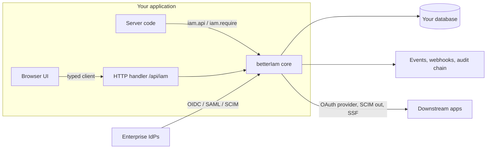

import { Blocks, Building2, Fingerprint, KeyRound, Network, ScrollText, ShieldCheck, Workflow } from 'lucide-react';

Better IAM gives an application the identity layer that is usually bought as a hosted service: multi-tenant
organizations, sign-in with every modern method, fine-grained authorization, governance, and enterprise
federation. It is a library, not a SaaS. It runs in your process, stores its data in your PostgreSQL,
SQLite, or libSQL database, and exposes a typed API to your server and browser code.

You create one instance with `betterIam()`, giving it a database, a deployment secret, and the URL it is served
from, and import that instance wherever your server code needs identity or authorization:

```ts twoslash title="iam.ts"
// @noErrors
import { betterIam } from 'better-iam';
import { sqliteAdapter } from 'better-iam/adapter-sqlite';

export const iam = betterIam({
  database: sqliteAdapter({ filename: './iam.db' }),
  secret: process.env.BETTER_IAM_SECRET!,
  baseURL: 'https://identity.example.com',
});
```

## Why it exists

Most business software eventually needs the same identity features: customers are organizations rather than
individuals, each organization wants its own roles and its own single sign-on, security teams ask who can do what
and who changed it, and enterprise buyers expect SCIM provisioning, MFA policies, and an audit trail. Teams usually
assemble this from several services: a hosted sign-in provider, a separate authorization service, and later a
governance or provisioning tool. That works, but it has costs:

- **Your identity data lives somewhere else.** People, sessions, and roles sit in a vendor's database, so every
  permission check is a network call, and keeping that data consistent with your own records is your problem.
- **Authorization is disconnected from your data.** Deciding "may Alice approve this invoice?" needs the invoice's
  owner and amount, which the external service does not have.
- **Each service has its own model.** Tenants, roles, and audit logs are defined three times and reconciled by hand.

Better IAM takes the other approach: it is a library that runs inside your application and stores everything in
your database, in the same transactions as your own writes. One <Term id="tenant">tenant</Term> model, one
authorization engine, and one tamper-evident <Term id="audit-chain">audit log</Term> cover sign-in, access
decisions, governance, and federation, all behind a single typed API.

<Callout type="info" title="When you may not need it">
  If your application has individual users and no organizations, roles, or enterprise customers, a simpler
  authentication library is enough. Better IAM earns its place when access control, multi-tenancy, and auditability
  are part of the product.
</Callout>

## What it covers

<FeatureGrid>
  <Feature icon={<Building2 />} title="Tenants and organizations" href="/docs/guides/concepts/tenants-and-identities">
    Tenant trees with isolated identity directories, invitations, sign-in aliases, and platform root
    administration.
  </Feature>
  <Feature icon={<Fingerprint />} title="Authentication" href="/docs/guides/authentication">
    Passwords, passkeys, magic links, email and SMS codes, TOTP, trusted devices, and per-tenant sign-in
    policies.
  </Feature>
  <Feature icon={<ShieldCheck />} title="Authorization" href="/docs/guides/authorization">
    Roles, versioned JSON policies with conditions and variables, relationships (ReBAC), boundaries, and
    reverse queries.
  </Feature>
  <Feature icon={<KeyRound />} title="Privileged access" href="/docs/guides/privileged-access">
    Just-in-time elevation with approvals, access packages, temporary bindings, and configuration as code.
  </Feature>
  <Feature icon={<Workflow />} title="Governance" href="/docs/guides/governance">
    Access reviews, certification campaigns, separation of duties, role mining, invariants, and change
    previews.
  </Feature>
  <Feature icon={<Network />} title="Federation" href="/docs/federation">
    OAuth/OIDC sign-in and provider, SAML SSO, SCIM in and out, and Shared Signals (CAEP/RISC).
  </Feature>
  <Feature icon={<ScrollText />} title="Audit and events" href="/docs/guides/events">
    A tamper-evident, hash-chained audit log with webhooks, subscribers, metrics, and spans.
  </Feature>
  <Feature icon={<Blocks />} title="Every framework" href="/docs/frameworks">
    A typed client plus Next.js, React, Vue, Nuxt, SvelteKit, React Router, NestJS, Express, Hono, and
    Fastify integrations.
  </Feature>
</FeatureGrid>

## How it fits together



Every operation, whether it comes from a browser, a server action, the CLI, or a SCIM connector, runs
through the same pipeline:

1. **Resolve the <Term id="credential">credential</Term>.** A session cookie, bearer token, API key, or assumed role
   becomes a <Term id="principal">principal</Term>: who is calling, how they signed in, and whether they used MFA.
2. **Authorize.** The principal's <Term id="role">roles</Term>, <Term id="policy">policies</Term>, and
   <Term id="boundary">boundaries</Term> in that tenant decide whether the action is allowed.
3. **Apply the change in one transaction** in your database, so a failure leaves nothing half done.
4. **Record it.** A hash-chained audit event is appended in the same transaction and then fans out to
   <Term id="webhook">webhooks</Term>, in-process subscribers, and metrics.

Because there is only one path, nothing can bypass authorization or the audit log, and an administrator using the
console is held to the same rules as your own API calls.

## Where to go next

<Cards>
  <Card title="Quickstart" href="/docs/guides/quickstart">
    Create an instance, bootstrap a tenant, and make your first authorization check in minutes.
  </Card>
  <Card title="Installation" href="/docs/guides/installation">
    Packages, subpath imports, databases, and runtime requirements.
  </Card>
  <Card title="Policy playground" href="/playground">
    Evaluate policy documents in your browser with the real policy engine.
  </Card>
  <Card title="API reference" href="/docs/reference/api">
    Every server API method with HTTP routes and TypeScript signatures.
  </Card>
</Cards>
