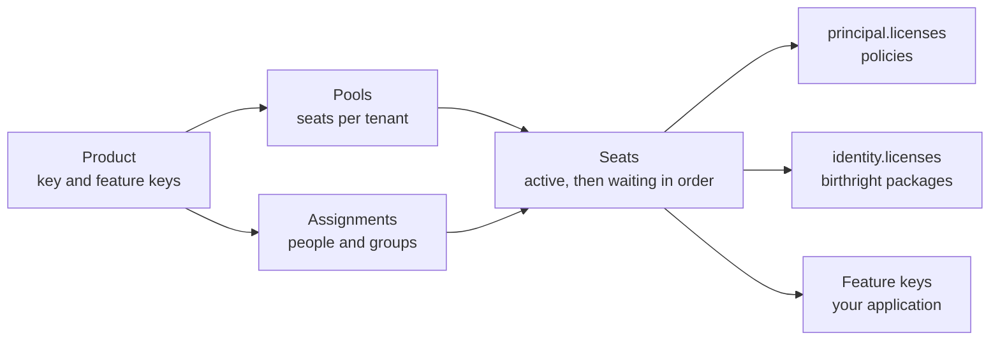

Seats are counted everywhere: a SaaS plan tier sold per person, an add-on, a desktop tool the organization buys per
seat. Someone has to know who holds one, who is waiting for one, and who gets the next one when a seat frees up, and
the access that comes with a seat should follow it without anyone editing roles by hand.

License management keeps that record:

- A **product** (a SKU) is defined once, by the platform or by a <Term id="tenant">tenant</Term>.
- **Pools** give each organization a number of seats of it, for as long as a contract runs.
- The product is **assigned** to people and groups.
- Better IAM keeps one **seat** per person: `active` while capacity lasts, otherwise `waiting` in order on the
  product's waiting list. When a seat frees up, the next person in line gets it at once.

A license does not grant anything by itself. What it unlocks is expressed with the governance you already use, so
access reviews, simulations, analysis, certifications, and separation of duties see it:

- **Policies** test `principal.licenses`, the keys of the products the person holds an active seat for.
- **Birthright access packages** test `identity.licenses`, so a seat can bring roles and group memberships with it.
- **Feature keys** on each product tell your application what to switch on: `iam.licenses.features` on the server,
  `licenses.mine` in the browser.

Everything lives in the `licenses` API group (`POST /api/iam/licenses/{method}`, `client.licenses.*` in the browser),
plus two scheduled jobs on `iam.licenses`.



```ts title="Define a product, buy ten seats, and give it to the Design group"
const pro = await iam.api.licenses.createProduct(admin, {
  tenantId,
  key: 'pro',
  name: 'Pro',
  description: 'Exports, SSO and the audit log',
  featureKeys: ['exports', 'sso', 'audit-log'],
});
await iam.api.licenses.addPool(admin, {
  tenantId,
  productId: pro.id,
  quantity: 10,
  note: 'PO 2026-114',
});
const { seats } = await iam.api.licenses.assign(admin, {
  tenantId,
  productId: pro.id,
  subjectType: 'group',
  subjectId: designGroupId,
});
// seats: [{ identityId, productKey: 'pro', from: 'none', to: 'active' }, ...]

// In your application: what does this person's license switch on? A product the organization defines itself counts
// only where your application trusts that organization (platform products always count).
const features = await iam.licenses.features(identityId, tenantId, { trustedTenantId: tenantId });
// ['audit-log', 'exports', 'sso']
```

## Define products

| Field | Meaning |
| --- | --- |
| `key` | A permanent identifier: 1 to 64 lowercase letters, digits, dots, underscores or hyphens, starting with a letter or digit. Policies and package rules name products by key. |
| `name` | Up to 100 characters. |
| `description` | Up to 512 characters, shown to people in `licenses.mine`. |
| `featureKeys` | Up to 50 feature keys the product unlocks (flag-key syntax: lowercase letters and digits joined by `-`, `_` or `.`, starting with a letter), deduplicated and sorted. |
| `status` | `active`, or `retired` for good. |

**Who defines a product decides who sees it.** A product defined on the root tenant is a **platform product**: every
tenant sees it and can assign it, and only root administrators define, change, or retire it. A product defined by an
organization or project is visible to that tenant and every tenant below it. `listProducts` returns the tenant's own
products and its ancestors', sorted by key, each with:

- `scope`: `platform` for the root tenant's products, else `tenant`;
- `definedBy` and `definedHere`: the defining tenant, and whether it is the tenant the list was read in (only the
  defining tenant changes a product; an enclosing tenant's product answers `INVALID_INPUT` "change it there");
- `shadowed`: an enclosing tenant defines the same key too, and its product wins.

**Keys.** A key is unique in its defining tenant, and a tenant cannot define a key that an enclosing tenant already
defines (`CONFLICT`). An enclosing tenant, the platform included, may still introduce a key a tenant below it already
uses, and the enclosing product then wins: the lower tenant's product is listed as `shadowed`, and its seats stay but no
longer grant the key, or the product's feature keys, to policies, package rules, `iam.licenses`, or `licenses.mine`.
So no tenant can claim a key such as `enterprise` first and have its own seats count as the platform's product. Move
the people to the enclosing product, or unassign them. A retired product's key stays taken, and a retired enclosing
product still shadows the key below it.

- `createProduct` needs `iam:licenses:manage` on `iam/licenses/products` and a
  <Term id="recent-authentication">recent sign-in</Term>. A tenant defines at most 200 products.
- `updateProduct` renames a product, changes its description (`null` clears it), or replaces its feature keys. The key
  never changes. No recent sign-in is needed.
- `retireProduct` (a recent sign-in again) ends the product everywhere: every seat of it is released in every tenant
  that held one (`license:seat-release` with reason `product-retired`, in each seat's tenant), its pools and
  assignments stay as read-only history, and assigning it or changing its pools answers `INVALID_TRANSITION`. There is
  no way back: define a new product instead.

```ts title="Root administrators define platform products on the root tenant"
const suite = await iam.api.licenses.createProduct(rootAdmin, {
  tenantId: rootTenantId,
  key: 'suite',
  name: 'Acme Cloud Suite',
  featureKeys: ['suite'],
});
```

## Add capacity with pools

A pool gives one tenant (its `tenantId`, the consuming tenant) `quantity` seats of one product, from `startsAt` (or its
creation) until `endsAt` (or indefinitely). A tenant's capacity for a product is the sum of its **live** pools, the ones
that have started and not ended. Pools model how seats are bought: a yearly contract, a trial that ends, a top-up that
starts next month.

| Field | Meaning |
| --- | --- |
| `quantity` | 1 to 1,000,000 seats. |
| `startsAt` | Optional, epoch milliseconds. A pool that has not started adds nothing (`live: false`). |
| `endsAt` | Optional, epoch milliseconds, in the future and after `startsAt`. |
| `note` | Up to 512 characters, such as a purchase order. |
| `subscriptionId` | A [billing](/docs/guides/billing#plans-subscriptions-and-coupons) subscription of the receiving tenant or an enclosing tenant that paid for the seats (`source` becomes `subscription`). A reference only: nothing is metered. |

**Who adds capacity.** Capacity is granted by whoever owns the product, never by the tenant that consumes it:

- Seats of a **platform product** are granted by root administrators: the permission is checked in the root tenant,
  and only a root principal passes. An organization's owner cannot add seats of the platform's products to their own
  organization; the refusal is recorded in the owner's own tenant, with `targetTenantId` naming the root tenant.
- Seats of a **tenant's product** are granted by that tenant's managers (`iam:licenses:manage` on
  `iam/licenses/pools` in the defining tenant), to the tenant itself or to any tenant below it, such as its projects.
  The receiving tenant's administrators can assign the seats but not change them.

`addPool`, `updatePool` (`quantity`; `endsAt`, where `null` makes the pool open-ended and a past time ends it now; and
`note`, where `null` clears it), and `removePool` are authorized that way. The pool events (`license:pool-add`,
`license:pool-update`, `license:pool-remove`) are recorded in the receiving tenant, where the capacity lands; the
operation event is recorded where the permission was checked. A tenant holds at most 100 pools of one product.

```ts title="A project of Acme gets five seats of Acme's own product, for this year only"
await iam.api.licenses.addPool(acmeAdmin, {
  tenantId: apolloProjectId,
  productId: pro.id,
  quantity: 5,
  endsAt: Date.parse('2027-01-01T00:00:00Z'),
  note: 'Apollo pilot',
});
```

<Callout title="Capacity changes move seats, never fail">
  More capacity activates waiting people in order. Less capacity, by lowering a quantity, ending a pool, or removing
  one, moves the **newest** active seats to the head of the waiting list. A pool that starts or ends with time takes
  effect at the next `iam.licenses.reconcile()` run.
</Callout>

`listPools` returns the tenant's own pools and, for products the tenant defines, the pools it granted to tenants below
it, newest first, with `tenantName`, `productKey`, and `live`. Ended pools are left out unless `includeEnded: true`. An
ended pool is kept as purchase history for 400 days after its end, then `iam.sweepExpired()` removes it.

**Moved tenants.** When `tenants.reparent` moves a tenant out from under a product's defining tenant, the product no
longer counts there: its seats stop granting anything at once, the next `iam.licenses.reconcile()` releases them, and
the assignments stay (they count again if the tenant moves back). The defining tenant still lists the pools it granted
there and can remove them with `removePool`; adding or changing capacity there answers `INVALID_INPUT`.

## Assign products

`assign` gives a product to a person or a group of the tenant (`iam:licenses:assign` on `iam/licenses/assignments`):

```ts
await iam.api.licenses.assign(admin, {
  tenantId,
  productId: pro.id,
  subjectType: 'identity', // or 'group'
  subjectId: aliceId,
});

// Up to 100 people at once; people who already hold a direct assignment are skipped.
const { assigned, skipped, seats } = await iam.api.licenses.assignMany(admin, {
  tenantId,
  productId: pro.id,
  identityIds: [bobId, carolId, daveId],
});
```

- Any kind of identity may hold a license: people, service accounts, agents, and [guests](/docs/guides/guests).
  Assigning a disabled person is allowed; they claim a seat once they are active again. Deleted identities and unknown
  groups answer `NOT_FOUND`, and one unknown person refuses the whole `assignMany` batch.
- A person may hold the same product directly and through several groups; they still hold one seat, and the seat
  records its sources (`direct`, `groupIds`).
- To license a [team](/docs/guides/teams-and-departments), assign its backing group (`team.groupId`): the team's
  members and the members of the teams below it claim seats.
- A product holds at most 10,000 assignments per tenant (`LIMIT_EXCEEDED`); assign groups instead of people.
- `unassign` removes one assignment by `assignmentId`, or by `productId`, `subjectType`, and `subjectId`. The seats it
  carried are released unless another assignment still covers the person, and waiting people move up.
- `listAssignments` lists them newest first, optionally for one product or subject, with the subject's name (and a
  person's email).

Assignments are audited as `license:assign` and `license:unassign`, with the person or group as the resource.

### Licensed groups

A product assigned to a group goes to whoever joins it, so putting someone into a licensed group claims a seat.
Changing the members of a licensed group through the groups API (`addMember`, `addMembers`, `updateMember`; also
packages, workflows, and configuration sync, which add members the same way) therefore needs `iam:licenses:assign` as
well as `iam:groups:update`. That includes a group that team sync copies into a team whose backing group, or a team
above it, holds a product. A refusal answers `ACCESS_DENIED` and is audited as a denied `iam:groups:update`.

<Accordions>
<Accordion title="Every other path into a licensed group that asks for iam:licenses:assign">

Each is refused with `ACCESS_DENIED` (audited as a denial of the operation) when the caller lacks the right:

- `identities.createMany` and `identities.invite` with `groupIds`. Invitations are checked again, against the inviter,
  when accepted and when `identities.resendInvitation` sends them again: if the inviter lost the right, or one of the
  groups was licensed since, both fail with `INVITATION_INVALID` and the person does not join at all. Revoke the
  invitation and invite the person again from an account that holds the right.
- Guest invitations with `groupIds` or with a package that includes a licensed group, checked at invitation, when
  resent, and again at redemption (`INVITATION_INVALID` then), and `guests.convertToMember` with `clearExpiry`, which
  keeps the guest in those groups for good.
- <Term id="access-package">Access packages</Term> that include a licensed group: `packages.assign`, approving a
  package request, extending an assignment, and saving a package rule (an automatic rule whose owner lacks the right
  has its additions suspended and reported as an issue).
- Onboarding flows whose completion groups are licensed.
- Team administrators (`iam:teams:update`) adding or re-timing members of a licensed team, or of a team below one.
- Configuration sync putting people into a licensed team.

</Accordion>
</Accordions>

By design, three paths claim seats without `iam:licenses:assign`: a team's maintainers managing their own team under
the delegation its administrators gave them, directory sync (<Term id="scim">SCIM</Term>) setting group members as the
directory says, and renewing a guest invited into a licensed group (`guests.attest`). The guest's seat was authorized
when the guest was invited, a renewal ends again within 365 days, and it lengthens only what the invitation granted at
redemption.

## Seats and the waiting list

Seats are materialized: `listSeats` shows exactly who holds what. For each product in a tenant:

1. **Claimants** are the direct assignees and the live members of assigned groups (a membership whose `expiresAt` has
   not passed). Only active, unexpired identities of the tenant claim a seat.
2. **Seniority** decides who keeps a seat: a seat remembers `assignedAt`, the first time the person claimed it.
   Claimants are ranked oldest first. In the same millisecond, an existing active seat ranks before an existing waiting
   seat, which ranks before a new claimant, so a newcomer never takes someone's seat and repeated runs never swap two
   holders.
3. The first `capacity` claimants hold an **active** seat; the rest are **waiting**, and `listSeats` gives each waiting
   seat its `position` (from 1).
4. A seat whose last claim is gone (unassigned, left the group, disabled, deleted) is **released**. A person who claims
   the product again later starts over with a new seniority, behind everyone already holding or waiting for a seat.

Capacity is never over-allocated. Every change is audited on the person as `license:seat-activate`,
`license:seat-waiting`, or `license:seat-release`, with `from`, `to`, and the `reason` that caused it.

```ts
const { seats } = await iam.api.licenses.listSeats(admin, {
  tenantId,
  productId: pro.id,
  status: 'waiting',
});
// [{ identityName: 'Bob', status: 'waiting', position: 1, direct: true, groupIds: [], assignedAt }, ...]
```

`listSeats` is sorted by product key, active before waiting, then by seniority, and filters by `productId`, `status`,
and `identityId`.

**When seats move.** Seats follow a change in the same transaction that makes it: assignments, pool changes, and
retirement; group membership changes from any writer (the groups API, teams and team sync, accepted invitations, SCIM
provisioning, access packages); group deletion, also by SCIM (its assignments go with it); identity deletion (direct
assignments go and the seats are released); and SCIM deactivating, reactivating, or deleting a person. Disabling or
offboarding a person releases their seats right after the change. Batches (`groups.addMembers`, offboarding,
configuration sync) reconcile each product once, at the end of the batch; people who claim a seat in the same batch rank
by identity ID among themselves.

Things that happen with time (a pool starting or ending, a membership or an account expiring), and a tenant moving away
from a product's defining tenant, are applied by the hourly [`iam.licenses.reconcile()`](#schedule-the-jobs). Until
then nothing is granted past its time: a seat held only through a group stops counting the moment the membership
lapses, an expired account holds nothing, and a moved tenant's seats of a product it no longer sees count for nothing.

An offboarded or disabled person keeps their direct assignment, so they queue again if they return. Remove it with
`unassign`, or let [reclaim](#reclaim-unused-seats) do it.

## Usage and settings

`usage` reports, per product the tenant uses (it has pools, seats, or assignments of it, or defines it): `capacity`
(from live pools), `active`, `waiting`, `available`, live `pools`, `assignments`, and with reclaim turned on
`reclaimable` (active seats older than `reclaimAfterDays` whose holders have been inactive that long) and
`reclaimableThroughGroups` (the part of those held only through groups).

`getSettings` returns the settings below with their defaults, and `configure` records `license:settings` with the
values before and after.

### Reclaim unused seats

`configure({ tenantId, reclaimAfterDays })` (7 to 365; `null` turns it off, the default) makes the daily
[`iam.licenses.reclaim()`](#schedule-the-jobs) job take seats back from people who do not use them:

- A person is inactive when their last sign-in (or, without one, their account's creation) and the last use of their
  own sessions and API keys are all older than `reclaimAfterDays`.
- For each **direct** assignment older than that period whose holder is inactive, the job removes the assignment
  (`license:reclaim`, by `deployment-operator`), and the waiting list moves up. Assignments made within the period are
  left alone, so a new holder has time to start.
- Only assignments of products that hold seats in the tenant are reclaimed: a retired product's assignments stay as
  history.
- Seats held through groups are never reclaimed: `usage` counts them in `reclaimableThroughGroups`, and removing the
  person from the group frees the seat.
- Each pass also records the activity it saw on every seat (`lastActivityAt` in `listSeats`).

### Waiting-list email

With `configure({ tenantId, notifyWaiting: true })`, a person who joins a product's waiting list is emailed
(`license-waiting`, "You are on the waiting list for Pro"), and so is a waiting person whose seat became active
(`license-activated`, "Your Pro seat is ready"). Only active people (kind `user`) with an email address are emailed, the
deployment needs `authentication.sendEmail`, and the messages travel through the <Term id="outbox">outbox</Term> like
other email. The payload carries `tenantId`, `tenantName`, `productKey`, and `productName`.

## What a license unlocks

### Policies

`principal.licenses` lists, sorted, the keys of the products the principal holds an **active** seat for in the
decision's tenant, platform products included. Waiting seats, retired products, and seats held only through a group
membership that has lapsed never count. Test it with `ArrayContains` (any of the listed keys) or `ArrayContainsAll`
(every listed key).

A common pattern binds a role broadly (to every member, through an all-members group) and lets the license decide:
assigning or unassigning the product then grants or removes the access, without touching bindings.

```json title="Access that follows the seat"
{
  "version": 1,
  "statements": [
    {
      "sid": "ExportsNeedPro",
      "effect": "allow",
      "actions": ["reports:export"],
      "resources": ["report/*"],
      "conditions": { "ArrayContains": { "principal.licenses": "pro" } }
    },
    {
      "sid": "AnalyticsForProOrEnterprise",
      "effect": "allow",
      "actions": ["analytics:*"],
      "resources": ["*"],
      "conditions": { "ArrayContains": { "principal.licenses": ["pro", "enterprise"] } }
    },
    {
      "sid": "WarehouseNeedsBothAddOns",
      "effect": "allow",
      "actions": ["warehouse:query"],
      "resources": ["*"],
      "conditions": { "ArrayContainsAll": { "principal.licenses": ["data-addon", "compute-addon"] } }
    },
    {
      "sid": "ExportsNeedProAndTheFlag",
      "effect": "allow",
      "actions": ["documents:export"],
      "resources": ["*"],
      "conditions": { "ArrayContains": { "principal.licenses": "pro", "tenant.features": "exports" } }
    },
    {
      "sid": "TrialSeatsNeverTouchBilling",
      "effect": "deny",
      "actions": ["billing:*"],
      "resources": ["*"],
      "conditions": { "ArrayContains": { "principal.licenses": "trial" } }
    }
  ]
}
```

Prefer allow statements that require a product over deny statements about people who lack one: a missing license then
simply grants nothing.

- **Who holds what.** A person's sessions and API keys, and the keys of service accounts and agents, carry their own
  seats. An agent acting for a person in a delegated session acts as the person, so it carries the person's seats (its
  delegation, boundary, and key limits still apply). Assumed roles, and principals of another tenant, hold none.
- **When it is read.** Only for decisions whose documents name `principal.licenses`, at decision time, so a seat that
  moves changes access on the next request. `authorize`, `authorizeMany`, `listAccessible`, `policies.simulate`,
  `whoCan`, access invariants, and impact previews all see the real seats.
- **Server-owned.** Values that `resolveContext` or a plugin supplies under `principal.licenses` are removed before the
  server sets its own, and an identity attribute cannot be named `licenses` (`INVALID_CONFIG` at startup).
- **Testing.** `policies.test` defaults it to `[]`; pass `context: { 'principal.licenses': ['pro'] }` to try a
  document. Policy lint knows it as a list and suggests it for the misspelling `principal.license`.
- **Guardrails.** Assigning, unassigning, and pool changes run the tenant's enforced
  [access invariants](/docs/guides/governance/change-safety#access-invariants), so a seat change that would newly break
  one fails with `INVARIANT_VIOLATION` and nothing is saved. Capacity granted from an enclosing tenant (a platform
  grant, say) is held to the receiving tenant's invariants as well. Retiring a product checks the defining tenant's
  invariants only, so a customer's invariant can never keep the platform from retiring a product.
- Root administrators override policies, so license conditions do not constrain them.

### Birthright packages

[Automatic access packages](/docs/guides/privileged-access/automatic-assignment) can follow seats. Their rules may test
`identity.licenses`, the keys of the products the person holds an active seat for, so a seat brings the roles and groups
the product needs (a Pro wiki, an export role) and takes them away when the seat goes.

```ts title="Everyone with an active Pro seat gets the Pro tools package"
await iam.api.packages.create(admin, {
  tenantId,
  name: 'Pro tools',
  groupIds: [proWikiGroupId],
  roleIds: [exporterRoleId],
  autoAssign: {
    include: [
      {
        StringEquals: { 'principal.kind': 'user' },
        ArrayContains: { 'identity.licenses': 'pro' },
      },
    ],
  },
});
```

```ts title="More autoAssign rules"
// Pro or Enterprise holders in Engineering and every department below it.
{ include: [{ StringEquals: { 'principal.kind': 'user' },
              ArrayContains: { 'identity.licenses': ['pro', 'enterprise'], 'identity.departments': engineeringId } }] }

// Service accounts that hold both add-ons.
{ include: [{ StringEquals: { 'principal.kind': 'service' },
              ArrayContainsAll: { 'identity.licenses': ['data-addon', 'compute-addon'] } }] }

// Pro holders, except those on a trial seat, with a week's grace when the seat goes.
{ include: [{ StringEquals: { 'principal.kind': 'user' }, ArrayContains: { 'identity.licenses': 'pro' } }],
  exclude: [{ ArrayContains: { 'identity.licenses': 'trial' } }],
  graceMs: 7 * 24 * 60 * 60 * 1000 }
```

- **Values are product keys** of products visible to the tenant (its own, its ancestors', the platform's), retired
  ones included. An unknown key fails the save with `INVALID_INPUT` (`unknown license …`), and string operators are
  refused: the key is a list, so use `ArrayContains` or `ArrayContainsAll`.
- **No chains.** A seat held only through group memberships that an access package created does not count, so a
  package can never grant itself through a licensed group. Seats held directly count, and so do seats held through a
  counted team's backing group.
- **When rules follow.** Right after license calls that move seats (assigning, unassigning, pool changes, retiring,
  and the two jobs) for the people whose seats changed, and after identity changes (creation, updates, disabling,
  offboarding, team and department changes). Seats that moved because of a plain group membership edit or a deletion
  reach packages at the next `iam.reconcilePackages()` run.
- **Warnings.** `autoAssign.warnings` flags a rule that tests `identity.licenses`, because anyone holding
  `iam:licenses:assign` can then change who gets the package, and so can whoever manages the members of a group a
  product is assigned to without it: a team's maintainers, and directory sync. Grant that permission as carefully as
  the package, and license teams and directory groups whose membership you trust.
- **A product that disappears** from under a rule (for example after restoring a backup) suspends the rule
  (`package:auto-suspended`, reason `invalid-rule`) instead of revoking everyone.
- **Configuration as code.** Package rules in configuration documents name products by key, and `config.plan` refuses
  an unknown key just as `config.apply` does. Products, pools, assignments, and settings themselves are runtime state
  and are not part of configuration documents.

### Feature keys in your application

A product's `featureKeys` say what its seat switches on in your application. Read them on the server without a
credential:

```ts
// The feature keys of the person's active seats of PLATFORM products; [] for disabled, expired or unknown people.
const features = await iam.licenses.features(identityId, tenantId);
// The product keys, exactly what principal.licenses holds for the person.
const products = await iam.licenses.products(identityId, tenantId);

// Combine with the tenant's feature flags: the flag rolls the feature out, the seat entitles the person.
const canExport = (await iam.features.isEnabled(tenantId, 'exports')) && features.includes('exports');
```

**Whose feature keys to trust.** Any tenant can define a product of its own and list any feature key on it, so a
feature key alone proves nothing about who sold it. `iam.licenses.features` therefore counts only the products the
**platform** (the root tenant) defines by default: a tenant cannot mint `exports` for itself by defining a product that
lists it. To also count products a tenant sells to its own subtree (an organization licensing its projects), pass that
tenant as the one you trust. Products defined by it or by a tenant above it count; products defined below it never do:

```ts
// Products Acme (or the platform above it) defines count; a project's self-defined product does not.
const acmeFeatures = await iam.licenses.features(identityId, projectId, { trustedTenantId: acmeId });
```

People read their own licenses with `licenses.mine` from any credential of the tenant (a session or an API key),
without a permission and without an audit record:

```ts
const { licenses, featureKeys, allFeatureKeys } = await client.licenses.mine({ tenantId });
```

- `licenses` lists each product they hold or wait for (`status`, and `position` while waiting), with `platform`
  (whether the root tenant defines it) and `definedBy` (the defining tenant).
- `featureKeys` is the union over active seats of platform products, the same keys `iam.licenses.features` returns by
  default.
- `allFeatureKeys` includes products their own tenant or a tenant above it defines. Those are not paid entitlements, so
  filter `licenses` by `definedBy` before reading them as such.
- Assumed roles see none.

Feature keys are an overlay for application code: `features.evaluate` and `iam.features.isEnabled` stay per tenant and
do not look at seats. Hiding UI is not enforcement, so guard the server side with `principal.licenses` as well.

## Schedule the jobs

Schedule both on the server. They need no credential, act as `deployment-operator`, and are safe to repeat and to
overlap.

```ts
setInterval(() => void iam.licenses.reconcile().catch(reportError), 60 * 60 * 1000).unref();
setInterval(() => void iam.licenses.reclaim().catch(reportError), 24 * 60 * 60 * 1000).unref();
```

- **`iam.licenses.reconcile({ tenantId? })`, hourly.** Brings every active tenant's seats in line with assignments,
  memberships, identity status, and pool terms (pools that started or ended, memberships and accounts that expired,
  anything repaired by hand), one transaction per tenant with licenses, then re-evaluates birthright packages for the
  people whose seats changed. The result is `{ tenants, activated, waiting, released, failedTenants }`. Suspended
  tenants are skipped, a tenant that fails is listed in `failedTenants` without stopping the others, and an unknown
  `tenantId` throws `NOT_FOUND`. A retired product never gets seats back.
- **`iam.licenses.reclaim({ tenantId? })`, daily.** In tenants with `reclaimAfterDays` set, removes the direct
  assignments of inactive people (see [reclaim](#reclaim-unused-seats)) and reconciles the products it touched. The
  result is `{ tenants, reclaimed, failedTenants }`, where each reclaimed entry names the `tenantId`, `productId`,
  `productKey`, `identityId`, and the `lastActivityAt` the job saw. An unknown `tenantId` is reported in
  `failedTenants`.

Related jobs: `iam.reconcilePackages()` applies package rules after membership edits, `iam.auth.dispatchOutbox()` (CLI
`outbox`) delivers waiting-list email, and `iam.sweepExpired()` removes pools 400 days after they ended. See
[Scheduled jobs](/docs/operations/jobs) for the other jobs a deployment runs.

## Permissions

| Action | Resource | Methods |
| --- | --- | --- |
| `iam:licenses:read` | `iam/licenses/products[/{id}]`, `iam/licenses/pools`, `iam/licenses/assignments`, `iam/licenses/seats`, `iam/licenses/settings` | `listProducts`, `getProduct`, `listPools`, `listAssignments`, `listSeats`, `usage`, `getSettings` |
| `iam:licenses:manage` | `iam/licenses/products[/{id}]`, `iam/licenses/pools[/{id}]`, `iam/licenses/settings` | `createProduct` and `retireProduct` (with a recent sign-in), `updateProduct`, `addPool`, `updatePool`, `removePool`, `configure` |
| `iam:licenses:assign` | `iam/licenses/assignments` | `assign`, `assignMany`, `unassign` |
| None | | `mine` (the caller's own licenses, from any credential of the tenant) |

Platform products are defined and changed, and their pools granted, by root administrators only. Pool changes are
authorized in the product's defining tenant. Every call except `mine` records its operation event (`iam:licenses:*`,
reads included), and a refused call records a denial. Keep `iam:licenses:assign` apart from `iam:licenses:manage` when
the people who hand out seats should not buy them. Changing the members of a group a product is assigned to needs
`iam:licenses:assign` too (see [licensed groups](#licensed-groups)).

## Audit events

Subscribe a <Term id="webhook">webhook</Term> to `license:*`, or to `license:seat-*` to follow seats. Pool events are
recorded in the tenant that receives the seats, retirement in the tenant that defines the product, and each seat event
in the seat's tenant.

| Event | Recorded when |
| --- | --- |
| `license:product-create`, `license:product-update`, `license:product-retire` | A product was defined; renamed, described, or given new feature keys; or retired |
| `license:pool-add`, `license:pool-update`, `license:pool-remove` | Capacity was added; a pool's quantity, end, or note changed; or a pool was removed |
| `license:assign`, `license:unassign` | A product was assigned to a person or group (one event per subject), or an assignment was removed |
| `license:seat-activate` | A person got an active seat, new or from the waiting list |
| `license:seat-waiting` | A person joined the waiting list, or their active seat moved back to it |
| `license:seat-release` | A person's seat was released |
| `license:reclaim` | The reclaim job removed an inactive person's direct assignment |
| `license:settings` | Reclaim or waiting-list email was turned on, off, or changed |

## Data and limits

- Five tenant-scoped collections hold the state: `licenseProducts`, `licensePools`, `licenseAssignments`,
  `licenseSeats`, and `licenseSettings` (one row per tenant). All are removed when their tenant is purged. Purging a
  project removes the pools it received and leaves its parent's products and the parent's own pools alone.
- Deleting a person removes their direct assignments and releases their seats; deleting a group (with `groups.delete`
  or by SCIM) removes its assignments and releases the seats they carried. Offboarding and disabling release seats and
  keep assignments.
- Ended pools are kept 400 days after their end as purchase history, then swept by `iam.sweepExpired()`. Retired
  products and their assignments are kept; their pools follow the same rule.
- There is no metering or proration: a pool's `subscriptionId` only records which subscription paid for it, and
  changing billing does not change pools.

| Limit | Value |
| --- | --- |
| Products a tenant defines | 200 |
| Feature keys per product | 50 |
| Pools of one product in one tenant (live or ended, until swept) | 100 |
| Seats per pool | 1 to 1,000,000 |
| Assignments of one product in one tenant | 10,000 (assign groups instead) |
| People per `assignMany` | 100 |
| `reclaimAfterDays` | 7 to 365 |
| Page size of `listPools`, `listAssignments`, `listSeats` | 1 to 1000 (100 by default) |

## Errors

| Code | Status | When |
| --- | --- | --- |
| [`ACCESS_DENIED`](/docs/reference/errors#access_denied) | 403 | Defining, changing, or granting seats of a platform product without being a root administrator; putting someone into a licensed group without `iam:licenses:assign` |
| [`CONFLICT`](/docs/reference/errors#conflict) | 409 | The key exists in the defining tenant or an enclosing one, or the product is already assigned to that subject |
| [`INVALID_INPUT`](/docs/reference/errors#invalid_input) | 400 | Changing a product an enclosing tenant defines, adding or changing capacity in a tenant that moved away, an unknown product key in a package rule, or a value out of range |
| [`INVALID_TRANSITION`](/docs/reference/errors#invalid_transition) | 409 | Assigning a retired product, changing its pools, or retiring it again |
| [`NOT_FOUND`](/docs/reference/errors#not_found) | 404 | An unknown product, deleted identity, or unknown group, or an unknown `tenantId` given to `reconcile` |
| [`LIMIT_EXCEEDED`](/docs/reference/errors#limit_exceeded) | 409 | 200 products, 100 pools of one product, or 10,000 assignments of one product in a tenant |
| [`INVARIANT_VIOLATION`](/docs/reference/errors#invariant_violation) | 409 | An assignment or pool change would newly break an enforced invariant |
| [`INVITATION_INVALID`](/docs/reference/errors#invitation_invalid) | 400 | Accepting, resending, or redeeming an invitation into a licensed group whose inviter lacks `iam:licenses:assign`, or one of whose groups was licensed since |
| [`RECENT_AUTH_REQUIRED`](/docs/reference/errors#recent_auth_required) | 403 | `createProduct` or `retireProduct` without a recent sign-in |

## Next steps

<Cards>
  <Card title="licenses API reference" href="/docs/reference/api/licenses">
    Every method with its permission, audit events, and errors.
  </Card>
  <Card title="Automatic assignment" href="/docs/guides/privileged-access/automatic-assignment">
    Birthright rules that give each seat holder the roles and groups their product needs.
  </Card>
  <Card title="Feature flags" href="/docs/guides/feature-flags">
    Roll features out per tenant, and combine flags with seats.
  </Card>
  <Card title="Billing and spend" href="/docs/guides/billing">
    Plans and subscriptions that can pay for a pool of seats.
  </Card>
</Cards>
