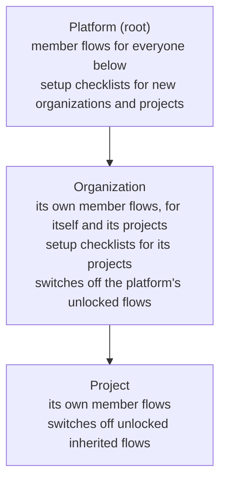

A new member's first day has a script: read the rules, fill in a profile, set up two-step verification, collect a
laptop. A new customer organization has one too: add a second owner, verify the email domain, require MFA, pass a
business verification. The platform wants the same basics everywhere, each organization adds its own, and a project
inside an organization adds a little more. Onboarding flows are those scripts, stored in Better IAM next to your
tenants, so the steps follow the tenant tree, completion shows up in reports, and a policy can hold access back until
the required steps are done.

There are two kinds of flow:

- **Member onboarding** (`audience: 'member'`) walks people who join a tenant through their first steps.
- **Tenant setup** (`audience: 'tenant'`) is a checklist for the administrators of new organizations or projects below
  the tenant that defines it.

## Levels

Flows are defined at any level of the tenant tree and inherited downward:



A flow's `appliesTo` decides whom it reaches: `tenant` (the defining tenant's own people), `descendants` (the people of
the tenants below it) or `subtree` (both). It defaults to `descendants` at the platform root and `tenant` elsewhere.
`tenantTypes` narrows the tenants below to some types, such as `['project']`. A person sees the flows of every level at
once, platform first.

Each tenant customizes what it inherits with `onboarding.setSettings`:

- **Switching flows off.** `disabledFlowIds` turns inherited member flows off for the tenant and everything below it.
  A flow defined with `locked: true` cannot be switched off. Setup checklists from above always apply.
- **The welcome screen.** `welcomeTitle`, `welcomeMessage`, `supportEmail`, and `supportUrl`: for each value, the
  nearest level that set it wins. The platform sets defaults, an organization overrides the message, and a project
  overrides only the title.

Flows ask only people (or tenants) created after the flow took effect, so publishing a flow never interrupts everyone
at once. `includeExisting: true` asks existing ones too.

## Steps

A flow has 1 to 25 steps. Each has a stable `id`, because progress is kept per step:

| Kind           | Who      | Completes when                                                                                             |
| -------------- | -------- | ---------------------------------------------------------------------------------------------------------- |
| `form`         | both     | The answers are submitted (text, textarea, email, URL, number, yes/no, select, and date fields).          |
| `acknowledge`  | both     | The reader confirms the text.                                                                              |
| `task`         | both     | Marked done, or approved by an administrator (`verification: 'admin'`).                                   |
| `agreement`    | member   | The person accepts the named terms of use of their own tenant. Skipped where the tenant has none.          |
| `verify-email` | member   | The email address is verified.                                                                             |
| `mfa`          | member   | An authenticator app or a passkey is enrolled.                                                             |
| `passkey`      | member   | A passkey is registered.                                                                                   |
| `check`        | tenant   | The tenant's own state meets it: a verified domain, enough members or owners, an MFA policy, and more.     |

`optional: true` steps never hold a flow back. Steps that complete on their own follow the live state: removing the last
passkey reopens a `passkey` step.

```ts
// The platform: every member of every organization and project reads the rules.
await iam.api.onboarding.createFlow(rootSession, {
  tenantId: rootTenantId,
  name: 'Platform essentials',
  audience: 'member',
  locked: true,
  steps: [
    { id: 'conduct', kind: 'acknowledge', title: 'Acceptable use', content: 'Use the service lawfully.' },
    { id: 'mfa', kind: 'mfa', title: 'Set up two-step verification' },
  ],
});

// The platform: every new organization completes a setup checklist the platform reviews.
await iam.api.onboarding.createFlow(rootSession, {
  tenantId: rootTenantId,
  name: 'Organization setup',
  audience: 'tenant',
  tenantTypes: ['organization'],
  steps: [
    { id: 'owners', kind: 'check', title: 'Add a second owner', check: 'owners', minimum: 2 },
    { id: 'domain', kind: 'check', title: 'Verify your email domain', check: 'verified-domain' },
    { id: 'kyc', kind: 'task', title: 'Business verification', verification: 'admin' },
  ],
});

// An organization: its engineers collect a laptop and then join a group.
await iam.api.onboarding.createFlow(acmeAdmin, {
  tenantId: acmeId,
  name: 'Engineering onboarding',
  audience: 'member',
  rule: { include: [{ StringEquals: { 'principal.department': 'Engineering' } }] },
  completionGroupIds: [engineersGroupId],
  steps: [{ id: 'laptop', kind: 'task', title: 'Collect your laptop', verification: 'admin' }],
});
```

`rule` targets a member flow with the [automatic assignment](/docs/guides/privileged-access/automatic-assignment) rule
language, and `completionGroupIds` adds people to groups when they finish, which needs the same rights as adding them
by hand.

### Answers that fill attributes

A form field with `attribute` fills a declared identity attribute, so the department a new member picks can drive
targeting rules, access packages, and policies. Onboarding fills only **empty** attributes, never overwriting a value
an administrator or directory sync set, and only for the **defining tenant's own people**: a tenant has no authority
over the identities of the tenants below it, so a flow that reaches only descendants cannot map fields at all. Mapping
fields needs `iam:identities:update` when the flow is saved.

## Working through onboarding

People work through their own flows without any permission, from an ordinary session of their tenant:

```ts
const mine = await client.onboarding.mine({ tenantId });
// { welcome, flows: [{ name, source, required, steps, done, total, complete }], pending, complete }

await client.onboarding.submitStep({ tenantId, flowId, stepId: 'conduct', acknowledged: true });
await client.onboarding.submitStep({ tenantId, flowId, stepId: 'team', answers: { department: 'Engineering' } });
```

Tenant setup is completed by the tenant's administrators: `onboarding.setup` lists the checklists, and
`onboarding.submitSetupStep` (`iam:onboarding:manage`) completes forms, acknowledgements, and tasks. Impersonating
administrators can look but never complete steps for someone.

The tenant that defines a flow follows progress with `onboarding.progress`: its own people with their answers, and
per-tenant counts for the tenants below (never names). Setup reports list every tenant being set up with its answers.
`onboarding.verifyStep` approves or sends back a verified task, and `onboarding.resetProgress` starts a flow or one
step over.

## Onboarding in policies

Decisions for a person in their own tenant can see `principal.onboarding` (the names of the member flows they have
completed) and `principal.pendingOnboarding` (how many required flows are still open, a number). A deny statement holds access back until
onboarding is done:

```json title="No documents until onboarding is done"
{
  "effect": "deny",
  "actions": ["documents:*"],
  "resources": ["*"],
  "conditions": { "NumericGreaterThan": { "principal.pendingOnboarding": 0 } }
}
```

`{ "ArrayContains": { "principal.onboarding": "Security basics" } }` grants something only to people who finished one
flow. The server reads these keys only for decisions whose documents name them, so policies that do not use them pay
nothing. Finishing onboarding never depends on them: accepting terms, verifying an email address, and enrolling MFA use
their own APIs, so nobody is locked out of the steps that would let them in.

## In the console

- **Administration → Onboarding** (root): platform flows, the platform welcome screen, and progress reports, including
  every organization's setup answers with **Approve** and **Send back** for verified tasks.
- **Organization → Onboarding**, in an organization or a project: the levels, the welcome screen and switched-off
  inherited flows, the flows inherited from above, the tenant's own flows, and a builder with templates.
- **Get started**: the signed-in person's checklist. A banner links to it while required steps are open.
- **Organization → Setup checklist**, and a **Finish setting up** card on the overview.

## Next steps

<Cards>
  <Card title="Onboarding API" href="/docs/reference/api/onboarding">
    Every method, permission, and error of the onboarding group.
  </Card>
  <Card title="Terms of use" href="/docs/guides/governance/agreements">
    Versioned agreements that onboarding steps and policies can require.
  </Card>
  <Card title="Conditions" href="/docs/guides/authorization/conditions">
    The operators and context keys policies can test, including principal.pendingOnboarding.
  </Card>
</Cards>
