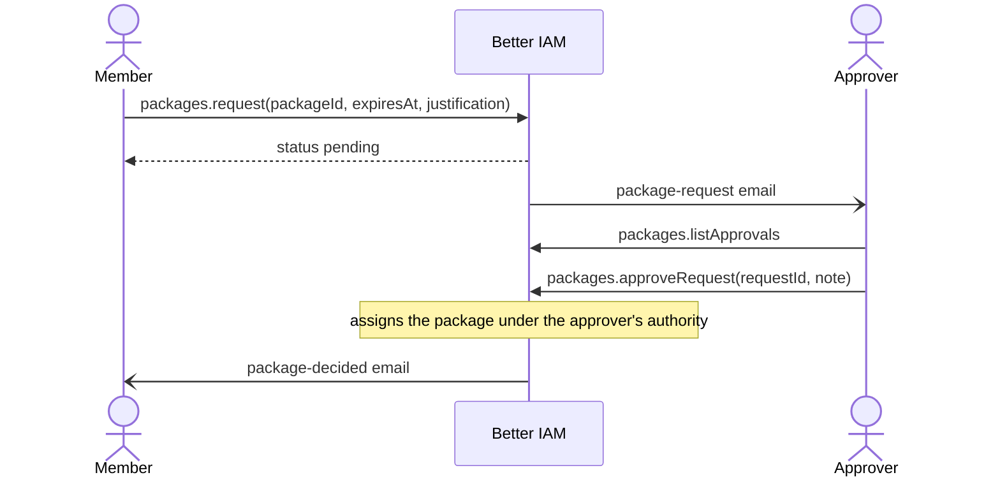
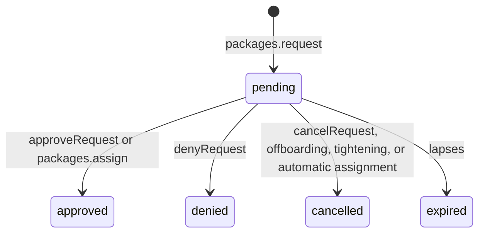

Some access always comes as a set. A new engineer needs the Reader role and the Engineering group; a contractor
needs a vendor profile for the length of the contract; a project member needs the project's roles and channels.
Granting those parts one by one is slow, and removing them later is worse: somebody has to remember every piece.

An <Term id="access-package">access package</Term> names such a set once. _Assigning_ it to a person grants every
part as ordinary <Term id="binding">role bindings</Term> and group memberships in one transaction, all ending on
the same date. Revoking the assignment, or reaching its end date, takes exactly that set away again and nothing
else. Members can also _request_ a package themselves, and an approver decides.

A package is a convenience, never a bypass: whoever assigns or approves it still needs the right to grant each
part by hand.

## Define a package

`packages.create` defines what a package contains and the rules for granting it. It needs
`iam:packages:create`.

```ts title="An onboarding kit"
const kit = await iam.api.packages.create(credential, {
  tenantId,
  name: 'Engineering onboarding',
  description: 'Reader role and the Engineering group',
  roleIds: [reader.id],
  groupIds: [engineering.id],
  maxDurationMs: 365 * 86400_000,
  requireJustification: true,
});
```

<TypeTable
  type={{
    name: {
      type: 'string',
      description: 'The name administrators and members see, such as "Engineering onboarding". Unique per tenant.',
      required: true,
    },
    description: {
      type: 'string',
      description: 'What the package is for. Shown to administrators and to members who may request it.',
    },
    roleIds: {
      type: 'string[]',
      description: 'Roles to grant; each becomes an identity binding of the assignment. At most 50; protected roles cannot be packaged.',
    },
    groupIds: {
      type: 'string[]',
      description: 'Groups to join; each becomes a membership. At most 50. A package needs at least one role or group.',
    },
    maxDurationMs: {
      type: 'number',
      description: 'Makes an end date mandatory and caps how far out it may be, from a minute to ten years. Use it for contractor or vendor access. It cannot be combined with an autoAssign rule.',
    },
    requireJustification: {
      type: 'boolean',
      description: 'Every assignment and request must state why, such as a ticket or contract number.',
      default: 'false',
    },
    requestable: {
      type: 'boolean',
      description: 'Members holding iam:packages:request may ask for the package themselves.',
      default: 'false',
    },
    approverGroupId: {
      type: 'string | null',
      description: 'Group whose members decide on requests and are emailed them. Without it, anyone holding iam:packages:approve decides.',
    },
    managerApproval: {
      type: 'boolean',
      description: "The requester's manager may decide on requests and is emailed each one.",
      default: 'false',
    },
    autoAssign: {
      type: 'AutoAssignInput',
      description: 'A birthright rule that assigns the package to every matching identity, such as everyone in a department. See Automatic assignment.',
    },
  }}
/>

The other definition calls:

- `packages.update` changes a package's contents or rules. `null` clears the description, the duration cap, or
  the approver group. Content changes apply to future assignments only (automatic holders are updated too).
- `packages.list` and `packages.get` return packages with their live holder counts, for an overview page.
- `packages.delete` removes a package nobody holds; while someone holds it, it fails with `RESOURCE_IN_USE`.

## Assign and revoke

Administrators grant a package with `packages.assign`, move its end date with `packages.extend`, and take it away
with `packages.revoke`:

```ts title="Assign for a contract, then extend or revoke"
const assignment = await iam.api.packages.assign(credential, {
  tenantId,
  packageId: kit.id,
  identityId: newHire.id,
  expiresAt: Date.parse('2027-06-30T18:00:00Z'),
  justification: 'Joined the platform team (HR-2291)',
});
// assignment.created: { bindings, memberships }, assignment.skipped: groups left alone

// The contract was extended.
await iam.api.packages.extend(credential, {
  tenantId,
  packageId: kit.id,
  identityId: newHire.id,
  expiresAt: Date.parse('2027-12-31T18:00:00Z'), // or null for no end
});

// The project ended early.
await iam.api.packages.revoke(credential, { tenantId, packageId: kit.id, identityId: newHire.id });
```

### What an assignment creates

`packages.assign({ tenantId, packageId, identityId, expiresAt?, justification? })` turns every role into an
ordinary identity binding and every group into an ordinary membership, all ending at `expiresAt`. They are created
under the caller's <Term id="authority">grant authority</Term> and tagged with the assignment. The details matter
when a person already has some of the access:

- **Rights.** The caller needs `iam:packages:assign` on the package plus what the direct calls need:
  `iam:bindings:create` on each role and `iam:groups:update` on each group. A package never widens what its
  assigner could grant by hand.
- **Roles.** Each role becomes a binding of the assignment's own, even when the person already holds the role
  another way. A package never depends on, replaces, or removes a binding granted by hand.
- **Groups.** A group has one membership record per person. A membership that already lasts at least as long is
  left alone and reported in `skipped`; a shorter one is extended and becomes the assignment's. When two packages
  of the same person share a group, the membership belongs to whichever needs it longest and passes to the other
  when that one is revoked or shortened.
- **Hand edits.** Editing a package's binding or membership by hand (`bindings.update`, `groups.updateMember`,
  re-adding a lapsed member) takes the record over: revoking the package no longer removes it.
- **Rules.** `maxDurationMs` makes an end date mandatory and caps it, and `requireJustification` makes the
  justification mandatory (`INVALID_INPUT` otherwise).
- **Repeat assignments.** Assigning a package the person already holds by hand fails with `CONFLICT`. Assigning
  one they hold through a package rule takes it over as a manual assignment (`replacedAutomatic: true`). An
  assignment whose bindings no longer grant, for example because its assigner's authority was revoked when they
  were offboarded, is reported as `broken` and may simply be assigned or requested again.

### Ending an assignment

- **Revoke.** `packages.revoke({ tenantId, packageId, identityId })` removes exactly the records the assignment
  added. It needs only `iam:packages:assign` on the package, because the assignment owns those records whichever
  authority issued them.
- **Expire.** An assignment ends by itself at `expiresAt`. The purge worker later sweeps it together with its
  bindings and memberships.
- **Extend or shorten.** `packages.extend({ tenantId, packageId, identityId, expiresAt })` moves the end of the
  assignment and everything it created at once. Shortening needs only `iam:packages:assign`. Lengthening (or
  `null`, no end) is granting, so it needs the same rights as `assign` plus a grant authority, and the package's
  bindings move to the extender's authority so the longer grant is bounded by what the extender may give.
- **Leave.** Offboarding or deleting an identity removes its assignments.

An assignment made by a [package rule](/docs/guides/privileged-access/automatic-assignment) follows the rule
instead: `packages.revoke` refuses it while the rule exists, and `packages.extend` always refuses it
(`INVALID_TRANSITION`). To take the package from one person, exclude them in the rule. To give them a fixed end,
assign the package to them by hand, which turns the assignment into a manual one.

### Who holds what

`packages.listAssignments({ packageId?, identityId?, includeExpired?, source? })` lists holders, for a package's
holder list or a person's detail page. `source` is `automatic` or `manual`, and the call needs
`iam:packages:read`. A role or group cannot be deleted while a package includes it, nor a package while someone
holds it (`RESOURCE_IN_USE`).

Assignments are audited as `package:assign` (with the counts, the skips, and the justification),
`package:revoke`, and `package:extend`. The console lists packages, their holders, and the requests on the Access
packages page.

## Self-service requests

Administrators should not be the bottleneck for routine access. Mark a package `requestable` and members ask for
it themselves, from the console's Elevate page or your own UI. The approvers are emailed, decide from the same
page, and approval assigns the package under their authority.



```ts title="Request and decide"
const request = await iam.api.packages.request(memberCredential, {
  tenantId,
  packageId: vendorProfile.id,
  expiresAt: Date.parse('2027-03-31T00:00:00Z'),
  justification: 'Statement of work SOW-17',
});

const waiting = await iam.api.packages.listApprovals(approverCredential, { tenantId });
await iam.api.packages.approveRequest(approverCredential, {
  tenantId,
  requestId: request.id,
  note: 'Approved for the contract term',
});
```

### Asking

`packages.request({ tenantId, packageId, expiresAt?, justification? })` records a request for the signed-in
member. It needs `iam:packages:request` on the package and the member's own ordinary session of the tenant (not an
assumed role, not impersonation). The end-date and justification rules are the same as for assigning.

- The request waits for the tenant's `approvalLifetimeMs` (one day by default, from the
  [access policy](/docs/guides/privileged-access/elevation#tenant-access-policy)), but never beyond the end it asks
  for.
- Asking for a package the person already holds, or already asked for, fails with `CONFLICT`. Asking for a package
  that is not requestable fails with `INVALID_TRANSITION`.
- A request that names approvers but would reach none (an empty approver group, or `managerApproval` without an
  active manager) is refused with `INVALID_TRANSITION`, rather than waiting for nobody.
- `packages.cancelRequest({ tenantId, requestId })` withdraws one's own pending request, for example when the need
  went away.

Grant `iam:packages:request` through a group every member belongs to, as with `iam:bindings:activate`.

### Deciding

- `packages.approveRequest({ tenantId, requestId, expiresAt?, note? })` grants a request: it assigns the package
  to the requester under the approver's authority, until the end the requester asked for unless the approver
  chooses another. The approver therefore needs the same rights as `assign` (`iam:bindings:create` on each role,
  `iam:groups:update` on each group).
- `packages.denyRequest({ tenantId, requestId, note? })` refuses a request, with an optional note explaining why.
- Both need `iam:packages:approve` on the package. When the package names approvers, the decider must also be a
  member of the approver group or, with `managerApproval`, the requester's manager. Root always may.
- Nobody decides on their own request, and decisions cannot be made from an
  <Term id="impersonation">impersonation</Term> session (`IMPERSONATION_RESTRICTED`).

Two email templates keep people informed. `package-request` goes to the named approvers when a request is recorded,
so they can decide. `package-decided` goes to the requester when the request is approved or denied.

### Request lifecycle



- Tightening a package (turning `requestable` off, requiring a justification, or capping the duration) cancels
  the pending requests that no longer fit, with the reason as the note.
- A direct `packages.assign` marks the person's pending request for the package approved, and an automatic
  assignment cancels it.
- `packages.listRequests` reports a lapsed request as `expired` before the purge worker marks it. Offboarding
  cancels pending requests.

### Views

| Call                                                                      | Who            | What it shows, and when to use it                                                                      |
| ------------------------------------------------------------------------- | -------------- | ------------------------------------------------------------------------------------------------------ |
| [`packages.listMine`](/docs/reference/api/packages#listmine)              | Members        | Requestable packages with the member's status on each (held, awaiting approval, or open to request), plus their assignments and recent requests. Build a "Request access" screen from it. |
| [`packages.listApprovals`](/docs/reference/api/packages#listapprovals)    | Approvers      | Requests awaiting them, limited to packages they hold `iam:packages:approve` on. Build an approvals inbox from it. |
| [`packages.listRequests`](/docs/reference/api/packages#listrequests)      | Administrators | Requests filtered by `packageId`, `identityId`, and `status`; needs `iam:packages:read`. Use it to audit who asked for what. |

The request flow is audited as `package:request`, `package:request-approved`, `package:request-denied`, and
`package:request-cancelled`. The [lifecycle events](/docs/guides/events/lifecycle-events) page lists their
metadata.

## Automatic assignment

Some packages should simply follow the directory: everyone in engineering gets the engineering kit, every service
account gets the integration profile. A package with an `autoAssign` rule is given to every active identity that
matches it and taken away from automatic holders that stop matching. Rules run under their owner's authority, are
re-applied when identities change and on a schedule, and hold back unusually large changes until someone confirms
them.

<Cards>
  <Card title="Automatic assignment" href="/docs/guides/privileged-access/automatic-assignment">
    Rule language, ownership, reconciliation, grace periods, and the safety brake.
  </Card>
</Cards>

## Packages as code

Packages can live in a reviewed [configuration document](/docs/guides/privileged-access/config-as-code) with the
rest of the access model. They are carried by name; who holds a package is runtime state and never synced.

```json title="tenant.json (excerpt)"
{
  "version": 1,
  "packages": [
    {
      "name": "Engineering onboarding",
      "roles": ["Reader"],
      "groups": ["Engineering"],
      "maxDurationMs": 31536000000,
      "requireJustification": true,
      "requestable": true,
      "approverGroup": "Platform team",
      "managerApproval": false
    }
  ]
}
```

## Packages from role mining

You may not know which sets of access belong together. [Role mining](/docs/guides/governance/usage-and-mining)
finds role combinations many people hold together (`bundle` suggestions). Grant them as one package with
`packages.create`, optionally assigned automatically by attribute. The console's Role mining page has a Create
package button for this.

## Next steps

<Cards>
  <Card title="Automatic assignment" href="/docs/guides/privileged-access/automatic-assignment">
    Give a package to everyone who matches a rule.
  </Card>
  <Card title="Access report" href="/docs/guides/privileged-access/access-report">
    See which package assignments end soon.
  </Card>
  <Card title="Packages API" href="/docs/reference/api/packages">
    Every packages method with its signature.
  </Card>
</Cards>
