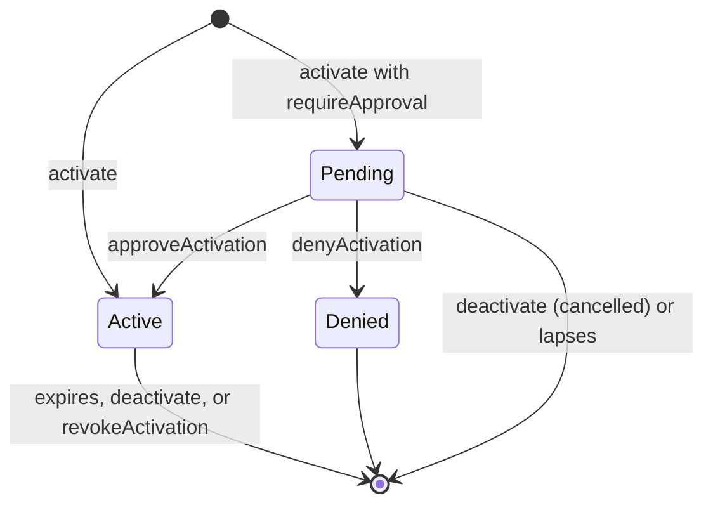
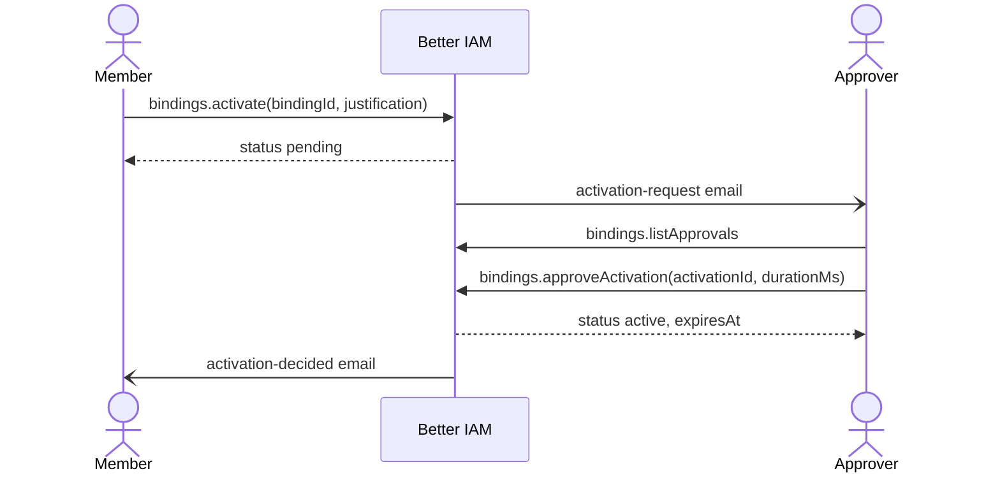

Administrator and production roles are dangerous to hand out permanently. A stolen session of someone who holds
them all the time is a stolen administrator. But taking the roles away entirely means a ticket and a wait every
time someone needs them, so in practice they stay granted.

Just-in-time elevation removes that trade-off. You give people an
<Term id="eligible-binding">eligible binding</Term>: a record that they may take a role, which grants nothing by
itself. When they need the role, they activate the binding for a limited time (an
<Term id="activation">activation</Term>), optionally stating a reason, proving MFA, or waiting for a second person
to approve. When the time runs out, the role is gone. Nobody carries the privilege around, and every elevation
leaves a record with a reason.

## Make a role eligible

Create a binding as usual and add `eligible: true` plus the rules each activation must satisfy. The subject can
be a person or a group; with a group, every live member may activate it.

```ts title="Eligible bindings"
// The on-call group may take the incident-response role for up to two hours, with a reason and MFA.
await iam.api.bindings.create(credential, {
  tenantId,
  roleId: responder.id,
  subjectType: 'group',
  subjectId: onCall.id,
  eligible: true,
  maxActivationMs: 2 * 3_600_000,
  requireJustification: true,
  requireMfa: true,
});

// Production administration also needs a second person: the platform team approves.
await iam.api.bindings.create(credential, {
  tenantId,
  roleId: productionAdmin.id,
  subjectType: 'group',
  subjectId: engineers.id,
  eligible: true,
  requireApproval: true,
  approverGroupId: platformTeam.id,
});
```

<TypeTable
  type={{
    eligible: {
      type: 'boolean',
      description: 'Makes the binding eligible: it grants nothing until its subject activates it with bindings.activate.',
      default: 'false',
    },
    maxActivationMs: {
      type: 'number',
      description: 'The longest activation a member may ask for, from one minute to seven days. An approver may grant a different duration, but never more than this maximum.',
      default: '3600000 (one hour)',
    },
    requireJustification: {
      type: 'boolean',
      description: 'The member must state a reason, such as a ticket number. It is stored on the activation and in the audit trail.',
      default: 'false',
    },
    requireMfa: {
      type: 'boolean',
      description: 'Only a session that completed MFA may activate; password-only sessions are refused with MFA_REQUIRED.',
      default: 'false',
    },
    requireApproval: {
      type: 'boolean',
      description: 'Activation becomes a request that an approver grants or denies. Nobody approves their own.',
      default: 'false',
    },
    approverGroupId: {
      type: 'string | null',
      description: 'Only members of this group (or a root administrator) may decide, and they are emailed each request. null clears it.',
    },
    managerApproval: {
      type: 'boolean',
      description: "The requester's manager may decide as well, and is emailed each request.",
      default: 'false',
    },
  }}
/>

Activation settings only make sense on eligible bindings: passing them for a standing binding fails with
`INVALID_INPUT` (explicit `false` flags are accepted, so forms can send every checkbox). Use `bindings.update` to
change the rules later. `bindings.update({ eligible: false })` turns the binding back into a standing one, clears
its activation settings, and ends every activation of it.

## Activate

When a member needs the role, they call `bindings.activate` with the binding, how long they need it, and a reason.
The result is an activation record; while it is live, the role applies.

```ts title="Elevate, work, step down"
const activation = await iam.api.bindings.activate(memberCredential, {
  tenantId,
  bindingId: eligibleBinding.id,
  justification: 'INC-4211',
  durationMs: 30 * 60_000,
});
// activation: { id, status: 'active', active: true, activatedAt, expiresAt, ... }

// Done early? Step down so the role stops applying now.
await iam.api.bindings.deactivate(memberCredential, { tenantId, activationId: activation.id });
```

`bindings.activate` checks, in order of what most often goes wrong:

- **Permission.** The caller needs `iam:bindings:activate` on the role (`iam/{roleId}`), so a tenant can scope
  which roles a person may activate.
- **Session.** The call must come from the person's own ordinary session of the tenant. Assumed-role sessions are
  refused with `INVALID_INPUT`, and an administrator using <Term id="impersonation">impersonation</Term> to view
  the product as a member cannot activate for them (`IMPERSONATION_RESTRICTED`).
- **Binding.** The binding must apply to the caller, directly or through a group they belong to (`ACCESS_DENIED`
  otherwise), and must still be eligible and live (`INVALID_TRANSITION`).
- **Duration.** `durationMs` defaults to the effective maximum. It must lie between one minute and that maximum;
  a longer or shorter value fails with `INVALID_INPUT` rather than being shortened.
- **Rules.** Without a justification when one is required, the call fails with `INVALID_INPUT` (justifications
  are at most 2048 characters). Without MFA when it is required, it fails with `MFA_REQUIRED`.
- **One at a time.** There is one live activation per binding and person. Activating again while one is live, or
  while a request is still waiting, fails with `CONFLICT` (409).

The result carries `status` (`active`, `pending` for a request awaiting approval, or `denied`), `active` (whether
it grants right now), `activatedAt`, `expiresAt`, and the `justification`.

### While an activation is live

The role behaves exactly like a standing binding. Authorization decisions, `principal.roles` in policy
conditions, reviews such as `whoCan` and `effectiveActions`, and `identities.listBindings` (which shows the
`activation`) all see it.

### How an activation ends

An activation stops granting at the next request when any of these happens:

- It reaches its `expiresAt`. This is the normal case: nobody has to do anything.
- The holder calls `bindings.deactivate`. Use it to step down when the work is done early.
- An administrator calls `bindings.revokeActivation`. Use it for incident response, when someone's elevated
  access must end now. It needs `iam:bindings:delete` on the binding and the binding's own
  <Term id="authority">grant authority</Term> (or root), like deleting the binding.
- The holder leaves the group, the binding or role is deleted, or eligibility is turned off.

The purge worker deletes ended activations from storage later; they grant nothing in the meantime.



## Approval-gated activation

For the most sensitive roles, a reason and MFA are not enough: you want a second person to agree before anyone
elevates. This is _two-person control_. With `requireApproval`, `bindings.activate` records a request instead of
activating, and the role becomes live only when an approver says yes.



```ts title="Request and approve"
const pending = await iam.api.bindings.activate(engineerCredential, {
  tenantId,
  bindingId,
  justification: 'CHG-88',
});

// The approver sees what awaits them and decides, optionally for a different duration.
const queue = await iam.api.bindings.listApprovals(platformCredential, { tenantId });
await iam.api.bindings.approveActivation(platformCredential, {
  tenantId,
  activationId: pending.id,
  durationMs: 45 * 60_000,
  note: 'Approved for the change window',
});
```

The calls involved:

- `bindings.activate` with `requireApproval` returns a request with `status: 'pending'`. It lapses after the
  tenant's `approvalLifetimeMs` (24 hours by default) if nobody decides.
- `bindings.listApprovals` shows an approver the requests they may decide on, never their own. It powers an
  approver's inbox and needs `iam:bindings:approve` on the tenant.
- `bindings.approveActivation({ activationId, durationMs?, note? })` grants a request. The role is live from that
  moment for the requested duration, or for another `durationMs` the approver chooses, from one minute up to the
  binding's effective maximum.
- `bindings.denyActivation({ activationId, note? })` refuses a request, with an optional note explaining why.
- `bindings.deactivate` lets the requester withdraw their own request. It is audited as `binding:deactivate`
  with `cancelled: true`.

Both decisions need `iam:bindings:approve` on the role. Notes are at most 2048 characters. The safeguards:

- Nobody decides on their own request (`INVALID_INPUT`).
- Nobody decides from an impersonation session (`IMPERSONATION_RESTRICTED`), so an administrator viewing the
  product as an approver cannot approve in their name.
- Only a request that is still waiting can be decided, and only while its binding is still eligible
  (`INVALID_TRANSITION`, 409).

Members see their own waiting request as `pendingActivation` in `bindings.listMine`. Administrators list requests
and refusals with `bindings.listActivations({ status: 'pending' })` or `({ status: 'denied' })`.

### Approver groups and managers

By default, anyone holding `iam:bindings:approve` on the role may decide. Name the approvers when only specific
people should:

- `approverGroupId`: only live members of that group, or a root administrator, may decide. Use it for a platform
  or security team that owns production access.
- `managerApproval`: the requester's manager (`Identity.managerId`) may decide as well. Use it when the person
  who knows the requester's work should sign off.

The approvers named this way are emailed each request; the requester is never among them. A request that names
approvers must reach at least one active one. When the approver group is empty and the requester has no active
manager, activation fails with `INVALID_TRANSITION` (409) instead of creating a request nobody can answer.

Managers are set with `managerId` on `identities.create` or `identities.update`, and SCIM can maintain it.
`identities.listReports` lists a manager's reports, and offboarding hands a leaver's reports to the successor.

### Emails

When the deployment sends email, two templates keep people informed without them watching a console:

- `activation-request` goes to each approver when a request is recorded, so they can decide promptly.
- `activation-decided` goes to the requester when a request is approved or denied, so they know whether to start
  working.

Both carry the activation, role, requester, justification, and decision, so your application can render them
however it likes.

## Tenant access policy

Setting the same rules on every eligible binding is repetitive, and one forgotten binding is a gap. The
<Term id="tenant-access-policy">tenant access policy</Term> sets minimum rules, or floors, for every eligible
binding of an organization at once. A binding may
be stricter than the policy, never looser, so adopting a floor later tightens existing bindings without editing
them.

`tenants.setAccessPolicy` sets it (console: "Elevation defaults" on the Configuration page):

```ts title="Organization-wide floors"
await iam.api.tenants.setAccessPolicy(credential, {
  tenantId,
  accessPolicy: {
    maxActivationMs: 4 * 3_600_000,
    requireJustification: true,
    requireMfa: true,
    approvalLifetimeMs: 8 * 3_600_000,
  },
});
// accessPolicy: null clears the policy.
```

<TypeTable
  type={{
    maxActivationMs: {
      type: 'number',
      description: "Caps every binding's own maximum activation length, from one minute to seven days.",
    },
    requireJustification: {
      type: 'boolean',
      description: 'Every activation in the organization must state a justification.',
    },
    requireMfa: {
      type: 'boolean',
      description: 'Every activation needs a session that completed MFA.',
    },
    requireApproval: {
      type: 'boolean',
      description: 'Every activation starts as an approval request.',
    },
    approvalLifetimeMs: {
      type: 'number',
      description: 'How long an activation or package request waits for a decision before it lapses, from five minutes to thirty days.',
      default: '86400000 (one day)',
    },
  }}
/>

The effective rules for a binding are its own settings tightened by the policy: a flag is on when either sets it,
and the maximum length is the smaller of the two. Unknown fields are refused. Setting the policy needs
`iam:tenants:update` and recent authentication, and is audited as `tenant:access-policy`. The policy can also live
in a [configuration document](/docs/guides/privileged-access/config-as-code) as `accessPolicy`.

## Who may activate and approve

Activation and approval are ordinary permissions, so you decide who elevates and who approves with roles:

- `iam:bindings:activate` on `iam/{roleId}` lets a member activate an eligible binding of that role. On `*` it
  lets them activate any role they are eligible for, and on the tenant it also allows `bindings.listMine`.
- `iam:bindings:approve` on `iam/{roleId}` lets a person decide requests for that role. On the tenant it also
  allows `bindings.listApprovals`.

The usual shape is a _Member_ role bound to a group every person belongs to, and an _Approver_ role bound to the
approver group:

```ts title="Member and Approver roles"
const member = await iam.api.roles.create(credential, {
  tenantId,
  name: 'Member',
  permissions: ['iam:bindings:activate'],
});
await iam.api.bindings.create(credential, {
  tenantId,
  roleId: member.id,
  subjectType: 'group',
  subjectId: everyone.id,
});

const approver = await iam.api.roles.create(credential, {
  tenantId,
  name: 'Approver',
  permissions: ['iam:bindings:approve'],
});
await iam.api.bindings.create(credential, {
  tenantId,
  roleId: approver.id,
  subjectType: 'group',
  subjectId: platformTeam.id,
});
```

Because a member cannot approve their own request and the binding can name the approver group, approval gives
you two-person control for the roles that need it.

## Views for members and administrators

Each audience has a read that shows exactly what it needs:

| Call                                                                         | Who             | What it shows, and when to use it                                                              |
| ---------------------------------------------------------------------------- | --------------- | ----------------------------------------------------------------------------------------------- |
| [`bindings.listMine`](/docs/reference/api/bindings#listmine)                 | Members         | Their own bindings, standing and eligible, with the live activation and any waiting request. Build an "Elevate" screen from it. |
| [`bindings.listApprovals`](/docs/reference/api/bindings#listapprovals)       | Approvers       | Waiting requests they may decide on, with the role and requester. Build an approvals inbox from it. |
| [`bindings.listActivations`](/docs/reference/api/bindings#listactivations)   | Administrators  | Live activations by default; requests or refusals with `status`; ended ones with `includeExpired`. Use it to see who is elevated right now. |
| [`bindings.list`](/docs/reference/api/bindings#list)                         | Administrators  | Bindings; `eligible: true` or `false` separates eligible from standing ones. Use it to audit which roles are standing. |
| [`identities.listBindings`](/docs/reference/api/identities#listbindings)     | Administrators  | One person's effective bindings with `activation`, `pendingActivation`, and `inWindow`. Use it on a member's detail page. |

`bindings.listMine` needs no `iam:bindings:read`, only `iam:bindings:activate` on the tenant, so members can see
what they may elevate to without seeing everyone else's access. It must be called from an ordinary session of the
tenant. The console's Elevate page is built this way: eligible roles with their rules, the activation form,
pending requests, and, for approvers, the requests awaiting their decision.

## Audit and alerting

Every step is recorded in the audit log, so you can alert on elevation as it happens and answer "who was an
administrator on Tuesday, and why?" later:

| Event                          | What happened, and why you would care                                                                                              |
| ------------------------------ | ---------------------------------------------------------------------------------------------------------------------------------- |
| `iam:bindings:activate`        | The activation call ran. It is the operation record every API call leaves.                                                          |
| `binding:activate`             | A member activated a binding and now holds the role, with `activationId`, `roleId`, `expiresAt`, and the justification. Alert on it to see every elevation. |
| `binding:activation-requested` | Activation needs approval and a request was recorded. Page approvers or open a ticket.                                              |
| `binding:activation-approved`  | An approver granted a request. Keep it as evidence of two-person control.                                                           |
| `binding:activation-denied`    | An approver refused a request. Tell the requester, or watch for repeated refusals.                                                  |
| `binding:deactivate`           | An activation ended early: `cancelled: true` for a withdrawn request, `revoked: true` when an administrator ended it, which often means incident response. |

Subscribe a <Term id="webhook">webhook</Term> to `binding:*` to alert on every elevation, or query the audit log
for a member's history.
The member page in the console shows it as "Activation history".

```ts title="Alert on elevation"
await iam.api.webhooks.create(credential, {
  tenantId,
  url: 'https://ops.example.com/hooks/iam',
  events: ['binding:*'],
});
```

The access analysis points out where eligibility would help. It reports people with a direct, permanent binding
to a full administration role (`standing-privileged-access`) and eligible bindings nobody activated within the
dormancy window (`unused-eligible-binding`), which may not be needed at all. See
[access reviews](/docs/guides/authorization/reviews).

<Cards>
  <Card title="Lifecycle events" href="/docs/guides/events/lifecycle-events">
    Metadata of every binding event.
  </Card>
  <Card title="bindings API reference" href="/docs/reference/api/bindings">
    Signatures and HTTP routes for activation and approval.
  </Card>
</Cards>
