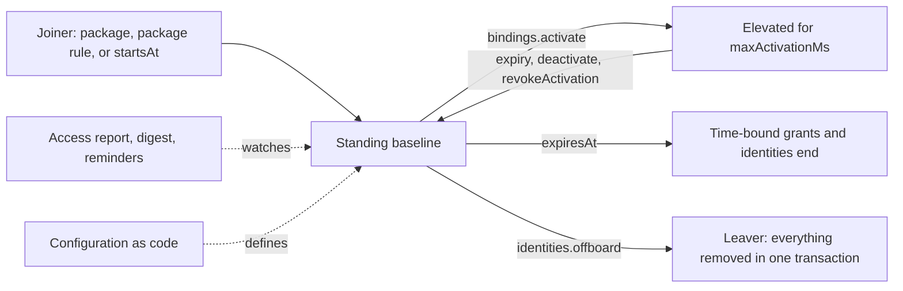

import { CalendarClock, ClipboardList, FileCode, KeyRound, Package, RefreshCw } from '@/lib/icons';

Most breaches and audit findings involve access that nobody needed any more: an administrator role granted for
one incident and never removed, a contractor account that outlived the contract, an API key nobody remembers
issuing. The longer powerful access sits unused, the more likely it is to be misused or stolen.

The privileged access features attack that problem from two sides. They keep
<Term id="standing-privilege">standing privilege</Term> (powerful access someone holds all the time) close to
zero, and they put an end date on access so it goes away without anyone remembering to remove it. This section explains how the pieces fit; the
[authorization guides](/docs/guides/authorization) cover the building blocks such as
[roles](/docs/guides/authorization/roles) and [temporary access](/docs/guides/authorization/temporary-access).

## Standing versus eligible roles

A <Term id="binding">role binding</Term> connects a role to a person or group. By default a binding is
_standing_: the role applies whenever the binding exists. That is right for everyday access, such as an editor
role for a writer, but wrong for an administrator role that is needed a few times a month.

Three properties narrow a binding without changing the role:

| Property    | What it does                                                                                                                                  | When to use it                                   |
| ----------- | --------------------------------------------------------------------------------------------------------------------------------------------- | ------------------------------------------------ |
| `startsAt`  | Future-dates the binding. It is listed with its start date but grants nothing until then.                                                      | Access that begins on the first day of a contract. |
| `expiresAt` | Makes the binding temporary. It stops granting at that instant and the purge worker deletes it. Group memberships can carry an `expiresAt` too, which ends every grant and activation the membership carried. | Projects, contracts, and anything with a known end. |
| `window`    | Makes the binding recurring (`{ from, to, timeZone, days? }`): it applies only inside the hours and days you name, in that time zone.            | Support staff who work business hours.           |

An <Term id="eligible-binding">eligible binding</Term> (`eligible: true`) goes further. It records that someone
_may_ hold a role, but grants nothing by itself. When the person needs the role, they _activate_ the binding with
`bindings.activate`, and the role applies only for a bounded time: `maxActivationMs`, one hour by default and
seven days at most. Each such period is an <Term id="activation">activation</Term>.

Use eligibility for administrator, auditor, incident-response, and production-access roles. The person is
entitled to the role but holds it only while they need it, and every activation leaves a record with a reason.

```ts title="Engineers may take the production admin role for up to two hours"
await iam.api.bindings.create(credential, {
  tenantId,
  roleId: productionAdmin.id,
  subjectType: 'group',
  subjectId: engineers.id,
  eligible: true, // [!code highlight]
  maxActivationMs: 2 * 3_600_000,
  requireJustification: true,
  requireMfa: true,
});
```

[Just-in-time elevation](/docs/guides/privileged-access/elevation) covers activation, approvals, approver
groups, and the organization-wide rules.

## The lifecycle at a glance

Access has a life: it starts when someone joins or takes on a task, changes as they work, and should end when
they move on. Each stage has a feature that makes it automatic.



- **Joining.** An <Term id="access-package">access package</Term> is a named set of roles and group memberships
  granted together, such as an onboarding kit. [Assigning a package](/docs/guides/privileged-access/access-packages)
  grants the whole set in one call, a [package rule](/docs/guides/privileged-access/automatic-assignment) grants
  it to everyone who matches (for example everyone in engineering), and `startsAt` lets access begin on a set day.
- **Working.** The everyday baseline is small. Privileged roles are eligible and activated for a bounded time,
  with a justification, MFA, or a second person's approval.
- **Changing.** `expiresAt` ends identities, bindings, memberships, and package assignments by themselves. The
  [access report](/docs/guides/privileged-access/access-report) shows what ends soon, and its emails tell owners
  and the people themselves.
- **Leaving.** [`identities.offboard`](/docs/guides/privileged-access/lifecycle#offboarding) disables a person and
  removes everything that granted them access in one transaction, handing what they owned to a successor.

Every step is audited. The [lifecycle events](/docs/guides/events/lifecycle-events), such as `binding:activate`
when someone elevates or `identity:expire` when an account runs out, can be sent to a
<Term id="webhook">webhook</Term> for alerting.

## In this section

<Cards>
  <Card icon={<KeyRound />} title="Just-in-time elevation" href="/docs/guides/privileged-access/elevation">
    Eligible bindings with activation rules, approval, approver groups, and tenant-wide floors.
  </Card>
  <Card icon={<CalendarClock />} title="Access lifecycle" href="/docs/guides/privileged-access/lifecycle">
    Time-bound identities, temporary memberships, API key hygiene, and offboarding.
  </Card>
  <Card icon={<Package />} title="Access packages" href="/docs/guides/privileged-access/access-packages">
    Roles and groups granted as one set, assigned by administrators or requested by members.
  </Card>
  <Card icon={<RefreshCw />} title="Automatic assignment" href="/docs/guides/privileged-access/automatic-assignment">
    Birthright rules that give a package to everyone who matches and take it away when they stop.
  </Card>
  <Card icon={<ClipboardList />} title="Access report" href="/docs/guides/privileged-access/access-report">
    What ends soon, what is elevated now, and which keys nobody uses, with digest and reminder emails.
  </Card>
  <Card icon={<FileCode />} title="Configuration as code" href="/docs/guides/privileged-access/config-as-code">
    Export, plan, and apply the access model as one reviewed document, and fail CI on drift.
  </Card>
</Cards>

## Putting it together

A common baseline for an organization, in five steps:

<Steps>
<Step>

### Nobody holds a standing administrator role

Put everyone in an _Everyone_ group and give that group a _Member_ role with `iam:bindings:activate`, the
permission to activate bindings one is eligible for. Add `iam:packages:request` if members may ask for access
packages themselves.

```ts
const member = await iam.api.roles.create(credential, {
  tenantId,
  name: 'Member',
  permissions: ['iam:bindings:activate', 'iam:packages:request'],
});
await iam.api.bindings.create(credential, {
  tenantId,
  roleId: member.id,
  subjectType: 'group',
  subjectId: everyone.id,
});
```

</Step>
<Step>

### Privileged roles are eligible

Bind administrator and production roles to the relevant groups as eligible, with `requireJustification` and
`requireMfa`. For the most sensitive roles add `requireApproval` with a named approver group, so a second person
signs off every activation. A [tenant access policy](/docs/guides/privileged-access/elevation#tenant-access-policy)
can make these rules the minimum for every eligible binding at once.

</Step>
<Step>

### Contractors and integrations expire

Give contractors an `expiresAt`, so their accounts stop working on the last day of the contract. Give
integrations scoped, labeled API keys whose last use you can review. See
[access lifecycle](/docs/guides/privileged-access/lifecycle).

</Step>
<Step>

### A nightly job keeps it honest

Schedule three jobs. `purge` (`iam.purgeDeleted()`) disables expired identities and deletes expired grants.
`report` prints the [access report](/docs/guides/privileged-access/access-report) for a channel or ticket.
`config-plan --fail-on-drift` fails when production no longer matches the reviewed
[configuration file](/docs/guides/privileged-access/config-as-code). When the deployment sends email, add `digest`
(the report emailed to owners) and `remind` (a note to each person whose access ends soon). See
[scheduling](/docs/guides/governance/scheduling).

```sh
better-iam purge --config better-iam.config.mjs
BETTER_IAM_TOKEN=... better-iam report --config better-iam.config.mjs --tenant TENANT_ID
BETTER_IAM_TOKEN=... better-iam config-plan --config better-iam.config.mjs --tenant TENANT_ID --input tenant.json --fail-on-drift
```

</Step>
<Step>

### Leavers are offboarded

When someone leaves, call `identities.offboard` with a successor. It disables the account, removes every grant,
and hands the resources and reports the leaver owned to the successor.

</Step>
</Steps>
