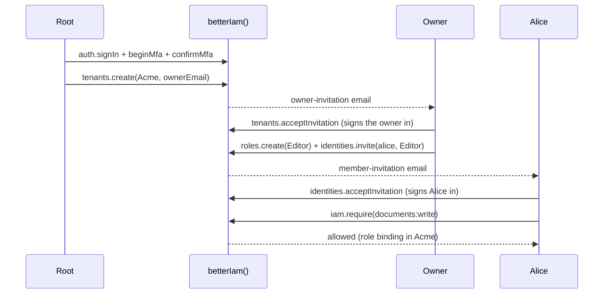

This walkthrough builds a working identity layer on SQLite in a few minutes: a configured instance, a migrated
database, a root administrator signed in with MFA, an organization with an owner, a custom role, and an enforced
authorization check. Every step uses the same APIs you will use in production.

<Callout title="Requirements">
  Node.js 22.12 or newer. Better IAM is ESM-only (set `"type": "module"` in your `package.json`) and ships
  TypeScript declarations. The SQLite adapter uses the
  native `better-sqlite3` driver and password hashing uses `argon2`, so your package manager must be allowed to run
  their install scripts. You also need an authenticator app (any TOTP app) for the root administrator's second
  factor.
</Callout>

<Steps>
<Step>

### Install

```npm
npm i better-iam
```

The umbrella package installs every `@better-iam/*` package except the Nuxt module, and exposes them as subpaths
such as `better-iam/adapter-sqlite`, `better-iam/client`, and `better-iam/next`. Protocol packages (OAuth, SAML,
SCIM) load only when you import their subpaths. See [Installation](/docs/guides/installation) to install
individual packages instead.

</Step>
<Step>

### Create a secret

Better IAM derives its signing and encryption keys from one deployment secret of at least 32 characters. Keep it
stable across restarts and processes, and store it like a database password.

```bash
node -e "console.log(require('node:crypto').randomBytes(32).toString('base64url'))"
```

```ini title=".env"
BETTER_IAM_SECRET=paste-the-generated-value-here
BETTER_IAM_BASE_URL=http://localhost:3000
```

Better IAM does not load `.env` files itself. Make these variables available to every process that loads the
configuration (your server, your scripts, and the CLI), for example with `export` in your shell or your
framework's `.env` support. Rotating the secret later is supported with `previousSecrets`; see
[Secrets](/docs/operations/deployment/secrets).

</Step>
<Step>

### Configure the instance

Put the options in a module whose default export is the configuration. Your application and the
`better-iam` CLI both load it, so migrations and jobs always see the same settings.

```ts twoslash title="better-iam.config.mjs"
// @noErrors
import { sqliteAdapter } from 'better-iam/adapter-sqlite';

export default {
  database: sqliteAdapter({ filename: './iam.db' }),
  secret: process.env.BETTER_IAM_SECRET,
  baseURL: process.env.BETTER_IAM_BASE_URL,
  authentication: {
    // Development only: print each invitation, link, and code, including its token. In production,
    // send the message with your mail provider, deduplicate retries by message.id, and never log payloads.
    sendEmail: async (message) => {
      console.log(message.template, message.to, message.payload);
    },
  },
  permissions: {
    resourceTypes: {
      document: {
        actions: ['documents:read', 'documents:write'],
        attributes: { ownerId: 'string' },
      },
    },
  },
  // Authorization calls this to learn which tenant owns one of your documents. Replace findDocument
  // with a lookup in your own database; never trust a tenant ID taken from the request.
  resolveResource: async ({ type, id }) => {
    const document = await findDocument(id);
    return { type, id, tenantId: document.tenantId, attributes: { ownerId: document.ownerId } };
  },
};
```

- `database` chooses the storage adapter, here a SQLite file.
- `secret` and `baseURL` come from the environment you set in the previous step.
- `authentication.sendEmail` delivers invitations, verification links, and codes. Creating an organization fails
  with `DELIVERY_REQUIRED` without it.
- `permissions.resourceTypes` declares the kinds of things your product protects and the actions that apply to
  them, so policies and roles that use these names are validated when they are saved.
- `resolveResource` loads the owner and attributes of your own records at decision time. `document` is an
  application-owned type (your database holds documents, not Better IAM), so checks on it fail with
  `RESOURCE_RESOLVER_REQUIRED` without a resolver. See
  [resources and catalog](/docs/guides/concepts/resources-and-catalog#application-owned-and-managed-resources).

Then create the instance your code imports:

```ts twoslash title="iam.ts"
// @noErrors
import { betterIam } from 'better-iam';
import config from './better-iam.config.mjs';

export const iam = betterIam(config);
```

</Step>
<Step>

### Migrate and bootstrap

`migrate` creates the schema. `bootstrap` creates the platform root tenant and its first administrator exactly
once. It reads the administrator's credentials from the environment, because secrets are never accepted as
command-line arguments.

```bash
npx better-iam migrate --config better-iam.config.mjs

export BETTER_IAM_ROOT_EMAIL=root@example.com
export BETTER_IAM_ROOT_NAME="Platform administrator"
export BETTER_IAM_ROOT_PASSWORD='a long root password' # at least 12 characters
npx better-iam bootstrap --config better-iam.config.mjs
```

`bootstrap` prints what it created as JSON:

```json
{
  "tenant": { "id": "3f2c9a4e-…", "name": "Platform", "type": "root", "status": "active", … },
  "identity": { "id": "usr_…", "email": "root@example.com", "rootAdmin": true, … },
  "mfaEnrollmentRequired": true
}
```

Copy `tenant.id`: it is the root tenant's ID, which the next steps call `rootTenantId`. Every sign-in names a
tenant, because the same email address can belong to separate identities in different tenants.

</Step>
<Step>

### Serve the HTTP API

The instance exposes a Web-standard `handler` and a Node `nodeHandler`. Mount either one; the typed browser client
and every framework integration talk to it under `/api/iam`.

```ts title="server.ts"
import { createServer } from 'node:http';
import { iam } from './iam';

createServer(iam.nodeHandler).listen(3000);
```

Emails are queued in the database with the change that caused them, and reach `sendEmail` only when
`iam.auth.dispatchOutbox()` runs. A deployment runs it on a schedule (see
[scheduled jobs](/docs/operations/jobs)); the setup script below calls it directly.

Using a framework? Skip this step and follow the [Next.js](/docs/frameworks/nextjs), [Nuxt](/docs/frameworks/nuxt),
[SvelteKit](/docs/frameworks/sveltekit), [NestJS](/docs/frameworks/nestjs), or
[Express, Hono, and Fastify](/docs/frameworks/node) guide.

</Step>
<Step>

### Sign in as the root administrator

Root authority always requires an MFA-verified session, so the root administrator can do nothing until it enrolls
an authenticator. Its first sign-in therefore returns a **challenge** with `enrollmentRequired: true` instead of a
session. The rest of this walkthrough is one setup script that calls `iam.api` directly, the way your backend and
admin tooling do; it starts by completing that enrollment.

```ts title="setup.ts"
import { createInterface } from 'node:readline/promises';
import { iam } from './iam';

const terminal = createInterface({ input: process.stdin, output: process.stdout });
const rootTenantId = '3f2c9a4e-…'; // tenant.id from the bootstrap output

// First factor: the password. The result is an MFA challenge, not a session.
const signIn = await iam.api.auth.signIn({
  tenantId: rootTenantId,
  email: process.env.BETTER_IAM_ROOT_EMAIL!,
  password: process.env.BETTER_IAM_ROOT_PASSWORD!,
});
if (!('mfaRequired' in signIn)) throw new Error('Expected an MFA challenge');
const challenge = { tenantId: rootTenantId, challenge: signIn.challenge };

// Second factor: add the secret to your authenticator app, then confirm the code it shows.
const { secret } = await iam.api.auth.beginMfa(challenge);
console.log('Authenticator key:', secret);
const code = await terminal.question('Six-digit code: ');
const { token: rootSessionToken, recoveryCodes } = await iam.api.auth.confirmMfa({
  credential: challenge,
  code,
});
console.log('Recovery codes (store them safely):', recoveryCodes);
```

- `auth.signIn` checks the password and returns either a session or, as here, an MFA challenge that is valid for
  five minutes. Enter the code before it expires.
- `auth.beginMfa` creates the authenticator secret. It also returns `uri`, an `otpauth://` link you can show as a
  QR code instead.
- `auth.confirmMfa` checks the first code, enables the factor, returns ten single-use recovery codes, and issues an
  MFA-verified session. Its `token` is the root's bearer token for the next steps.

If the root administrator ever loses both the authenticator and the recovery codes, `npx better-iam recover-root`
reads the same environment variables and creates a replacement root administrator. Give it an email address the
root tenant does not use yet.

</Step>
<Step>

### Create an organization

Tenants form a tree under the root, and each customer organization is a tenant with its own people and roles.
The root creates the organization and invites its owner by email. `tenants.create` needs recent authentication
(a session established within the last five minutes), which the session you just received has.

```ts title="setup.ts (continued)"
// A credential says who is calling: { token }, or { headers } from an incoming request.
const root = { token: rootSessionToken };

const { tenant } = await iam.api.tenants.create(root, {
  parentId: rootTenantId,
  type: 'organization',
  name: 'Acme',
  slug: 'acme', // a sign-in alias: tenants.lookup({ slug: 'acme' }) finds the tenant
  ownerEmail: 'owner@acme.test',
});

// Hand the queued owner-invitation email to sendEmail, which prints it with its token.
await iam.auth.dispatchOutbox();
const invitationToken = await terminal.question('Token from the owner-invitation: ');

// The owner redeems the invitation, normally on your invitation page. Acceptance creates their
// identity in Acme, activates the tenant, and signs them in.
const accepted = await iam.api.tenants.acceptInvitation({
  tenantId: tenant.id,
  token: invitationToken,
  name: 'Olivia Owner',
  password: 'another long password',
});
if ('mfaRequired' in accepted) throw new Error('Acme requires MFA: complete it as the root did');
const owner = { token: accepted.token };
```

The new tenant starts `pending` and becomes `active` when the owner accepts. `tenants.acceptInvitation` is public
(it needs no credential) because the owner has no account yet. It returns the owner's identity with a session,
or with an MFA challenge when the organization requires a second factor.

</Step>
<Step>

### Grant access and check it

The owner shapes their organization: a custom role built from catalog permissions, and an invitation that binds
it to a new member.

```ts title="setup.ts (continued)"
const editor = await iam.api.roles.create(owner, {
  tenantId: tenant.id,
  name: 'Editor',
  permissions: ['documents:read', 'documents:write'],
});
await iam.api.identities.invite(owner, {
  tenantId: tenant.id,
  email: 'alice@acme.test',
  roleIds: [editor.id],
});
await iam.auth.dispatchOutbox(); // prints Alice's member-invitation
terminal.close();
```

Run the script once, in the shell where you exported the variables, with a TypeScript runner such as
`npx tsx setup.ts`. It expects a freshly bootstrapped database: on a second run the root already has an
authenticator (answer the challenge with `auth.verifyMfa` instead of enrolling again), and the `acme` alias is
taken (`SLUG_TAKEN`).

Alice redeems her `member-invitation` token with the public `identities.acceptInvitation`, typically from your
invitation page through the browser client. That creates her identity, binds the Editor role, and signs her in;
through the HTTP handler her session is kept in a cookie that her later requests carry.

Your application then enforces decisions in its own routes with `iam.require`, which throws when the caller may
not act, or `iam.authorize`, which returns the decision for you to inspect:

```ts title="routes/documents.ts"
import { iam } from '../iam';

export async function updateDocument(request: Request, document: { id: string; tenantId: string }) {
  await iam.require({
    headers: request.headers, // the session cookie or bearer token of the caller
    tenantId: document.tenantId,
    action: 'documents:write',
    resource: { type: 'document', id: document.id },
  });
  // ...only reached when the caller may write this document
}
```

A denied check throws an `IamError` with code `ACCESS_DENIED` (403), and a missing or lapsed credential fails with
`UNAUTHENTICATED` (401); the HTTP handler turns both into JSON error responses. See
[Error codes](/docs/reference/errors).

</Step>
</Steps>

## What you built



## Next steps

<Cards>
  <Card title="Core concepts" href="/docs/guides/concepts">
    How tenants, identities, resources, and the request pipeline fit together.
  </Card>
  <Card title="Authentication" href="/docs/guides/authentication">
    Passkeys, magic links, MFA, sessions, and per-tenant sign-in policies.
  </Card>
  <Card title="Authorization" href="/docs/guides/authorization">
    Roles, policies with conditions, relationships, and reverse queries.
  </Card>
  <Card title="Try policies live" href="/playground">
    Evaluate policy documents in the browser with the real engine.
  </Card>
</Cards>
