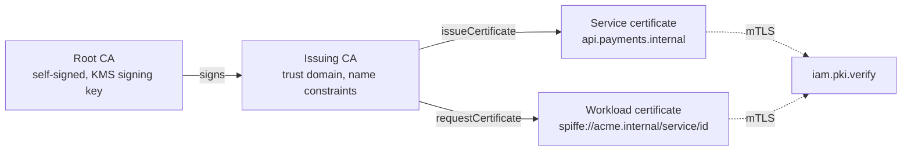

Services inside a company prove who they are with TLS certificates: an internal HTTPS endpoint needs one, and with
mutual TLS (mTLS) the client presents one too. Public certificate authorities do not certify internal names such as
`api.payments.internal`, so teams run a CA of their own, often a root key in a file and certificates minted by hand.
Then nobody can say who may obtain a certificate for which name, a copied CA key certifies anything, and a certificate
keeps working after the service account it was made for is gone.

Better IAM runs a private certificate authority (CA) for each <Term id="tenant">tenant</Term>, in the style of AWS
Private CA, step-ca or a SPIFFE server. It issues X.509 certificates for mutual TLS between services, for internal
HTTPS, and as workload identities: SPIFFE X.509-SVIDs that name a <Term id="service-account">service account</Term> or
an agent. Certificates are authorized by the same <Term id="policy">policies</Term> as everything else. Each name a
certificate carries is decided on its own, so a team can be allowed to certify `*.payments.internal` and nothing else.
The CA signing keys are [KMS keys](/docs/guides/secrets-and-keys/key-management): they never leave the server, and
disabling the key stops the CA.



## Quick start

<Steps>
<Step>

### Create a root and an issuing authority

Once per tenant: a root, kept for signing intermediates, and an issuing (intermediate) authority for leaf
certificates.

```ts
const root = await iam.api.pki.createAuthority(admin, {
  tenantId,
  name: 'Acme Root',
  subject: { commonName: 'Acme Root CA', organization: 'Acme', country: 'US' },
  pathLength: 1,
});
const issuing = await iam.api.pki.createAuthority(admin, {
  tenantId,
  name: 'Acme Workloads',
  parentId: root.id,
  subject: { commonName: 'Acme Workload CA' },
  trustDomain: 'acme.internal',
  permitted: { dnsNames: ['internal'], uriHosts: ['acme.internal'] },
});
```

</Step>
<Step>

### Certify a service

The service makes its own key pair and a certification request. The private key never reaches IAM.

```ts
import { createCertificateRequest } from 'better-iam';
import { generateKeyPairSync } from 'node:crypto';

const { privateKey } = generateKeyPairSync('ec', { namedCurve: 'P-256' });
const csr = createCertificateRequest({ privateKey, dnsNames: ['api.payments.internal'] });
const { certificatePem, chainPem, rootPem } = await iam.api.pki.issueCertificate(credential, {
  tenantId,
  authorityId: issuing.id,
  csr,
  usage: 'server',
});
```

</Step>
<Step>

### Serve it and trust the root

A TLS server presents `certificatePem + chainPem`, and its peers trust `rootPem`, or the tenant's bundle from
`iam.pki.bundle(tenantId)`. A server that terminates mutual TLS checks client certificates with
[`iam.pki.verify`](#verifying-certificates-mutual-tls).

</Step>
</Steps>

Over HTTP the same calls are `POST {basePath}/pki/{method}`.

## Authorities

`createAuthority` makes a **root** (self-signed) or an **intermediate** (signed by a `parentId` authority of the same
tenant). Issue leaf certificates from intermediates and keep the root for signing intermediates only.

<TypeTable
  type={{
    name: {
      type: 'string',
      description: 'Unique in the tenant (ignoring case), up to 128 characters.',
      required: true,
    },
    subject: {
      type: 'DistinguishedName',
      description: "The CA's name: commonName (required, up to 64 characters), organization, organizationalUnit, locality, state, and country (a two-letter ISO code).",
      required: true,
    },
    parentId: { type: 'string', description: 'The authority that signs this one. With it, the new authority is an intermediate.' },
    keySpec: {
      type: "'ecc-p256' | 'ecc-p384' | 'ed25519' | 'rsa-2048' | 'rsa-3072' | 'rsa-4096'",
      description: 'A new KMS signing key of this kind.',
      default: "'ecc-p256'",
    },
    keyId: {
      type: 'string',
      description: 'Or an existing KMS signing key (id or alias) the caller may sign with (iam:kms:sign). The authority takes it over.',
    },
    validityDays: {
      type: 'number',
      description: "The authority's own validity, up to 10950 days. An intermediate never outlives its parent.",
      default: '3650 for roots, 1825 for intermediates',
    },
    pathLength: {
      type: 'number',
      description: 'How many levels of CAs may sit below this one (0 to 10). An intermediate gets what the authorities above leave (one less than its parent) by default, and never more.',
    },
    trustDomain: {
      type: 'string',
      description: 'The SPIFFE trust domain for workload certificates (spiffe://{trustDomain}/...), unique across the deployment: CONFLICT when another tenant has it.',
    },
    permitted: {
      type: '{ dnsNames?: string[]; uriHosts?: string[] }',
      description: 'Name constraints: DNS suffixes such as internal (the name and its subdomains) and URI hosts, up to 50 each. They bind this authority and everything below it, and are written into intermediate certificates.',
    },
    crlUrl: { type: 'string', description: 'An http(s) URL written into issued certificates as their CRL distribution point.' },
    maxValiditySeconds: {
      type: 'number',
      description: 'The longest leaf certificate the authority issues, 60 seconds to 825 days.',
      default: '7776000 (90 days)',
    },
    defaultValiditySeconds: {
      type: 'number',
      description: 'Leaf validity when a request names none, at most maxValiditySeconds.',
      default: '86400 (one day)',
    },
  }}
/>

Creating an authority needs `iam:pki:create` on `iam/pki` and <Term id="recent-authentication">recent
authentication</Term>. Conditions on it see `resource.authorityType`, `resource.keySpec` (for a new key) and
`resource.trustDomain` (when one is given). An intermediate also needs `iam:pki:update` on its parent, and must fit
within the path length of every authority above it. A tenant keeps at most 50 authorities.

### Signing keys belong to their authority

A new authority gets a KMS signing key tagged `pki-authority: {name}`; an adopted `keyId` is taken over. Either way the
key is marked `managedBy: 'pki'`, and the KMS API refuses to sign with it, grant it or use it any other way directly
(`KEY_MANAGED`), so nobody can sign a certificate body the CA did not decide. A key another authority or a data
protection profile manages cannot be adopted.

- The authority pins the key's current version, so rotating the KMS key never changes a CA's public key.
- Disabling the KMS key stops the authority from signing anything, CRLs included, until the key is enabled again
  (`KEY_STATE_INVALID`).
- Every signature is audited on the key as `iam:kms:sign` with `via: 'pki'`.

### Disabling an authority

`updateAuthority` (`iam:pki:update`) disables or re-enables an authority (`state`) and changes `maxValiditySeconds`,
`defaultValiditySeconds` or `crlUrl` (`null` clears it) for future certificates. A disabled authority issues nothing,
and certificates it issued fail `iam.pki.verify` until it is active again. A revoked authority cannot be changed
(`AUTHORITY_UNAVAILABLE`).

## Issuing certificates

`issueCertificate` takes a PEM PKCS#10 certification request (`csr`). The request's signature must verify with its own
key, which proves that the requester holds the private key. `createCertificateRequest` (exported from `better-iam` and
`@better-iam/server`) builds requests without OpenSSL:

```ts
const csr = createCertificateRequest({
  privateKey, // KeyObject or PKCS#8 PEM: ECDSA P-256/P-384, Ed25519 or RSA (2048 bits or more)
  subject: { commonName: 'api.payments.internal' },
  dnsNames: ['api.payments.internal'],
  ipAddresses: ['10.0.4.12'],
});
```

- **Keys.** The requested key is ECDSA P-256 or P-384, Ed25519, or RSA of 2048 to 8192 bits, and the request's
  signature algorithm must match it (`INVALID_CSR` otherwise).
- **Names.** The certificate gets the request's subject common name and subject alternative names, unless the call
  passes `commonName`, `dnsNames`, `uris`, `ipAddresses` or `emails` itself. At most 100 alternative names. When there
  are alternative names, the common name must be one of them (clients may fall back to it).
- **Canonical names.** What is decided is exactly what is signed. DNS names are lowercase ASCII, email addresses are
  lowercase ASCII, and URIs must already be in canonical form (no user information, dot segments, uppercase hosts or
  default ports; SPIFFE IDs follow the SPIFFE grammar). IP addresses are written in canonical text, an IPv4-mapped
  IPv6 address as its IPv4 address.
- **Usage.** `usage` is `both` (the default), `server` or `client`: the extended key usage of the certificate.
- **Validity.** `validitySeconds` defaults to the authority's `defaultValiditySeconds`, may not exceed its
  `maxValiditySeconds` (at least 60 seconds), and the certificate never outlives the authority. Certificates start 60
  seconds in the past to allow for clock skew. A certificate that would expire within a minute is refused.
- **Result.** `certificatePem`, `chainPem` (the intermediates, issuer first), `rootPem`, `serialNumber`, `notBefore`,
  `notAfter` and a SHA-256 `fingerprint`. A TLS server presents `certificatePem + chainPem`, and its peers trust
  `rootPem` (or the tenant's bundle).

### Who may certify which names

Policies cannot say "every name in this list must match" directly, so the CA decides **each name separately**.
`iam:pki:issue` is evaluated on `iam/pki/{authorityId}` once for the common name and once for every subject alternative
name, and the certificate is issued only if every decision allows it. Each decision sees:

| Context key                                                                | Value                                                     |
| -------------------------------------------------------------------------- | --------------------------------------------------------- |
| `resource.name`                                                            | The name being decided.                                   |
| `resource.nameType`                                                        | `commonName`, `dns`, `wildcard`, `uri`, `ip` or `email`.  |
| `resource.usage`                                                           | `server`, `client` or `both`.                             |
| `resource.validitySeconds`                                                 | The requested validity.                                   |
| `resource.keyType`                                                         | `ecc-p256`, `ecc-p384`, `ed25519` or `rsa-{bits}`.        |
| `resource.authorityId`, `resource.authorityName`, `resource.authorityState` | The issuing authority.                                    |
| `resource.authorityType`, `resource.trustDomain`                           | `root` or `intermediate`, and its SPIFFE trust domain.    |

```json title="Certify payments names for a day at most"
{
  "effect": "allow",
  "actions": ["iam:pki:issue"],
  "resources": ["iam/pki/*"],
  "conditions": {
    "StringLike": { "resource.name": ["*.payments.internal", "payments.internal"] },
    "NumericLessThanEquals": { "resource.validitySeconds": 86400 }
  }
}
```

With that policy, a certificate for `api.payments.internal` is issued, while one that also names `admin.internal` is
refused as a whole.

A wildcard DNS name such as `*.payments.internal` is decided with `resource.nameType` `wildcard`, never `dns`. It
covers hosts a policy may deny one by one, so a policy that allows DNS names does not allow wildcard certificates:
allow the `wildcard` name type explicitly where you want them.

Every issued name must also fit the **name constraints** (`permitted`) of the issuing authority and every authority
above it, and so must a common name that looks like a host name. A name outside them fails with `NAME_NOT_PERMITTED`,
whoever asks, owners and root administrators included.

A `spiffe://` URI must be the certificate's only URI, and its trust domain must be the authority's `trustDomain`. Paths
under `/user/`, `/service/` and `/agent/` name identities, so only `requestCertificate` issues them: asking for one
with `issueCertificate` fails with `NAME_NOT_PERMITTED`.

## Workload identity (SPIFFE)

`requestCertificate` gives the caller a certificate for its **own** identity: an X.509-SVID whose only name is the
critical subject alternative name `spiffe://{trustDomain}/{user|service|agent}/{identityId}`, with an empty subject.
The authority needs a `trustDomain`.

```ts
// A service account, with its own API key:
const svid = await iam.api.pki.requestCertificate(
  { token: serviceKey },
  { tenantId, authorityId: issuing.id, csr },
);
svid.spiffeId; // spiffe://acme.internal/service/{identityId}
```

- **Permission.** `iam:pki:request` on the authority. The decision's `resource.name` is the SPIFFE ID,
  `resource.nameType` is `uri`, and `resource.identityKind` is the caller's kind, so policies can narrow workload
  certificates by kind or trust domain.
- **Validity.** One hour by default (`validitySeconds`, at most a day and the authority's maximum), and never past the
  end of the session or API key that asked for it, or of the identity itself.
- **Callers.** Only user sessions and API keys acting in their own right. Assumed roles, session tokens, delegated
  agent sessions and <Term id="impersonation">impersonation</Term> are refused.

Workloads renew their SVID before it expires by requesting a new one with a new key pair.

## Verifying certificates (mutual TLS)

A server that terminates mutual TLS verifies the client's certificate chain, and learns who is calling, with
`iam.pki.verify`:

```ts
import { X509Certificate } from 'node:crypto';

// In a Node TLS server with `requestCert: true`:
const presented = new X509Certificate(socket.getPeerCertificate().raw).toString(); // PEM
const peer = await iam.pki.verify(presented, { tenantId, usage: 'client' }); // tenantId is required
peer.identityId; // for workload certificates
peer.spiffeId;
```

`verify` accepts only certificates this deployment issued. It looks the certificate up by serial number and requires
the presented certificate to be byte-for-byte the stored one. It then walks the **stored** chain, never the chain the
client sent, checking every signature. It also checks:

- the validity period and the requested `usage`;
- revocation, and that the certificate was issued in `tenantId` (trust is per organization);
- that every authority in the chain is active, unexpired and within its path length;
- for workload certificates, that the identity is still active, unexpired and (for agents) not suspended.

Anything else fails with `CERTIFICATE_INVALID` (401). CA certificates never authenticate. The result carries the
`serialNumber`, `fingerprint`, `subject`, `dnsNames`, `uris`, `notAfter` and issuing `authorityId`, plus `spiffeId`
and `identityId` for workload certificates.

## Revocation and CRLs

`revokeCertificate` (`iam:pki:revoke` on the issuing authority) takes a serial number and a `reason`: `unspecified`
(the default), `keyCompromise`, `caCompromise`, `affiliationChanged`, `superseded`, `cessationOfOperation` or
`privilegeWithdrawn`. A revoked certificate fails `iam.pki.verify` at once and appears on the authority's next CRL.

<Callout type="warn" title="Revoking an authority's certificate revokes the authority">
  A subordinate authority's own certificate is listed under its parent, with `usage: 'ca'`. Revoking it revokes the
  authority itself and every authority below it (`authoritiesRevoked` in the audit event). Nothing they issued
  verifies any more, and they can never issue again.
</Callout>

Each authority publishes a signed CRL (RFC 5280) listing its revoked certificates that have not expired yet. The CRL is
rebuilt on the first request after a revocation, or once the current one is 12 hours old, and each one is valid for 24
hours. CRLs are public by design. Serve them at the `crlUrl` you gave the authority:

```ts
// GET https://pki.acme.internal/crl/{authorityId}.crl
app.get('/crl/:id.crl', async (request) => iam.pki.crlResponse(request.params.id));
```

`crlResponse` answers `application/pkix-crl`, or 404 for an unknown authority. When a fresh CRL cannot be signed (the
authority's KMS key is disabled), it serves the last one while that is still valid, and answers 503 after that.

- `api.pki.crl` returns the same CRL as PEM to callers with `iam:pki:read`, and `iam.pki.crl(authorityId)` to server
  code without a credential.
- `iam.pki.bundle(tenantId)` (or `api.pki.bundle`) returns the tenant's active, unexpired root certificates as one PEM
  bundle, for relying parties to trust. Intermediates are not trust anchors: servers send them with their own
  certificate (`chainPem`).

## Permissions

| Action            | Resource       | Calls                                                                                                       |
| ----------------- | -------------- | ----------------------------------------------------------------------------------------------------------- |
| `iam:pki:create`  | `iam/pki`      | `createAuthority` (plus `iam:pki:update` on the parent for intermediates)                                   |
| `iam:pki:read`    | `iam/pki/{id}` | `getAuthority`, `listAuthorities` and `listCertificates` (per authority), `getCertificate`, `crl`, `bundle` |
| `iam:pki:update`  | `iam/pki/{id}` | `updateAuthority`                                                                                           |
| `iam:pki:issue`   | `iam/pki/{id}` | `issueCertificate`, once per name                                                                           |
| `iam:pki:request` | `iam/pki/{id}` | `requestCertificate`                                                                                        |
| `iam:pki:revoke`  | `iam/pki/{id}` | `revokeCertificate`                                                                                         |

Decisions on an authority see `resource.authorityId`, `resource.authorityName`, `resource.authorityType`,
`resource.authorityState` and `resource.trustDomain`. Callers from another tenant are refused before anything is looked
up, and sessions that view as someone else cannot use the CA.

## Audit

Every call is audited with its action on `pki/{authorityId}` (`pki` for tenant-wide calls). Issuing records the
serial number, every name as `{nameType}:{name}`, the usage and the expiry. Workload certificates also record the
SPIFFE ID, and revocations record the serial number and reason. Refusals after the call was authorized (a name outside
the constraints, an invalid request, an unavailable authority or key) are audited as `deny` with a reason too. Private
keys never reach IAM, so they never appear anywhere.

## Errors

| Code                                                                    | Status | When                                                                                                    |
| ----------------------------------------------------------------------- | ------ | ------------------------------------------------------------------------------------------------------- |
| [`INVALID_CSR`](/docs/reference/errors#invalid_csr)                     | 400    | The request is not valid DER, is not signed by its own key, or uses an unsupported key or algorithm.     |
| [`NAME_NOT_PERMITTED`](/docs/reference/errors#name_not_permitted)       | 403    | A name is outside the authorities' name constraints, or a SPIFFE ID is outside the trust domain.         |
| [`AUTHORITY_UNAVAILABLE`](/docs/reference/errors#authority_unavailable) | 409    | The authority (or one above it) is disabled, revoked or expired.                                        |
| [`CERTIFICATE_INVALID`](/docs/reference/errors#certificate_invalid)     | 401    | `iam.pki.verify` refused a certificate.                                                                 |
| [`KEY_STATE_INVALID`](/docs/reference/errors#key_state_invalid)         | 409    | The authority's KMS key is disabled or pending deletion.                                                |
| [`KEY_MANAGED`](/docs/reference/errors#key_managed)                     | 409    | Adopting a KMS key another authority or a data protection profile manages.                              |
| [`CONFLICT`](/docs/reference/errors#conflict)                           | 409    | The authority name is taken, the trust domain belongs to another tenant, or the certificate is already revoked. |
| [`ACCESS_DENIED`](/docs/reference/errors#access_denied)                 | 403    | A name, the authority or the workload request is not allowed.                                           |

Creating authorities can also fail with `LIMIT_EXCEEDED` (past 50) and `RECENT_AUTH_REQUIRED`, and malformed input with
`INVALID_INPUT`.

<Cards>
  <Card title="pki API reference" href="/docs/reference/api/pki">
    Every method with its permission, audit events, and errors.
  </Card>
  <Card title="Key management" href="/docs/guides/secrets-and-keys/key-management">
    The KMS signing keys behind every authority.
  </Card>
  <Card title="SSH access" href="/docs/guides/ssh-access">
    SSH certificates for people and hosts from a per-tenant SSH certificate authority.
  </Card>
</Cards>
