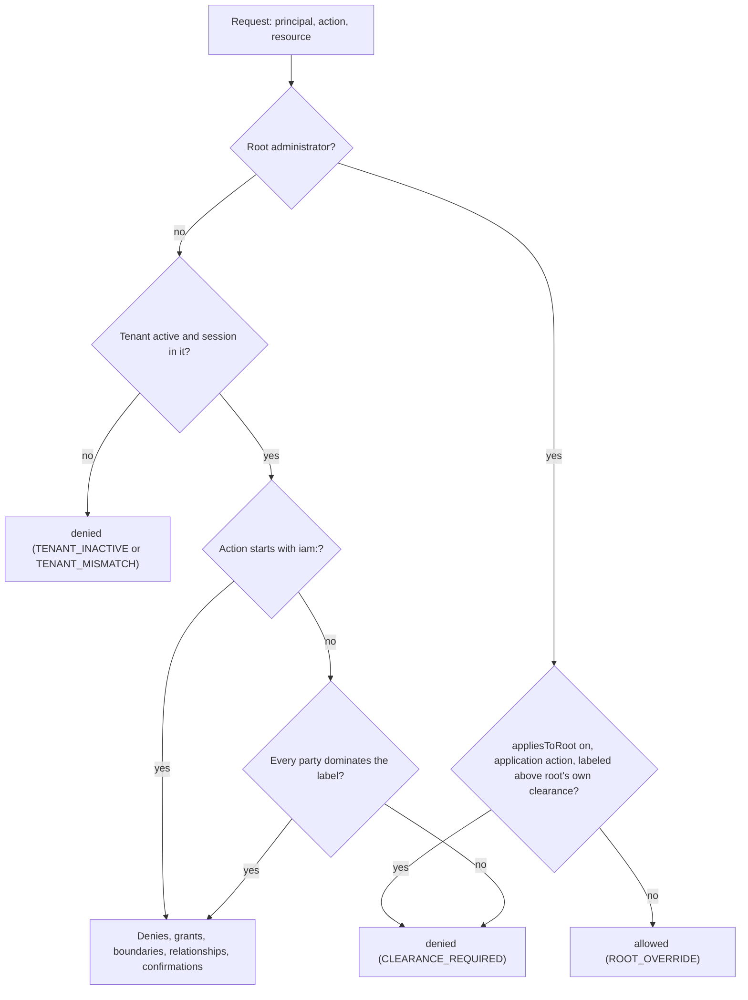

<Term id="role">Roles</Term>, <Term id="relationship">relationships</Term>, and <Term id="policy">policies</Term>
say what a person's job lets them do, and the people who manage them can change that. Some information carries a
second rule that nobody's job can waive: it may only be read by people who hold a clearance at its level, who were read
into the programs it belongs to, and whose citizenship allows it, whatever their role says. That is mandatory access
control, and it sits on top of everything else.

Better IAM models it with three things an organization holds in IAM:

- **A classification scheme.** Ranked levels (such as UNCLASSIFIED, CONFIDENTIAL, SECRET, TOP SECRET), compartments
  (need-to-know control systems or special access programs), the countries that own the information, and the
  dissemination controls labels may carry (NOFORN and REL TO).
- **Clearances.** One adjudicated record per person, <Term id="service-account">service account</Term>, or agent: a
  level, the citizenship an officer verified, the compartments the holder is read into (optionally backed by a
  non-disclosure agreement), a status, and the investigation and its dates.
- **Labels.** The classification of a resource, held by IAM rather than by your application, so that nobody can
  declassify a resource by editing its attributes or deleting and recreating it.

At decision time every party of the session (the person, and every agent acting with them) must **dominate** the
resource's label, or the decision is refused with `CLEARANCE_REQUIRED` before any role, policy, relationship,
ownership, or delegation is looked at. This is the simple security property of the Bell-LaPadula model ("no read up").
Platform administration (`iam:*` actions) is never subject to it, so administrators can always manage the tenant.

| | Roles, relationships, and policies | Security clearances |
| --- | --- | --- |
| Answers | What may this person do here? | Is every party of this session cleared for this resource? |
| Managed by | Administrators, within their grant authority | Security officers (`iam:clearances:*`) and classification managers (`iam:classifications:*`) |
| Evaluated | After the mandatory check: denies, grants, boundaries, relationships | First, for every action outside `iam:*`; no grant changes its answer |
| Where the facts live | Bindings, policy documents, relationships | Schemes, clearance records, and labels in IAM |

Everything lives in the `clearances` API group (`client.clearances.*` over HTTP).

## Turn it on

The module is off unless the deployment sets the `clearances` option. Without it nothing is reserved, read, or
enforced, decisions are exactly what they were, every method of the `clearances` group answers `FEATURE_DISABLED`
(403), and `iam.clearances.sendReminders()` throws it.

```ts title="lib/iam.ts"
import { betterIam } from 'better-iam';

export const iam = betterIam({
  // ...database, secret, baseURL, permissions, resolveResource
  clearances: {}, // or { appliesToRoot: false }
});
```

<TypeTable
  type={{
    appliesToRoot: {
      type: 'boolean',
      description: 'Root administrators are bound by labels too: they keep the root override for everything else, but read a labeled application resource only with a clearance of their own (see Root administrators below).',
      default: 'true',
    },
  }}
/>

`clearances` must be an object: `true`, an unknown setting, or a non-boolean `appliesToRoot` fails construction with
`INVALID_CONFIG`. Once a tenant defines a scheme, the decisions in it change; tenants without a scheme in their ancestry
decide as before.

<Callout type="warn" title="Turning it on is a breaking change for two kinds of configuration">
  **Reserved names.** The identity attributes `clearanceLevel`, `clearanceRank`, `clearanceStatus`,
  `clearanceCompartments`, and `clearanceCitizenship`, and the resource attributes `classification`,
  `classificationRank`, `compartments`, `noforn`, and `releasableTo` become reserved. Declaring one fails at startup
  with `INVALID_CONFIG` (`INVALID_INPUT` for a tenant-registered type), and values that `resolveContext` or a plugin
  supplies are removed. If your application keeps a `classification` attribute today, rename it (for example to
  `sensitivity`), or move the marking into IAM labels or the resolver's typed `classification` field.

  **Root no longer reads up.** With `appliesToRoot` left at its default, a root administrator is refused on every
  labeled application resource above their own clearance, which they normally do not have. Set
  `appliesToRoot: false` to keep the old override.
</Callout>

## What is enforced, and what is not

Enforced:

- **No read up, on every application action.** The check runs for every action that does not start with `iam:`,
  reads and writes alike: a party below a label can neither read nor change the resource. (Bell-LaPadula allows a
  blind "write up"; Better IAM does not.)
- **Every party.** Agents acting for a person, the sponsor behind an agent's key, and the administrator behind a
  "view as" session must each dominate the label ([whose clearance counts](#whose-clearance-counts)).
- **Fail closed.** An unknown level, compartment, or caveat, a label written under another scheme, a label left in a
  tenant that no scheme applies to any more, a malformed label from your resolver (or a resolver that fails for the
  resource an `iam/{type}/{id}` alias names), a resource whose label could not be looked up, and an unlabeled resource
  of a type the scheme requires a label on (without a `defaultLabel`) all refuse every party.
- **At decision time.** Status, expiry, interim policy, the guest ceiling, and NDA acceptance are evaluated on every
  decision. No worker has to run for a suspension, an expiry, or a lapsed NDA to take effect.

Not enforced in this version:

- **The \*-property ("no write down").** A person cleared at TOP SECRET can write into an UNCLASSIFIED resource. Better
  IAM decides access to resources; it does not track information flowing between them inside your application. You can
  approximate the rule for your own actions with a [policy](#add-rules-of-your-own-with-policies).
- **Labeling new content.** Your application decides what a new resource is labeled. Label it as part of creating it,
  require labels on its type (`requireLabels`), or set a `defaultLabel`.
- **Administration.** `iam:*` actions are never subject, by design. Administrators without a clearance can still read
  a labeled resource's registration (its attributes, owner, and parent) through `resources.get` and `resources.list`,
  and the label itself through `clearances.getLabel` (with `iam:clearances:read`). Keep sensitive values out of
  registration attributes.
- **Integrity models** such as Biba, and labels on people's data in IAM itself.
- **Artifacts issued earlier.** A suspension or a new label takes effect on the next decision. SSH certificates are
  re-checked by the [SSH sweep](/docs/guides/ssh-access#revocation) (`iam.ssh.sweep()`, every few minutes) and
  verifiable credentials by the credential sweep (`iam.verifiableCredentials.sweep()`, hourly), which revokes those
  whose holder no longer dominates the type's label; until a sweep runs they stay valid, and assertions and delegation
  tokens issued before stay valid until they expire or are revoked.

## Define a scheme

A tenant (normally an organization) defines one scheme, and it applies to the tenant and every tenant below it. The
scheme in force for a tenant is the one defined **closest to the root** of its ancestry, so a project can neither
redefine nor re-rank its organization's levels, and a scheme defined at the platform (root) tenant applies everywhere.
Defining a scheme where the tenant, an ancestor, or a tenant below it already defines one is a `CONFLICT`.

Labels and clearances stay under the scheme they were written under. Moving a tenant (`tenants.reparent`) so that
another scheme, or none, would apply to it is refused with `RESOURCE_IN_USE` while it or any tenant below it holds a
label or a live (interim, active, or suspended) clearance: declassify and revoke them first. Moves that keep the scheme
in force are not affected. Should a label ever be left in a tenant that no scheme applies to, it refuses everyone, root
included, rather than being ignored.

`clearances.templates()` lists four starting points. Their compartments are always empty: add your own.

| Template | Levels (rank) | Owner countries | Caveats |
| --- | --- | --- | --- |
| `us` | `U` UNCLASSIFIED (0), `C` CONFIDENTIAL (1), `S` SECRET (2), `TS` TOP SECRET (3) | `USA` | NOFORN, RELTO |
| `uk` | `OFFICIAL` (0), `SECRET` (1), `TOP-SECRET` TOP SECRET (2) | `GBR` | NOFORN, RELTO |
| `nato` | `NU` NATO UNCLASSIFIED (0), `NR` (1), `NC` (2), `NS` NATO SECRET (3), `CTS` COSMIC TOP SECRET (4) | none | RELTO |
| `corporate` | `public` (0), `internal` (1), `confidential` (2), `restricted` (3) | none | none |

NATO is not a country, so the `nato` template has no owner countries and uses REL TO only. The same definitions are
exported as `classificationTemplates` from `better-iam/core`, together with the pure helpers `validateScheme`,
`validateLabel`, `joinLabels`, `labelCovers`, and `dominates`.

```ts
const scheme = await iam.api.clearances.defineScheme(securityAdmin, {
  tenantId,
  name: 'Acme classification',
  template: 'us', // or definition: { levels, compartments, ownerCountries, caveats }
  requireLabels: ['document'], // types that must carry a label; '*' for every application type
  guestCeiling: 'C', // guests count at most as CONFIDENTIAL; null (default): guests hold no clearance
  interimAllowed: true, // interim clearances count at decision time (default false)
  adjudication: 'within-own', // the default; or 'unrestricted'
  notify: { emails: ['security-office@acme.example'] }, // extra reminder recipients
});

// Add compartments by changing the definition.
await iam.api.clearances.updateScheme(securityAdmin, {
  tenantId,
  version: scheme.version,
  definition: {
    ...scheme.definition,
    compartments: [{ id: 'LANTERN', name: 'Project Lantern' }],
  },
});
```

A definition has:

- `levels`: 2 to 20, listed in rank order with integer ranks that start at 0 and strictly increase (at most 999).
  Rank 0 is the lowest (public or unclassified) level. Each has an `id` (a letter or digit, then letters, digits, `.`,
  `_`, `:`, or `-`, 64 characters at most), a display `name`, and an optional `abbreviation`; ids, names, and
  abbreviations are unique ignoring case.
- `compartments`: up to 200 `{ id, name }`. Ids are opaque on purpose: compartment names can themselves be sensitive,
  so audit events, emails, and decisions only ever carry ids.
- `ownerCountries`: ISO 3166-1 alpha-3 codes in upper case. NOFORN means citizens of these countries only, so the
  NOFORN caveat needs at least one.
- `caveats`: which dissemination controls labels may use, `NOFORN` and `RELTO`.

Validation messages name positions (`levels[2].rank`), never submitted names.

### Scheme settings

<TypeTable
  type={{
    requireLabels: {
      type: 'string[]',
      description: "Resource types (up to 100) whose unlabeled resources are refused for everyone. '*' covers every application type, but not the built-in model, model-tool, ssh-host, ssh-login, and credential-type types, which you can list by name.",
      default: '[]',
    },
    defaultLabel: {
      type: 'ClassificationLabel | null',
      description: 'Applied to unlabeled resources of the required types instead of refusing them. null removes it.',
    },
    guestCeiling: {
      type: 'string | null',
      description: "The highest level a guest's clearance counts at. null: guests hold no clearance.",
      default: 'null',
    },
    interimAllowed: {
      type: 'boolean',
      description: 'Whether interim clearances count at decision time. Turning it off stops every interim clearance from counting at once.',
      default: 'false',
    },
    adjudication: {
      type: "'within-own' | 'unrestricted'",
      description: 'within-own: officers grant only what their own clearance holds. unrestricted: any officer grants any level.',
      default: "'within-own'",
    },
    notify: {
      type: '{ emails: string[] } | null',
      description: 'Up to 20 extra recipients of clearance reminders besides the owners.',
    },
  }}
/>

### Changing a scheme

`updateScheme` changes the scheme the tenant defines itself; an inherited one is changed where it is defined
(`CONFLICT`). Settings change freely and take effect on the next decision. The definition is guarded so nothing in use
is reinterpreted:

- new levels must rank above every level kept (`INVALID_INPUT`);
- no level is ever re-ranked, whether or not IAM sees it in use (your resolver asserts labels by level id, and a
  `defaultLabel` may name any level), and a level removed earlier comes back only at the rank it had
  (`RESOURCE_IN_USE`);
- a level that a live (interim, active, or suspended) clearance or a label uses cannot be removed, a compartment in use
  cannot be removed, and every label must stay valid, so a caveat that labels use cannot be dropped
  (`RESOURCE_IN_USE`);
- the `defaultLabel` must stay valid under the new definition, or be replaced or removed in the same call
  (`INVALID_INPUT`).

Pass the `version` you read to catch concurrent edits (`VERSION_CONFLICT`). Adding an owner country widens who reads
NOFORN material, so treat it like a grant: it is audited and needs `iam:classifications:manage` and a
<Term id="recent-authentication">recent sign-in</Term>.

## Grant clearances

An identity holds at most one clearance, stored in its own tenant and issued under the scheme in force there.

```ts
await iam.api.clearances.grant(officer, {
  tenantId,
  identityId: alice.id,
  level: 'S',
  citizenship: ['USA'],
  investigation: { kind: 'T5', completedAt: Date.parse('2026-08-01') },
  reinvestigationDue: Date.parse('2031-08-01'),
});
```

| Field | Meaning |
| --- | --- |
| `level` | A level id of the scheme. |
| `citizenship` | Up to 10 alpha-3 codes an officer adjudicated. The only source of NOFORN and REL TO decisions: identity attributes and context never are. |
| `status` | `interim`, `active`, `suspended`, `revoked`, or `terminated`. |
| `investigation` | `{ kind, completedAt }`, such as `{ kind: 'T5', completedAt }`. |
| `reinvestigationDue`, `expiresAt` | Dates (epoch milliseconds, within twenty years). A clearance stops counting at `expiresAt`; reinvestigation dates only drive [reminders](#reminders-and-emails). |
| `readIns` | The compartments the holder is read into, by whom and when, and the NDA agreement behind each. |
| `suspended`, `revoked`, `terminated` | Who, when, and why. |

### When a clearance counts

At every decision a clearance counts only when all of these hold; otherwise the party has no clearance (rank -1):

- the identity is active and not past its own `expiresAt`;
- the record was issued under the scheme in force (a tenant moved below another scheme loses it);
- the status is `active`, or `interim` while the scheme allows interim clearances;
- the clearance is not past its `expiresAt`, and its level still exists.

A guest counts at most at the scheme's `guestCeiling` (no clearance when it is `null`) and is never read into
compartments. `get` and `list` report what decisions see as `effectiveStatus` (`active`, `interim`, `none`,
`expired`, `suspended`, `revoked`, or `terminated`) and `effectiveLevel`.

### The lifecycle

- `grant` issues a clearance (`interim: true` for an interim one, where the scheme allows it). It is a `CONFLICT` when
  the identity already holds a live one; a revoked or terminated record is replaced (the audit trail keeps the
  history). Only active identities are granted, and a guest only up to the guest ceiling.
- `update` changes the level, citizenship, interim or final status, the investigation, and the dates (`null` clears
  one). The adjudication rules apply to the higher of the old and the new level, so lowering a TOP SECRET clearance
  needs a TOP SECRET officer.
- `suspend` takes a clearance out of force at once, with a `reason` and an optional `incidentId`. Only `reinstate`
  lifts it, back to active or interim, and the read-ins come back with it.
- `revoke` ends a clearance for cause and debriefs every compartment. `revoked` is final: a new clearance needs a new
  `grant`.

Offboarding (`identities.offboard`) terminates the leaver's clearance and debriefs every compartment (reported as
`clearancesTerminated`); deleting an identity keeps its clearance as terminated history with the read-ins released. A
clearance that was revoked for cause stays `revoked` through both.

### Compartments and NDA read-ins

A label with compartments is read only by holders read into every one of them. `readIn` reads an active or interim
clearance into a compartment of the scheme, optionally naming an [agreement](/docs/guides/governance/agreements) of
the person's tenant as the program's non-disclosure agreement. `debrief` ends one read-in. Guests are never read in.

```ts
await iam.api.clearances.readIn(officer, {
  tenantId,
  identityId: alice.id,
  compartmentId: 'LANTERN',
  agreementId: lanternNdaId,
});
```

A read-in counts while the compartment exists and, when it names an NDA, while the holder's acceptance of the
agreement's current version is current: publishing a new version, a lapsed `reacceptAfterDays`, or deleting the
agreement closes the read-in until the person accepts again. Officers see this as each read-in's `current` in `get`
and `list`, and the person sees which NDAs still need accepting in [`mine`](#your-own-clearance).

### Who may adjudicate

- **Nobody adjudicates their own clearance**, owners and root included. `grant`, `update`, `readIn`, and `reinstate`
  refuse the caller's own clearance, and the clearance of anyone who is a party of the caller's session (an agent
  cannot adjudicate its sponsor, and a delegated session cannot adjudicate the person). The refusal is an audited
  `ACCESS_DENIED`. Tightening (`suspend`, `debrief`, `revoke`) may be done to oneself.
- **Guests never adjudicate**, whatever role they hold; they can read clearances when a role allows it.
- **Not while impersonating.** Every change to clearances and labels, and `mine`, refuse a "view as" session with
  `IMPERSONATION_RESTRICTED`.
- **`within-own` adjudication.** An officer grants, updates to, or reinstates only a level their own clearance holds,
  and reads someone into (or reinstates someone with) only compartments they are read into themselves. Every party of
  the officer's session must hold it.
- **Bootstrap.** Under `within-own`, nobody could grant the first TOP SECRET clearance. While no active clearance in
  the scheme's subtree holds a level (or is read into a compartment), an <Term id="owner">owner</Term> of the tenant in
  their own session, or a root administrator, may grant it. Such grants are audited with `bootstrap: true`. Once anyone
  holds it, only officers cleared for it can grant it, so bootstrap the top level first.

```ts title="Bootstrap the first officer"
// The owner, holding no clearance, bootstraps the first officer (nobody holds TS yet).
await iam.api.clearances.grant(owner, { tenantId, identityId: officerId, level: 'TS', citizenship: ['USA'] });
// From now on the officer adjudicates, the owner's own clearance included.
await iam.api.clearances.grant(officer, { tenantId, identityId: ownerId, level: 'TS', citizenship: ['USA'] });
```

Clearances are adjudicated in the identity's own tenant. Under a scheme an organization defines, a project's people are
adjudicated by officers acting in the project, and a project owner may bootstrap a level only while nobody in the whole
scheme subtree holds it; organizations that run many projects usually choose `unrestricted` adjudication.

## Label resources

A label is `{ level, compartments?, noforn?, releasableTo? }`:

- `level`: a level id of the scheme;
- `compartments`: compartment ids the reader must be read into, every one of them;
- `noforn: true`: readers must be citizens of an owner country (needs the NOFORN caveat);
- `releasableTo`: alpha-3 codes of countries whose citizens may read it besides the owners (needs the RELTO caveat). An
  empty list means owner countries only; leaving it out means no restriction.

```ts
await iam.api.clearances.label(officer, {
  tenantId,
  type: 'document',
  id: 'q3-plan',
  label: { level: 'S', compartments: ['LANTERN'], noforn: true },
  inheritToChildren: true, // optional: the label also applies to every managed descendant
});
```

A label at the lowest level still needs a clearance (of any level) to read: people without a clearance read only
unlabeled resources. Leave public resources unlabeled.

### Labels are held by IAM

Labels live in IAM (`resourceLabels`), never in resource attributes, and have their own permissions:

- **`label` only raises** (`iam:classifications:label`). The new label must cover the old one in every dimension:
  level at least as high, every compartment kept, NOFORN kept, releasable to no new country. Inheritance once on stays
  on. Anything else is refused as a declassification. The resource need not exist yet.
- **`declassify` lowers** (`iam:classifications:declassify`, a recent sign-in, and a `reason`): it lowers, changes, or
  (with `label: null`) removes a label. The caller's own clearance must dominate the current label: nobody declassifies
  what they could not read.
- **Labels outlive their resources.** Deleting a resource and registering it again does not declassify it. A
  registered resource that inherits a label from its managed parents keeps it when it is deleted: what it inherited
  joins its own label (audited as `classification:label` with `reason: 'resource-deleted'`), so registering it again
  under another parent changes nothing. Deleting is refused (`RESOURCE_IN_USE`) while what it inherits cannot be read
  under the scheme in force.
- **Types are resource type names** (a lowercase letter, then lowercase letters, digits, or `-`; ids may hold `/`).
  Platform types cannot be labeled: `iam`, `tenant`, `identity`, `session`, `role`, `oauth-client`, `scim`, `saml`,
  and `ssf`.

`getLabel` returns a resource's own label and what it inherits; `listLabels` lists the tenant's labels by type and
level. A label written under another scheme (a tenant moved below an ancestor that defines its own) refuses everyone
until it is replaced with `declassify`. Nobody declassifies what they could not read, so that still needs a clearance
that dominates the label as the scheme in force reads it; only a label naming a level, compartment, or caveat the scheme
in force does not define, which no clearance can dominate, may be repaired by anyone with the permission.

### The label a decision applies

The label a decision applies is the **join** of:

1. the resource's own IAM label;
2. every label marked `inheritToChildren` on its managed parents and their ancestors, through the registration's parent
   and the parent its attributes report (`parentType` / `parentId`), up to 16 levels (deeper or cyclic chains refuse
   everyone);
3. for built-in resources served from elsewhere: a model's labels in every tenant above (a project uses its
   organization's models, so a label written where the model is defined applies in the project too), and an SSH
   login's host label (a label on `ssh-host/{host}` applies to every login of the host, whatever its
   `inheritToChildren`, including logins added later);
4. the `classification` your `resolveResource` returns for it, validated against the scheme.

The join takes the higher level, the union of compartments, NOFORN when either has it, and the intersection of
`releasableTo` lists. It never lowers anything, so your resolver can **raise** a label (for example from a marking in
your own database) but never lower what IAM holds. A resolver label that is not valid for the scheme refuses everyone,
root included.

```ts title="lib/iam.ts"
resolveResource: async (reference) => {
  const document = await db.documents.find(reference.tenantId, reference.id);
  return {
    ...reference,
    attributes: { ownerId: document.ownerId },
    ...(document.marking ? { classification: document.marking } : {}), // e.g. { level: 'C' }
  };
},
```

- An unlabeled resource of a type in `requireLabels` gets the scheme's `defaultLabel`, or is refused for everyone.
- An application action on the platform alias `iam/{type}/{id}` gets the answer the named resource gets, so the alias
  never reads lower: its label includes what your `resolveResource` returns for `{type}/{id}` itself (its
  `classification` and the parent it reports), and a resolver that fails for it refuses every party. `iam:` actions on
  it are administration and are never subject.
- Plugin endpoints with their own (non-`iam:`) action on a record they name are decided the same way: under
  `requireLabels: ['*']` such an endpoint refuses everyone until the record it names is labeled, as `authorize` does.
- SSH hosts (`ssh-host`, id the host name) and logins (`ssh-login`, id `{host}/{login}`), credential types
  (`credential-type`), and models (`model`) can be labeled like any resource; [SSH certificates](/docs/guides/ssh-access),
  [credential offers](/docs/federation/verifiable-credentials), and [model calls](/docs/guides/inference) are then
  decided against the label. Label a host to protect every login to it, and a model in the tenant that defines it to
  protect it wherever it is inherited.
- A credential an administrator offers someone (`iam:vc:issue`) needs no `vc:request`, but its holder must still
  dominate the type's label: when the offer is made (an audited `ACCESS_DENIED` otherwise), when the wallet redeems it,
  and in every credential sweep, which revokes it (`access-changed`) once the holder no longer does.

## How decisions apply clearances

The order of a decision with clearances:

<Steps>
<Step>

**Root administrators** get the root override (`ROOT_OVERRIDE`), with labels enforced when `appliesToRoot` is on.

</Step>
<Step>

**Inactive tenants** (`TENANT_INACTIVE`) and principals of another tenant (`TENANT_MISMATCH`) are refused before any
clearance data is read.

</Step>
<Step>

**The session's parties and their clearances** are loaded once, whatever the policies mention.

</Step>
<Step>

**The mandatory check is the first step of every evaluation**, keyed on the action being evaluated: unless it starts
with `iam:`, a label any party fails to dominate refuses with `CLEARANCE_REQUIRED`.

</Step>
<Step>

**Then denies, grants, boundaries, relationships, and delegation confirmations**, as without clearances.

</Step>
</Steps>



Because the check comes first:

- no grant, ownership, relationship, or policy can open a labeled resource above the session's clearance;
- a delegated [confirmation](/docs/guides/ai-agents#confirming-sensitive-actions-one-at-a-time) is never used up by a
  refused call;
- `CLEARANCE_REQUIRED` is never confused with "no grant", so nothing falls back to another path.

Callers of `authorize`, `authorizeMany`, `require`, and the HTTP routes see the usual `ACCESS_DENIED`. Every refusal is
audited as a denial of the requested action with the metadata `{ mandatory: 'clearance' }` and nothing else: no label,
no level, no compartment, and no hint which dimension failed. Only officers learn that, through
[`explain`](#explain-a-refusal).

A party dominates a label when its level ranks at least as high, it is read into every compartment of the label,
NOFORN labels find an owner country in its adjudicated citizenship, and REL TO labels find one of the listed or owner
countries there.

### Whose clearance counts

| Session | Parties that must dominate the label |
| --- | --- |
| A person's session or API key in their own tenant | The person |
| A "view as" session | The member, and the administrator behind it, who is decided too |
| A service account's API key | The service account (no clearance unless an officer grants one) |
| An agent's own API key or session token | The agent **and** its sponsor |
| A session token | Its source identity, as above |
| A delegated session | The person, the acting agent, and every agent that handed the work on |
| A role session (cross-tenant or web identity) | Nobody is cleared: it reads only unlabeled resources |
| A root administrator | The root administrator's own clearance, which counts only when issued under the target's scheme |
| Reviews and simulations (`simulate`, `whoCan`, invariants, and so on) | The identity's real clearance, as for the session kind simulated (an agent with its sponsor) |

When it is the administrator behind a ["view as"](/docs/guides/authentication/impersonation) session whose clearance
fails, the refusal is `CLEARANCE_REQUIRED` (not `IMPERSONATOR_DENIED`) and is audited with the
mandatory marker like any other, so threat detection holds the administrator, not the member, responsible.

### Root administrators

Root keeps the override for everything else (`ROOT_OVERRIDE`), including all `iam:*` administration, but with
`appliesToRoot` on it reads a labeled application resource only when it holds a clearance that dominates the label.
Clearances are adjudicated in the holder's own tenant, so a root administrator (of the root tenant) can hold one that
counts only when the root tenant defines the scheme, that is, a platform-wide scheme, and another root-tenant officer
grants it. Under an organization's scheme root therefore reads no labeled resource of that organization. Root cannot
clear itself either: break-glass access is an interim clearance a second officer grants. Cross-tenant SSH stays
refused (`ROOT_SSH_RESTRICTED`) as before. With `appliesToRoot: false`, root's override applies to labeled resources
too.

## Add rules of your own with policies

Decisions carry the session's clearance and the resource's label as context keys, so
[conditions](/docs/guides/authorization/conditions) can add rules on top of the mandatory check. They can never open
what it refuses.

| Key | Type | Value |
| --- | --- | --- |
| `principal.clearanceLevel` | identifier, optional | The level id the session counts at: that of its weakest party. Absent when any party has no clearance. |
| `principal.clearanceRank` | number | That level's rank, the lowest across the parties; -1 when any party has no clearance. |
| `principal.clearanceStatus` | identifier | `active`, `interim` (when any party's is interim), or why a clearance does not count: `none`, `expired`, `suspended`, `revoked`, or `terminated`. |
| `principal.clearanceCompartments` | list | The compartment ids every party is read into right now. |
| `principal.clearanceCitizenship` | list | The countries every party's adjudicated citizenship shares. |
| `resource.classification` | identifier, optional | The level id of the label decisions apply. Absent when unlabeled. |
| `resource.classificationRank` | number | That level's rank; -1 when unlabeled. |
| `resource.compartments`, `resource.noforn`, `resource.releasableTo` | list, boolean, list | The label's compartment ids, whether it is NOFORN, and its REL TO countries. |

For example, a deny statement approximates "no write down" for one action: people cleared TOP SECRET may not write
documents labeled below it, or unlabeled ones (`resource.classificationRank` is -1 for those).

```json title="Approximate no write down"
{
  "effect": "deny",
  "actions": ["documents:write"],
  "resources": ["document/*"],
  "conditions": {
    "NumericGreaterThanEquals": { "principal.clearanceRank": 3 },
    "NumericLessThan": { "resource.classificationRank": 3 }
  }
}
```

- The server owns these keys: values that `resolveContext` or a plugin supplies are removed, and the resource keys are
  written after the resource's attributes, so no attribute can stand in for them.
- `principal.clearanceLevel` and `resource.classification` can be absent, so guard deny statements on them with
  `Exists`. [Policy lint](/docs/guides/authorization/policies#lint) knows the keys' types (the resource keys when the
  deployment enables clearances).
- `policies.test` evaluates only the document and never applies the mandatory check. It defaults the keys to an
  uncleared person and an unlabeled resource unless the context passes them.
- Root administrators override policies, so these conditions do not constrain them (the mandatory check does, unless
  `appliesToRoot` is false).

## Listings, data filters, and reviews

- **`listAccessible`** reads the labels of the type once and applies them to every registered resource, as `authorize`
  would.
- **Data filters** ([`iam.planResources`](/docs/guides/authorization/data-filtering), `filters.plan`, `filters.planFor`)
  AND a clearance filter into every plan, root's included: `not (id in [...])` for the labeled resources the caller
  cannot read, or, for a type that requires labels, `id in [...]` for the registered resources they can. Both compile
  to every target (`filterToSql`, `filterToPrisma`, `filterToMongo`, `filterMatches`).
- **A plan refuses with `UNSUPPORTED_FILTER` when it cannot be exact**: for an application (unmanaged) type the scheme
  requires labels on, for any application type while a label in the tenant is passed down to children (the parents
  your resolver reports are invisible to a filter), for SSH logins while a host is labeled, and when a statement that
  could apply to the planned action conditions on a label's keys, which the server derives per resource rather than
  reading from the row. Check those resources with `authorize`.
- **Labels your resolver asserts are not visible to plans.** For an application type that does not require labels, a
  plan applies only IAM-held labels. If your resolver raises labels, require labels on the type (plans then refuse and
  you check rows with `authorize`), hold the labels in IAM, or check each row with `authorize` before showing it.
- **Reviews tell the truth.** [`policies.simulate`](/docs/guides/authorization/reviews#explain-one-decision) reports
  `CLEARANCE_REQUIRED` (so reviewers learn that a resource is labeled above someone, never the label),
  `effectiveActions` refuses each application action and still allows `iam:` ones, `whoCan` leaves out whoever the
  clearance refuses, impact previews never show those actions as gained, and access invariants report
  `CLEARANCE_REQUIRED` as the violation's reason. `accessPaths.find` offers no path for a clearance refusal: nothing a
  person can request lifts it.

## Explain a refusal

`clearances.explain` (officers only: `iam:clearances:adjudicate`) answers what the public reason never says: whether
the person (their own sessions, so an agent with its sponsor) may read the resource, the label decisions apply (after
inheritance, the resolver, and the default), every party's clearance, and which dimension the first refused party
fails: `level`, `compartment`, `noforn`, `releasability`, or `invalid-label` (also a missing required label).

```ts
const why = await iam.api.clearances.explain(officer, {
  tenantId,
  identityId: alice.id,
  type: 'document',
  id: 'q3-plan',
});
// { allowed: false, failure: 'compartment', label: { level: 'S', compartments: ['LANTERN'] }, party, parties }
```

It works for resources that no longer exist, since their labels remain.

## Incidents and threat detection

`suspend` needs only `iam:clearances:suspend` and no recent sign-in, so an incident responder can take a clearance out
of force at once. Pass the incident's id as `incidentId`, and `notifyPerson: false` when the person must not be tipped
off. Lifting it takes an adjudicator (`reinstate`, with a recent sign-in), who cannot be the person.

```ts
await iam.api.clearances.suspend(responder, {
  tenantId,
  identityId: bob.id,
  reason: 'Under investigation',
  incidentId,
  notifyPerson: false,
});
```

[Threat detection](/docs/guides/threat-detection) watches for people reading up:

- Clearance refusals are `deny` events, so the rule `denial-burst` counts them like any other refusal, and
  `metadata.mandatory === 'clearance'` singles out attempts to read up in your SIEM or a webhook filter.
- The rule **`classified-access-attempts`** (high, MITRE ATT&CK T1213) counts only those: an actor refused for want of
  a clearance 3 times within an hour (tunable: 1 to 1000 times, one minute to seven days) raises a detection against
  them, or against the administrator behind a "view as" session. It names the actions and how many resources, never a
  label.
- The response action **`suspend-clearance`** suspends the person's clearance from an incident, by hand
  (`threats.respond`, which then also needs `iam:clearances:suspend` on `iam/clearances/{identityId}`) or from a
  [playbook](/docs/guides/threat-detection#playbooks), whose author needs `iam:clearances:suspend` on
  `iam/clearances`. Playbooks never suspend an owner's or a root administrator's clearance.
- The response sends the person no email, records `suspended.by` (`threat-detection` for playbooks) and the incident,
  and is audited as `clearance:suspend` (as `suspend` records it) and `threat:suspend-clearance`. Only `reinstate`
  lifts it: `threats.release` ends a containment, never a suspension.
- The SSH sweep revokes certificates whose login or host a suspended or revoked clearance no longer reaches.

```ts title="Suspend clearances on classified probing"
await iam.api.threats.createPlaybook(securityOfficer, {
  tenantId,
  name: 'Suspend on classified probing',
  trigger: { ruleIds: ['classified-access-attempts'] },
  actions: [{ kind: 'suspend-clearance' }, { kind: 'notify' }],
});
```

## Reminders and emails

`iam.clearances.sendReminders({ tenantId?, withinDays? })` is a deployment job; run it daily, followed by an outbox
run. It emails the owners of the tenant that defines the scheme and the scheme's `notify.emails` about clearances whose
periodic reinvestigation is due (or overdue) or whose end, interim or final, falls within `withinDays` (default 60, at
most 365). Each date is reminded once, and a changed date is reminded again. Suspended, revoked, and terminated
clearances, people who are not active, and tenants that are not active are skipped. It needs an email delivery
callback (`DELIVERY_REQUIRED`).

```ts
setInterval(
  async () => {
    await iam.clearances.sendReminders();
    await iam.auth.dispatchOutbox();
  },
  24 * 60 * 60 * 1000,
).unref();
```

| Template | Sent to | When |
| --- | --- | --- |
| `clearance-reminder` | The scheme tenant's owners and `notify` | `sendReminders` found a reinvestigation or an end coming up |
| `clearance-status` | The person (people with an email only) | Their clearance was suspended or revoked (unless `notifyPerson: false`), or reinstated |

Both name the level only, never compartments, caveats, or the reasons officers recorded, because mail passes through
third parties. Point `links.clearances({ tenantId, identityId? })` in the email templates at your clearance pages;
reminders fall back to `links.account`. See [Scheduled jobs](/docs/operations/jobs) for the other jobs a deployment
runs.

## Your own clearance

`clearances.mine({ tenantId })` returns the caller's own clearance, with no permission needed, from their own session
or API key in the tenant (not a role session, session token, or delegated session, and not while impersonating:
`ACCESS_DENIED` or `IMPERSONATION_RESTRICTED`). It carries the scheme's name and levels, their level, status,
effective status, citizenship, dates, and the compartments they are read into with whether each NDA still needs
accepting. It returns `{ scheme: null, clearance: null }` when no scheme applies, and `clearance: null` when they hold
none.

## Permissions

| Action | Resource | Methods |
| --- | --- | --- |
| `iam:clearances:read` | `iam/classifications/scheme`, `iam/clearances[/{identityId}]` | `getScheme`, `get`, `list` |
| `iam:clearances:read` | `iam/classifications/labels[/{type}/{id}]` | `getLabel`, `listLabels` |
| `iam:clearances:adjudicate` | `iam/clearances/{identityId}` | `grant`, `update`, `readIn`, `debrief`, `reinstate`, `revoke`, `explain` |
| `iam:clearances:suspend` | `iam/clearances/{identityId}` | `suspend` |
| `iam:classifications:manage` | `iam/classifications/scheme` | `defineScheme`, `updateScheme` |
| `iam:classifications:label` | `iam/classifications/labels/{type}/{id}` | `label` |
| `iam:classifications:declassify` | `iam/classifications/labels/{type}/{id}` | `declassify` |

- `defineScheme`, `updateScheme`, `grant`, `update`, `readIn`, `reinstate`, `revoke`, and `declassify` also need a
  recent sign-in (`RECENT_AUTH_REQUIRED`). `suspend` and `debrief` do not, so they work in the middle of an incident.
- `templates` needs only a signed-in caller, and `mine` the caller's own session or API key in the tenant.
- A label resource name longer than 256 characters is authorized as `iam/classifications/labels/{type}/sha256:{hex}`,
  so per-type policy patterns keep working.
- Enforced [access invariants](/docs/guides/governance/change-safety#access-invariants) are re-checked around
  `iam:clearances:adjudicate`, `iam:classifications:manage`, and `iam:classifications:declassify`, which can widen what
  the mandatory check lets through. Suspending and labeling only narrow access and are never blocked by an "expect
  allow" invariant, and neither are `revoke` and `debrief`; "expect deny" invariants still apply to them.

## Limits

| What | Limit or default |
| --- | --- |
| Levels per scheme | 2 to 20, ranks 0 to 999 |
| Compartments per scheme | 200 |
| Owner countries | 64 |
| `releasableTo` per label | 300 countries |
| Required types (`requireLabels`) | 100 |
| Citizenship per clearance | 10 countries |
| Extra reminder recipients | 20 |
| Label inheritance | 16 levels of managed parents (fail closed beyond) |
| Reminder window | 60 days by default, 1 to 365 |
| Dates (`expiresAt`, reinvestigation) | within twenty years |
| Reasons | 512 characters |
| `list`, `listLabels` page size | 100 by default, at most 500 |

The scheme, clearances, and labels are tenant-scoped collections (`classificationSchemes`, `clearances`,
`resourceLabels`) purged with their tenant.

## Events

Every `clearances` call made with a permission records its operation event (`iam:clearances:read`,
`iam:clearances:adjudicate`, and so on). Changes also record their own events, with level and compartment ids only:

| Events | Recorded when |
| --- | --- |
| `clearance:grant`, `clearance:update` | A clearance was granted (with `bootstrap`) or changed |
| `clearance:read-in`, `clearance:debrief` | A person was read into a compartment, or debriefed |
| `clearance:suspend`, `clearance:reinstate`, `clearance:revoke` | A clearance was suspended (also by threat responses), reinstated, or revoked |
| `clearance:terminate` | Offboarding or deletion ended a clearance |
| `clearance:reminder` | `sendReminders` reminded the officers about a clearance |
| `classification:scheme-define`, `classification:scheme-update` | The scheme was defined or changed |
| `classification:label`, `classification:declassify` | A label was raised, or lowered, changed, or removed |

Subscribe a <Term id="webhook">webhook</Term> to `clearance:*` and `classification:*` to mirror them into your security
office's records.

## Errors

| Code | Status | When |
| --- | --- | --- |
| [`FEATURE_DISABLED`](/docs/reference/errors#feature_disabled) | 403 | Any `clearances` method, or `sendReminders`, without the `clearances` option |
| [`INVALID_CONFIG`](/docs/reference/errors#invalid_config) | 400 | A `clearances` option that is not an object, has an unknown setting, or a non-boolean `appliesToRoot`; a reserved attribute name declared at startup |
| [`ACCESS_DENIED`](/docs/reference/errors#access_denied) | 403 | Adjudicating your own clearance or a party's of your session, a guest officer, a level or compartment beyond your own under `within-own`, lowering a label with `label`, or declassifying what your clearance does not dominate (all audited); also every `CLEARANCE_REQUIRED` decision as callers see it |
| [`IMPERSONATION_RESTRICTED`](/docs/reference/errors#impersonation_restricted) | 403 | Changing clearances or labels, or `mine`, from a "view as" session |
| [`RECENT_AUTH_REQUIRED`](/docs/reference/errors#recent_auth_required) | 403 | A change that needs a recent sign-in |
| [`CONFLICT`](/docs/reference/errors#conflict) | 409 | A scheme already defined in the tenant's ancestry or below it, changing an inherited scheme, granting to someone who holds a live clearance, or reading someone in twice |
| [`VERSION_CONFLICT`](/docs/reference/errors#version_conflict) | 409 | `updateScheme` with a stale `version` |
| [`RESOURCE_IN_USE`](/docs/reference/errors#resource_in_use) | 409 | A scheme change that re-ranks any level (or brings a removed one back at another rank), removes a level or compartment in use, or would make a label invalid; moving a tenant that holds labels or live clearances out from under its scheme; deleting a resource whose inherited label the scheme cannot read |
| [`INVALID_TRANSITION`](/docs/reference/errors#invalid_transition) | 409 | Suspending a suspended clearance, reinstating one that is not suspended, or reading a suspended clearance in |
| [`INVALID_INPUT`](/docs/reference/errors#invalid_input) | 400 | A definition, label, or setting that does not validate, a guest above the ceiling, an interim clearance the scheme does not allow, or new levels that do not rank above the kept ones |
| [`UNSUPPORTED_FILTER`](/docs/reference/errors#unsupported_filter) | 400 | A data filter plan that labels keep from being exact |
| [`DELIVERY_REQUIRED`](/docs/reference/errors#delivery_required) | 400 | `sendReminders` without an email delivery callback |

## Next steps

<Cards>
  <Card title="clearances API reference" href="/docs/reference/api/clearances">
    Every method with its permission, audit events, and errors.
  </Card>
  <Card title="Threat detection" href="/docs/guides/threat-detection">
    Detect repeated classified access attempts and suspend clearances from incidents.
  </Card>
  <Card title="Data filtering" href="/docs/guides/authorization/data-filtering">
    Query plans that leave out what a caller's clearance cannot read.
  </Card>
  <Card title="Access reviews" href="/docs/guides/authorization/reviews">
    Simulate decisions, including CLEARANCE_REQUIRED, and ask who can act on a resource.
  </Card>
</Cards>
