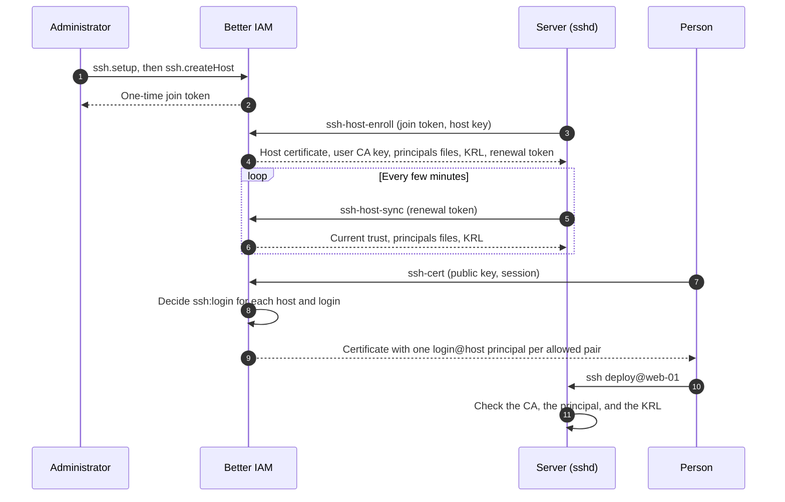

Most teams manage SSH access by copying public keys into `authorized_keys` files on every server. Those keys never
expire, nobody knows exactly which servers hold a given person's key, and when someone leaves, their key stays on
every server nobody remembered to clean up. Nor is there one place to answer "who can log in to the database hosts
as `postgres`?".

OpenSSH has a better model built in: certificates. A server that trusts a certificate authority (CA) accepts any key
the CA signed, for the principals the certificate names, until the certificate expires. Better IAM can be that
authority. People and machines sign in as usual and get a short-lived OpenSSH certificate for exactly the hosts and
local accounts their <Term id="policy">policies</Term> allow. Servers run stock `sshd`, a few files under `/etc/ssh`,
and a sync job; nothing else.

- **User certificates** name each host and login they open. They last hours, never longer than the
  <Term id="session">session</Term> that asked for them.
- **Host certificates** let clients verify servers by certificate, so there are no trust-on-first-use prompts.
- **Revocation** works through key revocation lists (KRLs) that servers fetch every few minutes. A sweep revokes
  certificates whose holder or access went away.
- **Policies decide**, as everywhere else. Getting a certificate is an `ssh:login` decision, so
  <Term id="condition">conditions</Term>, <Term id="boundary">boundaries</Term>, just-in-time roles, access windows,
  delegation scopes and access reviews all apply.

**Who configures it.** Your team turns on the `ssh` option and schedules the sweep job. An organization's
administrator creates its authorities and registers hosts, whoever runs a server enrolls it with a one-time join
token, and members fetch certificates with the CLI or your own UI.



## Turn it on

The certificate authority is off until the deployment sets the `ssh` option. While it is off, every method of the
`ssh` API group fails with `FEATURE_DISABLED`.

```ts title="iam.ts"
const iam = betterIam({
  // ...
  ssh: true, // or an options object
});
```

<TypeTable
  type={{
    maxUserCertificateMs: {
      type: 'number',
      description: 'The longest user certificate any tenant may allow, 5 minutes to 7 days. Tenant settings can only go lower.',
      default: '24 hours',
    },
    hostCertificateMs: {
      type: 'number',
      description: 'Host certificate lifetime, 1 day to 1 year. Hosts renew with their renewal token.',
      default: '90 days',
    },
    clockSkewMs: {
      type: 'number',
      description: 'How far the start of validity ("valid after") is backdated against clock skew, at most 1 hour.',
      default: '5 minutes',
    },
    maxHostsPerCertificate: { type: 'number', description: 'The most hosts one user certificate may name, 1 to 256.', default: '64' },
    recordRetentionDays: {
      type: 'number',
      description: 'How long certificate records stay after they expire, for audits (1 to 3650).',
      default: '90',
    },
    joinTokenMs: { type: 'number', description: 'How long a host join token stays valid, 5 minutes to 30 days.', default: '24 hours' },
    issuanceLimit: { type: 'number', description: 'Certificates one identity may request per rate-limit window.', default: '60' },
  }}
/>

A value outside its range fails with `INVALID_CONFIG`. The option also adds the `ssh-login` and `ssh-host` resource
types and their actions to the permission catalog.

## How access is decided

Every enrolled host lists the local accounts people may use on it (`logins`). Every pair of host and login is a
resource of type `ssh-login`, named `ssh-login/{host}/{login}`, whose attributes are the host's labels plus `host`
and `login`. Forwarding is decided on the host itself, `ssh-host/{host}`:

| Action              | Resource                   | Grants                                                   |
| ------------------- | -------------------------- | -------------------------------------------------------- |
| `ssh:login`         | `ssh-login/{host}/{login}` | Logging in to the host as that login                     |
| `ssh:port-forward`  | `ssh-host/{host}`          | The `permit-port-forwarding` extension                   |
| `ssh:agent-forward` | `ssh-host/{host}`          | The `permit-agent-forwarding` extension                  |
| `ssh:x11-forward`   | `ssh-host/{host}`          | The `permit-X11-forwarding` extension                    |

Certificate extensions apply to every host a certificate names, so a certificate carries a forwarding extension only
when every host it names allows that kind of forwarding. Every certificate carries `permit-pty` and
`permit-user-rc`.

```json title="Deploy to staging, reach databases with MFA, forward ports anywhere"
{
  "version": 1,
  "statements": [
    {
      "effect": "allow",
      "actions": ["ssh:login"],
      "resources": ["ssh-login/*/deploy"],
      "conditions": { "StringEquals": { "resource.environment": "staging" } }
    },
    {
      "effect": "allow",
      "actions": ["ssh:login"],
      "resources": ["ssh-login/db-*/postgres"],
      "conditions": { "Bool": { "principal.mfa": true } }
    },
    { "effect": "allow", "actions": ["ssh:port-forward"], "resources": ["ssh-host/*"] }
  ]
}
```

A certificate carries one principal per allowed pair, `{login}@{host}`. On each host, the principals file of each
login holds only that host's own principal, so a certificate opens nothing it was not issued for. A host that was
not set up with a principals file refuses these certificates outright, because a principal such as `deploy@web-01`
never equals a local user name.

The same decisions work through the generic API, so reviews and tests need nothing SSH-specific:
`iam.authorize({ token, tenantId, action: 'ssh:login', resource: { type: 'ssh-login', id: 'web-01/deploy' } })`,
[`policies.whoCan`](/docs/guides/authorization/reviews#who-can-act-on-a-resource), `policies.simulate`, and
`ssh.whoCanLogin` for one host. `whoCanLogin` (`iam:ssh:read`) decides each active identity in a
<Term id="synthetic-session">synthetic session</Term> (with MFA when `assumeMfa`), optionally for one `login` or
identity `kind`. A host or login that does not exist is `NOT_FOUND`.

Two principals never get certificates:

- **"View as" sessions.** An <Term id="impersonation">impersonation</Term> session is refused
  (`IMPERSONATION_RESTRICTED`).
- **The platform root override in another organization.** A <Term id="root">root</Term> administrator needs a role in
  the organization like anyone else (`ROOT_SSH_RESTRICTED`). The root tenant's own hosts are the exception.

## Set up the authority and hosts

An administrator with `iam:ssh:manage` creates the tenant's two authorities, one that signs user certificates and one
that signs host certificates, and then registers hosts. Hosts can be registered only once the authorities exist
(`SSH_NOT_CONFIGURED` otherwise). `setup` is idempotent: a second call creates nothing.

```ts
await iam.api.ssh.setup(admin, { tenantId });

const { host, joinToken } = await iam.api.ssh.createHost(admin, {
  tenantId,
  name: 'web-01',
  addresses: ['web-01.corp.example.com', '10.0.0.5'],
  logins: ['deploy', 'ubuntu'],
  labels: { environment: 'staging', team: 'payments' },
});
```

<TypeTable
  type={{
    name: {
      type: 'string',
      description: 'Up to 128 lowercase letters, digits, "." and "-". It never changes, because it is part of every principal. A duplicate name is CONFLICT.',
      required: true,
    },
    logins: {
      type: 'string[]',
      description: 'The local accounts people may be granted, 1 to 64. Each is up to 32 letters, digits, "_", "." or "-", starting with a letter or "_".',
      required: true,
    },
    addresses: { type: 'string[]', description: 'Up to 32 DNS names and IP addresses clients connect with. The host certificate names them and the host name.' },
    labels: {
      type: 'Record<string, string>',
      description: 'Up to 32 attributes that policies read as resource.{label}. Names are letters, digits and "_" (starting with a letter); values are up to 256 characters. host, login, tenantId, name, status, id, type, ownerId, parentId and parentType are reserved.',
    },
    description: { type: 'string', description: 'Up to 512 characters.' },
  }}
/>

`createHost` returns the host and a one-time join token, shown once and valid for `joinTokenMs`.

### Names the organization can vouch for

The host certificate names the host's name and every address, and clients trust the host authority for them. The
authority must therefore never vouch for a name the organization does not own:

- **Owned names.** Without `hostPatterns` (see [tenant settings](#tenant-settings)), a name or address must be a
  single label (`web-01`), a private address (`10.0.0.5`, `fd00::5`), or a name under one of the organization's
  [verified domains](/docs/federation/enterprise-onboarding#prove-the-email-domain). With `hostPatterns`, it must also
  match them, and a public IP address needs a pattern that fixes its prefix (`203.0.113.*`). Anything else is refused
  with `HOST_OUTSIDE_PATTERNS`.
- **Unique names.** No two hosts of the organization share a name or address. Reusing another host's name is
  `CONFLICT`; any other overlap is `HOST_NAME_TAKEN`.
- **Names within your scope.** `iam:ssh:manage` is decided on `iam/ssh/hosts/{name}` for the host's name and for
  every address, so an administrator allowed only `iam/ssh/hosts/team-a-*` cannot give a host the address
  `payroll.acme.com`.

`updateHost` changes addresses, logins, labels or the description (`null` clears it); new addresses follow the same
rules. Removing an address revokes the host's certificate at once, and the host gets a new one at its next sync. New
logins and addresses reach the server at its next sync too (`syncRequired` in the result says so). Refusals are
audited as denied `iam:ssh:manage` events with the code in `metadata.reason`.

`disableHost` takes a host out of service: its certificate is revoked, its key is published to clients as revoked,
its tokens stop working, and no user certificate names it any more. `deleteHost` removes it and revokes its
certificate.

### Enroll a server

<Steps>
<Step>

**Run the enrollment on the server.** The CLI reads the server's public host key (`--host-key`, default
`/etc/ssh/ssh_host_ed25519_key.pub`) and sends it with the join token. The token works once.

```bash
BETTER_IAM_SSH_JOIN_TOKEN=biam_sshj.... better-iam ssh-host-enroll --url https://iam.example.com
```

`--dry-run` lists the files without writing them, and `--root DIR` writes under another directory (for images and
tests).

</Step>
<Step>

**Check what it wrote.** `enrollHost` returns everything sshd needs, and the CLI writes it (only ever under
`/etc/ssh`):

| File                                        | For                                                        |
| ------------------------------------------- | ---------------------------------------------------------- |
| `/etc/ssh/ssh_host_ed25519_key-cert.pub`    | `HostCertificate`, signed by the host authority (named after the host key type) |
| `/etc/ssh/better-iam/user-ca.pub`           | `TrustedUserCAKeys`                                        |
| `/etc/ssh/better-iam/principals/{login}`    | `AuthorizedPrincipalsFile`, holding `{login}@{host}`       |
| `/etc/ssh/better-iam/revoked.krl`           | `RevokedKeys`                                              |
| `/etc/ssh/sshd_config.d/00-better-iam.conf` | The drop-in naming the four above                          |
| `/etc/ssh/better-iam/renewal-token`         | The host's credential for syncing (mode `0600`)            |

```text title="/etc/ssh/sshd_config.d/00-better-iam.conf"
# Managed by better-iam: host web-01 of tenant ten_123
# The first value sshd reads wins, so this drop-in sorts first (check with sshd -T).
TrustedUserCAKeys /etc/ssh/better-iam/user-ca.pub
AuthorizedPrincipalsFile /etc/ssh/better-iam/principals/%u
RevokedKeys /etc/ssh/better-iam/revoked.krl
HostCertificate /etc/ssh/ssh_host_ed25519_key-cert.pub
```

sshd uses the first value it reads for each setting, so the drop-in's name sorts first. sshd reads it only when
`sshd_config` includes `/etc/ssh/sshd_config.d/*.conf`; check the effective configuration with `sshd -T`.

</Step>
<Step>

**Reload sshd**, for example with `systemctl reload ssh`.

</Step>
<Step>

**Schedule the sync.** Run `better-iam ssh-host-sync --url https://iam.example.com` every few minutes from cron or a
systemd timer. Revocations and principals apply to the next login without a reload; reload sshd when a sync renews
the certificate (`certificateRenewed`) or the trust changed.

</Step>
</Steps>

Each sync fetches the current trust, principals files and revocation list. It issues a new host certificate when the
current one is two thirds through its life, the host's addresses changed, or the host authority rotated; `renew: true`
(`--renew`) forces one, at most hourly. A new certificate comes with a new renewal token, which the CLI saves. The
previous token keeps working until the new one is used, so a lost response never locks a host out. The CLI also
deletes the principals files of logins the host no longer has. Enrollment and syncs are rate limited per host.

Without the CLI, call the public routes yourself. Like every `POST` to the handler, they need
`Content-Type: application/json` and `X-Better-IAM: 1`:

```bash
curl -s https://iam.example.com/api/iam/ssh/syncHost \
  -H 'content-type: application/json' -H 'x-better-iam: 1' \
  -d "{\"renewalToken\":\"$(cat /etc/ssh/better-iam/renewal-token)\"}"
```

<Callout type="warn" title="A renewal token never moves a host to another key">
  A sync that presents a different host key fails with `HOST_KEY_CHANGED` (audited as a denied `ssh:host:sync`), so a
  stolen renewal token cannot produce a host certificate for an attacker's key. After rebuilding a server, re-enroll
  it with a new join token from `ssh.resetJoinToken`, which also invalidates its renewal token.
</Callout>

Every certificate a host held before is revoked as `superseded` whenever it gets a new one, and a key that no
enrolled host uses any more is published to clients as revoked. A host key cannot be a security key or one of the
organization's authority keys (`INVALID_INPUT`), nor another host's key (`HOST_KEY_IN_USE`), so revoking one host
never revokes anything else.

While the organization is suspended, hosts keep syncing but get no new certificates, and their revocation list
revokes every user certificate. Enrolling needs an active organization (`TENANT_INACTIVE`).

## Get a certificate

People, and <Term id="service-account">service accounts</Term> or agents with their API keys, call
`issueCertificate`, or run the CLI:

```bash
better-iam login --url https://iam.example.com
better-iam ssh-cert --tenant ten_123                 # every host and login you may use
better-iam ssh-cert --hosts web-01 --logins deploy --ttl-minutes 30 --reason "hotfix 42"
ssh deploy@web-01.corp.example.com
```

`ssh-cert` reads your public key (`--key`, default `~/.ssh/id_ed25519.pub`) and saves the certificate next to it
(`~/.ssh/id_ed25519-cert.pub`), where ssh finds it. It also writes the host authority, for the organization's host
names, to `~/.ssh/better-iam_known_hosts` (`--known-hosts` to change), and the host revocation list beside it as
`~/.ssh/better-iam_revoked_hosts`. `--no-write` prints the certificate instead. Add both files to your SSH
configuration once:

```text title="~/.ssh/config"
Host *.corp.example.com web-* db-*
  UserKnownHostsFile ~/.ssh/known_hosts ~/.ssh/better-iam_known_hosts
  RevokedHostKeys ~/.ssh/better-iam_revoked_hosts
```

`clientTrust` returns the same two for a session of the organization. The public `trust` route gives only the
authority keys (and the `@cert-authority` line for configured `hostPatterns`), so the host inventory is never
public.

```ts
const cert = await iam.api.ssh.issueCertificate(session, {
  tenantId,
  publicKey: 'ssh-ed25519 AAAA... alice@laptop',
  hosts: ['web-01'], // optional; default: every enrolled host you may open
  logins: ['deploy'], // optional
  ttlMs: 30 * 60_000, // optional; default and maximum from the tenant settings
  reason: 'hotfix 42', // optional; audited
});
// cert.certificate: 'ssh-ed25519-cert-v01@openssh.com AAAA...'
// cert.principals: ['deploy@web-01'], cert.validBefore, cert.hosts, cert.knownHosts, cert.revokedHostKeys
```

A request names at most 256 hosts and 64 logins, and a certificate at most `maxHostsPerCertificate` hosts and 256
principals (`TOO_MANY_HOSTS` otherwise; name fewer with `hosts`). A named host that is not enrolled is `NOT_FOUND`.

`myAccess` lists the hosts, logins and forwarding the caller may use, with the settings that affect a request (like
`tsh ls`), and `myCertificates` lists their last 100 certificates. Anyone may revoke their own user certificate with
`revokeCertificate` without a permission. A "view as" session or a credential narrowed by a session policy needs
`iam:ssh:manage` for that, and an agent acting for a person may revoke only the certificates its own session obtained.

### How long a certificate lives

A certificate's lifetime is the requested `ttlMs` (at least one minute), or the tenant's default, capped by all of:

- the tenant's maximum, and the account's expiry;
- the session that asked for it. A certificate lives only as long as that session: signing out, revoking the person's
  sessions, revoking the API key, or the session's idle timeout ends it at the next revocation list or sweep;
- the earliest end of any time-limited grant that can allow `ssh:login`: a just-in-time
  <Term id="activation">activation</Term>, an expiring binding or group membership, or an
  <Term id="access-window">access window</Term>. Standing grants set no limit;
- ten minutes for agents acting for people (delegated sessions).

When the result is less than a minute away, the request fails with `SESSION_EXPIRING`: renew the session or the
access first.

Issuing is rate limited per identity (`issuanceLimit`, 60 per window by default). The key ID that sshd logs is
`{email} ({identityId})`, plus `via agent {id}` for delegated sessions. Supported keys are Ed25519, ECDSA
(P-256/384/521), RSA of 2048 bits or more, and FIDO security keys (`ed25519-sk`, `ecdsa-sk`).

Issuing is audited as `ssh:certificate:issue`, with the serial, key ID, hosts, fingerprint and reason, and counts as
using `ssh:login` for [usage tracking](/docs/guides/governance/usage-and-mining). A refusal by policy or by the
tenant's rules (access denied, MFA, security key, "view as", root override) is a denied `ssh:login` event whose
`metadata.reason` names the code.

## Tenant settings

`updateSettings` (`iam:ssh:manage`) changes a tenant's rules; fields left out keep their values. `getSettings`
(`iam:ssh:read`) reads them, with the deployment's ceiling as `deploymentMaxCertificateMs`.

<TypeTable
  type={{
    requireMfa: {
      type: 'boolean',
      description: 'People need an MFA session to get a certificate (MFA_REQUIRED). Service accounts and agents are unaffected.',
      default: 'false',
    },
    requireSecurityKey: {
      type: 'boolean',
      description: 'Only FIDO security keys (ed25519-sk, ecdsa-sk) are certified (SECURITY_KEY_REQUIRED).',
      default: 'false',
    },
    requireUserVerification: {
      type: 'boolean',
      description: 'Security-key certificates carry verify-required: the key checks its PIN or biometric at every login.',
      default: 'false',
    },
    bindSourceAddress: {
      type: 'boolean',
      description: "Certificates carry source-address with the caller's IP, so they work only from there. The server must know the IP (SOURCE_ADDRESS_UNKNOWN otherwise).",
      default: 'false',
    },
    defaultCertificateMs: { type: 'number', description: 'Lifetime when a request names none. It may not exceed maxCertificateMs.', default: '8 hours' },
    maxCertificateMs: {
      type: 'number',
      description: "The longest a request may ask for. Both lifetimes range from 1 minute to the deployment's maxUserCertificateMs.",
      default: '16 hours',
    },
    hostPatterns: { type: 'string[]', description: 'Up to 16 known_hosts patterns the host authority is trusted for.', default: '[]' },
  }}
/>

`bindSourceAddress` needs the client IP, which the handler knows only when you supply
[`http.clientInfo`](/docs/guides/authentication/http#client-details).

Without `hostPatterns`, members' clients trust the host authority for exactly the enrolled hosts' names and
addresses, never for `*`. With patterns such as `['*.corp.example.com', 'web-*', '10.20.*', '!bastion.corp.example.com']`
(`*` and `?` globs, `!` negation), every host name and address must match them as well, and clients trust the
authority for the patterns. Each positive pattern must end in a verified domain of the organization, fix an address
prefix, or be a short single-label name; `*` alone is refused, at least one pattern must be positive, and the patterns
must cover every host already enrolled. The authority can then never vouch for a name like `github.com`, even if an
administrator enters it.

## Revocation

There are two key revocation lists, both from `revocationList`:

- **`user`** (the default), which hosts load as `RevokedKeys` and enforce from their next sync. It holds:
  - certificates revoked by hand: `revokeCertificate`, `revokeIdentity` (everything one identity holds), and
    `revokeAllCertificates` (the whole tenant, for a suspected compromise);
  - certificates of people and machines who are no longer active, or whose session is gone, even before the sweep
    marks them;
  - every user certificate while the organization is suspended.
- **`host`** (`kind: 'host'`), which clients load as `RevokedHostKeys`. It holds revoked host certificates (of
  disabled, deleted and re-enrolled hosts, and after an address was removed) and host keys no enrolled host uses any
  more. Members also get these keys as `@revoked` lines in their known_hosts file.

<Callout title="Schedule the sweep">
  Run `iam.ssh.sweep()` or `better-iam ssh-sweep` every few minutes. It re-checks every live user certificate against
  the very session that requested it, with the same validation every request gets, and revokes certificates whose
  holder is no longer active (`identity-inactive`), whose session was revoked, expired or no longer validates
  (`session-ended`), or whose hosts, logins or forwarding policies no longer allow (`access-changed`, which also covers
  a login removed from a host). Removing a binding therefore takes SSH access away within minutes, not when the
  certificate expires. `ssh.sweep` (`iam:ssh:manage`) runs it for one tenant on demand.
</Callout>

Each revocation by the sweep is audited as `ssh:certificate:revoke` with the reason. `revocationList` is public: like
an X.509 CRL, it holds serials and public keys only. It is read outside any transaction and cached for 10 seconds per
tenant, kind and revocation version, and every revocation bumps the version. `iam.ssh.revocationList(tenantId, kind)`
returns the same list as bytes, for serving it from a custom route.

## Rotate an authority

Rotation is two-phase, so no certificate stops working unexpectedly:

<Steps>
<Step>

`rotateAuthority({ kind: 'user' })` (or `'host'`) publishes a new `pending` key. Hosts and clients trust it from their
next sync. Only one rotation per kind may be pending (`CONFLICT`).

</Step>
<Step>

`activateAuthority({ authorityId })` makes it sign. The old key stays trusted as `previous`, so the certificates it
signed keep working until they expire.

</Step>
<Step>

`retireAuthority({ authorityId })` stops trusting the previous key once its certificates have expired. It is refused
with `RESOURCE_IN_USE` while valid certificates remain, unless you pass `force: true`, which revokes them.

</Step>
</Steps>

After a compromise, `rotateAuthority({ kind, activate: true })` switches at once. User certificates then work only on
hosts that have synced since. A host authority rotation re-issues host certificates at each host's next sync.

Authority private keys are Ed25519, sealed with the deployment secret, and re-sealed by `iam.rotateSecrets()` (see
[rotating the deployment secret](/docs/operations/deployment/secrets#rotating-the-deployment-secret)). No API response
ever contains them; `listAuthorities` shows public keys and fingerprints only.

## API and permissions

Administration is decided on `iam/ssh/...` resources: `iam/ssh/authorities/{kind}`, `iam/ssh/hosts/{name}`,
`iam/ssh/certificates/{id}`, `iam/ssh/identities/{identityId}` and `iam/ssh/settings`.

| Method                                                                                                                  | Access                          |
| ----------------------------------------------------------------------------------------------------------------------- | ------------------------------- |
| `setup`, `updateSettings`, `rotateAuthority`, `activateAuthority`, `retireAuthority`                                    | `iam:ssh:manage`                |
| `createHost`, `updateHost`, `disableHost`, `resetJoinToken`, `deleteHost`                                               | `iam:ssh:manage`                |
| `revokeCertificate` (someone else's), `revokeIdentity`, `revokeAllCertificates`, `sweep`                                | `iam:ssh:manage`                |
| `status`, `getSettings`, `listAuthorities`, `getHost`, `listHosts`, `listCertificates`, `getCertificate`, `whoCanLogin` | `iam:ssh:read`                  |
| `issueCertificate`, `myAccess`, `myCertificates`, `clientTrust`, `revokeCertificate` (own)                              | A session; `ssh:login` decides  |
| `enrollHost` (join token), `syncHost` (renewal token), `trust`, `revocationList`                                        | Public                          |

Errors: `FEATURE_DISABLED`, `SSH_NOT_CONFIGURED`, `MFA_REQUIRED`, `SECURITY_KEY_REQUIRED`, `SOURCE_ADDRESS_UNKNOWN`,
`TOO_MANY_HOSTS`, `SESSION_EXPIRING`, `IMPERSONATION_RESTRICTED`, `ROOT_SSH_RESTRICTED`, `HOST_OUTSIDE_PATTERNS`,
`HOST_NAME_TAKEN`, `HOST_KEY_IN_USE`, `HOST_KEY_CHANGED`, `INVALID_TOKEN`, `TENANT_INACTIVE`, `RESOURCE_IN_USE` and
`RATE_LIMITED`. The [error reference](/docs/reference/errors) explains each.

Audit events: `ssh:certificate:issue`, `ssh:certificate:revoke` (sweep and self-service), `ssh:host:enroll`,
`ssh:host:renew`, denied `ssh:host:enroll` and `ssh:host:sync` (a real host's token refused, a key swap), denied
`ssh:login`, and the `iam:ssh:*` administration operations (denied ones name the refusal in `metadata.reason`).

## Next steps

<Cards>
  <Card title="ssh API reference" href="/docs/reference/api/ssh">
    Every method with its permission, audit events, and errors.
  </Card>
  <Card title="SSH commands" href="/docs/reference/cli#ssh-cert">
    ssh-cert, ssh-host-enroll, ssh-host-sync, and ssh-sweep with every flag.
  </Card>
  <Card title="Just-in-time elevation" href="/docs/guides/privileged-access/elevation">
    Grant ssh:login only while an activation lasts; certificates end with it.
  </Card>
</Cards>
