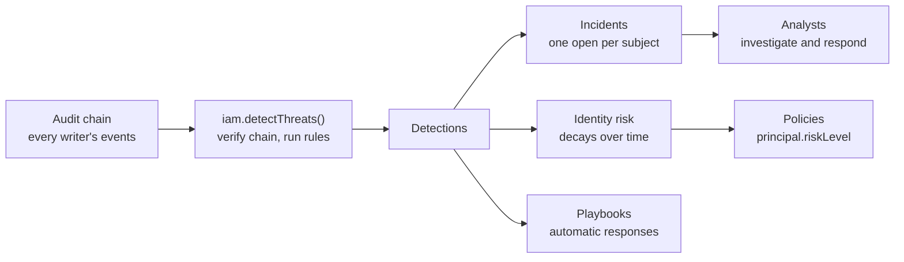

Attacks on accounts leave traces long before anyone notices them: a burst of failed sign-ins from one network, a
session presented from somewhere it was never used, a second factor switched off minutes after a suspicious sign-in,
an administrator granting themselves a role. The events are already in the audit log, but nobody reads it in time,
and by the time someone does, the intruder has settled in.

Better IAM reads its own <Term id="audit-chain">audit trail</Term> for these patterns. This is identity threat
detection and response (ITDR): it reports password sprays, password and second-factor guessing, stolen sessions,
replayed tokens, accounts taken over and then locked in, self-granted administrator access, mass deletions, weakened
security settings, and tampering with the audit log itself.

- **Detections** come from 21 built-in rules, each mapped to a MITRE ATT&CK technique.
- **Incidents** group the detections about one person, network, tenant, or directory connection for investigation.
- **Risk** is a decaying score per <Term id="identity">identity</Term> that <Term id="policy">policies</Term> read as
  `principal.riskLevel` and `principal.riskScore`.
- **Responses** end sessions, forget remembered devices, contain an account, block a network, or send an alert, by
  hand or automatically through **playbooks**.

Everything lives in the `threats` API group (`client.threats.*` over HTTP). Reading needs `iam:threats:read`, tuning
and triage `iam:threats:manage`, and acting on identities and networks `iam:threats:respond`, all on
`iam/threats/...`. People report activity on their own account ("this wasn't me") without any permission.



## How detection runs

Detection is a scheduled job, [`iam.detectThreats()`](/docs/reference/api#detectthreats) (CLI
[`detect-threats`](/docs/reference/cli#detect-threats)). Each run does this for every active tenant:

<Steps>
<Step>

**Read the tenant's audit chain from a cursor.** The engine keeps one cursor per tenant: the sequence and hash of the
last event it verified. It reads at most `maxEvents` unread events (2000 by default, at most 20,000). A tenant with
more waits for the next run and counts under `pending`, as does a run whose events hold the sign-ins of more than 500
people. A tenant's first run starts one day back instead of replaying the whole trail.

</Step>
<Step>

**Verify the hash chain.** Each event must follow the previous one: sequences are contiguous, `previousHash` links to
the event before, and `hash` recomputes. A chain head moved back behind the cursor, or replaced at it, counts too. A
break raises an `audit-tampering` detection (critical), and detection continues from the event as stored, so one
break is reported once. The gap an `audit:prune` checkpoint explains is not a break.

</Step>
<Step>

**Evaluate the rules** over the new events together with the earlier events the rules' windows reach back to (the
longest enabled window plus a day, so one day and fifteen minutes with the defaults). The module's own events
(`threat:*`, and anything the `threat-detection` actor records) are verified but never fed to the rules.

</Step>
<Step>

**Record the results in one transaction.** Detections are recorded once each and joined to incidents, identities'
risk rises, sign-in baselines are learned, the cursor advances, and the tenant's playbooks run for the new
detections.

</Step>
</Steps>

Reading the trail rather than hooking the code that writes it has three consequences. Detection sees everything any
writer records: the authentication service, <Term id="scim">SCIM</Term>, the OAuth provider, deployment jobs, and
every server process. It never slows down a sign-in or an API call. And it is not instant: a detection appears on the
first run after the activity, so the job's interval is the detection delay.

Every detection has a unique key made of its rule and a rule-chosen key: the triggering event for single-event rules,
or the burst for counting rules. Reading the same events again, overlapping runs, and a burst seen by several runs
never raise a second detection, and activity that never pauses raises at most one detection a day per subject and
rule. Two runs that overlap are safe: the writing transaction re-checks the cursor, and the later run records nothing.
When rule evaluation fails for one tenant, or its settings changed while the run evaluated them, that tenant records
nothing and keeps its cursor, so the next run reads the same events again. The other tenants are unaffected, and a
failure is reported on the `threats:detect` observability span.

A run returns what it did:

| Field | Meaning |
| --- | --- |
| `tenants` | Tenants read. |
| `eventsScanned` | Audit events read and verified. |
| `detections` | New detections recorded. |
| `incidentsOpened` | Incidents those detections opened. |
| `responses` | Playbook actions applied (skipped ones are not counted). |
| `braked` | Automatic containments held back by `maxAutomaticContainments`. |
| `chainBreaks` | Tenants whose audit chain failed verification in this run. |
| `pending` | Tenants with more unread events than one run reads; the next run continues where this one stopped. |

`threats.detect({ tenantId })` runs detection for one tenant right away (`iam:threats:manage` on
`iam/threats/detections`) and returns the same summary, for example behind a "Check now" button.

## Detection rules

`threats.rules({ tenantId })` lists every rule with its defaults, the bounds a tenant may tune it within
(`tunable`), and the setting in force. All rules are on by default. Counting rules fire when a key reaches the
threshold within a sliding window.

| Rule | Detects | Severity | Subject | Default | ATT&CK |
| --- | --- | --- | --- | --- | --- |
| `password-spray` | One network failing password sign-ins for many different accounts | high | network | 10 accounts in 15 minutes | T1110.003 |
| `brute-force` | Many failed password sign-ins for one person | medium | identity | 10 in 15 minutes | T1110.001 |
| `brute-force-success` | A sign-in right after a run of failed attempts | high | identity | 5 failures in 30 minutes | T1110 |
| `mfa-bombardment` | Repeated wrong second-factor codes: the password was right | high | identity | 5 in 15 minutes | T1621 |
| `session-hijack` | A session bound to one network presented from another | high | identity | every occurrence | T1550.004 |
| `new-network` | A privileged person signing in from a network not seen for them before | medium | identity | every occurrence | T1078 |
| `dormant-reactivated` | A sign-in to an account unused for longer than the dormancy period | medium | identity | 90 days | T1078 |
| `account-takeover-persistence` | Sign-in methods changed shortly after a risky sign-in | high | identity | within 1 hour | T1098 |
| `privilege-escalation` | Someone granting an administrator role they now hold | high | identity | every occurrence | T1098.003 |
| `root-admin-granted` | A person made a root administrator of the deployment | high | identity | every occurrence | T1098 |
| `mass-deletion` | One actor deleting or revoking many identities, roles, policies, groups, bindings, keys, or trusts | high | identity | 20 in 10 minutes | T1531 |
| `directory-mass-change` | A SCIM connection updating or deleting many people | medium | connection | 25 in 10 minutes | T1531 |
| `impersonation-burst` | One administrator starting many "view as" sessions | medium | identity | 5 in 1 day | T1078 |
| `denial-burst` | One actor denied many times (AI agents included): probing for access | medium | identity | 30 in 10 minutes | T1069 |
| `recon-burst` | Far more administrative reads than usual, or many data-subject exports | low | identity | 300 reads in 10 minutes | T1087 |
| `guardrail-weakened` | A protection dropped from the sign-in policy, a network block lifted, or detection weakened | medium | tenant | every occurrence | T1562 |
| `token-replay` | A web identity token presented a second time to assume a role | high | identity | every occurrence | T1550 |
| `audit-tampering` | The tenant's audit hash chain no longer verifies | critical | tenant | every break | T1070 |
| `invariant-broken` | A monitored access invariant stopped holding | medium | tenant | every `invariant:broken` | T1098 |
| `user-reported` | The account holder reported activity that was not them | high | identity | every report | T1078 |
| `upstream-signal` | An upstream identity provider reported compromise, a disabled account, or risk | by event | identity | every matched event | T1078 |

### What each rule reads

Networks are client addresses reduced to a key: an IPv4 address, or the /64 of an IPv6 address. Events without a
parseable address never reach the network rules.

<Accordions type="multiple">
<Accordion title="Sign-in failures: password-spray, brute-force, mfa-bombardment, brute-force-success">

These count `auth:signin:fail` events, which the authentication service records for known, active people only.
`password-spray` counts the distinct accounts one network failed a password for; `brute-force` counts one person's
wrong passwords; `mfa-bombardment` counts one person's wrong second-factor codes. `brute-force-success` counts
failures of any kind in the window before a sign-in and since the person's previous one. It is high when the
successful sign-in came from a network that was failing, and one step lower otherwise.

</Accordion>
<Accordion title="Sign-in baselines: new-network, dormant-reactivated">

Every sign-in a person makes themselves (not through impersonation) is learned into their baseline: the last 25
networks, the last 10 user agents, and the time. `new-network` needs at least one known network, so an identity's
first sign-in after detection is enabled only teaches. It reports privileged people only:
<Term id="owner">owners</Term>, root administrators, and holders of a live standing binding (direct or through a
group) of a role that grants `*` or `iam:*` on `*` without conditions. With `everyone: true` it reports everybody else
too, at low severity.

`dormant-reactivated` compares a sign-in with the last one the baseline holds, so it judges only accounts whose
previous sign-in the engine saw.

</Accordion>
<Accordion title="Account takeover: account-takeover-persistence">

A risky sign-in is one that `brute-force-success`, `new-network`, or `dormant-reactivated` flagged. Within the window
around it (an hour by default), this rule watches the person's own changes: turning off the second factor, enrolling
an authenticator app, adding a passkey, generating recovery codes, remembering a device, changing the email address or
password, and creating an API key. A risky sign-in that an administrator has since dismissed, or closed as a false
positive or benign, opens no window.

</Accordion>
<Accordion title="Stolen credentials: session-hijack, token-replay">

`session-hijack` needs the tenant sign-in policy's
[`bindSessionsToIp`](/docs/guides/authentication/tenant-policy#binding-sessions-to-their-network): only then are
sessions bound to a network and refused elsewhere (audited as `auth:session:mismatch`). It raises one detection per
session. `token-replay` reads web identity tokens that `sts.assumeRoleWithWebIdentity` refused as already used.

</Accordion>
<Accordion title="Privilege: privilege-escalation, root-admin-granted">

`privilege-escalation` reads role bindings created by someone who is neither an owner nor a root administrator, of an
administrator role (one that grants `*` or `iam:*` on `*` without conditions) that the creator now holds. The audit
event names only the role, so a holder of an administrator role granting it to a colleague matches too. It fires at
most once per actor, role, and day. `root-admin-granted` fires when `iam:root:grant` leaves its target a root
administrator.

</Accordion>
<Accordion title="Mass changes: mass-deletion, directory-mass-change, impersonation-burst, denial-burst, recon-burst">

`mass-deletion` counts identity deletions and offboarding, deletions of roles, policies, groups, bindings, webhooks,
and resource types, API key revocations, and trust revocations. `directory-mass-change` counts SCIM `UpdateUser` and
`DeleteUser` per connection.

`mass-deletion`, `impersonation-burst`, `denial-burst`, and `recon-burst` count identities only, never the
deployment's own actors (such as `deployment-operator`, `threat-detection`, SCIM connections, and Shared Signals
sources). What an administrator does in a <Term id="impersonation">"view as"</Term> session counts against the
administrator in `mass-deletion`, `denial-burst`, and `recon-burst`, not against the member it shows as.
`denial-burst` ignores refused web identity tokens: trust ids are public, so anyone can post tokens for one.

`recon-burst` counts allowed `iam:*:read` operations (reads of the threats module excepted) and, separately,
data-subject exports (`identity:export`) at a threshold of the larger of 3 and one fiftieth of the read threshold.

</Accordion>
<Accordion title="Integrity: guardrail-weakened, audit-tampering, invariant-broken">

`guardrail-weakened` fires when the tenant sign-in policy drops `requireMfa`, `requireMfaForOwners`,
`bindSessionsToIp`, or `notifyNewSignIn`, or empties `allowedIpRanges`; when a network block is lifted
(`security:network-unblock`); and when `threats.configure` turns a rule off or weakens detection (see
[Tuning](#tuning)). `audit-tampering` is raised by chain verification itself. `invariant-broken` reads the
`invariant:broken` events of the `monitor-invariants` job; a broken enforced
<Term id="invariant">invariant</Term> is at least high.

</Accordion>
<Accordion title="Reports: user-reported, upstream-signal">

`user-reported` is raised when a person reports activity that was not them (see
[This wasn't me](#this-wasnt-me)). `upstream-signal` reads what the
[Shared Signals receiver](/docs/federation/shared-signals-receiver) recorded (`signal:received`) when it matched an
upstream provider's event to a person of the tenant. The event sets the severity:

| Upstream event | Severity |
| --- | --- |
| `credential-compromise`, `risk-level-change` to HIGH | high |
| `account-disabled`, `account-purged`, `account-credential-change-required`, `risk-level-change` to MEDIUM | medium |
| `credential-change` | low |

Session revocations and LOW risk raise nothing (the receiver can end sessions itself). Contain people with a
playbook on this rule, for example `{ ruleIds: ['upstream-signal'], minSeverity: 'high' }`.

</Accordion>
</Accordions>

## Tuning

`threats.configure` changes a tenant's settings. Fields you leave out keep their value.

```ts
await iam.api.threats.configure(admin, {
  tenantId,
  rules: {
    'brute-force': { threshold: 20, windowMs: 30 * 60_000 },
    'new-network': { everyone: true }, // non-privileged people too, at low severity
    'recon-burst': { enabled: false },
    'mass-deletion': null, // back to every default
  },
  trustedNetworks: ['203.0.113.0/24', '2001:db8:1000::/48'], // office and VPN egress
  dormantDays: 60,
  riskHalfLifeHours: 48,
  notify: { owners: true, emails: ['soc@acme.test'] },
  maxAutomaticContainments: 5,
});
```

<TypeTable
  type={{
    rules: {
      type: 'Record<ThreatRuleId, ThreatRuleSetting | null>',
      description: "Per rule: enabled, severity (low, medium, high or critical), threshold (counting rules only) and windowMs (rules with a window only), each within the rule's tunable bounds, and everyone (new-network only). null restores one field's default; null for a whole rule drops every adjustment.",
    },
    trustedNetworks: {
      type: 'string[]',
      description: 'Up to 50 addresses or CIDR blocks, no wider than /8 (IPv4) or /32 (IPv6). Replaces the list.',
      default: 'none',
    },
    dormantDays: { type: 'number', description: 'Days without a sign-in before an account counts as dormant (7 to 3650).', default: '90' },
    riskHalfLifeHours: { type: 'number', description: 'Risk points halve every this many hours (1 to 720).', default: '24' },
    notify: {
      type: '{ owners?: boolean; emails?: string[] }',
      description: 'Who notify responses email: active owners with a verified email, and up to 20 addresses.',
      default: 'nobody',
    },
    maxAutomaticContainments: {
      type: 'number',
      description: 'The most identities playbooks may contain per tenant and run (0 to 100). 0 turns automatic containment off.',
      default: '3',
    },
  }}
/>

A value outside a rule's bounds, or a threshold for a rule that does not count, is refused with `INVALID_INPUT`.
`threats.getSettings` returns the settings with every default applied, and `configured: false` while the tenant has
never saved any.

**Trusted networks** are the addresses you know: offices, VPN egress, CI runners. Network rules never report them,
detections never name them, and neither people nor playbooks can block them (the response is skipped as
`trusted-network`). Per-person rules still apply to sign-ins from a trusted network.

`configure` needs `iam:threats:manage` on `iam/threats/settings` and a
<Term id="recent-authentication">recent sign-in</Term>. It is audited as `threat:settings` with the changed keys,
the rules whose behavior changed, the rules turned off, and the settings weakened. Weakening detection is itself
visible: turning a rule off, a higher threshold, a shorter window or a lower severity on a rule that stays on,
`new-network` no longer reporting everyone, a shorter risk half-life, a longer dormancy period, a newly trusted
network, a lower `maxAutomaticContainments`, or fewer alert recipients also records a `guardrail-weakened` detection
against the caller.

<Callout type="warn" title="Nobody shortens the half-life to clear their own risk">
  A shorter half-life decays every score at once. While detections raise the caller's own risk, shortening it is
  refused with `ACCESS_DENIED` (root administrators excepted). Contributions are kept for at least ten days, so
  restoring the half-life restores the scores.
</Callout>

## Incidents

A new detection joins the open incident about its subject, or opens one. There is at most one open (or investigating)
incident per subject: an identity, a network, the tenant, or a directory connection. The incident takes the highest
severity of its detections, lists up to 200 of them, and is retitled "N detections for X" once it spans more than one
rule. An incident about a network, the tenant, or a connection names an identity only while all its detections that
name one name the same one. Resolving an incident closes it for good; the next detection about the same subject opens
a new one.

A typical investigation:

```ts
const { openIncidents, investigating, riskyIdentities, contained, lastRunAt } =
  await iam.api.threats.summary(admin, { tenantId });

const { incidents } = await iam.api.threats.listIncidents(admin, {
  tenantId,
  status: 'open',
  severity: 'high',
});
const { incident, detections, notes, responses, risk } = await iam.api.threats.getIncident(admin, {
  tenantId,
  incidentId: incidents[0].id,
});

// Take it, write down what you found, and look at what the person did.
await iam.api.threats.updateIncident(admin, {
  tenantId,
  incidentId: incident.id,
  status: 'investigating',
  assigneeId: me,
});
await iam.api.threats.addNote(admin, {
  tenantId,
  incidentId: incident.id,
  body: 'Called Alice: she was not travelling.',
});
const trail = await iam.api.threats.timeline(admin, {
  tenantId,
  identityId: incident.identityId!,
  limit: 100,
});

// Respond, then close it.
await iam.api.threats.respond(admin, {
  tenantId,
  incidentId: incident.id,
  actions: [{ kind: 'contain' }, { kind: 'block-network', durationMs: 7 * 86_400_000 }],
  reason: 'Password sprayed and reused from a hosting provider',
});
await iam.api.threats.resolveIncident(admin, {
  tenantId,
  incidentId: incident.id,
  resolution: 'true-positive',
  note: 'Password reset with the person on the phone; account released.',
});
```

- Each detection carries its **evidence**: up to 20 audit event ids with the count, the time span, and the networks,
  identities, and actions involved, so a reviewer can open the underlying trail.
- `summary` reports `lastRunAt`, when detection last read the tenant's trail. A value far in the past means the job
  is not running.
- `updateIncident` moves an incident between `open` and `investigating`, assigns it to an active identity of the
  tenant (`null` unassigns), or changes its severity. `addNote` adds notes of up to 4000 characters, at most 500 per
  incident, resolved ones included.
- `resolveIncident` closes it as `true-positive`, `false-positive`, or `benign`. Its open detections become
  `resolved`. A false positive or benign finding also takes their points out of the identities' risk.
- `dismissDetection` marks one open detection a false alarm and takes its points out of the risk; the incident stays
  open for a person to resolve.
- `timeline` lists an identity's recent audit events, newest first: what it did and what was done to it.
- `listDetections` pages through detections by status, rule, severity, identity, incident, and time.

| Permission | Needed for |
| --- | --- |
| `iam:threats:read` | `rules`, `getSettings`, `summary`, `listDetections`, `getDetection`, `listIncidents`, `getIncident`, `listRisk`, `getRisk`, `timeline`, `listPlaybooks` |
| `iam:threats:manage` | `configure`, `dismissDetection`, `updateIncident`, `addNote`, `resolveIncident`, `createPlaybook`, `updatePlaybook`, `deletePlaybook`, `detect` |
| `iam:threats:respond` | `respond`, `release`, `setRisk` |

They are checked on `iam/threats/settings`, `iam/threats/rules`, `iam/threats/detections[/{id}]`,
`iam/threats/incidents[/{id}]`, `iam/threats/risk[/{identityId}]`, `iam/threats/playbooks[/{id}]`, and
`iam/threats/responses`. Changes need a recent sign-in, except `updateIncident`, `addNote`, and `detect`. A security
analyst role might hold `iam:threats:read` and `iam:threats:manage` on `iam/threats/*`, and an incident responder
`iam:threats:respond` as well.

## Identity risk

Every detection that concerns an identity (its subject, or the actor behind a tenant-level change) adds points to
that identity's risk:

| Severity | Points |
| --- | --- |
| low | 10 |
| medium | 25 |
| high | 50 |
| critical | 80 |

Points halve every `riskHalfLifeHours` (24 by default). The score is the sum of what is left, capped at 100, and its
level is `none` below 10, `low` from 10, `medium` from 40, and `high` from 70. One high detection therefore puts a
person at 50 (`medium`), a day later at 25 (`low`), and after three days back to `none`, unless something else
happens. Scores are computed when they are read, so they decay without any job running. The newest 50 contributions
are kept, and contributions older than ten half-lives (at least ten days) are dropped.

- **Overrides.** `threats.setRisk` with `low`, `medium`, or `high` sets a floor, such as "confirmed compromised",
  that holds until `expiresInMs` (one hour to 90 days) or indefinitely. The effective level is never below it, and
  the score is raised to at least that level's lower bound. `none` clears the override and every contribution.
- **Clearing.** Dismissing a detection, or resolving its incident as a false positive or benign, takes its points
  out. A true positive keeps them, decaying as usual.
- **Nobody clears risk about themselves.** Detections about you are dismissed by another administrator, and incidents
  that raised your own risk are closed as false positives or benign by another administrator (both `ACCESS_DENIED`,
  unless you are a root administrator). Nobody sets their own risk level at all. A compromised administrator account
  therefore cannot erase its own signal.
- Every change of level is audited as `threat:risk-change` with the old and new level and the score.

`threats.listRisk` lists the identities at or above a level (`low` by default), and contained ones, highest score
first, each with its contributions and what they still add. `threats.getRisk` returns one identity's risk (`none`
when nothing was ever detected).

## Risk in policies

Every decision whose policy documents mention them carries two context keys:

| Key | Type | Value |
| --- | --- | --- |
| `principal.riskLevel` | `none`, `low`, `medium`, `high` | The effective level at the time of the decision |
| `principal.riskScore` | number, 0 to 100 | The effective score, decay and override included |

Use them to take sensitive actions away from risky accounts while an incident is investigated, without touching
their roles:

```json title="Deny administration and payments to risky accounts"
{
  "version": 1,
  "statements": [
    {
      "sid": "NoAdministrationWhileAtHighRisk",
      "effect": "deny",
      "actions": ["iam:*"],
      "resources": ["*"],
      "conditions": { "StringEquals": { "principal.riskLevel": "high" } }
    },
    {
      "sid": "NoPaymentsFromRiskyAccounts",
      "effect": "deny",
      "actions": ["payments:send", "payroll:*"],
      "resources": ["*"],
      "conditions": { "NumericGreaterThanEquals": { "principal.riskScore": 40 } }
    },
    {
      "sid": "ExportsOnlyWhenCalm",
      "effect": "allow",
      "actions": ["documents:export"],
      "resources": ["document/*"],
      "conditions": {
        "StringEquals": { "principal.riskLevel": ["none", "low"] },
        "Bool": { "principal.mfa": true }
      }
    }
  ]
}
```

- **Risk follows the person.** A role session they assumed carries their risk, a
  <Term id="service-account">service account</Term>'s or agent's key its own, and a delegated session (an agent
  acting for a person) the higher of the person's and the agent's.
- **Simulated principals always get `none` and 0**: access invariants, <Term id="impact-preview">impact
  previews</Term>, policy simulation, and <Term id="birthright">birthright</Term> automation. An incident therefore
  never flips an invariant or stalls automation. `policies.test` defaults both keys to `none` and 0 too; pass other
  values in its `context` to try a document.
- **The server owns both keys.** Values that `resolveContext` or a plugin supplies are removed, and identity
  attributes cannot be named `riskLevel` or `riskScore`.
- **Root administrators override policies**, so a deny on risk does not stop them. Contain the account instead.

## Responding

Five response actions exist, taken by a person through `threats.respond` or automatically by a playbook:

| Action | Effect |
| --- | --- |
| `revoke-sessions` | Ends the identity's sessions, the role sessions it assumed, and (for an agent) its delegated sessions, and deletes pending sign-in challenges. API keys are kept unless `keepApiKeys: false`. |
| `forget-devices` | Deletes the identity's remembered devices, so the next sign-in asks for the second factor again. |
| `contain` | Disables the identity until `threats.release`: every session except API keys ends, remembered devices and challenges go, and its API keys are refused while it is disabled. |
| `block-network` | Blocks the network for the tenant, like `security.blockNetwork`, for `durationMs` (one minute to 30 days; one day by default). |
| `notify` | Emails the incident (template `threat-alert`) to the tenant's `notify` recipients. |

```ts
const responses = await iam.api.threats.respond(admin, {
  tenantId,
  identityId: aliceId, // or incidentId, or network: '198.51.100.0/24'
  actions: [{ kind: 'revoke-sessions', keepApiKeys: false }, { kind: 'forget-devices' }],
  reason: 'Session cookie reused from another country',
});
```

`respond` takes exactly one target (an incident, whose subject it acts on; an identity; or a network), one to five
actions with each kind at most once, and a reason. It needs `iam:threats:respond` on the incident (on
`iam/threats/responses` without one) and a recent sign-in. A response to an identity or network with an open incident
is filed under that incident. Every action comes back as a response record, `applied` or `skipped` with a reason:
`not-identity` (an identity action on a network), `no-network`, `trusted-network`, `already-applied` (already
contained, or a block at least as long already covers the network), `inactive`, `no-incident`, `no-transport`, or
`no-recipients`. Every applied action is audited as `threat:{action}`.

Protections apply to people responding:

- A root administrator's sessions are ended, and the account contained, only by a root administrator
  (`ACCESS_DENIED`). An owner is contained only by an owner of the tenant in person or a root administrator, as
  `identities.setStatus` requires (`ACCESS_DENIED`). The last owner cannot be contained (`LAST_OWNER`).
- Nobody contains themselves (`INVALID_INPUT`). Revoking your own sessions keeps the one you are responding from.
- A block may not cover your own address, either your session's or this request's (`INVALID_INPUT`), so you cannot
  lock yourself out. Trusted networks are never blocked.
- Blocks on the root tenant decide whether root administrators can sign in, so, as with `security.blockNetwork`, only
  a root administrator sets them (`ACCESS_DENIED`); playbooks skip them as `protected`.

**Containment is reversible.** The identity is disabled, its sessions end, and its API keys are refused while it
stays disabled. `threats.release({ tenantId, identityId, note })` makes it active again: it signs in as usual, and
its keys work again without being reissued. Its sessions stay ended and its risk is kept; member invitations it sent
are revoked at containment and stay revoked. Only an identity the threats module contained, and that nothing else has
disabled, suspended, or re-enabled since, can be released (`INVALID_TRANSITION` otherwise, and for an identity past
its `expiresAt`), and a root administrator only by root. Changing the identity's status any other way
(`identities.setStatus`, `identities.offboard`, a service account's `setStatus`, `agents.suspend` and
`agents.resume`, workflow steps) ends the containment, so a release never undoes what they did. Containing and
releasing re-evaluate the identity's rule-based access packages at once.

**Blocks** are ordinary tenant [network blocks](/docs/guides/authentication/tenant-policy#network-blocks) with the
reason prefixed `threat: `. They refuse sign-ins, sessions, and keys from the network, show in `security.listBlocks`,
and lapse on their own. A network that a tenant or platform block already covers for at least as long is skipped as
`already-applied`; a shorter block on the same network is renewed.

**Alerts** go to the addresses in `notify.emails` and, with `notify.owners`, to the tenant's active owners with a
verified email. They need the deployment's email transport (`authentication.sendEmail`). Playbooks email an incident
once, and again only when its severity has risen since; a person can send it again at any time.

## Playbooks

A playbook responds automatically: when a new detection matches its trigger, its actions run in order as the
`threat-detection` actor.

```ts
// Block spraying networks for a day and tell the security team.
await iam.api.threats.createPlaybook(admin, {
  tenantId,
  name: 'Block password sprays',
  trigger: { ruleIds: ['password-spray'] },
  actions: [{ kind: 'block-network', durationMs: 86_400_000 }, { kind: 'notify' }],
});

// Contain accounts that look taken over: stolen sessions, locked-in takeovers, and "this wasn't me".
await iam.api.threats.createPlaybook(admin, {
  tenantId,
  name: 'Contain taken-over accounts',
  trigger: { ruleIds: ['session-hijack', 'account-takeover-persistence', 'user-reported'] },
  actions: [{ kind: 'contain' }, { kind: 'notify' }],
});

// Page on anything high or critical, whatever the rule.
await iam.api.threats.createPlaybook(admin, {
  tenantId,
  name: 'Email the SOC',
  trigger: { minSeverity: 'high' },
  actions: [{ kind: 'notify' }],
});
```

- A trigger matches when every clause it sets matches: `ruleIds`, `minSeverity`, and `subjectTypes`. `{}` matches
  every detection.
- Playbooks run for new detections only, in the order they were created. Emails go out only through playbooks (or a
  person's `notify`): detection itself never emails anyone.
- **Automatic responses never contain owners or root administrators.** Containing one is skipped as `protected`
  (ending their sessions or forgetting their devices is allowed).
- Trusted networks are never blocked, and a network the detection does not name is skipped as `no-network`.
- A tenant has at most 50 playbooks with unique names. Each keeps `runs` and `lastRunAt`; `updatePlaybook` can turn
  one off with `enabled: false`. Creating, changing, and deleting them needs `iam:threats:manage` and a recent
  sign-in.

<Callout title="The containment brake">
  One run contains at most `maxAutomaticContainments` identities per tenant (3 by default; 0 turns automatic
  containment off). Further containments are skipped as `braked`, counted in the run's `braked`, and audited once per
  run as `threat:response-braked`, so a noisy rule or a flood of forged events cannot lock out the whole
  organization.
</Callout>

## This wasn't me

People report suspicious activity on their own account from their own session, without any permission:

```ts
const report = await client.threats.reportSuspicious({
  tenantId,
  note: 'I got a sign-in email from a city I have never been to.',
  sessionId: unknownSession.id, // optional: a session from auth.listSessions they do not recognize
});
// { detectionId, incidentId, sessionsEnded, devicesForgotten }
```

The report records a `user-reported` detection (high), which raises the person's risk and opens an incident the
administrators see. It then ends every other session of the account except API keys (the reporting session stays),
deletes pending sign-in challenges, forgets remembered devices, and runs the tenant's playbooks. Follow it with a
password change and a new second factor.

It is accepted from an ordinary sign-in session of the account's own tenant only: not from an API key, a role
session, a delegated session, or another tenant (`ACCESS_DENIED`), and not while impersonating
(`IMPERSONATION_RESTRICTED`). A person may file five reports in 24 hours (`LIMIT_EXCEEDED` beyond that), and a
tenant that turned the `user-reported` rule off refuses reports with `FEATURE_DISABLED`. It is audited as
`threat:user-report`, with the two responses as `threat:revoke-sessions` and `threat:forget-devices`.

## Events, alerts, and Shared Signals

Everything the module does is audited under `threat:*` actions. Detections and automatic responses are recorded by
the actor `threat-detection`, people's actions by the person.

| Events | Recorded when |
| --- | --- |
| `threat:detection`, `threat:incident-open` | A rule fired (or a rule was turned off, or a person reported activity), and a detection opened an incident |
| `threat:detection-dismiss`, `threat:incident-update`, `threat:note`, `threat:incident-resolve` | Triage: a false alarm, a status, assignee or severity change, a note (without its text), a resolution |
| `threat:risk-change`, `threat:risk-override` | An identity's risk level changed (`from`, `to`, `score`), or `setRisk` set or cleared it |
| `threat:revoke-sessions`, `threat:forget-devices`, `threat:contain`, `threat:release`, `threat:block-network`, `threat:notify` | A response was applied, or a containment lifted |
| `threat:response-braked` | Playbooks reached `maxAutomaticContainments` in a run, once per run |
| `threat:user-report` | A person reported suspicious activity on their own account |
| `threat:settings`, `threat:playbook-create`, `threat:playbook-update`, `threat:playbook-delete` | Settings or playbooks changed |

Subscribe a <Term id="webhook">webhook</Term> to `threat:*`, or to `threat:detection` and `threat:incident-open`, to
forward them to a SIEM or a pager.

With the [Shared Signals transmitter](/docs/federation/shared-signals#event-mapping), responses reach receivers that
keep their own sessions: `threat:revoke-sessions` is sent as CAEP `session-revoked` and `threat:contain` as RISC
`account-disabled`, so applications signed in through Better IAM end the account's sessions too. In the other
direction, the [Shared Signals receiver](/docs/federation/shared-signals-receiver#threat-detection-and-containment)
turns upstream providers' events into `upstream-signal` detections.

The `threat-alert` email carries the incident's `incidentId`, `title`, `severity`, `subject`, `subjectType`,
`detections` (the count), `tenantName`, and the latest detection's `summary`. `renderDeliveryMessage` renders it;
give it a `links.threats` builder that receives `{ tenantId, incidentId?, signInUrl? }` and returns the incident's page
in your console. Without one, the button falls back to `links.account`.

```ts
import { renderDeliveryMessage } from 'better-iam/auth/templates';

const rendered = renderDeliveryMessage(message, {
  appName: 'Acme Cloud',
  links: {
    threats: ({ tenantId, incidentId }) =>
      `https://admin.acme.test/orgs/${tenantId}/security/incidents/${incidentId ?? ''}`,
  },
});
```

## Deploying detection

Run the job every minute, beside `outbox`, from cron or a worker in your application:

```bash title="crontab"
* * * * *  better-iam detect-threats --config /etc/better-iam/better-iam.config.mjs && better-iam outbox --config /etc/better-iam/better-iam.config.mjs
```

```ts
setInterval(() => void iam.detectThreats().catch(reportError), 60_000).unref();
```

- The job needs no credential and is safe to overlap with itself. `--tenant ID` (`tenantId`) limits a run to one
  organization, and `--max-events N` (`maxEvents`, 1 to 20,000) caps what one run reads per organization. When
  `pending` stays above zero, run it more often or raise the cap.
- **Record client addresses.** Sessions and sign-in events carry an IP only when the deployment knows it: behind a
  proxy, supply [`http.clientInfo`](/docs/guides/authentication/http#client-details). Without addresses the network
  rules (`password-spray`, `new-network`, network keys on detections) and `block-network` have nothing to work with;
  the per-person rules still work.
- Alerts need `authentication.sendEmail` and the `outbox` job to deliver them.
- The module keeps nine tenant-scoped collections (`threatDetections`, `threatIncidents`, `threatNotes`,
  `identityRisk`, `threatBaselines`, `threatCursors`, `threatSettings`, `threatPlaybooks`, `threatResponses`). They
  are removed with their tenant; an identity's baseline and risk record go when the identity is deleted. Detections,
  incidents, and responses are kept as history and are not swept.
- `audit-prune` can run as usual, but prune only events the engine has read, or they are never judged. The engine
  resumes after the [prune checkpoint](/docs/guides/events/audit-chain#prune-with-checkpoints) without reporting a
  break.

See [Scheduled jobs](/docs/operations/jobs) for the other jobs a deployment runs.

## Limits

- **No geolocation.** There is no impossible-travel rule and no country or ASN data: networks are addresses and /64
  prefixes. Feed your own intelligence in through `trustedNetworks` and blocks.
- **Refusals that leave no audit event are invisible.** Attempts against unknown or disabled accounts, rate-limited
  attempts (`RATE_LIMITED`), requests from blocked or disallowed networks, invalid bearer tokens and API keys, wrong
  passwordless codes, and failed passkey assertions record nothing, so no rule counts them. A spray aimed at
  addresses that do not exist is not seen; rate limits and network blocks are the defense there.
- **Addresses need `http.clientInfo`** (see above).
- **Detection is not inline.** Activity is judged on the next run after it happened, and policies see the new risk
  from then on. Pair risk-based policies with short sessions for the most sensitive actions.
- **Chain verification is tamper evidence, not tamper proof.** It catches events edited, removed, or inserted outside
  the recorder, and a chain head moved back. Someone with full write access to the database can rewrite the events,
  the head, and the cursor consistently. Archive the audit log continuously to storage they cannot reach
  ([continuous archiving](/docs/guides/events/audit-chain#continuous-archiving)).
- **Bursts are deduplicated per day.** Activity that continues for days raises one detection per day per subject and
  rule, not one per attempt; the evidence shows the peak.

## Errors

| Code | Status | When |
| --- | --- | --- |
| [`ACCESS_DENIED`](/docs/reference/errors#access_denied) | 403 | Clearing risk raised against yourself (dismissing, closing as false positive or benign, shortening the half-life) or setting your own risk; ending a root administrator's sessions, containing one, or blocking on the root tenant without being root; containing an owner without being an owner in person; reporting from a session other than an ordinary sign-in |
| [`INVALID_INPUT`](/docs/reference/errors#invalid_input) | 400 | A setting outside its bounds, not exactly one `respond` target, containing yourself, or blocking a network that covers your own address |
| [`LAST_OWNER`](/docs/reference/errors#last_owner) | 409 | Containing the tenant's last owner |
| [`INVALID_TRANSITION`](/docs/reference/errors#invalid_transition) | 409 | Dismissing a detection that is not open, changing a resolved incident, or releasing an identity the module did not contain |
| [`CONFLICT`](/docs/reference/errors#conflict) | 409 | A playbook with the same name (case-insensitive) exists |
| [`LIMIT_EXCEEDED`](/docs/reference/errors#limit_exceeded) | 409 | More than 500 notes on an incident, 50 playbooks, or five reports in 24 hours |
| [`FEATURE_DISABLED`](/docs/reference/errors#feature_disabled) | 403 | A report while the tenant turned `user-reported` off |
| [`IMPERSONATION_RESTRICTED`](/docs/reference/errors#impersonation_restricted) | 403 | A report from a "view as" session |
| [`RECENT_AUTH_REQUIRED`](/docs/reference/errors#recent_auth_required) | 403 | A change that needs a recent sign-in |

## Next steps

<Cards>
  <Card title="threats API reference" href="/docs/reference/api/threats">
    Every method with its permission, audit events, and errors.
  </Card>
  <Card title="Shared Signals receiver" href="/docs/federation/shared-signals-receiver">
    Turn upstream providers' compromise and risk events into detections.
  </Card>
  <Card title="Device posture" href="/docs/guides/device-posture">
    Let policies require a registered, managed, or compliant device.
  </Card>
  <Card title="Audit chain" href="/docs/guides/events/audit-chain">
    Verify, export, archive, and prune the tamper-evident audit trail.
  </Card>
</Cards>
