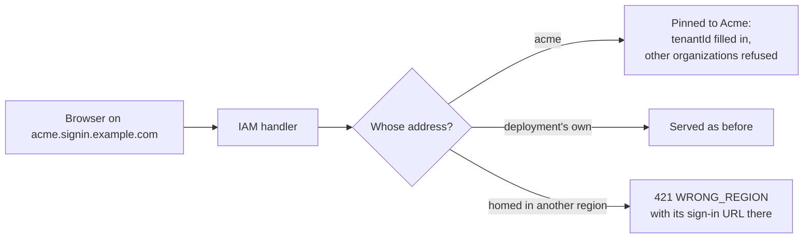

Every AWS account has its own sign-in URL, `123456789012.signin.aws.amazon.com`, and every Slack workspace its own
address, `acme.slack.com`. An address of their own tells people they are signing in to the right place, lets the
sign-in page show the organization's name and rules before anyone types, and keeps one organization's browser
session away from another's. Enterprise customers go further and want the sign-in page on their own domain,
`login.acme.com`. And once customers sit on several continents, each organization should be served from the region
that holds its data.

Better IAM supports all three:

- **Organization subdomains.** With `hosts.patterns`, each organization with an alias is reachable at an address built
  from it, such as `acme.signin.example.com`, or with its region, `acme.signin.eu-west-1.example.com`.
- **Custom hostnames.** Organizations verify hostnames they control with a DNS record, and one can become their
  primary address.
- **Regions.** With `regions`, each organization has a home region, and sign-in for it is sent there.

A request that arrives on an organization's address is **pinned** to that organization, whichever form the address
takes.



## Organization subdomains

### Configure the pattern

A pattern is a hostname template. `{tenant}` stands for an organization's alias (its
[slug](/docs/reference/api/tenants#setslug)), and `{region}` for one of your regions. The first pattern is the
canonical one, used in sign-in URLs and email links.

```ts title="iam.ts"
export const iam = betterIam({
  database,
  secret: process.env.BETTER_IAM_SECRET!,
  baseURL: 'https://signin.example.com',
  hosts: {
    patterns: ['{tenant}.signin.example.com'],
    signInPath: '/login', // where your sign-in page lives on each address
  },
});
```

Then point the addresses at your application, which serves the IAM handler on every host:

1. A wildcard DNS record, `*.signin.example.com`, to your load balancer or edge.
2. A wildcard TLS certificate for `*.signin.example.com`.
3. Your application (Next.js, Express, and so on) answering on all of those hosts, with the IAM handler mounted as
   usual. Nothing per organization needs to be deployed.

Patterns are checked when the instance is built. A pattern must contain `{tenant}` exactly once and be a valid
hostname template; `{region}` needs the `regions` option; outside `localhost` the base URL must be HTTPS; and when
passkeys are enabled, every pattern must sit under the passkey domain (the RP ID), because a passkey only works on
its own domain and the domains under it.

### What pinning does

On `acme.signin.example.com` (or Acme's verified custom hostname), every request acts for Acme:

| Request | What happens |
| --- | --- |
| A sign-in call without `tenantId` (`auth.signIn`, magic links, passkeys, password resets, invitations) | It acts in Acme. The page does not need to know Acme's tenant ID. |
| A sign-in call naming another organization's `tenantId` | Refused with `HOST_MISMATCH`. |
| A session, API key, or role session of another organization | Refused with `HOST_MISMATCH`, for every authenticated call. |
| A page on one organization's address calling the API on another's | Refused with `HOST_MISMATCH`. |
| The browser's `Origin` is an organization address | Trusted, like the deployment's own origins, so the page may call the API. |
| An address whose alias no active organization holds | `NOT_FOUND`, so a suspended organization's address stops working at once. |

The session cookie is host-only (the `__Host-` prefix forbids a `Domain` attribute), so a session started on
Acme's address is never even sent to Globex's. The deployment's own address (`baseURL`) is not pinned and serves
every organization, as before; root administrators sign in there.

```ts title="A sign-in page on acme.signin.example.com"
const client = createIamClient<typeof iam>();
// The address names the organization: show its name, then sign in to it.
const org = await client.tenants.lookup({ host: location.host });
await client.auth.signIn({ tenantId: org.tenantId, email, password });
```

Over plain HTTP the `tenantId` may be left out on an organization's address, and the handler fills it in. The typed
client asks for it because its types mirror the server API, where the deployment's own address serves every
organization.

### Development and proxies

`localhost` subdomains resolve to your own machine in every modern browser, so the same setup works in development
without DNS: use `baseURL: 'http://localhost:3000'` and the pattern `'{tenant}.localhost:3000'`, then open
`http://acme.localhost:3000`.

Behind a reverse proxy that rewrites `Host`, set `hosts.forwardedHost: true` to read the address from
`X-Forwarded-Host` instead. Enable it only when your own proxy sets that header, because the address decides which
organization a request is pinned to.

## Custom hostnames

Enterprise customers often want the sign-in page on their own domain. With `hosts.customHostnames`, an organization
can verify a hostname it controls, and from then on that hostname works exactly like its subdomain.

```ts title="iam.ts"
hosts: {
  patterns: ['{tenant}.signin.example.com'],
  customHostnames: true,
  cnameTarget: 'custom.signin.example.com', // what organizations point their hostname at
},
```

<Steps>
<Step>

### Claim the hostname

An administrator of the organization calls [`hostnames.add`](/docs/reference/api/hostnames#add). It returns two DNS
records: a TXT record that proves control, and a CNAME that sends traffic to your deployment.

```ts
const claimed = await iam.api.hostnames.add(credential, { tenantId, hostname: 'login.acme.com' });
// TXT   _better-iam-challenge.login.acme.com  "better-iam-hostname=…"
// CNAME login.acme.com                         custom.signin.example.com
```

</Step>
<Step>

### Publish the records and verify

The organization adds both records with its DNS provider, then calls
[`hostnames.verify`](/docs/reference/api/hostnames#verify). It answers `verified: false` until the TXT record is
visible, so a settings page can poll it. A verified hostname belongs to exactly one organization.

</Step>
<Step>

### Serve a certificate

Your TLS termination needs a certificate for the new hostname. With on-demand certificates, ask Better IAM whether a
hostname is allowed. It says yes only for the deployment's own hosts, active organizations' subdomains, and verified
custom hostnames.

```ts title="An on-demand TLS check (Caddy's ask endpoint)"
app.get('/tls/allowed', async (request, response) => {
  const allowed = await iam.hosts.allowed(String(request.query.domain));
  response.status(allowed ? 200 : 404).end();
});
```

</Step>
<Step>

### Make it the primary address (optional)

[`hostnames.setPrimary`](/docs/reference/api/hostnames#setprimary) makes the hostname the organization's canonical
address: sign-in URLs and email links use it instead of the subdomain.

</Step>
</Steps>

The deployment's own addresses cannot be claimed: its base URL, its trusted origins, and its whole subdomain space
(`HOSTNAME_NOT_ALLOWED`). A passkey is bound to one domain, so passkey sign-in is refused on a custom hostname outside
the passkey domain (`FEATURE_DISABLED`); people sign in there with a password, a magic link, or single sign-on, and
keep using their passkeys on the subdomain.

## Regions

A multi-region deployment runs the same application in several regions, for example one in the United States and one
in the European Union. Each deployment knows its own region, and each organization has a **home region**: where it
signs in, and where its sessions are issued.

```ts title="iam.ts (the eu-west-1 deployment)"
export const iam = betterIam({
  // ...
  regions: {
    current: 'eu-west-1',
    regions: {
      'us-east-1': { label: 'United States', baseURL: 'https://signin.us-east-1.example.com' },
      'eu-west-1': { label: 'Europe', baseURL: 'https://signin.eu-west-1.example.com' },
    },
  },
  hosts: { patterns: ['{tenant}.signin.{region}.example.com'] },
});
```

An organization's home region is its own `region`, set with `tenants.create({ region })` or later with
[`tenants.setRegion`](/docs/reference/api/tenants#setregion) (root administrators only), or else its nearest
ancestor's. Projects follow their organization. An organization created directly under the root without a region is
homed where it was created. Organizations that existed before you configured regions have none, and every region
serves them until you set one.

### Sign-in is sent to the home region

Every entry point to sign-in checks the organization's home region:

- `tenants.lookup` (by alias or by address)
- `domains.discover` (by email)
- public sign-in calls naming its tenant
- requests on its address

Everywhere but the home region they answer `WRONG_REGION` with HTTP 421 Misdirected Request. The error carries the
`region` and, when one can be built, a `location`: the organization's sign-in URL in its own region. An address that
names the wrong region (`acme.signin.eu-west-1.example.com` for an organization homed in `us-east-1`) is redirected
the same way.

```ts title="A global sign-in page"
try {
  const org = await client.tenants.lookup({ slug: form.organization });
  location.assign(org.signInUrl ?? `/login?org=${org.slug}`);
} catch (error) {
  if (error instanceof IamClientError && error.code === 'WRONG_REGION' && error.location)
    location.assign(error.location); // the organization lives in another region
  else throw error;
}
```

### One database or one per region

Regions can share one database (a globally replicated PostgreSQL, for example) or each keep their own:

| | Shared database | A database per region |
| --- | --- | --- |
| Where organization data lives | Everywhere the database replicates | Only in its home region |
| How a region finds another region's organization | From the organization's record | `regions.locate(alias)`, your own small directory |
| Moving an organization | `tenants.setRegion` | Copy its data to the new region first, then `setRegion` there |
| Creating an organization in another region | `tenants.create({ region })` from any region | On that region's deployment only |

With separate databases, a region does not know other regions' organizations at all. `regions.locate` lets it
answer `WRONG_REGION` for their aliases and addresses instead of `NOT_FOUND`. Keep that directory tiny: an alias and
a region per organization, for example in a global key-value store.

```ts
regions: {
  current: 'eu-west-1',
  regions: { 'us-east-1': {}, 'eu-west-1': {} },
  locate: async (alias) => directory.get(`org:${alias}`), // 'us-east-1' | 'eu-west-1' | undefined
},
```

<Callout type="warn" title="Regions route sign-in; they do not move data">
  The region check decides where sign-in is served and where sessions are issued. Authenticated calls are not
  refused by region, so administrators can still manage every organization from one place when the database is
  shared. For strict data residency, give each region its own database.
</Callout>

## Sign-in URLs and email links

Every organization has one canonical sign-in URL: its primary custom hostname, else its subdomain from the first
pattern, else its region's `baseURL`, followed by `hosts.signInPath`. You get it from:

- `iam.hosts.signInUrl(tenantId)` on the server;
- `signInUrl` in the results of `tenants.lookup` and `domains.discover`;
- `signInUrl` on every email and SMS message your `sendEmail` and `sendSms` callbacks receive.

That last one means invitations, password resets, and magic links can open on the organization's own address. The
built-in renderer passes it to your link builders:

```ts title="Links that open on the organization's address"
sendEmail: async (message) => {
  const rendered = renderDeliveryMessage(message, {
    appName: 'Acme Cloud',
    links: {
      invitation: ({ token, signInUrl }) => `${signInUrl ?? appUrl}/join?token=${token}`,
      passwordReset: ({ token, signInUrl }) => `${signInUrl ?? appUrl}/reset?token=${token}`,
      magicLink: ({ token, signInUrl }) => `${signInUrl ?? appUrl}/magic?token=${token}`,
    },
  });
  if (rendered) await mailer.send({ to: message.to, ...rendered });
},
```

## Framework integrations

The Next.js integration (`@better-iam/next`) and the Express, Hono, Fastify, and SvelteKit integrations
(`@better-iam/middleware`) call the handler in process from server actions, loaders, and route handlers. When the
instance has organization addresses, those calls keep the host the visitor is on, so they are pinned exactly like
browser calls. A server action on `acme.signin.example.com` signs people in to Acme without passing its tenant ID.

In your own middleware, `iam.hosts.resolve(host)` tells you which organization an address belongs to: undefined for
the deployment's own and unknown hosts, `NOT_FOUND` for an address no active organization holds, and `WRONG_REGION`
when another region serves it.

```ts
const org = await iam.hosts.resolve(request.headers.get('host') ?? '');
if (org) response.locals.organization = org; // { tenantId, name, slug, via: 'pattern' | 'custom' }
```

## Options

<TypeTable
  type={{
    'hosts.patterns': {
      type: 'string[]',
      description: <>Hostname templates with <code>{'{tenant}'}</code> (the organization's alias) and optionally <code>{'{region}'}</code>. The first is canonical. At most 16.</>,
    },
    'hosts.customHostnames': {
      type: 'boolean',
      default: 'false',
      description: 'Lets organizations verify hostnames of their own with the hostnames API group.',
    },
    'hosts.cnameTarget': {
      type: 'string',
      description: 'The hostname organizations point their custom hostname at, shown in the CNAME record hostnames.add returns.',
    },
    'hosts.signInPath': {
      type: 'string',
      default: "'/'",
      description: 'The path of your sign-in page on an organization address, appended to every sign-in URL.',
    },
    'hosts.forwardedHost': {
      type: 'boolean',
      default: 'false',
      description: 'Read the address from X-Forwarded-Host. Only behind a proxy you control that sets it.',
    },
    'regions.current': {
      type: 'string',
      description: "This deployment's region, one of regions.regions, such as us-east-1.",
      required: true,
    },
    'regions.regions': {
      type: 'Record<string, { baseURL?: string; label?: string }>',
      description: "Every region organizations can live in (1 to 64), with the base URL of that region's deployment and a display label.",
      required: true,
    },
    'regions.locate': {
      type: '(alias: string) => Promise<string | undefined>',
      description: "For a database per region: the region an alias this region does not know lives in, so its sign-in is redirected instead of failing.",
    },
  }}
/>

`iam.hosts` exposes `region` (this deployment's), `resolve(host)`, `signInUrl(tenantId)`, and `allowed(hostname)`
for the checks above.

## Next steps

<Cards>
  <Card title="Custom hostnames API" href="/docs/reference/api/hostnames">
    Claim, verify, make primary, and release organization hostnames.
  </Card>
  <Card title="Tenants and identities" href="/docs/guides/concepts/tenants-and-identities">
    Aliases, the tenant tree, and how organizations are isolated.
  </Card>
  <Card title="Configuration" href="/docs/operations/deployment/configuration">
    Every other option of the instance.
  </Card>
</Cards>
