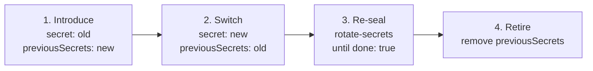

Every deployment has one `secret`. It is the root of the encryption that protects stored factors and queued
messages, so it has to stay stable for the life of the deployment, and when it must change, it changes in stages
rather than all at once. This page explains what the secret covers, how to rotate it, and how the other keys
(<Term id="assertion">assertion</Term>, OAuth, <Term id="saml">SAML</Term>, session JWT) relate to it.

## What the secret protects

<Tabs items={['Depends on the secret', 'Independent of it']}>
<Tab value="Depends on the secret">

- **Encryption:** authenticator (TOTP) secrets, <Term id="webhook">webhook</Term> signing secrets, and undelivered
  email, SMS, and webhook payloads in the <Term id="outbox">outbox</Term>, including queued invitation emails.
- **Challenge digests:** password reset, email verification and change, passwordless links and codes, MFA
  sign-in, phone verification, and passkey ceremonies.
- **Assertions:** the key that signs [stateless assertions](/docs/guides/recipes/operations#call-a-downstream-service-with-a-stateless-assertion)
  is derived from it.

</Tab>
<Tab value="Independent of it">

A rotation leaves these alone:

- sessions and API keys, which are hashed without the secret, so nobody is signed out;
- invitation links, whose tokens are plain SHA-256 hashes;
- OAuth, SAML, SCIM, and Shared Signals, which use their own keys;
- signed session tokens (JWTs), which use their own `sts.jwt.signingKeys` and `verificationKeys`.

</Tab>
</Tabs>

The secret must have at least 32 characters. Generate it from a cryptographic source and store it in your
secret manager:

```sh
node -e "console.log(require('node:crypto').randomBytes(48).toString('base64url'))"
```

`doctor` warns with `weak-secret` when the value looks like a placeholder (for example it contains "change me",
"replace me", "example", or "placeholder") or has little variety.

<Callout type="error" title="Never replace the secret outright">
Replacing the secret in one step makes every enrolled authenticator and every webhook unusable, and strands
queued messages. Always rotate through `previousSecrets`.
</Callout>

## Rotating the deployment secret

Rotation runs in four stages. Deploy each stage to every instance, worker, and CLI configuration before the next
one begins.



<Steps>
<Step>

### Introduce

Keep the old `secret` and add the new value to `previousSecrets` (at most five). Every process can now open
values sealed with either, while still sealing with the old one. Give downstream verifiers `iam.assertionKeys()`,
which lists both assertion keys.

</Step>
<Step>

### Switch

Make the new value `secret` and move the old one to `previousSecrets`. New values are sealed with the new secret,
and old values and pending links keep working.

</Step>
<Step>

### Re-seal

Run `better-iam rotate-secrets` (`iam.rotateSecrets()`). It re-seals stored authenticator secrets, webhook
secrets, and pending payloads with the new secret in short transactions and prints what it changed.
`--dry-run` only counts. Repeat until it reports `done: true`.

```sh
better-iam rotate-secrets --config better-iam.config.mjs --dry-run
better-iam rotate-secrets --config better-iam.config.mjs
```

</Step>
<Step>

### Retire

A day later, when emailed links and assertions issued under the old secret have expired, remove
`previousSecrets` everywhere and configure downstream verifiers with `iam.assertionKey()` alone. If the old secret
leaked, retire it as soon as `rotate-secrets` reports `done: true`, and never hand its assertion key to new
verifiers.

</Step>
</Steps>

`previousSecrets` must list distinct values of at least 32 characters, none equal to `secret`. Configurations
created by `better-iam init` read it from `BETTER_IAM_PREVIOUS_SECRETS` (comma-separated), as the console does.

### What `rotate-secrets` reports

<TypeTable
  type={{
    resealed: {
      type: 'Record<string, number>',
      description: 'Values re-sealed with the current secret per collection (in a dry run, values that would be).',
    },
    unreadable: {
      type: 'Record<string, number>',
      description: 'Values no configured secret opens, per collection: sealed with a secret that is gone.',
    },
    current: {
      type: 'number',
      description: 'Values already sealed with the current secret.',
    },
    complete: {
      type: 'boolean',
      description: <>Every record was examined; <code>false</code> when a <code>limit</code> cut a collection short.</>,
    },
    done: {
      type: 'boolean',
      description: <>Nothing sealed with a previous secret remains. Only then can <code>previousSecrets</code> go.</>,
    },
  }}
/>

`iam.rotateSecrets()` also accepts `batchSize` (records per transaction, default 200, 1 to 2000) and `limit` (a
per-collection sample, which `doctor` uses).

### Tracking a rotation with `doctor`

| Finding | Severity | Meaning |
| --- | --- | --- |
| `secret-rotation-pending` | warning | Stored values still need a previous secret. Run `rotate-secrets`. |
| `secret-rotation-unverified` | warning | The sample found nothing left, but did not cover every record. Confirm with `rotate-secrets --dry-run`. |
| `previous-secrets-configured` | info | `previousSecrets` is set and no stored value needs it any more. It can go. |
| `unreadable-secrets` | error | Stored values open with no configured secret. |

`unreadable-secrets` is what happens when the secret was replaced without `previousSecrets`. The fix is to put the
old secret back into `previousSecrets` and rotate. `rotate-secrets` exits non-zero with `UNREADABLE_SECRETS` in the
same case.

### Keys your application derives from the secret

Keys an application derives from `secret` itself need the same staged treatment. The console, for example,
derives its outbound SCIM provisioner's `encryptionKey` from it. Pass the keys derived from `previousSecrets` as
the provisioner's `previousEncryptionKeys`, then call `provisioner.rotateKeys()`, which re-seals stored downstream
tokens and reports `{ resealed, current, unreadable }`.

## Assertion keys

Services that verify [stateless assertions](/docs/guides/recipes/operations#call-a-downstream-service-with-a-stateless-assertion)
hold a key derived from the secret, never the secret itself.

- `iam.assertionKey()` returns the derived key (64 hexadecimal characters). A service holding only that key verifies
  with `verifyAssertion` and cannot recover the secret. Treat it as a shared secret between IAM and its services;
  it is never exposed over HTTP.
- `iam.assertionKeys()` returns the current key first, then those of `previousSecrets`. `verifyAssertion`, the
  NestJS assertion module, and the Next.js edge verifier all accept the list, so hand it out during a rotation and
  go back to the single key afterwards.

```ts title="Downstream service during a rotation"
import { verifyAssertion } from 'better-iam';

// IAM_ASSERTION_KEYS holds JSON.stringify(iam.assertionKeys()) while the secret rotates.
const claims = verifyAssertion(token, {
  key: JSON.parse(process.env.IAM_ASSERTION_KEYS!) as string[],
  audience: 'reports',
});
```

Assertions cannot be revoked before they expire (at most one hour, five minutes by default), which is why the
retire stage waits for them.

## Other keys

These are separate, explicit inputs. Keep each stable, secret, backed up, and separate by purpose; losing an
encryption key makes what it sealed unreadable.

| Key | Where | Rotation |
| --- | --- | --- |
| OAuth provider signing JWKs | `createOAuthProvider({ jwks })` | Roll over with a JWKS containing the active private key and the still-valid verification keys. |
| OAuth cookie keys | `createOAuthProvider({ cookieKeys })` | Persistent; never regenerated at startup. |
| OAuth encryption key (32 bytes) | `createOAuthProvider({ encryptionKey })` | Changing it requires re-encrypting stored protocol artifacts; automatic key migration is not provided. |
| SAML SP keys and certificates | `createSamlService` connections or `serviceProvider` | Supplied only through trusted deployment configuration. Roll IdP certificates by listing the previous and new ones in `idpCertificates`. |
| Session JWT keys | `sts.jwt.signingKeys`, `verificationKeys` | Move a retired key to `verificationKeys` (public only), where it verifies but never signs. |

Keep the OAuth keys identical across replicas and process restarts. No production key is ever generated inside a
request handler. See [Protocol mounts](/docs/operations/deployment/protocol-mounts) for where each one is
configured.

## Next steps

<Cards>
  <Card title="Configuration reference" href="/docs/operations/deployment/configuration">
    The `secret`, `previousSecrets`, and `sts.jwt` options with their validation rules.
  </Card>
  <Card title="Doctor" href="/docs/operations/storage#doctor">
    The findings that track a rotation until it is done.
  </Card>
  <Card title="Database operations" href="/docs/operations/deployment/database#backups">
    Back up the keys together with the database.
  </Card>
</Cards>
