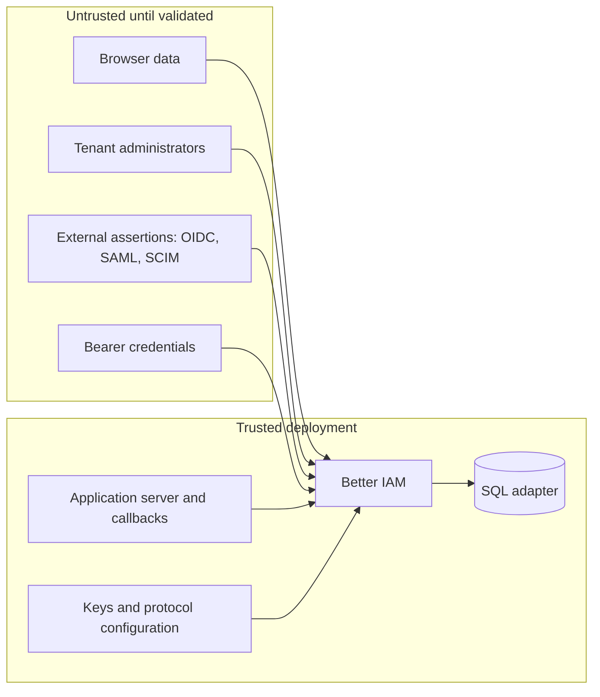

This page states what Better IAM guarantees and what it relies on you for. Read it before a security review or a
production launch; the guides linked from each section explain how to use the features it mentions.

## Trust boundaries

A trust boundary separates what Better IAM believes without checking from what it must validate first. The trusted
side is the application server, the configured SQL adapter, the cryptographic keys, the protocol configuration, and
your application callbacks. Browser data, tenant administrators, external assertions, and
bearer <Term id="credential">credentials</Term> are untrusted until validated. Your server remains responsible for calling authorization
before it accesses product resources.

## Root and delegation

Administration in Better IAM is delegated down a <Term id="tenant">tenant</Term> tree, and the most common way such
systems fail is by letting someone grant more than they hold. These rules explain where the top of the tree (the
<Term id="root">root</Term>) comes from and why no delegated path can exceed its source.

**Root authority** is a protected boolean capability on a root-tenant human identity. It is validated from current
storage and requires an MFA user session. A role called `root-admin`, a matching email, a linked account, or a JWT
claim cannot confer it. Root overrides policy restrictions across tenants, but not malformed input, expired
credentials, cross-site request forgery (CSRF) protection, signature validation, or resource ownership validation.
Cross-tenant root actions are recorded.

**Bootstrap and recovery.** Bootstrap runs only against an uninitialized installation. Recovery creates a new root
identity through a deployment-operator command and writes an audit event. Protect access to the configuration, the
database credentials, and recovery execution as root-equivalent capabilities.

**Invitations.** Member invitations store only a token hash, carry the inviter's
<Term id="authority">grant authority</Term>, and re-validate
that authority, the roles, and the groups when redeemed; a revoked authority or invitation makes the token useless.
An inviter needs `iam:identities:create` plus `iam:bindings:create` on each granted role and `iam:groups:update` on
each group, so invitations cannot grant more than the inviter could bind directly.

**Tenant aliases** are public discovery data by design: `tenants.lookup` needs no credential, like an AWS account
alias. Apply ingress rate limits to it and do not encode secrets in aliases.

**Managed resource registrations** are trusted authorization inputs. `iam:resources:*` permissions decide who may
register or edit them, and attribute values are validated against the declared schema.

<Term id="access-request">Access requests</Term> grant nothing by themselves. Approval creates
<Term id="binding">bindings</Term> under the reviewer's grant authority
and re-checks `iam:bindings:create` on every role, so the review permission can never widen what the reviewer could
bind directly, and a requester cannot review their own request. Temporary bindings stop granting the moment they
expire, before the purge worker removes them.

<Term id="webhook">Webhook</Term> subscriptions are tenant-scoped. Only root may subscribe to a subtree. Secrets are
sealed at rest and shown once, and deliveries carry audit metadata only. Endpoints must verify the HMAC signature (a
keyed hash made with the webhook secret) and the timestamp before trusting a delivery.

**Delegation limits.** Delegated administrators cannot remove their own parent-controlled ceilings, borrow a
superior authority, or edit protected owner definitions. Moving a tenant requires recent authentication plus
authority in the destination parent; the hierarchy's type, depth, and cycle rules apply, and delegation chains keep
their original grant authorities. Tenant-created actions cannot redefine platform namespaces, and account linking
supplies no cross-tenant permission.

**Retention purges** are deployment operations. They remove tombstoned tenants after an explicit retention window,
invoke plugin purge callbacks in the same transaction, and preserve audit records.

## Authentication

Authentication is where most attacks start: guessed and reused passwords, phished codes, stolen cookies. This
section lists how each credential is stored and checked, and which controls a tenant or operator can add.

### Passwords

Passwords use Argon2id and must be at least 12 characters. By default a small built-in screen also refuses
well-known passwords, keyboard walks, sequences, and passwords with fewer than five distinct characters
(`authentication.passwordPolicy.blockCommonPasswords: false` turns it off). `passwordPolicy.isBreached` adds a
breach corpus: `pwnedPasswords()` from `@better-iam/auth` is a Have I Been Pwned client that sends only a
five-character SHA-1 prefix (k-anonymity), times out after three seconds, and fails open unless `failClosed`.
`passwordPolicy.check` adds a custom rule.

Tenants tighten further through their [authentication policy](/docs/guides/authentication/tenant-policy):

- `minPasswordLength`;
- `passwordMinClasses`: 2 to 4 character classes;
- `passwordRejectPersonalInfo`: no email local part or name word of four or more characters;
- `passwordHistory`: refuse the last 1 to 24 passwords, compared with Argon2 against the newest 24 retained hashes,
  which are deleted with the identity;
- `passwordMaxAgeDays`.

Every rule applies wherever a password is set: creation, invitations, bulk onboarding, reset, and change. An
expired password is refused with `PASSWORD_EXPIRED` only after it has been verified, so expiry never reveals whether
a guess was right; the person recovers through password reset.

### Secrets, codes, and factors

- Secrets and challenges are generated with cryptographic randomness.
- Sessions and API keys store token hashes; short authentication codes use keyed digests.
- MFA seeds and delivery payloads use authenticated encryption.
- Recovery codes are hashed and single-use.
- <Term id="passkey">Passkeys</Term> verify the challenge, origin, relying-party ID (RP ID, the domain the passkey
  is bound to), user verification, and cryptographic signatures.

### Sessions

<Term id="session">Sessions</Term> have absolute and idle expiry, are revoked on sensitive credential changes, and can be ended individually
or all-but-current by their owner. Client details recorded on sessions (user agent, proxy-derived IP, device label)
are informational: nothing about the client is trusted for authorization, and an IP is recorded only when
`http.clientInfo` derives it from a proxy header you control. Root and configured tenant MFA requirements also
apply to federation and recovery; resetting a password does not remove MFA.

Sessions issued through the HTTP handler record the client's `User-Agent` as `session.client.userAgent`. Behind a
proxy you control, `http.clientInfo(request)` records the real IP, the user agent, and an optional device `label`;
values are trimmed and bounded. Sessions created directly through `iam.api.auth.*` record client details only
inside `iam.auth.withClient(info, fn)`. `auth.listSessions` returns the details for device lists, and
`auth.revokeOtherSessions` ends every other session of the caller (recent authentication required).

### Rate limits

Rate limits bound how fast anyone can guess a password, a code, or a recovery answer. Login attempts, MFA, and
recovery use shared, persisted rate limits per account, configured through
`authentication.rateLimits`: `attempts` (default 10) for ordinary flows such as password sign-in,
`sensitiveAttempts` (default 5) for MFA, recovery, and delivery requests, `windowMs` (default fifteen minutes),
and a pluggable `limiter`.

- The default limiter keeps durable counters in the IAM database. Multi-instance deployments that prefer a shared
  cache can supply one that implements `consume()`; `createMemoryRateLimiter()` serves single-process deployments
  and tests.
- Refusals (`RATE_LIMITED`, 429) carry `retryAfterMs` in the error body and a `Retry-After` header equal to the
  window, so clients and proxies can back off.
- `ipAttempts` (off by default) adds a counter per client IP and tenant that every authentication flow shares, so
  credential stuffing and password spraying from one address stop after that many attempts per window no matter
  how many accounts it names. It only works with a recorded IP (`http.clientInfo` behind your proxy).
  `identities.unlock` clears a person's counters but never the network's, so size it for the largest office behind
  one NAT.

### Tenant authentication policy

A tenant's authentication policy (`tenants.setAuthPolicy`, under `iam:tenants:update` with recent authentication)
can only tighten the deployment's configuration: require MFA for every person in the tenant, restrict the accepted
sign-in methods, and shorten session lifetimes.

- Method restrictions are checked before any credential is examined, so a rejected method never reveals whether a
  password was right.
- Existing sessions are re-validated against the policy on their next use: requiring MFA locks out non-MFA
  sessions immediately, and a person cannot disable MFA while the tenant requires it.
- `requireMfaForOwners` applies the same requirement to owners only, so the people who can change the policy are
  protected first.
- Each user session records the method that established it (`session.method`), available to policies as
  `principal.authMethod`.

### Remember this device

People who sign in every day from the same browser should not have to type a code every time, but a stolen
password alone must still not be enough. "Remember this device" (`verifyMfa` or `confirmMfa` with
`rememberDevice`) issues an opaque device token, stored hashed. The same browser can then satisfy the MFA
requirement on later password or passwordless sign-ins. The token lasts `authentication.trustedDeviceLifetimeMs`
(30 days by default, one year at most; 0 disables) or the tenant's `trustedDeviceDays`, whichever is shorter.

- Root administrators are never remembered, and an invalid or expired token simply leads to the normal challenge.
- Every remembered device is forgotten when the person changes their password, email, or factors, when an
  administrator revokes their sessions, and on `revokeTrustedDevices`.
- Sessions established this way carry `trustedDeviceId`, and people see and forget their devices
  (`listTrustedDevices`, `revokeTrustedDevice`).
- The HTTP layer keeps the token in its own `better-iam.device` cookie (HttpOnly, `__Host-` over HTTPS) and injects
  it into `auth/signIn` and `auth/finishPasswordless` bodies, so the client only sends `rememberDevice: true` once.
  `auth/revokeTrustedDevices` clears the cookie.

### Emailed one-time codes

Emailed codes (`mfaEmailCodes` on the tenant policy, or `authentication.mfaEmailCodes` for the deployment; off by
default) let a tenant require MFA without forcing every member to install an authenticator. When nothing is
enrolled, the sign-in response carries `emailCodeAvailable`. `auth.requestMfaCode` then emails a six-digit code
bound to that login challenge (hashed at rest, single use, ten minutes at most, sensitive rate limit), and
`verifyMfa` accepts it.

A code is weaker than an authenticator because it rides on the mailbox. People with an authenticator enrolled, and
root administrators always, must use the authenticator or a recovery code, and the address must be verified.

### Passkeys as the second factor

A registered passkey can also serve as the second factor (`beginPasskeyMfa` / `finishPasskeyMfa`), so people who
already have a passkey need no separate authenticator app. The assertion is
verified like a passkey sign-in (challenge, origin, RP ID, user verification, signature, counter) and is bound to
the pending login challenge, which must still be open and belong to the same person; both challenges are consumed
together.

### Network allowlists

A tenant can restrict where its people sign in from. `allowedIpRanges` (IPv4 or IPv6 addresses or CIDR blocks)
refuses session issuance, including impersonation, with `IP_NOT_ALLOWED` when the recorded client IP lies outside
every range. A session whose recorded IP falls outside the ranges stops working at its next use, so tightening the
list cuts off existing sessions.

The check needs an IP: configure `http.clientInfo` behind a proxy you control, because a sign-in without a
recorded IP (direct API use, or the handler without `clientInfo`) is not judged. Refusals show up as `denied`
spans with code `IP_NOT_ALLOWED`.

### The person's own security trail

People can read their own authentication trail without any administrative permission: `auth.listSecurityEvents`
returns the `auth:*` audit events recorded for their identity, naming the administrator when one acted through
impersonation.

With `authentication.signInNotifications` (or a tenant's `notifyNewSignIn`), a session that starts from an unfamiliar
client queues a `new-sign-in` email. A client is unfamiliar when none of the person's live sessions or remembered
devices has used it. The email carries the session ID, time, method, user agent, IP, and label, so a stolen password
is noticed quickly. Only sessions with client details are judged, so run sign-ins through the HTTP handler or
`auth.withClient`.

### Failed sign-in records

Failed attempts against a real, active account are recorded: a wrong password, authenticator or emailed code, or
recovery code once the first factor passed. Each becomes an `auth:signin:fail` event with the reason and the
client's IP and user agent, written in a transaction of its own after the refused flow rolled back, and is counted
in the person's sign-in record.

- Each new session carries that record as `session.previousSignIn`: the previous sign-in time and client, the
  failures since, and the latest failed attempt's time and client. People learn about guessing against their
  account the next time they sign in, even when no notification email reaches them.
- Attempts the rate limiter refused, unknown addresses, and disabled accounts produce no record and no event, so the
  mechanism neither enumerates accounts nor lets an attacker grow the audit log beyond the rate limit.
- `authentication.failedSignInAlerts` (off by default; needs `sendEmail`) turns the count into one
  `sign-in-failures` email per streak (payload `attempts`, `time`, `ip`, `userAgent`). It goes to verified addresses
  only, exactly when the streak reaches the threshold. The person hears about it without waiting for their next
  sign-in, and an attacker cannot use repeated attempts to flood their mailbox.

### Network blocks and IP-bound sessions

When an attack comes from a known address, or a session cookie may have been stolen, you need to cut access by
network without touching each account. Network blocks are the incident-response counterpart of the allowlist.

`security.blockNetwork({ tenantId, network, reason, durationMs?, platform? })` (`iam:security:manage`, recent
authentication, audited as `security:network-block`) blocks an IPv4 or IPv6 address or CIDR block. Every
authentication flow and every live session whose recorded client IP falls in that network is refused with
`IP_BLOCKED`, before rate limits or credentials are examined, so a blocked address cannot count against anyone.

- Root administrators set `platform` blocks on the root tenant that apply to every tenant; an organization's blocks
  apply to itself.
- A block lapses after `durationMs` (one minute to a year) or stays until `security.unblockNetwork` lifts it;
  `security.listBlocks` (`iam:security:read`) shows them with `active`.
- The caller's own recorded address is refused, so nobody locks themselves out.
- The authentication service reuses each tenant's list for five seconds, so a change reaches other processes
  within that time.
- Like the allowlist, blocks need `http.clientInfo` to record addresses.

A tenant that wants stolen cookies to be useless elsewhere sets `bindSessionsToIp`. A user session is then accepted
only from the address it was issued from; a use from another address is refused with `SESSION_NETWORK_MISMATCH` and
recorded in the person's trail as `auth:session:mismatch` (both addresses in the metadata). The person simply signs
in again from the new network while the old session keeps working from the old one. Sessions and requests without a
recorded address are not judged.

The admin console's Sign-in failures page blocks a source address platform-wide for a day in one click and lists
the platform's blocks; organization owners manage theirs on the settings page.

### Impersonation

Support staff often need to see exactly what a member sees, without asking for the member's password.
<Term id="impersonation">Impersonation</Term> ("view as", `identities.impersonate`) provides that under strict
limits. It is off until a tenant's authentication policy sets
`allowImpersonation`. It then needs `iam:identities:impersonate` on the member, recent authentication, an ordinary
session of the administrator's own, and a recorded reason.

- Owners, root administrators, service accounts, and the caller cannot be impersonated.
- The member session inherits the administrator's MFA state, so a member who requires MFA cannot be impersonated
  without it. It lasts at most eight hours and never longer than the administrator's session, ends the moment the
  administrator signs out or is disabled, and appears in the member's own session list.
- It cannot perform anything that requires recent authentication (password, email, factor, session, and ownership
  changes), and cannot re-authenticate, assume roles, grant OAuth consent, or impersonate further.
- Every audit record it produces carries `impersonatorId` beside the member `actorId`, policies see
  `principal.impersonated` and `principal.impersonatorId`, assertions carry `impersonatorId`, and the token is never
  issued as a cookie.

See the [impersonation recipe](/docs/guides/recipes/support-and-privacy#support-see-the-product-as-a-member-sees-it).

### Stateless assertions

Downstream services often need to know who is calling without querying IAM on every request. Stateless
<Term id="assertion">assertions</Term> (`assertions.issue`) are short-lived HS256 JSON Web Tokens describing the
caller (identity, tenant, session kind, MFA, method, role and group IDs, optional public claims) for a named
audience. Issuing one is authorized as `iam:assertions:create` on `iam/{audience}` and audited, so administrators
decide which roles may obtain tokens for which services.

Assertions are signed with a key derived from the deployment secret (`iam.assertionKey()`). A service holding only
that key verifies with `verifyAssertion` and cannot recover the secret. Assertions grant nothing inside IAM, cannot
be exchanged for sessions, and are not revocable before they expire (at most one hour, five minutes by default).
Keep lifetimes short, and treat the derived key as a shared secret between IAM and its services.

### Audit chain

Audit records form a per-tenant hash chain, the <Term id="audit-chain">audit chain</Term> (`sequence`,
`previousHash`, `hash`), that `audit.verify`,
`audit.export`, and the portable `verifyAuditChain` check; see [Audit chain](/docs/guides/events/audit-chain). The
chain detects alteration, reordering, or removal by anyone who cannot rewrite both the events and the chain head.
Export chains to independent storage and treat the exported heads as the reference;
[continuous audit archiving](/docs/operations/jobs#continuous-audit-archiving) does this on a schedule.

### Cookies and CSRF

HTTPS cookies use `__Host-better-iam.session`, Secure, HttpOnly, `SameSite=Lax` (or `Strict` with
`http.cookieSameSite`), and `Path=/`. They carry a `Max-Age` equal to the session's remaining lifetime unless the
request that issued the session asked for a browser-session cookie (`X-Better-IAM-Persistent: 0`, or
`http.persistentCookies: false` as the default). Then the browser drops the cookie when it closes, while the server
session still expires on its own schedule.

Loopback HTTP development uses a separate non-prefixed cookie name. JSON mutations require `X-Better-IAM: 1`, and
cookie requests also require an exact trusted Origin, which together stop other sites from forging requests. No
parent-domain cookie is configured.

## External identity

Federation accepts assertions from systems you do not control, so every one is validated before it can create or
reach an account.

- OAuth sign-in uses state, PKCE, browser-bound callbacks, issuer and subject mappings, and
  <Term id="oidc">OIDC</Term> nonce validation ([how each one helps](/docs/federation/oauth-sign-in#how-sign-in-works)).
- <Term id="saml">SAML</Term> uses a maintained verifier plus exact destination, recipient, and in-response-to
  checks and a shared replay cache ([response validation](/docs/federation/saml#response-validation)).
- <Term id="scim">SCIM</Term> connection credentials are tenant-scoped, cannot provision root privileges, and
  protect owner accounts.

An email collision is not proof of account ownership. Explicit linking must prove control of both the existing
account and the external provider identity; an unlinked collision returns `ACCOUNT_LINK_REQUIRED`. Configure
issuers, endpoints, certificates, signing keys, and redirect URLs only through trusted deployment configuration or
authorized administration. See [Federation](/docs/federation).

## Operational responsibilities

<Callout type="warn" title="These stay with you">
Better IAM cannot enforce the following. Treat them as part of your deployment's security baseline.
</Callout>

- **Keys.** Keep application and protocol keys stable, secret, backed up, and separate by purpose. Losing
  encryption keys makes enrolled factors and queued deliveries unreadable. Rotate the deployment `secret` with
  `previousSecrets` and `rotate-secrets` ([Secrets and keys](/docs/operations/deployment/secrets)); never replace
  it outright.
- **Delivery.** Require delivery transports to deduplicate IDs and avoid logging tokens or message payloads.
- **Tenant scoping.** Keep administrative policy explanations and audit records tenant-scoped.
- **Transactions.** Preserve the adapter transaction contract. External side effects belong in an outbox or after
  commit.
- **Ingress.** Use request and body limits and network rate limits at the ingress, in addition to account-level
  controls.
- **Trusted code.** Audit application resource loaders and custom <Term id="plugin">plugins</Term> as trusted server
  code.
- **Standing privilege.** Prefer <Term id="eligible-binding">eligible</Term> (just-in-time) bindings over standing
  privileged roles, require a
  justification and MFA for activation, and alert on `binding:*` events. Give contractors and temporary service
  accounts an `expiresAt`, and schedule `purgeDeleted` so expired identities are disabled promptly.
- **API keys.** Label API keys, review `credentials.list({ unusedForMs })` regularly, and revoke or rotate keys
  nobody uses; rotation keeps the label and resets the usage history.
- **Configuration as code.** Keep tenant configuration in version control and roll it out with `config-plan` /
  `config-apply`; treat the applying token as an administrator credential, because every change it makes is
  authorized against that identity.

## Testing and disclosure

Tests exercise adversarial cases but are not an independent penetration test or a security certification. Report
vulnerabilities privately to the repository owner, and do not include live secrets in reports.

## Next steps

<Cards>
  <Card title="Secrets and keys" href="/docs/operations/deployment/secrets">
    What the deployment secret protects and how to rotate it.
  </Card>
  <Card title="Tenant sign-in policy" href="/docs/guides/authentication/tenant-policy">
    MFA, allowed methods, IP ranges, and password rules per organization.
  </Card>
  <Card title="Federation" href="/docs/federation">
    How external sign-in and provisioning are validated.
  </Card>
</Cards>
